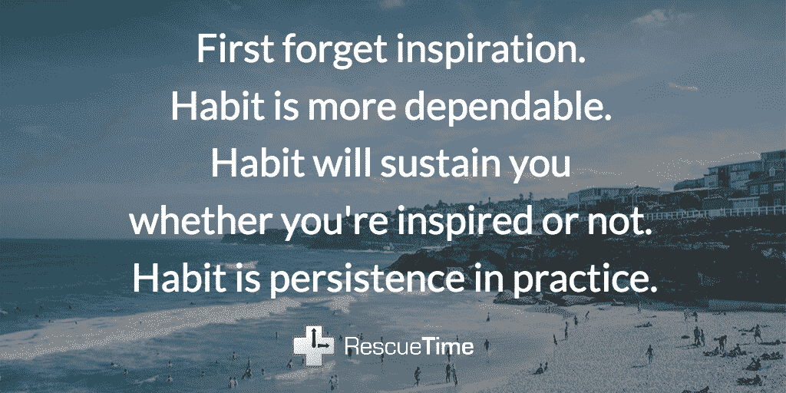
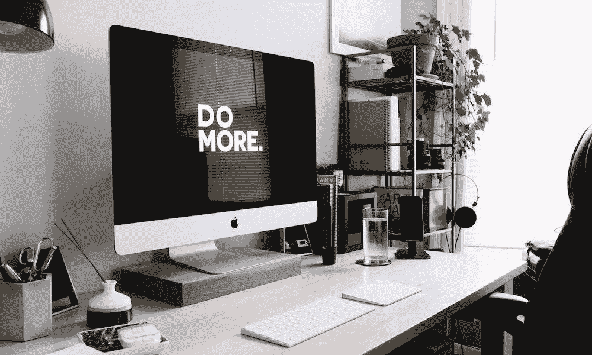

# 有效的目标设定:设定、衡量和实现目标的实用建议

> 原文：<https://medium.com/swlh/effective-goal-setting-practical-advice-for-setting-measuring-and-hitting-your-goals-2fcc93f53465>

## 确保你实现今年所有目标的 5 个步骤

你有没有一张没用过的健身房通行证，占用了你钱包里的空间？你是否在大部分对话中向任何愿意听你抱怨你讨厌的工作并想离开的人抱怨？

我们都想改变我们的生活方式，而设定目标，无论是职业目标还是个人目标，都是这种改变不可或缺的一部分。目标是我们如何描绘我们被激励努力的未来的图景。

不幸的是，大多数时候我们在坚持自己的目标方面做得相当糟糕。生活挡了我们的路，那些一次性的借口(“我明天去健身房”)很快就变成了彻头彻尾的失败。但不一定要这样。

在本指南中，我们将涵盖有效目标设定的基本要素，从计划和承诺*正确的*目标，到你将用来实现目标的确切过程。

# 目标、习惯和过程:三块成功拼图

如果你的目标设定过程只是简单地把它们写下来并努力实现它们，你很可能会失败。

也许你更高级一点，你也写下了如何实现目标的行动计划。这是一个好的开始，但它仍然不会让你越过终点线。

相反，有效的目标设定依赖于三个因素的结合:

1.  ***你想要达到的*:**这些是你的目标。它们是你想看到的结果，比如减 20 斤或者写小说。
2.  ***如何*你将到达那里:**这是你的过程。或者，你为了得到你想要的结果将要采取的日常行动。比如每周跑 10 英里或者每天写作。
3.  ***为什么*你想要:**这些都是你的习惯。它们是驱动你日常行为的无意识惯例。

最后一部分是为什么，这是整个目标设定过程的关键。为了保持忠诚，你需要的不仅仅是一个目标和一个计划。你需要更好的习惯。

大多数研究认为，我们一天中有 40-50%的时间是由习惯决定的。这里有一个例子:一项研究给一组电影观众一袋爆米花——不管是新鲜的还是不新鲜的。虽然吃不新鲜爆米花的那组人说不好吃，但他们还是吃了和吃新鲜爆米花的那组一样多的量。

人类的大脑倾向于常规而不是新奇。即使你的习惯不健康，也很难阻止自己去做。然而，这也是一个强有力的机会。

当谈到设定我们将真正实现的目标时，习惯是我们最有力的工具。

# 从习惯开始，目标就会随之而来

培养正确的习惯有助于我们维持日常的过程，这让我们更接近我们的目标。

简单吧？

创造积极变化的最佳方式不是从目标开始向下努力，而是从下往上开始。改变你的习惯，你会更容易做你想要的日常行动，这将让你更接近你的目标。这种程度的一致性是一个强大的工具。

让我们再来看看我们写小说的例子。如果你设定一个每天写 500 个单词的日常过程，并且[养成支持这个过程的正确习惯](http://blog.rescuetime.com/how-to-build-good-habits/)(安排专门的写字板，前一天晚上关闭除文字处理器之外的所有东西，关掉手机和社交媒体，直到你达到每天的目标，等等……)在一年结束时，你将会写超过 180，000 个单词。

**那差不多是四本 200 页的小说或者两本 400 页的文学巨著。**

这个过程可以为你想要实现的任何目标服务。假设你想学西班牙语。如果你每天晚上花半个小时学习西班牙语，那么一年下来，你已经花了 182.5 个小时学习这门语言——根据美国外交服务研究所[的说法，距离完全流利已经过去了一半。](https://blog.thelinguist.com/how-long-should-it-take-to-learn-a-language)

作家奥克塔维亚·巴特勒写道:

# 有效设定目标的 5 个步骤

当你朝着目标努力时，你的习惯会让你保持动力和一致性。但是，如何在一开始就设定正确的目标呢？

要知道哪些习惯需要改进，你仍然需要从思考你想要达到的目标开始，然后反向努力。但这不仅仅意味着设定任何旧的目标。

为了获得最大的成功机会，这里有一个 5 步流程，你可以用它来设定有效的、现实的、可操作的目标:

# 第一步:写下你的核心价值观，并设定与之一致的目标

在你考虑目标之前，你需要理解*为什么*你想要达到目标。换句话说:你在乎什么？

这可能是一个大问题。因此，一个很好的开始就是从[像这样的列表](https://jamesclear.com/core-values)中挑选 3-5 个能引起你共鸣的核心价值观。你的核心价值观是你的习惯、过程和目标的基础结构。

这里有几个例子:

*   成就
*   大胆
*   同情
*   创造力
*   知识
*   学问
*   领导力
*   承认
*   稳定性

你的价值观将有助于告知你真正想要努力实现的目标。

因此，如果你的核心价值观之一是“知识”，那么就更容易达到你流利西班牙语的目标，并建立你达到这一目标所需的过程和习惯。

首先，写下你的每个目标，看看它与哪个价值相关。或者，另一种看待它的方式是浏览你的核心价值观清单，并为每一个写一个目标。

# 第二步:消除阻碍你的“足够好”的目标

有了你想要实现的目标清单，是时候优先考虑你想要努力的目标了。

这是一个困难的练习，因为很难放弃目标。尤其是当它们与你的核心价值观相联系的时候。将某些人推到一边会让你感觉像是在欺骗自己。

> 对“伟大”目标最大的干扰是那些“足够好”的目标。

要克服这一点，你需要进行一轮强制优先级排序。

看看你的目标清单——也许现在是 15-20 个。圈出你想实现的前五个目标。你现在应该有两个列表——一个有五个，其余的。你的五个目标清单成为你的“必须做”清单，而另一个是你的“不惜一切代价避免”清单。

# 第三步:为实现你的目标制定一个行动计划

现在我们有进展了！

有了“必须做”的目标清单，是时候为如何实现它们制定一个计划或过程了。虽然这取决于你自己的时间表和偏好，但你可以尝试一些策略。比如:

*   把你的大目标分成小块:拿出你的目标，写下你需要采取的每一步。然后，采取每一个步骤，并进一步分解。现在你有了一个清晰的计划，里面充满了你可以每天实现的小目标。
*   [使用 SMART 系统:](https://www.mindtools.com/pages/article/smart-goals.htm) SMART 代表具体的、可衡量的、可实现的、现实的、及时的目标。思考每一个因素，并写下它与你的目标的关系:你实现目标的时间框架是什么？你将如何衡量你的进步？你现在做这个合适吗？现实吗？你对实现目标所需的东西有多具体？
*   [想象一下 6 个多月后的自己:](/swlh/its-july-2018-a-brainhack-for-your-goals-1d82ea383c82)回溯工作是一种很好的方式，可以定义我们实现目标所需的所有步骤。想象 6 个月后的自己。你是如何度过你的日子的？在过去的 6 个月里，你希望自己一直在做什么？想象你完美的一天，以及它如何让你更接近你的目标。

无论你选择哪条路，目的都是为你每天需要做的事情制定一个清晰可行的计划*来实现你的目标。研究表明，如果你为何时、何地以及如何实现目标制定了具体的计划，那么你坚持目标的可能性会增加两到三倍。*

# 第四步:更新你的日历和时间表来反映你的目标

随着你的目标和过程的制定，是时候尽你所能优化来建立和支持让你坚持下去的习惯了。

一种方法是简单地安排你的习惯:

*   每天早上花时间去实现你的目标。例如，在早上 7:30 设置提醒或闹钟，花一个小时写作。
*   安排在你精力最充沛的时候朝着你的目标努力。我们的能量水平在一天中时高时低。为了给自己最好的机会，把你的习惯安排在你知道你会有精力的时候。
*   将你的日历[作为责任伙伴](http://blog.rescuetime.com/daily-schedule/)。回顾过去的一个月，看看你什么时候朝着目标努力了，努力了多少。你什么时候最成功？
*   设定[时间提醒](https://www.rescuetime.com/rescuetime-pro?detail=alerts)，当你完成了每天的工作目标时提醒你。RescueTime 可以让你真实地了解你在数字设备上花费的时间，并在你需要休息时提醒你。

# 第五步:优化你的工作环境，让你更容易实现目标

你在哪里工作对你工作的质量和数量有很大的影响。在一个有太多干扰的地方工作——人、不必要的噪音、其他责任的提醒——会让我们无法养成达成目标所需的好习惯。

确保你的环境适合你想做的工作。这可能意味着在你周围保持积极的提醒，限制分心，或者总是有合适的工具供你使用。

如果你想了解更多，我们整理了这份关于[如何优化工作环境](http://blog.rescuetime.com/work-environment/)以提高工作效率的完整指南。

# 如何衡量你的目标并以此为基础

当你朝着目标努力的时候，看到进步会让你有动力坚持到底。

每当你意识到自己比目标进步了 1%或更接近目标时，你的大脑就会受到多巴胺的刺激。你越能坚持下去，就越有可能实现你的目标。

我们以前写过实现你长期目标的[技巧](http://blog.rescuetime.com/mental-strategies-long-term-goals/)。但是这里有一些简单的方法，你可以用来开始跟踪和衡量你的进步:

*   [**更小的目标，更经常的**](http://blog.rescuetime.com/why-you-should-be-setting-smaller-goals/) :就像当你建立你的过程时，写下你需要达到目标的每一步是跟踪进展和每天给自己激励“胜利”的好方法
*   [**利用视觉线索查看你的进展**](http://blog.rescuetime.com/how-to-build-good-habits/) **:** 对你的进展进行视觉呈现有助于推动你前进并保持专注。一种方法是回形针法，在这种方法中，你用一个罐子里的一叠回形针开始一天的工作，每当你完成目标过程的一部分时，就把它们移过来。另一种方法是在你的工作区贴一个大日历，划掉你完成日常工作的日子。看到这种情况持续下去是一个强有力的提醒。
*   **通过** [**追踪你的时间来建立责任感**](https://www.rescuetime.com/) **:** RescueTime 的时间追踪和每周报告给你一个真实的观察，看看你在你的目标上花了多少时间。而[提醒和目标](https://www.rescuetime.com/features)可以帮助你保持对每日目标的责任感。

# 下一步做什么

设定和实现你的目标是一个终生的过程。下载我们免费的 [*设定和实现目标指南*](https://www.rescuetime.com/guides/goals) 继续建立你的目标设定工具箱，然后免费注册 [RescueTime](https://www.rescuetime.com/) 开始跟踪和测量你每天是如何度过时间的。

# 嘿，我是乔里！

我帮助公司和有趣的人通过巧妙而集中的写作讲述他们的故事。想一起工作吗？给我发邮件到 hello@jorymackay.com

*本帖原载于 2018 年 1 月 30 日* [*改版博客*](http://blog.rescuetime.com/effective-goal-setting/) *。*

## 这个故事发表在 [The Startup](https://medium.com/swlh) 上，这是 Medium 最大的企业家出版物，拥有 291，182+人。

## 在这里订阅接收[我们的头条新闻](http://growthsupply.com/the-startup-newsletter/)。

