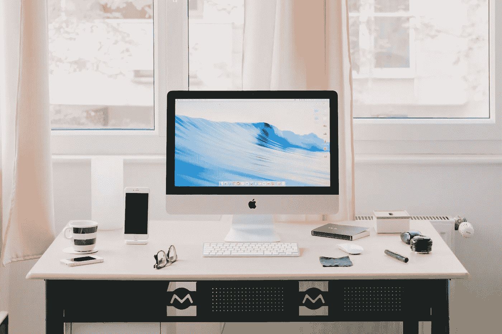

# 远程工作的有效技巧

> 原文：<https://medium.com/swlh/effective-tips-for-working-remotely-23cc290a8c08>

公司很少解释远程工作的有效方式。使用这些建议让你开始。

Photo by [Norbert Levajsics](https://unsplash.com/photos/D97n3LR5uN8?utm_source=unsplash&utm_medium=referral&utm_content=creditCopyText) on [Unsplash](https://unsplash.com/?utm_source=unsplash&utm_medium=referral&utm_content=creditCopyText)

你的老板允许你每周远程工作一两天。现在你可以从办公室生活的束缚中解脱出来，享受在家工作的自由。听起来很简单，对吧？

不是每个人都这样。新获得的自由对一些员工来说很难适应。由于公司很少解释远程工作的有效方式，我收集了一些多年来对我有帮助的建议。

远程工作越来越普遍，所以考虑以下习惯，充分利用你不在办公室的日子。

# 1.查找工作区

有一个指定的空间来做你的工作。把一间空房变成办公室。如果空间有限，找一张专门用于工作的书桌或桌子。指定的工作空间很重要，原因有几个。

首先，你将有空间展开你的工作材料——比如论文、书籍和报告——并把它们放在外面一整天。这比在餐桌上工作好多了。然后，你要收拾你的材料去吃午饭；下午把所有东西都拿出来工作；收拾好晚餐的东西。第二，一个专用的工作空间可以帮助你激励自己。当你走到这个指定的空间，你就知道该工作了。

# 2.投资工作材料

一些公司为他们的员工购买设备，从显示器到纸和笔，这样他们就为成功做好了准备。其他人则让员工自己决定是否购买额外物品。

我为这两种类型的公司都工作过，发现拥有合适的材料，无论我是否购买，都是非常值得的。投资少量的供应品是做好工作和保持远程工作提供的自主性的相对最小的成本。

# 3.制定时间表

给你的一天一些结构，并为未来的一天制定一个时间表。我每天晚上制定一个[逐小时的时间表](https://amymhaddad.com/working-in-blocks-of-time-95962601d95a)，其中包括我的优先事项以及我将在什么时候处理它们。所以在星期二，我为星期三制定了一个时间表。

我还安排了[的休息](https://amymhaddad.com/why-workplace-breaks-are-needed-e0de7c49968b)。比如写了两个小时的文章，我会休息 15 分钟。休息是管理你一天精力的重要部分。离开你的家或公寓一会儿，散散步是提升你下午能量水平的好方法。

# 4.与同事交流

我大块大块不间断地工作。然而，我不是整天的隐士。我也优先考虑与同事交流，这在你远程工作时很重要。

我发现在一天中的指定时间检查数字通信工具很有帮助。例如，当我创建我的日程表时，我会记下我什么时候会查看电子邮件和空闲时间。有些人在电子邮件上设置了自动回复，提醒同事什么时候会有回复。还有一些人，比如经理，可能会发现提前告诉团队成员他们什么时候有空聊天或者回复邮件是有帮助的。

# **5。有指定的工作服**

Basecamp 的首席执行官杰森·弗里德在他的书《远程 [*:不需要办公室*](https://www.amazon.com/Remote-Office-Required-Jason-Fried/dp/0804137501) 中建议，把工作和娱乐与你穿的衣服分开。也许你有几件“工作”t 恤，与你在周六下午或晚上放松时穿的 t 恤不同。弗里德建议，指定“在家工作”的服装可以让你进入正确的思维模式。

# 6.减少分心

在家工作的一个好处是逃避工作场所强加给你的干扰。所以，不要让自己被“家”分心，比如打开电视，浏览脸书的新闻。为什么？是因为一心多用不行。大卫·迈耶博士在美国心理协会的一篇文章中指出，任务之间的转换会导致高达 40%的生产力损失。

# 7.决定你工作日的结束

一个常见的挑战是远程工作时工作量过大。你看到你的电脑就在附近，你有一种唠叨的冲动，想整晚不停地查看你的电子邮件。

这就是为什么提前确定你的工作日什么时候结束很重要。把这个包括在你上面讨论的日常计划中。然后，关上你的笔记本电脑，把它放在你的书包里，或者关上你办公室的门，这样你的电脑就看不见了。

# 8.有效利用你的高峰时间

一些公司允许你在你想去的地方工作(远程工作)和你想去的时间工作(弹性工作时间表)。如果你的公司提供弹性工作时间表，那么确定你的高峰工作时间是很重要的。你早上做的第一件事是什么？你在午餐时间更警觉吗？

这些问题的答案可以帮助你确定你的工作高峰期。我是一个早起的人；我更喜欢在清晨和午饭后立即工作。在这些时候，我会优先处理重要的任务，把不太重要的事情留到一天中精神疲惫的时候。知道你什么时候工作最好可以帮助你充分利用你的一天。

更多的公司应该解释员工如何在远程工作时更有效率。在此之前，试试上面的建议，看看什么最适合你。

*如果你喜欢这篇文章，那么* [*订阅我的博客简讯*](http://amymhaddad.us10.list-manage.com/subscribe?u=bd9ac04321dc5549e9319ddb3&id=11053c7cab) *。当有新文章发表时，我会发邮件给你。感谢阅读！*

## 这篇文章发表在 [The Startup](https://medium.com/swlh) 上，这是 Medium 最大的创业刊物，拥有 275，554+人关注。

## 在这里订阅接收[我们的头条新闻](http://growthsupply.com/the-startup-newsletter/)。

