# 多维数据的有效可视化——实践方法

> 原文：<https://medium.com/swlh/effective-visualization-of-multi-dimensional-data-a-hands-on-approach-b48f36a56ee8>

## 有效数据可视化的策略

# 介绍

[*描述性分析*](https://www.gartner.com/it-glossary/descriptive-analytics/) 是与数据科学项目甚至特定研究相关的任何分析生命周期的核心组件之一。数据聚合、汇总和*可视化*是支持这一数据分析领域的一些主要支柱。从传统的 [*商业智能*](https://en.wikipedia.org/wiki/Business_intelligence) 时代到现在的 [*时代，人工智能*](https://en.wikipedia.org/wiki/Artificial_intelligence) 、 [*数据可视化*](https://en.wikipedia.org/wiki/Data_visualization) 一直是一种强大的工具，并因其在提取正确信息、清晰轻松地理解和解释结果方面的有效性而被组织广泛采用。

然而，处理通常具有两个以上属性的多维数据集开始产生问题，因为我们的数据分析和通信媒介通常局限于二维。过去，我写过几篇关于有效数据可视化的流行文章，也在会议上讲过同样的内容。本文将是我迄今为止处理结构化和非结构化数据的经验汇编！在本文中，我们将探讨以下几个方面:

*   **图形的语法**
*   **多维结构化数据可视化的有效策略**(范围从 ***一维*** 到 ***6-D*** )
*   **简述包括文本、图像和音频在内的非结构化数据的可视化**

示例将用 Python 展示，但是，如果您感兴趣，您可以在 R 或您选择的任何其他平台中复制相同的内容。

# 动机

数据可视化和讲故事一直是任何数据科学管道中最重要的阶段之一，涉及到从数据中提取有意义的见解，不管数据或项目有多复杂。举个简单的例子 [***【十几只雷龙】***](https://www.autodeskresearch.com/publications/samestats)——下图描绘了十二个不同的数据集。

> 你能猜出这些看起来非常不同的数据集之间的共同点吗？

The Datasaurus Dozen — What is common among these diverse datasets?

> 答:所有数据集的汇总统计数据完全相同！

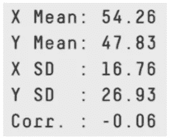

这是著名的安斯科姆四重奏的有趣变体，你们很多人可能都很熟悉，如下图所示。

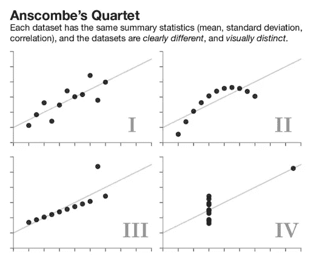

Anscombe’s quartet — Different datasets with same summary statistics

这些演示的关键要点是，*“不要盲目信任您的数据，开始根据您的数据建模”*。汇总统计数据总是具有欺骗性。在继续进行特征工程和构建统计、机器学习和深度学习模型之前，请始终可视化和理解您的数据属性。

另一个非常重要的动机来源，特别是对于有效的数据可视化，可以从几个世纪前的一些优秀案例研究中获得，当时我们甚至没有计算机，更不用说 Python 或 R！第一幅是约翰·斯诺著名的可视化作品，描绘了 1854 年英国伦敦爆发的宽街霍乱！

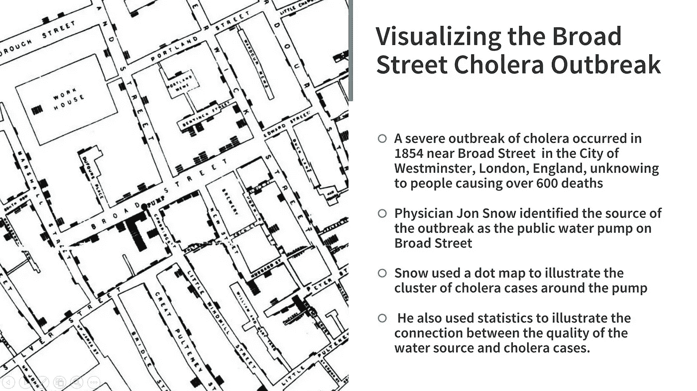

Visualizing the Broad Street Cholera outbreak which helped find the root cause of the disease outbreak! (Source: [https://github.com/dipanjanS/art_of_data_visualization](https://github.com/dipanjanS/art_of_data_visualization))

你可以看到一个简单的手绘可视化是如何帮助找到 19 世纪 50 年代宽街霍乱爆发的根本原因的。另一个有趣的可视化是由现代护理实践之母佛罗伦萨南丁格尔建立的，她对护理和统计有着根深蒂固的兴趣。

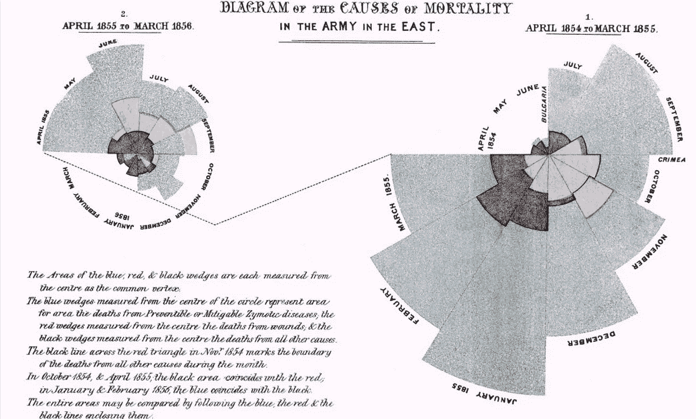

Causes of Mortality in the Army of the East — Florence Nightingale (Source: [https://github.com/dipanjanS/art_of_data_visualization](https://github.com/dipanjanS/art_of_data_visualization))

上图描绘了一个极区图，描述了 19 世纪 50 年代军队中的死亡原因。我们可以看到，这一可视化绝对不是简单化的，但它传达了正确的见解——清楚地显示了士兵死于可预防疾病的比例，这些疾病基于伤口或其他原因。这应该为有效的数据可视化提供足够的动力！

# 可视化的快速复习

我假设普通读者知道用于绘制和可视化数据的基本图形和图表，因此我不会进行详细的解释，但我们将在这里的动手实验中涵盖其中的大部分。正如著名的可视化先驱和统计学家所提到的，数据可视化应该在数据之上利用*【清晰、精确和高效】*来交流模式和见解。

我们将在这里使用 Python 机器学习生态系统，我们建议您查看用于数据分析和可视化的框架，包括`[pandas](https://pandas.pydata.org/)`、`[matplotlib](https://matplotlib.org/)`、`[seaborn](https://seaborn.pydata.org/)`、`[plotly](https://plot.ly/)`和`[bokeh](https://bokeh.pydata.org/en/latest/)`。除此之外，如果你对用数据制作美丽而有意义的可视化感兴趣，了解`[D3.js](https://d3js.org/)`也是必须的。有兴趣的读者推荐阅读[*爱德华·塔夫特的《量化信息的可视化展示》*](https://www.edwardtufte.com/tufte/books_vdqi) **。**

# *理解图形的语法*

*为了理解图形的语法，我们需要理解语法是什么意思。下图简要总结了这两个方面。*

*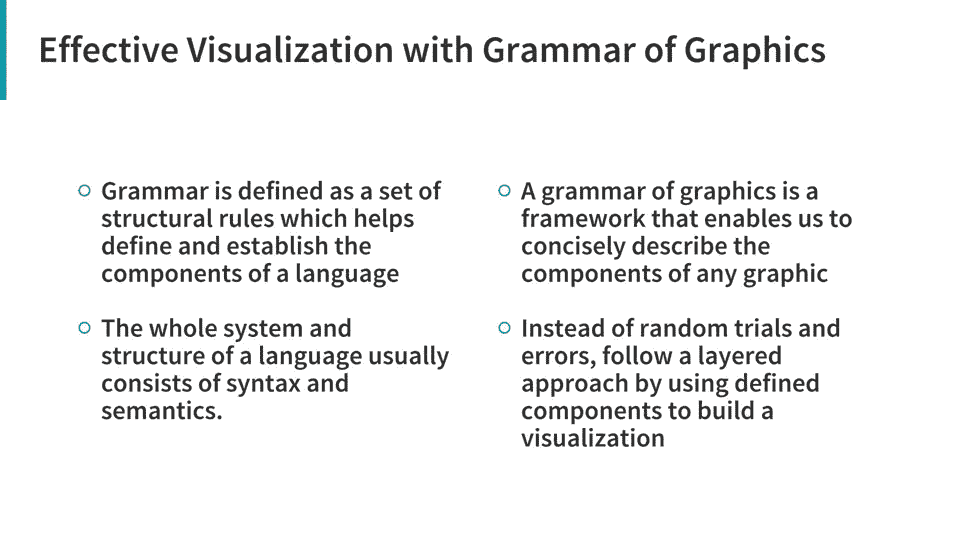*

*Understanding Grammar of Graphics (Source: [https://github.com/dipanjanS/art_of_data_visualization](https://github.com/dipanjanS/art_of_data_visualization))*

*基本上，图形语法是一个框架，它遵循分层的方法，以结构化的方式描述和构建可视化或图形。涉及多维数据的可视化通常有多个组件或方面，利用这种分层的图形语法有助于我们描述和理解可视化中涉及的每个组件——在数据、美学、比例、对象等方面。*

*图形框架的原始语法是由 Leland Wilkinson 提出的，它详细地涵盖了与有效数据可视化相关的所有主要方面。我肯定会推荐感兴趣的读者去看看这本书，只要他们有机会！*

* [## 图形的语法|利兰·威尔金森|斯普林格

### 第一版序言在 1980 年代为 SYSTAT 编写图形之前，我首先讲授了一个关于…

www.springer.com](https://www.springer.com/in/book/9780387245447) 

然而，我们将使用它的一个变体——称为图形框架的分层语法，它是由著名的数据科学家 Hadley Wickham 提出的，他也是著名的 R visualization 软件包`[**ggplot2**](https://ggplot2.tidyverse.org/)`的创建者。读者应该看看他的论文，标题是 [*【图形的分层语法】*](http://vita.had.co.nz/papers/layered-grammar.html) ，其中详细介绍了他提出的图形分层语法，还谈到了他为 R 编程语言构建的开源实现框架`**ggplot2**`

我已经确定了七个主要组成部分，它们通常帮助我在多维数据上建立有效的可视化。下图显示了语法中每个特定组件的一些细节。

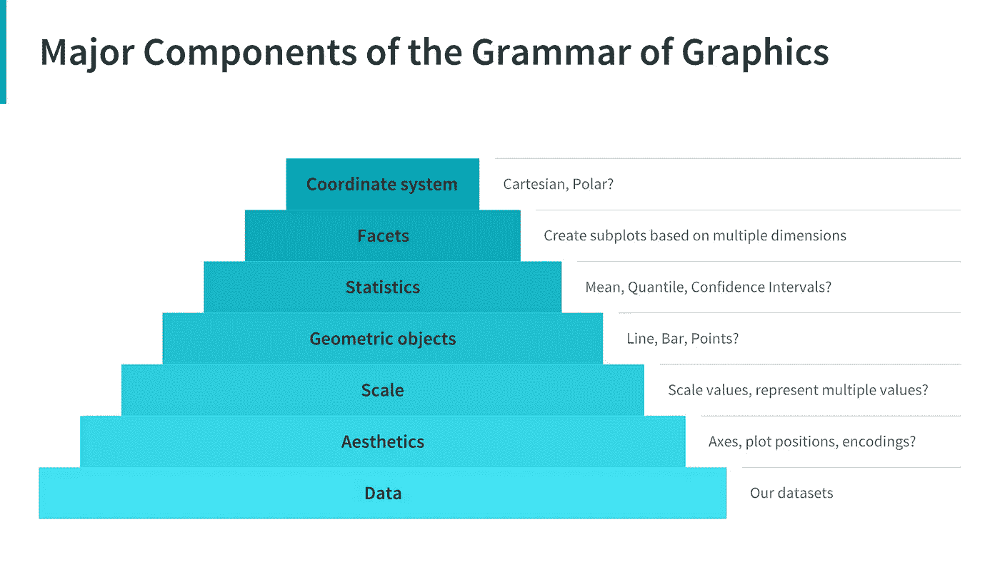

Major components of the Grammar of Graphics ( Source: [https://github.com/dipanjanS/art_of_data_visualization](https://github.com/dipanjanS/art_of_data_visualization))

我们用一个金字塔架构来展示组件的内在分层结构。通常，为了用一个或多个维度构建或描述任何可视化，我们可以使用如下组件。

1.  **数据**:始终从数据开始，确定您想要可视化的维度。
2.  **美观**:根据数据尺寸、图中各数据点的位置确定轴线。还要检查是否需要任何形式的编码，包括大小、形状、颜色等等，这些对于绘制多个数据维度都很有用。
3.  **标度:**我们是否需要对潜在值进行标度，用一个特定的标度来表示多个值或一个范围？
4.  **几何对象:**这些通常被称为“几何图形”。这将涵盖我们在可视化上描绘数据点的方式。应该是点，条，线之类的？
5.  **统计:**我们需要在可视化中显示一些统计度量吗，比如集中趋势、扩散、置信区间的度量？
6.  **刻面:**我们需要根据特定的数据维度创建支线剧情吗？
7.  **坐标系:**可视化应该基于哪种坐标系——是笛卡尔坐标系还是极坐标坐标系？

现在，我们将通过一些实际操作的例子来看看如何利用这个分层框架来为多维数据构建有效的数据可视化。

# 可视化结构化多维数据

让我们开始工作吧，不要让我在理论和概念上喋喋不休。我们将使用可从 [UCI 机器学习库](https://archive.ics.uci.edu/ml/index.php)获得的 [**葡萄酒质量数据集**](https://archive.ics.uci.edu/ml/datasets/wine+quality) 。该数据实际上由两个数据集组成，描述了葡萄牙*“Vinho Verde”*葡萄酒的红色和白色变种的各种属性。本文中的所有分析都可以在我的 [**GitHub 资源库**](https://github.com/dipanjanS/practical-machine-learning-with-python/tree/master/bonus%20content/effective%20data%20visualization) 中找到，作为一个 [Jupyter 笔记本](https://github.com/dipanjanS/practical-machine-learning-with-python/tree/master/bonus%20content/effective%20data%20visualization)供那些渴望亲自尝试的人使用！

我们将从加载以下分析所需的依赖项开始。

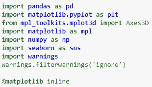

我们将主要使用`**matplotlib**` 和`**seaborn**` 作为我们的可视化框架，但是您可以自由地使用您选择的任何其他框架进行测试。我们先来看看经过一些基本的数据预处理步骤后的数据。

我们通过合并红葡萄酒和白葡萄酒样本的数据集来创建一个单一的葡萄酒数据框架。我们还基于葡萄酒样本的`**quality**`属性创建了一个新的分类变量`**quality_label**` 。现在让我们来看一下数据。

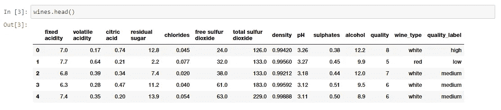

The wine quality dataset

很明显，我们有几个葡萄酒样品的数字和分类属性。每个观察值属于一个红葡萄酒或白葡萄酒样品，属性是从物理化学测试中测量和获得的特定属性或特性。如果你想了解每个属性的详细解释，你可以查看 Jupyter 笔记本。让我们对其中一些感兴趣的属性做一个快速的基本描述性汇总统计。

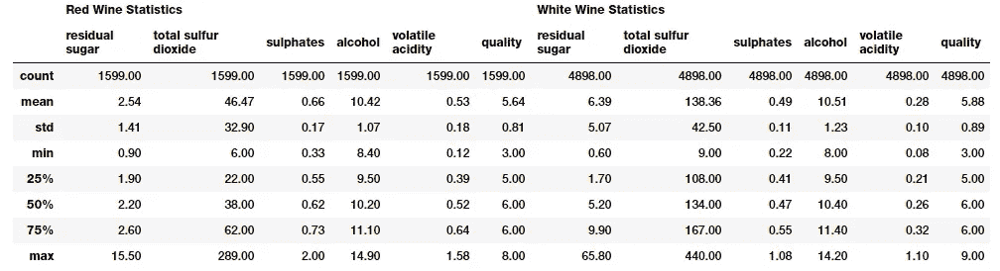

Basic descriptive statistics by wine type

对不同类型的葡萄酒样本进行对比和比较这些统计数据是非常容易的。请注意一些属性的明显差异。我们将在以后的一些可视化中强调这些。

# 单变量分析

单变量分析基本上是最简单的数据分析或可视化形式，我们只关心分析一个数据属性或变量，并将其可视化(一维)。

## 一维可视化数据(1-D)

可视化所有数字数据及其分布的最快和最有效的方法之一是使用`pandas`来利用 ***直方图***

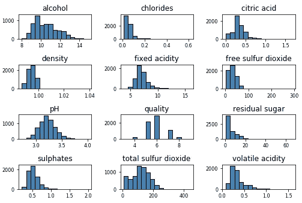

Visualizing attributes as one-dimensional data

上面的图很好地说明了任何属性的基本数据分布。

让我们深入到 ***可视化一个连续的数字属性。*** 本质上是一个 ***直方图*** 或 ***密度图*** 在理解该属性的数据分布方面非常有效。

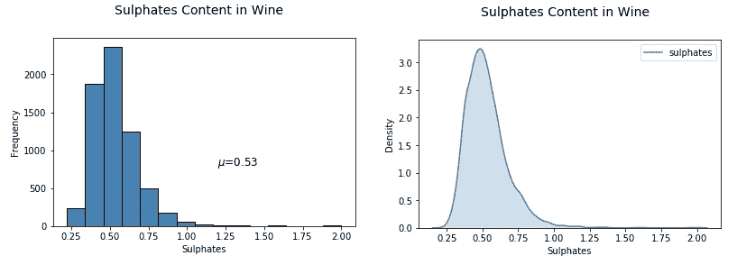

Visualizing one-dimensional continuous, numeric data

从上面的图中可以明显看出，葡萄酒`sulphates`的分布存在明显的右偏。

***可视化一个离散的、分类的数据属性*** 略有不同，而 ***条形图*** 也是最有效的方法之一。你也可以使用*饼状图，但是一般来说要尽量避免使用它们，尤其是当不同类别的数量超过三个的时候。*

*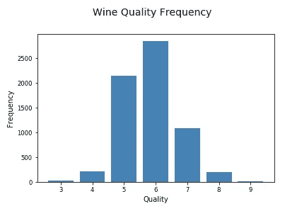*

*Visualizing one-dimensional discrete, categorical data*

*现在让我们继续看更高维度的数据。*

# *多变量分析*

*多元分析是乐趣和复杂性的开始。这里我们分析多个数据维度或属性(2 个或更多)。多变量分析不仅包括检查分布，还包括这些属性之间的潜在关系、模式和相关性。如果需要，您还可以根据手头要解决的问题，利用推断统计和假设检验来检查不同属性、组等的统计显著性。*

## *以二维方式可视化数据(2-D)*

*检查不同数据属性之间的潜在关系或相关性的最佳方式之一是利用 ***成对相关矩阵*** 并将其描绘为 ***热图*** 。*

*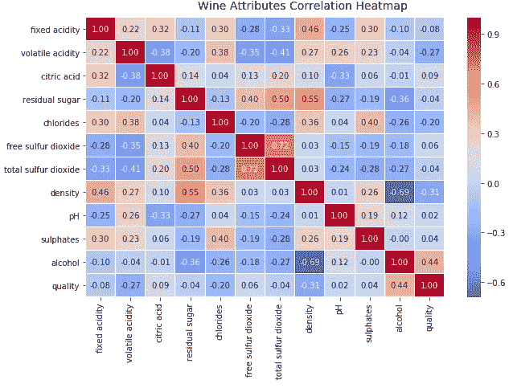*

*Visualizing two-dimensional data with a correlation heatmap*

*热图中的梯度根据相关性的强度而变化，您可以清楚地看到，很容易发现潜在属性之间具有很强的相关性。另一种方法是在感兴趣的属性之间使用 ***成对散点图*** 。*

*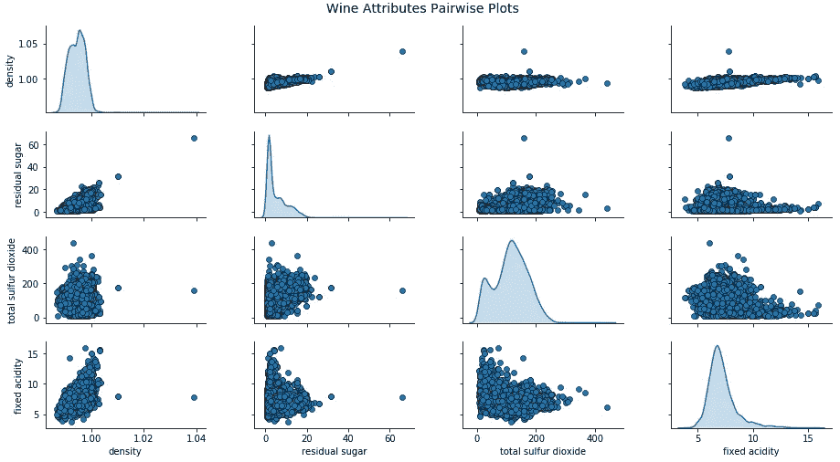*

*Visualizing two-dimensional data with pair-wise scatter plots*

*根据上面的图，您可以看到散点图也是观察数据属性的二维潜在关系或模式的一种不错的方式。*

> *关于成对散点图需要注意的重要一点是，这些图实际上是对称的。任何一对属性`***(X, Y)***`的散点图看起来与`***(Y, X)***`中的相同属性不同，只是因为垂直和水平刻度不同。它不包含任何新信息。*

*将多个属性的多元数据可视化的另一种方式是使用 ***平行坐标*** 。*

*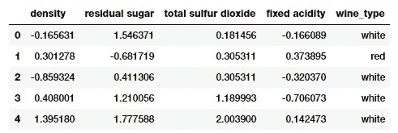**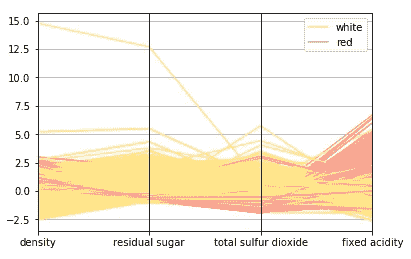*

*Parallel coordinates to visualize multi-dimensional data*

*基本上，在如上所述的可视化中，点被表示为连接的线段。每条垂直线代表一个数据属性。跨越所有属性的一组完整的连接线段代表一个数据点。因此，倾向于聚集的点看起来会靠得更近。通过观察，我们可以清楚地看到，与白葡萄酒相比，`**density**` 更适合红葡萄酒。同样，*白葡萄酒*的`**residual sugar**`和`**total sulfur dioxide**`比*红葡萄酒*高，而*红葡萄酒*的`**fixed acidity**`比`**white wines**`高。查看我们之前导出的统计表中的统计数据来验证这个假设！*

*让我们来看一些我们可以 ***可视化两个连续的数字属性*** 的方法。特别是 ***散点图*** 和 ***联合图*** 不仅是检查模式、关系的好方法，也是查看属性的个体分布的好方法。*

*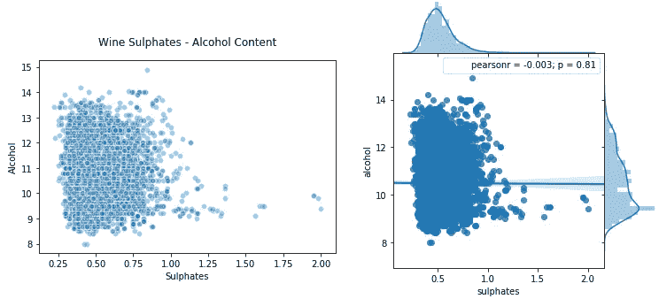*

*Visualizing two-dimensional continuous, numeric data using scatter plots and joint plots*

*上图左侧为 ***散点图*** ，右侧为 ***联合图*** 。正如我们提到的，您可以在联合图中检查相关性、关系以及个体分布。*

*如何看待 ***可视化两个离散的、分类的属性？*** 一种方法是利用单独的情节(支线情节)或 ***面*** 来获得一个分类维度。*

*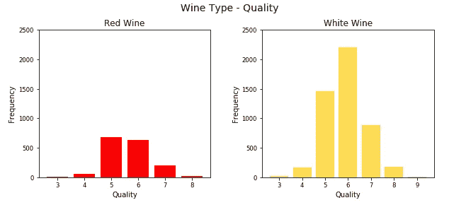*

*Visualizing two-dimensional discrete, categorical data using bar plots and subplots (facets)*

*虽然这是可视化分类数据的好方法，但正如您所见，利用`**matplotlib**` 已经导致编写了大量代码。另一个好方法是使用 ***堆叠条*** 或 ***多个条*** 用于单个图中的不同属性。我们可以轻松地利用`**seaborn**` 实现同样的目的。*

*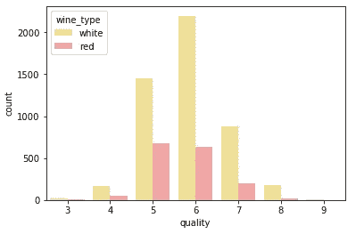*

*Visualizing two-dimensional discrete, categorical data in a single bar chart*

*这肯定看起来更干净，你也可以有效地比较不同的类别很容易从这个单一的阴谋。*

*让我们看看 ***在二维中可视化混合属性*** (本质上是数字和分类在一起)。一种方法是使用 ***刻面\支线剧情*** 连同通用 ***直方图*** 或 ***密度剧情*** 。*

*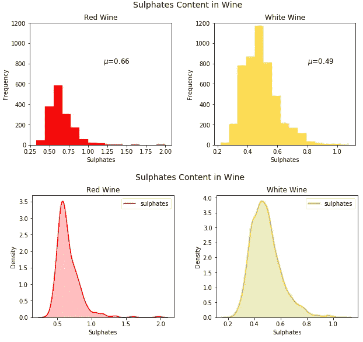*

*Visualizing mixed attributes in two-dimensions leveraging facets and histograms\density plots*

*虽然这很好，但我们又一次有了很多样板代码，我们可以通过利用`**seaborn**` 来避免这些代码，甚至可以在一个图表中描绘这些图。*

*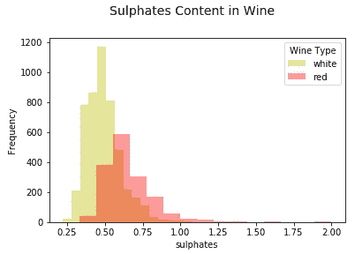*

*Leveraging multiple histograms for mixed attributes in two-dimensions*

*你可以看到上面生成的图清晰简洁，我们可以很容易地比较不同的分布。除此之外， [***箱形图***](https://en.wikipedia.org/wiki/Box_plot) 是根据分类属性中的不同值有效描绘数字数据组的另一种方式。 [***箱形图***](https://en.wikipedia.org/wiki/Box_plot) 是了解数据中四分位值以及潜在异常值的好方法。*

*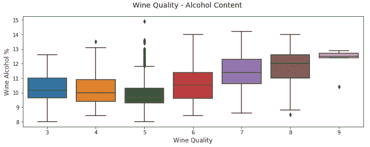*

*Box Plots as an effective representation of two-dimensional mixed attributes*

*另一个类似的可视化是[***violin plots***](https://en.wikipedia.org/wiki/Violin_plot)，这是使用核密度图(描绘不同值的数据的概率密度)可视化分组数字数据的另一种有效方式。*

*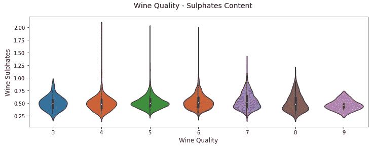*

*Violin Plots as an effective representation of two-dimensional mixed attributes*

*你可以清楚地看到上面不同酒类`**quality**`**`**sulphate**`的密度图。***

> ***将数据可视化为二维非常简单，但是随着维度(属性)数量的增加，数据开始变得复杂。原因是因为我们被二维的展示媒介和环境所束缚。***
> 
> ***对于三维数据，我们可以通过在我们的图表中取一个 **z 轴**或者利用支线图和小平面来引入一个虚假的**深度**的概念。***
> 
> ***然而，对于高于三维的数据，可视化变得更加困难。超越三维的最好方法是使用**的小平面、颜色、形状、大小、深度**等等。***

## ***三维可视化数据(3-D)***

***考虑到数据中的三个属性或维度，我们可以通过考虑一个 ***成对散点图*** 并引入 ***颜色*** 或 ***色调*** 的概念来将它们可视化，以分离出分类维度中的值。***

***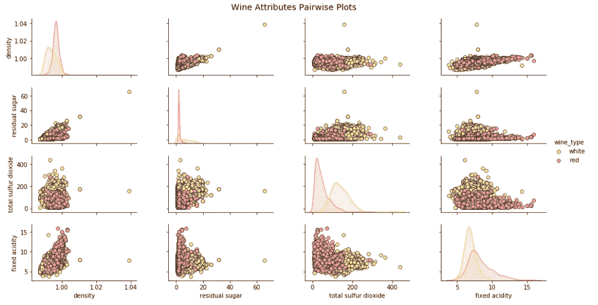***

***Visualizing three-dimensional data with scatter plots and **hue** (color)***

***上面的图使你能够检查相关性和模式，也可以围绕葡萄酒组进行比较。就像我们可以清楚地看到*白葡萄酒*的`**total sulfur dioxide**`和`**residual sugar**`比*红葡萄酒*高。***

***让我们来看看 ***可视化三个连续的数字属性*** 的策略。一种方式是将两个维度表示为常规的**(*×轴*)和 ***宽***(*y*-轴)，并且还将 ***深度***(*z*-轴)的概念用于第三维。*****

****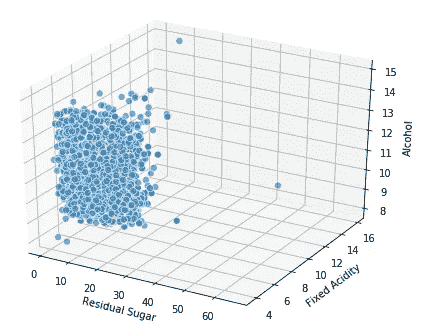****

****Visualizing three-dimensional numeric data by introducing the notion of **depth******

****但是这样有效吗？不尽然！然而，我们可以利用常规的 2-D 轴来表示两个连续变量(散点图),并且*引入第三个连续变量作为宁滨的分类变量*,其值在固定宽度的箱中——通常这些可以是分位数。基于这些分位数(或箱)，我们可以使用 ***大小*** 甚至 ***色调*** 来表示这里的第三个变量，使其成为三维的。****

****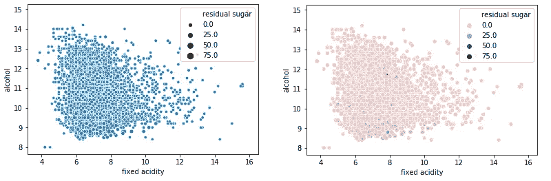****

****Using the notion of **size** or **hue** for representing continuous data in 3-D****

****一个更好的选择是使用 ***刻面*** 的概念作为第三维度(本质上是 ***支线剧情*** )，其中每个支线剧情指示来自我们的第三变量(维度)的特定仓。请记住，如果您使用的是`**matplotlib**`而不是`**seaborn**`的散点图功能，您需要手动创建您的条块(如下例所示)。****

****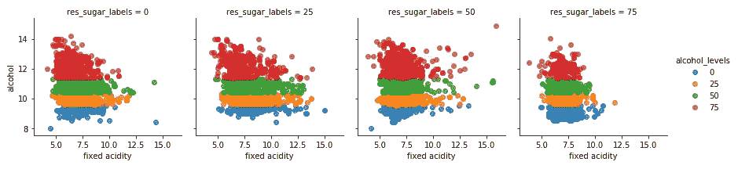****

****Using the notion of **facets** for representing continous data in 3-D****

****上面的图清楚地告诉我们，葡萄酒样品中的`**residual_sugar**`水平和`**alcohol**`含量越高，`**fixed_acidity**`越低。****

****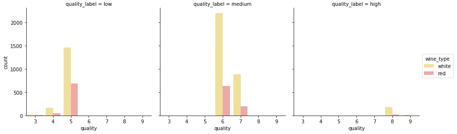****

****Visualizing three-dimensional categorical data by introducing the notion of **hue** and **facets******

****上面的图表清楚地显示了与每个维度相关的频率，您可以看到这在理解相关见解时是多么容易和有效。****

****考虑到*三个混合属性的可视化，我们可以使用 ***色调*** 的概念来在一个分类属性中分离我们的组，同时使用传统的可视化，如 ***散点图*** 来可视化数值属性的二维。*****

****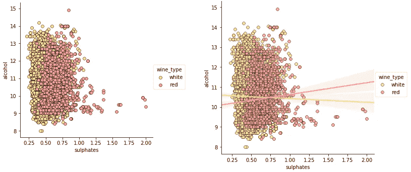****

****Visualizing mixed attributes in three-dimensions leveraging scatter plots and the concept of **hue******

****因此，色调充当了类别或组的良好分隔符，尽管如上所述不存在或非常弱的相关性，但我们仍然可以从这些图中了解到，与*白葡萄酒*相比，*红葡萄酒*的`**sulphates**` 略高。除了散点图，还可以使用一个 ***内核密度图*** 来三维理解数据。****

****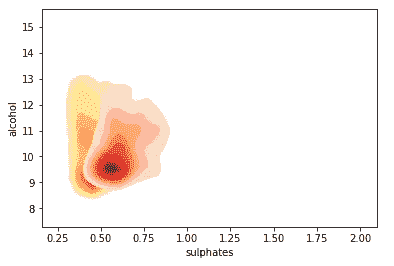****

****Visualizing mixed attributes in three-dimensions leveraging kernel density plots and the concept of **hue******

****与*白葡萄酒*相比，*红葡萄酒*样品具有更高的`**sulphate**` 含量，这是非常明显和预料到的。您还可以看到基于色调强度的密度浓度。****

****如果我们正在处理三维中的 ***多个分类属性*** *，我们可以使用 ***【色相】*** 和 ***中的一个常规轴*** 来可视化数据，并使用类似于 ***盒图*** 或**【小提琴图*** 的可视化来可视化不同组的数据。****

***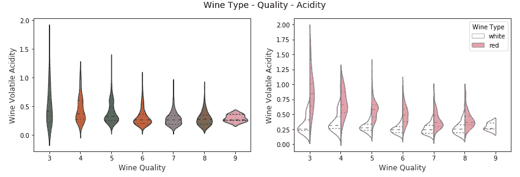***

***Visualizing mixed attributes in three-dimensions leveraging split violin plots and the concept of **hue*****

***在上图中，我们可以看到，在右手边的三维可视化绘图中，我们在 x 轴上表示了葡萄酒`**quality**` ，在`**wine_type**`上表示了色调*。我们可以清楚地看到一些有趣的现象，比如红葡萄酒*比白葡萄酒*的`**volatile acidity**`高。******

***您也可以考虑使用 ***箱线图*** 以类似的方式表示具有多个分类变量的混合属性。***

***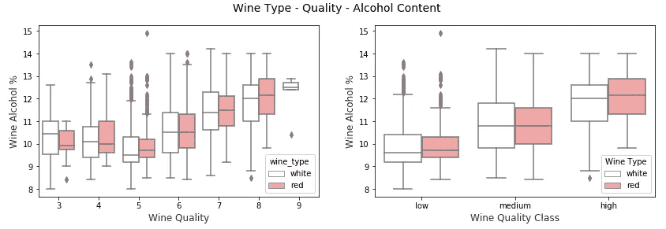***

***Visualizing mixed attributes in three-dimensions leveraging box plots and the concept of **hue*****

***我们可以看到，无论是对于`**quality**` 还是`**quality_label**` 属性，葡萄酒的`**alcohol**` 含量越高质量越好。此外，根据*的质量等级，与*白葡萄酒*相比，*红葡萄酒*往往具有略高的中值`**alcohol**` 含量。然而如果我们查看*的质量等级，我们可以看到，对于*等级较低的葡萄酒* ( **3 & 4** )，其*白葡萄酒*中值`**alcohol**` 含量要大于*红葡萄酒*样品。除此之外，与白葡萄酒相比，*红葡萄酒*的中值`**alcohol**` 含量似乎略高。*****

## ****以四维方式可视化数据(4-D)****

****根据我们之前的讨论，我们利用图表的各种组件来可视化多个维度。在四维中可视化数据的一种方式是使用 ***深度*** 和 ***色调*** 作为像 ***散点图*** 那样的常规图中的特定数据维度。****

****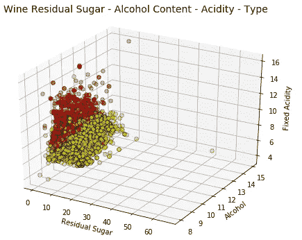****

****Visualizing data in four-dimensions leveraging scatter plots and the concept of **hue** and **depth******

****从上面的图中可以明显看出,`**wine_type**`属性由色调表示。此外，尽管由于情节的复杂性，解释这些可视化变得越来越困难，但您仍然可以收集到一些见解，如`**fixed acidity**`对于*红葡萄酒*更高，而`**residual sugar**`对于*白葡萄酒*更高。当然，如果在`**alcohol**`和`**fixed acidity**`之间有一些关联，我们可能会看到一个逐渐增加或减少的数据点平面，显示出一些趋势。****

****这样有效吗？再说一次，不是真的！一个更好的策略是保持二维绘图，但是使用*和数据点 ***大小*** 作为数据维度。通常这将是一个 ***气泡图*** 类似于我们之前看到的。*****

****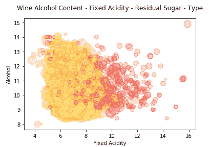****

****Visualizing data in four-dimensions leveraging bubble charts and the concept of **hue** and **size******

****我们用 ***色相*** 来表示`**wine_type**` ，数据点 ***大小*** 来表示`**residual sugar**`。我们确实从之前的图表中观察到了类似的模式，一般来说*白葡萄酒*的气泡尺寸更大，表明*白葡萄酒*的`**residual sugar**`值比*红葡萄酒*的【】值更高。****

****现在，这可能比以前的 4-D 图更好，但老实说，在我看来还不错。是的，*色调*有助于我们看出哪些葡萄酒的`**fixed acidity**` 更高或更低，但我不太喜欢大小的概念，因为它通常很难解释。我们能做得更好吗？是的，我们可以！让我们用 ***刻面*** 代替，如下图所示。****

****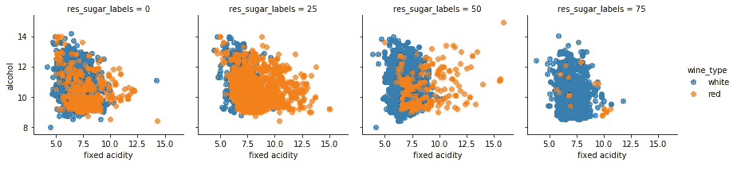****

****Visualizing data in four-dimensions leveraging scatter plots and the concept of **hue** and **facets******

****看那个！清晰简洁的视觉效果告诉我们*白葡萄酒*比*红葡萄酒*的`**fixed acidity**`低，并且*白葡萄酒*的`**residual sugar**`比*红葡萄酒*的`**residual sugar**`高得多。同样提高`**alcohol**`电平，降低`**fixed acidity**`。****

****如果我们有两个以上的分类属性要表示，我们可以重用我们的概念，利用*和 ***面*** 来描述这些属性，并使用像 ***散点图*** 这样的规则图来表示数字属性。让我们看几个例子。*****

****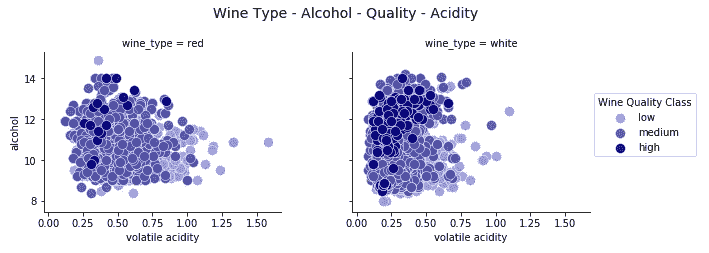****

****Visualizing data in four-dimensions leveraging scatter plots and the concept of **hue** and **facets******

****我们可以很容易地发现多种模式，这一事实验证了这种可视化的有效性。*白葡萄酒*的`**volatile acidity**`水平较低，同样*高品质葡萄酒*的酸度水平也较低。同样根据*白葡萄酒*样本，*高品质葡萄酒*的`**alcohol**` 含量较高，*低品质葡萄酒*的`**alcohol**`含量最低！****

****让我们举一个类似的例子，用其他一些属性来构建一个四维的可视化。****

****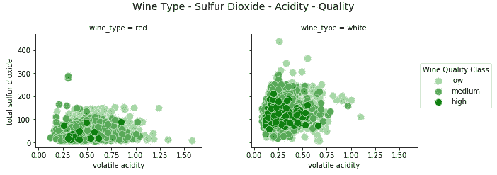****

****Visualizing data in four-dimensions leveraging scatter plots and the concept of **hue** and **facets******

****我们清楚地看到，*优质葡萄酒*的`**total sulfur dioxide**`含量较低，如果你对葡萄酒成分有必要的了解，这一点是很重要的。我们还看到*红酒*的`**total sulfur dioxide**`水平低于*白酒*。然而，在几个数据点上，*红酒的`**volatile acidity**`水平更高。*****

## ****在五维空间中可视化数据(5-D)****

****再次遵循与上一节相似的策略，在五维空间中可视化数据，我们利用各种绘图组件。让我们用*、 ***色相*** 和 ***大小*** 来表示除了 ***正轴*** 以外的三个数据维度来表示另外两个维度。既然我们使用了尺寸的概念，我们将基本上绘制一个三维的 ***气泡图*** 。*****

****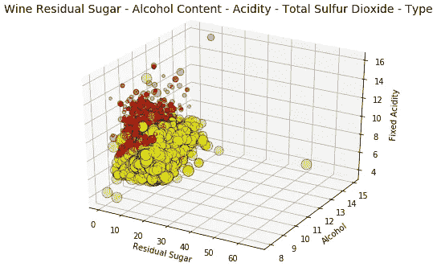****

****Visualizing data in five-dimensions leveraging bubble charts and the concept of **hue, depth** and **size******

****这个图表描述了我们在上一节中谈到的相同的模式和见解。然而，我们也可以看到，根据由`**total sulfur dioxide**`表示的点数大小，*白葡萄酒*比*红葡萄酒*具有更高的`**total sulfur dioxide**`等级。****

****除了 ***深度*** ，我们还可以使用 ***刻面*** 以及 ***色调*** 来表示这五个数据维度中的多个分类属性。代表 ***大小*** 的属性之一可以是*数值(连续)*甚至是*分类*(但是我们可能需要用数字来表示数据点大小)。虽然由于缺乏分类属性，我们没有在这里进行描述，但是您可以在自己的数据集上尝试一下。****

****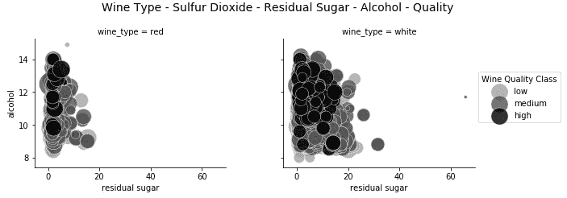****

****Visualizing data in five-dimensions leveraging bubble charts and the concept of **hue, facets** and **size******

****这基本上是另一种方法，可以将我们之前绘制的五维图可视化。但是，考虑到我们之前观察到的解释 ***大小*** 的难度，您可以使用宁滨将其中一个变量(如果是连续的)转换为离散分类变量，然后将其用作额外的 ***刻面*** 参数，如下图所示！****

****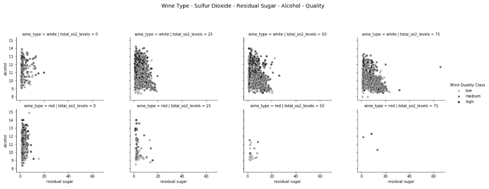****

****Visualizing data in five-dimensions leveraging scatter plots and the concept of **hue** and **facets******

****虽然在查看我们之前绘制的图时， ***深度*** 或 ***大小*** 的额外尺寸可能会使许多人困惑，但是由于 ***小平面*** 的优势，该图仍然有效地保留在二维平面上，因此通常更有效且更容易解释。****

## ****可视化六维数据(6-D)****

****既然我们玩得开心(我希望！)，让我们在可视化中添加另一个数据维度。我们将利用****色调******尺寸******形状*** 除了我们的*规则两轴来刻画所有的六个数据维度。******

*****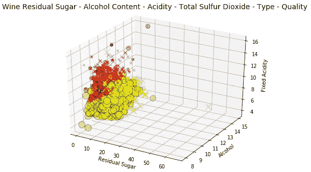*****

*****Visualizing data in six-dimensions leveraging scatter charts and the concept of **hue, depth, shape** and **size*******

*****哇，在一个情节中有六个维度！我们有由 ***形状*** 、*高*(平方像素)、*中*(X 标记)和*低*(圆圈)品质的葡萄酒。其中`**wine_type**`由 ***表示色相，*** `**fixed acidity**`由 ***表示深度*** 和数据点 ***大小*** 表示内容`**total sulfur dioxide**`。*****

****解释这一点似乎有点费力，但是在试图理解正在发生的事情时，请一次考虑几个组件。****

1.  ****考虑到 ***形状*** & ***y 轴*** ，我们有*高*和*中*品质的葡萄酒，与*低*品质的葡萄酒相比具有更高的`**alcohol**` 水平。****
2.  ****考虑到 ***色相******大小*** ，我们对于*白葡萄酒*的`**total sulfur dioxide**`含量要高于*红葡萄酒*。****
3.  ****考虑到 ***深度*** 和 ***色调*** ，我们有*白葡萄酒*比*红葡萄酒*的`**fixed acidity**`水平低。****
4.  ****考虑到 ***色调*** 和 ***x 轴*** ，我们有*红葡萄酒*比*白葡萄酒*的`**residual sugar**`水平低。****
5.  ****考虑到****形状*** ，*白葡萄酒*似乎比*红葡萄酒*拥有更多*高*品质的葡萄酒(可能是因为*白葡萄酒*的样本量更大)。*****

****我们还可以通过移除 ***深度*** 组件并使用 ***面*** 来代替分类属性来构建 6-D 可视化。****

****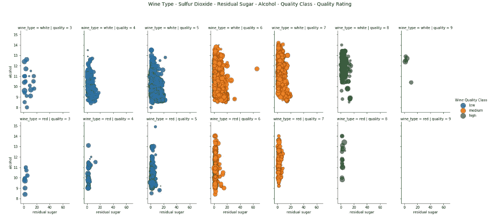****

****Visualizing data in six-dimensions leveraging scatter charts and the concept of **hue, facets** and **size******

****因此，在这个场景中，我们利用 ***面*** 和*来表示三个分类属性，利用 ***两个常规轴*** 和 ***大小*** 来表示我们的 6-D 数据可视化的三个数值属性。*****

## ****我们能再高点吗？****

****紧迫的问题是，我们能超越六维吗？当然，突破二维渲染设备的限制来可视化更多的数据维度肯定会变得越来越困难。****

********

****一种方法是使用更多的面和支线剧情。除此之外，如果数据集具有时间方面，也可以使用时间的概念，如下例所示。****

****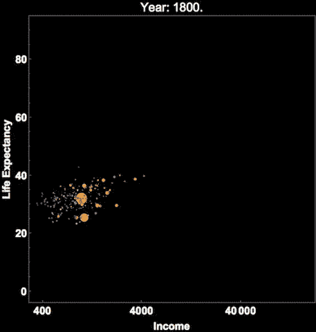****

****Hans Rosling’s famous visualization of global population, health and economic indicators****

****这幅描绘了*全球各国人口、健康和各种经济指标的著名可视化作品。这也在一个官方 ted 会议上展示过，如果大家还没看过的话，我推荐大家去看看！*****

*****这将为您提供一个很好的视角，让您了解如何利用图形的分层语法来可视化多维数据。*****

# *****可视化非结构化数据—文本、图像、音频*****

*****上一节向您介绍了一些有效可视化结构化数据的有用技术。但是我们如何处理像文本、图像和音频这样的非结构化数据呢？它们彼此之间有很大的不同，如果单独考虑它们，也会有很大的不同！在这里，我们将简要地看一下可视化这三种非结构化数据源的一些方法。请记住，可视化这些数据源的最终目标不仅仅是为了它，而是为了收集见解并生成有用的属性和特征，这些属性和特征可以在下游的机器学习或深度学习应用程序中进一步使用。*****

## *****可视化文本数据*****

*****考虑到您有一个文本数据语料库，最好的开始方式之一是做基本的探索性数据分析。这可能是像试图找到典型的句子长度或字数的分布方面。下面是我最近在 NLP 上举办的 [*研讨会中的一个例子。*](https://www.analyticsvidhya.com/datahack-summit-2018/2018/08/04/getting-started-with-natural-language-processing)*****

****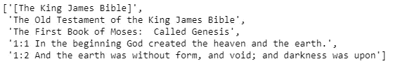********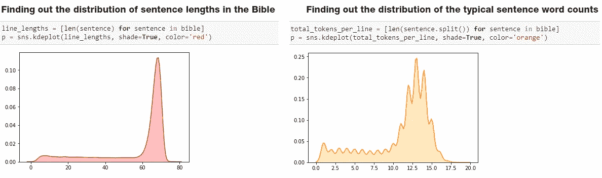****

****Basic EDA on Text Data****

****除此之外，我们还可以通过利用浅层解析、依存解析和选区解析等技术，专注于理解和可视化语言结构。如果您对进一步的细节感兴趣，我的一篇关于 [***自然语言处理***](https://towardsdatascience.com/a-practitioners-guide-to-natural-language-processing-part-i-processing-understanding-text-9f4abfd13e72) 的文章中提供了详细的代码示例。****

**** [## 自然语言处理实践指南(第一部分)——处理和理解文本

### 经过验证和测试的解决 NLP 任务的实践策略

towardsdatascience.com](https://towardsdatascience.com/a-practitioners-guide-to-natural-language-processing-part-i-processing-understanding-text-9f4abfd13e72) 

下图描述了我的文章中演示选区和依赖解析的一个示例。

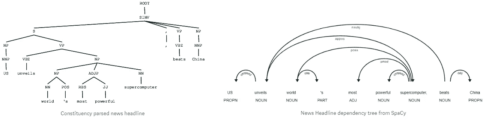

Constituency & Dependency Parsing — Understanding Text Structure

我们还可以看看基于最近的深度学习模型(如 Word2Vec、GloVe 和 FastText)的嵌入，以了解除结构之外的文本语义。我在我的关于文本数据的 [***特征工程方法的文章***](https://towardsdatascience.com/understanding-feature-engineering-part-4-deep-learning-methods-for-text-data-96c44370bbfa) 中也提到了这一广泛的细节，如果你对这些血淋淋的细节感兴趣，你可以参考一下！

 [## 理解特征工程(第 4 部分)——深度学习的直观实践方法…

### 驯服非结构化文本数据的更新、高级策略

towardsdatascience.com](https://towardsdatascience.com/understanding-feature-engineering-part-4-deep-learning-methods-for-text-data-96c44370bbfa) 

通常，可视化单词嵌入可以帮助您理解语料库中单词之间的上下文和语义，甚至利用这些功能来构建机器学习或深度学习模型！

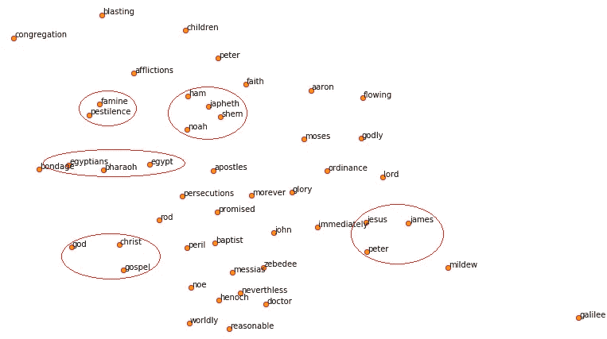

An example of visualizing word2vec word embeddings on The Bible

## 可视化图像数据

图像基本上是多维张量，可以表示为像素值的矩阵。这真的增加了一个简单的小图像的维度，并使其难以处理。下图描述了一个简单的例子。

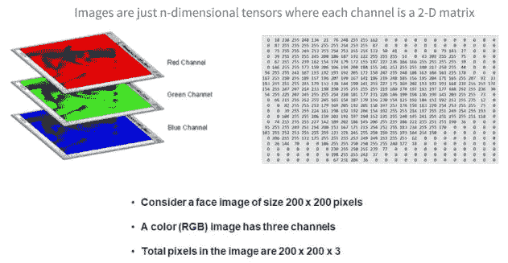

最好的开始方式之一是加载任何感兴趣的特定图像，并根据其像素值查看其通道贡献，如下所示。

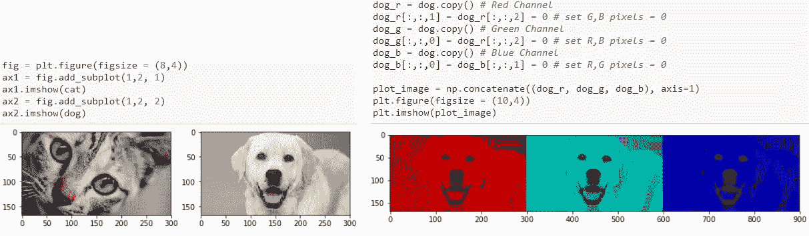

Visualizing image channels

另一个有趣的方面是通过检查图像像素值并绘制下图所示的分布来观察图像强度分布。

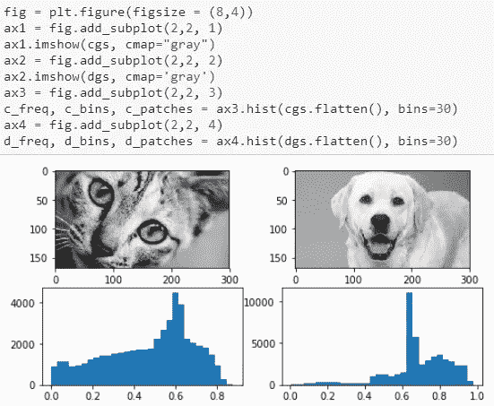

Visualizing image intensity distributions

考虑到可视化可能对下游机器学习或深度学习有用，我们可以看看边缘检测，它可以帮助识别图像边缘，甚至将它们用作潜在的特征！

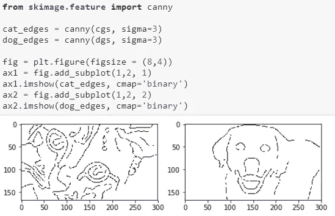

Visualizing image edges

我们还可以可视化从 HOG 获得的特征，HOG 代表方向梯度直方图。简而言之，这有助于计算局部区域中梯度方向的出现次数。下面是一个简单的例子。

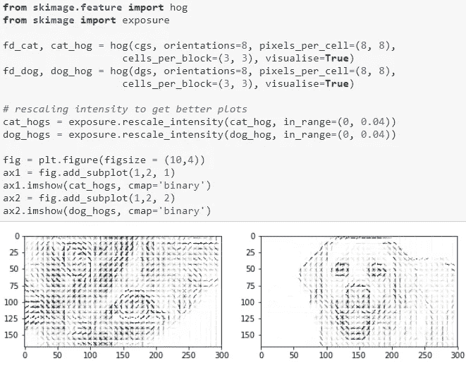

Visualizing HOG features

您甚至可以使用从前面的技术中获得的特征描述符来构建图像分类器、对象检测等等。

## CNN 改变了世界

卷积神经网络，通常被称为 CNN，使用自动化特征工程和表示，真正革新了视觉数据的可视化和建模方式。每个图层通常称为卷积图层(通常后跟汇集图层),可以从输入图像中提取特定和一般特征。下图中描述了一个示例，在该示例中，CNN 可视化并学习网络中每一层的每个面的要素表示。

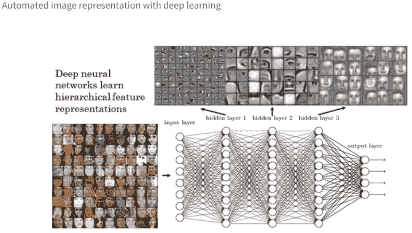

CNNs revolutionized image representation and feature engineering

可视化 CNN 的中间层总是有助于理解图像的哪些部分被提取为特征，并有助于激活这些层中的隐藏单元！

## 可视化音频数据

这里最大的问题是，“你真的能看到你能听到的东西吗？”。这里的目的是能够可视化从特定源创建的任何声音或音频。信号处理在这些方面真的很有帮助！我最近研究了一个有趣的用例，使用深度迁移学习对来自[***urban sound 8k***](https://urbansounddataset.weebly.com/urbansound8k.html)*数据集的不同类别的音频文件进行分类，我们利用了预先训练的模型，这些模型是专业的图像分类器，令人惊讶的是，它的工作效率接近 90%!如果有兴趣，你可以在我的书 [*“用 Python 进行实际迁移学习”*](https://github.com/dipanjanS/hands-on-transfer-learning-with-python) 中查看更多细节，我已经在 [*GitHub*](https://github.com/dipanjanS/hands-on-transfer-learning-with-python) 上为大家开源了代码。*

*我们利用`**librosa**`框架进行特征提取，它还提供了优秀的可视化 API。可视化声音的最简单方法之一是绘制波形振幅，如下图所示。*

*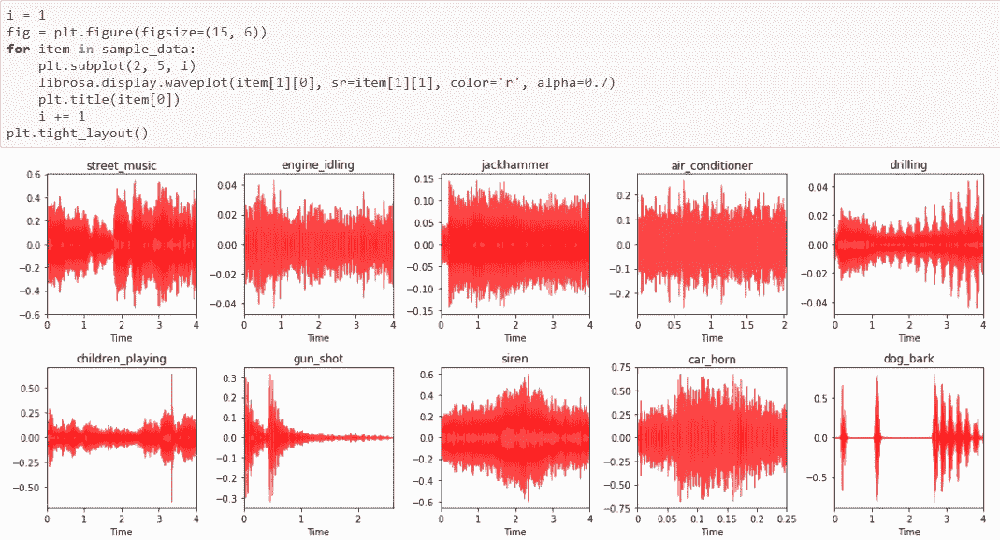*

*Visualizing Audio Waveform Amplitudes*

*然而，更有用的可视化是梅尔频谱图，它是我们的音频信号随时间变化的频谱的字面视觉表示。以下描述显示了我们音频源的 mel 频谱图。*

*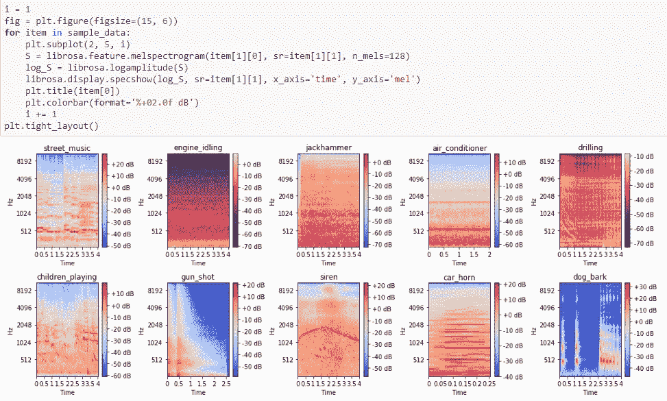*

*Visualizing Audio Mel-spectrograms*

*这些视觉效果让我们了解不同的音频源可以是什么样的，并且是非常有用的功能，可以被 CNN 等深度学习模型使用。*

# *结论*

*数据可视化是一门艺术，也是一门科学。如果你正在读这篇文章，我真的很赞赏你通读这篇内容广泛的文章的努力。其目的不是为了记忆任何东西，也不是为了给可视化数据提供一套固定的规则。这里的主要目标是理解和学习一些有效的策略来可视化结构化和非结构化数据，尤其是当维数开始增加时。一定要保持简单，不要试图构建极其复杂的可视化。*

*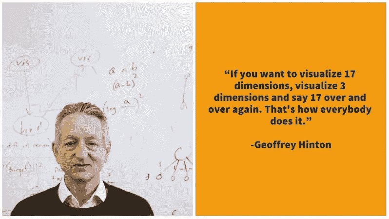*

*我鼓励你在将来利用这些片段来可视化你自己的数据集。请随时给我反馈，并分享您自己的有效数据可视化策略*“尤其是如果您能走得更高的话！”**

*有反馈给我吗？或者有兴趣和我一起做研究，数据科学，人工智能？你可以在 [**LinkedIn**](https://www.linkedin.com/in/dipanzan/) **联系我。***

* [## Dipanjan Sarkar —数据科学家—英特尔公司| LinkedIn

### 查看 Dipanjan Sarkar 在世界最大的职业社区 LinkedIn 上的个人资料。Dipanjan 有 6 份工作列在…

www.linkedin.com](https://www.linkedin.com/in/dipanzan/) 

## 这篇文章发表在 [The Startup](https://medium.com/swlh) 上，这是 Medium 最大的创业刊物，有+398，714 人关注。

## 订阅接收[我们的头条新闻](http://growthsupply.com/the-startup-newsletter/)。

******