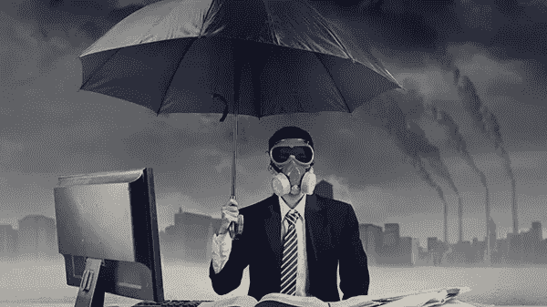

# 自我驱动的领导是有害的

> 原文：<https://medium.com/swlh/ego-driven-leadership-is-toxic-f0dfce04b3ac>

## 它会毁掉个人和整个组织

**Credit:**Getty Images/iStockphoto

起初听起来可能很不幸，但我和相当多的自私、自恋和彻头彻尾的有毒的人打过交道，也为他们工作过。

尽管这些经历大多令人不快，但我从那些人身上学到了很多关于糟糕领导力的东西。我亲眼目睹了一次又一次…