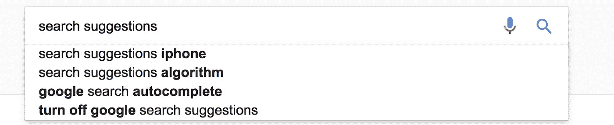
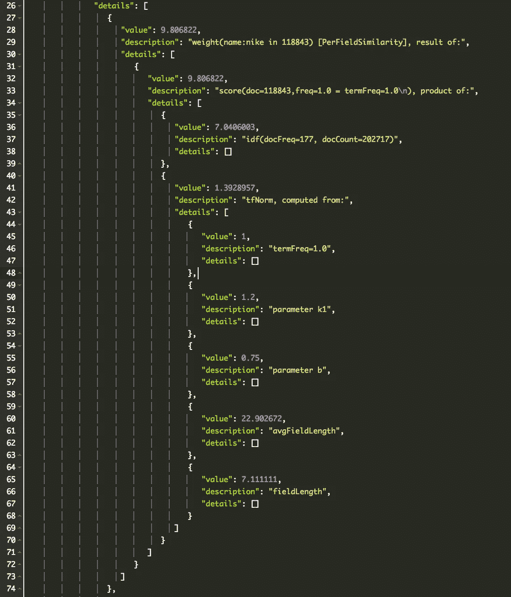

# 弹性搜索搜索建议最佳实践

> 原文：<https://medium.com/swlh/elasticsearch-search-suggestions-best-practices-241fa3a97108>

用户大量使用电子商务平台，确保产品非常容易被找到是至关重要的。

我一直在一家处理平台的公司工作，该平台提供对 1 亿件产品的访问，因此我们投入了一些时间和资源来确保我们的搜索结果和建议随着时间的推移变得更好。当然，正如你从标题中注意到的，它是基于 ElasticSearch 的。

让我们来谈谈有助于制作一个伟大的搜索模块的关键点。

*   ES 标记符
*   多匹配是首选
*   模糊逻辑
*   关联因素
    —词频
    —倒排文档频率
    —正常长度

# ES 标记符

正如您所知，ES 中的每个字段都有一个分析器，这些分析器由标记器和过滤器组成。确保以有助于搜索变得更好的方式选择这些是至关重要的。
在建议的情况下，使用[边缘 NGram 记号化器](https://www.elastic.co/guide/en/elasticsearch/reference/current/analysis-edgengram-tokenizer.html)可以获得最佳结果之一。Edge [NGram](https://www.elastic.co/guide/en/elasticsearch/reference/current/analysis-ngram-tokenizer.html) 是什么？

> 每当 edge_ngram tokenizer 遇到指定字符列表中的一个字符时，它首先将文本分解成单词
> ，然后它发出每个单词的 N 元语法，其中 N 元语法的开头锚定到单词的开头。

这就带来了 Ngram 是什么的问题？它基本上是取你的令牌中所有相邻的指定长度为 N 克的令牌。

*例如。3 克的“快速狐狸”会给出如下的代币
【Qui，uic，ick，Fox，oxe，xes】*

Edge Ngram 将类似于 Ngram，但只是从一开始就标记化。

使用 Edge Ngram 的好处是，当用户提供更多数据时，您的查询将匹配更好的结果。假设你输入 Nik，它会匹配 Nikon 和 Nike 的令牌 Nik，当然如果你输入 e，它只会匹配 Nike。

要检查您的字段对于某个文档是如何标记的，您可以在 ES:

GET[Host/index _ name/type/bead 7 _ documentID _ CD 23 cf/_ term vectors？fields =字段名](http://Host/index_name/type/bead7_documentID_cd23cf/_termvectors?fields=fieldName)

这将向您显示您有多少令牌，以及它们是如何为某个字段名(基本上是您的搜索字段)构造的。

# 多匹配是首选

作为一个查询，没有必须，但是“匹配”或[“多匹配”](https://www.elastic.co/guide/en/elasticsearch/reference/current/query-dsl-multi-match-query.html)查询被证明是搜索场景中最好的。如果您在多个字段中查找，将使用“multi_match ”,默认的搜索类型将是“最佳匹配”,其中提供的任何一个字段匹配，文档将是匹配的。
但是，假设您希望您搜索的关键字出现在组合在一起的字段组合中(即品牌/型号/系列)。在这种情况下，您应该使用类型为 [cross_fields](https://www.elastic.co/guide/en/elasticsearch/reference/current/query-dsl-multi-match-query.html#type-cross-fields) 的“匹配”查询进行搜索【请注意，使用 cross_fields 将导致您无法使用模糊逻辑，如下所述】。

# 模糊逻辑

[模糊逻辑](https://www.elastic.co/guide/en/elasticsearch/reference/current/query-dsl-match-query.html#query-dsl-match-query-fuzziness)是一个使用起来非常简单的特性，但是它会对你的搜索产生巨大的影响。

**让我们用一个例子来展示一下用法** :
如果用户在平台中搜索**‘Nile’**，ElasticSearch 肯定知道他指的是‘Nike’，但是发生了打字或者一只猫跳到了键盘上。耐克当然会匹配。酷，对！
但请注意，这不能用于所有类型的匹配查询搜索(例如 cross_fields)，但大多数都是这样。

# 相关性因素

ES 对什么影响相关性有一些理论(因为搜索引擎不是他们做的，而是 Lucene 的)。

当你制作你的结构时，要考虑 3 个主要因素

## 检索词频率

有多少个标记包含在该文档中查找的单词。并且这个值会影响得到的相关性，如下所示:
if(t in d) = √frequency
因此，如果你的标记没有被正确标记，你可能会在完美匹配中遇到问题。
例如。假设你的分词器正在这样做:
a/b/c = > a，a/b，a/b/c
这将导致重复 3 次，这使得它的权重比匹配只有“a”作为值的文档的权重更高(这是一个完美的匹配)。

## 逆文档频率

对于这一部分，我只能说，你应该知道你的总文档中某个关键词越多，这个关键词就失去了价值。这是在 ES/Lucene 中完成的，以确保不必要的停用词如“the”、“in”不会被考虑在内。因此，在构建数据时要牢记这一点。

## 标准长度

这基本上是您的字段值的长度，如果您真的不太在意这个优先级(这又会影响完美匹配)，那么禁用它，您会注意到内存的显著改善，因为这为每个文档占用了一个字节。但是，禁用搜索功能是不明智的。如果你有一个日志索引，当你的字段被分析时，你一定要禁用它，因为在日志索引中你只关心找到一个错误代码，但是你不关心其他的东西，而且你会节省大量的内存。

## 如何检查什么影响什么:

要检查是什么影响了您的查询不够相关，请在您的查询中使用[ [explain](https://www.elastic.co/guide/en/elasticsearch/reference/current/search-request-explain.html) ]来查看 TF、IDF 和其他因素以及它们的值。

它会给你类似这样的东西:

前任。耐克的比赛

# 结论

你真应该买一个[程序员笔记本电脑/工作站贴纸](http://tidd.ly/8f345c71)，它们太棒了😍。

我们还得出结论，搜索和建议是需要讨论的非常大的主题，这篇文章肯定没有涵盖这个主题的 1%。但是，根据我的经验，这些关键点是非常可靠的搜索基础。
希望这对读者有用。

## 这篇文章发表在 [The Startup](https://medium.com/swlh) 上，这是 Medium 最大的创业刊物，有 308，589 人关注。

## 订阅接收[我们的头条新闻](http://growthsupply.com/the-startup-newsletter/)。

