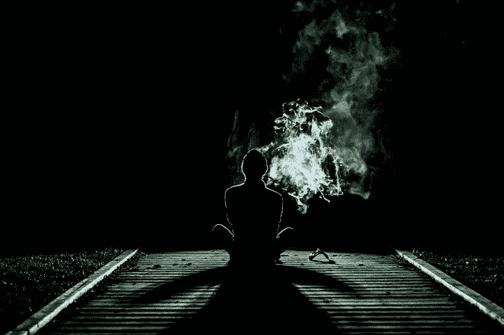

# 用动机的阴暗面消除坏习惯

> 原文：<https://medium.com/swlh/eliminating-bad-habits-with-the-dark-side-of-motivation-cdcfac047fce>

[Free-Photos/pixabay](https://pixabay.com/en/smoke-human-alone-weird-drugs-1031060/)

昨天分享了 [**沉迷**](https://ideavisionaction.com/personal-development/the-psychology-of-addiction/) 的心理。总之，我们的人格由各种独立的亚人格组成。它们在不同的时间被激活，并控制我们的精神。

当你经历上瘾的循环时，两个程序依次被触发。首先，诱惑控制了我们，让我们沉迷其中。第二，当活动结束时，后悔就开始了。

在活动开始时，第一个程序是活动的，第二个程序处于潜在状态。在行为接近尾声时，第一个程序失去了它的强度，第二个程序被激活。

我们的目标是每当我们感觉到第一个程序被触发时，就触发第二个程序。此外，我们需要增加第二个节目的强度，使其压倒第一个节目。

# 戒烟

这是我亲身经历的一个例子。我过去是一个严重的吸烟者。过了一段时间，我的一个下属，我的理性思维，决定是时候戒掉了，因为这个习惯是不可持续的。

尽管如此，我没有 100%退出。尽管我充分意识到吸烟的危害，但我还是不停地到处吸烟，没有过量。每次我这样做的时候，我都会后悔，因为这对我的身体造成了伤害。

我需要找一个项目来抑制我吸烟的欲望。当我发现癌变的嘴、喉咙和肺的照片时，我发现了这个程序。这些照片引起了强烈的厌恶感，压倒了我吸烟的欲望。

# 实践

仅仅找到一个 [**的黑暗动机**](https://ideavisionaction.com/personal-development/the-dark-side-of-motivation/) 来戒掉你的瘾是不够的。你必须提前练习，这样你就可以在感觉到冲动的时候立即触发它。

最好的方法是在你感觉良好的时候练习，而不是等到冲动太强烈的时候出现不舒服的情况。

首先，引发从事你的坏习惯的冲动。你可以通过思考你的习惯来做到这一点。一旦冲动出现，立即触发第二个程序，并增加它的强度，以至于它压倒了第一个程序。

至少每天练习一次，坚持一个月，并且每当你有这种冲动的时候。我们的目标是通过这个练习达到 [**无意识能力**](https://ideavisionaction.com/personal-development/four-levels-of-learning/) 的水平。这样，每当第一个程序被触发时，第二个程序将被自动触发。

你需要做一些有意识的努力来达到无意识的能力水平。所以，每天练习至少一个月，不要等到冲动出现。

# 结论

成瘾行为包括两个阶段。在第一阶段，诱惑占据了我们的心灵，让我们染上坏习惯。在第二阶段，后悔开始出现，让我们感觉很糟糕。

每当我们感受到诱惑时，我们可以通过有意识地触发诸如后悔、厌恶、愤怒或恐惧等黑暗情绪来消除我们的坏习惯。

当一种强烈的冲动袭击你的时候，这是不容易做到的。如果你想用这个方法，你需要提前练习，在你完全感觉不到任何诱惑的时候。

***如果你真的想让你的生活更上一层楼，*** [***注册我的电子邮件简讯***](https://ideavisionaction.com/email-newsletter/) ***每周都会收到我关于个人发展和生活经验的最新帖子。***

## 这个故事发表在 [The Startup](https://medium.com/swlh) 上，这是 Medium 最大的企业家出版物，拥有 353，974+人。

## 在这里订阅接收[我们的头条新闻](http://growthsupply.com/the-startup-newsletter/)。

