# 埃隆·马斯克的阅读清单:他在推特上提到的每一本书(附推文！)

> 原文：<https://medium.com/swlh/elon-musks-reading-list-every-book-he-mentioned-on-twitter-with-tweets-aee4361f3513>

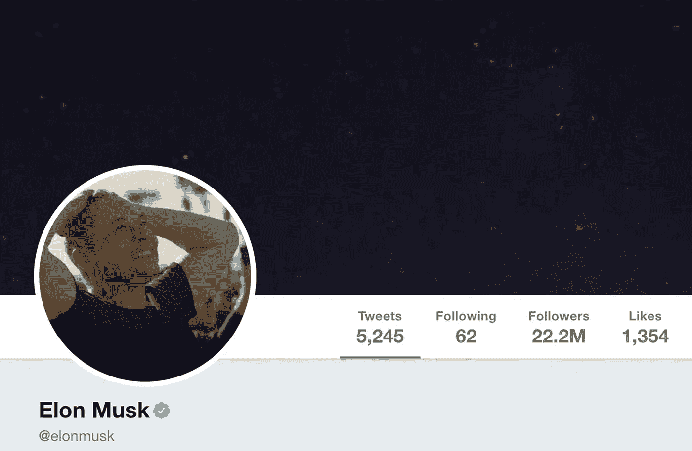

Original post [**here**](https://www.mostrecommendedbooks.com/elon-musk-twitter-books).

认真学习 Python 的时候，你建什么？

当然是一个 **twitter 刮刀**！

为什么？

我喜欢读传记。但是我更喜欢《T2》自传。知道某人**是如何真正认为**是令人着迷的。

但是…如果他们从来没有写过书呢？

他们可能会发微博！

因此，我下载了一些我觉得有趣的人写的每一条推文(纳瓦·拉维坎特、朗达·帕特里克博士、戴密斯·哈萨比斯等)

> 旁注:该死的马克·安德森删除了你所有的推文！！

这些人中有一个是埃隆。

更酷的是我在推特上找到了他提到的每本书。

所以我收集了完整的列表，并把它放在这里(与推文！)，给你阅读的乐趣🙂

尽情享受吧！

# 埃隆·马斯克图书公司

1.  本杰明·富兰克林:一个美国人的生活——沃尔特·伊萨克森

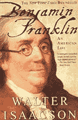

2.[说谎——山姆·哈里斯](https://www.amazon.com/dp/B00G1SRB6Q/?tag=richardreeze-20)

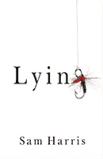

[3。让一切照旧见鬼去吧:把资本主义变成一股向善的力量——理查德·布兰森](https://www.amazon.com/dp/B0064W5TQS/?tag=richardreeze-20)

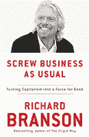

4.[凯瑟琳大帝:一个女人的肖像——罗伯特·k·马西](https://www.amazon.com/dp/B004J4X9L0/?tag=richardreeze-20)

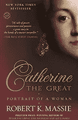

5.[点火！:液体火箭推进剂的非正式历史——约翰·德鲁里·克拉克](https://www.amazon.com/dp/B076838QS2/?tag=richardreeze-20)

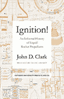

6.[液体火箭发动机设计的现代工程——迪特尔·k·胡泽尔&大卫·h·黄](https://www.amazon.com/dp/1563470136/?tag=richardreeze-20)

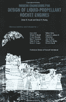

7.[基础(7 本丛书)——艾萨克·阿西莫夫](https://www.amazon.com/gp/product/B011M97Y5G/?tag=richardreeze-20)

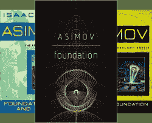

8.月亮是个苛刻的女主人——罗伯特·A·海因莱因

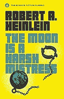

9.[超级智能:路径、危险、策略——尼克·博斯特罗姆](https://www.amazon.com/dp/B00LOOCGB2/?tag=richardreeze-20)

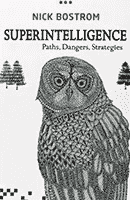

10.我们最后的发明:人工智能和人类时代的终结——詹姆斯·巴拉特

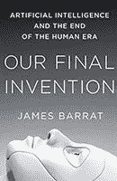

11.守护进程——丹尼尔·苏亚雷斯


12.[沙丘(6 本系列)——弗兰克·赫伯特](https://www.amazon.com/dp/B00O3H6U28/?tag=richardreeze-20)

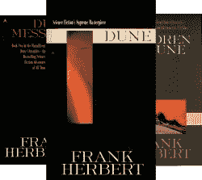

13.[文化(十大丛书)—伊恩·M·班克斯](https://www.amazon.com/dp/B0013TX6FI/?tag=richardreeze-20)


14.[我们恒星中的断层——约翰·格林](https://www.amazon.com/dp/B005ZOBNOI/?tag=richardreeze-20)

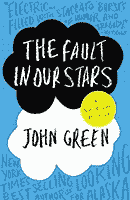

15.[机器停止—E·M·福斯特](https://www.amazon.com/dp/B00ATH5ZKY/?tag=richardreeze-20)


16.[等待戈多:两幕悲喜剧——塞缪尔·贝克特](https://www.amazon.com/dp/B008UX3QU0/?tag=richardreeze-20)

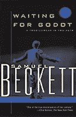

17.[银河系漫游指南——道格拉斯·亚当斯](https://www.amazon.com/dp/B000XUBC2C/?tag=richardreeze-20)

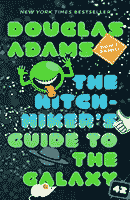

18.[大图:关于生命的起源、意义和宇宙本身——肖恩·卡罗尔](https://www.amazon.com/dp/B014EOUMZA/?tag=richardreeze-20)

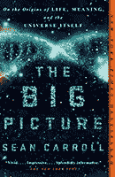

19.[魔戒——j . r . r .托尔金](https://www.amazon.com/dp/B007978OY6/?tag=richardreeze-20)

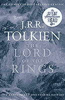

20.[生活 3.0:成为人工智能时代的人类——马克斯·泰格马克](https://www.amazon.com/dp/B06WGNPM7V/?tag=richardreeze-20)

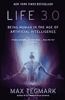

21.如果宇宙中充满了外星人，那么每个人都在哪里呢？:费米悖论和外星生命问题的 50 个解决方案——斯蒂芬·韦伯

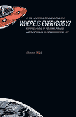

22.[《权力的游戏》(5 本系列)——乔治·r·r·马丁](https://www.amazon.com/dp/B00957T6X6/?tag=richardreeze-20)

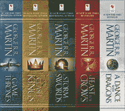

23.[卡尔·马克思的《资本论》](https://www.amazon.com/dp/B007KP788K/?tag=richardreeze-20)

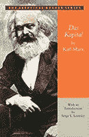

24.[国富论——亚当·斯密](https://www.amazon.com/dp/B01NAAL61L/?tag=richardreeze-20)


25.[阿特拉斯耸耸肩——安·兰德](https://www.amazon.com/dp/B003V8B5XO/?tag=richardreeze-20)

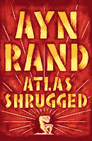

**附言:**更多娱乐，请在[推特](https://twitter.com/elonmusk)上关注埃隆。

如果你喜欢这样的书籍推荐，我最近和一个朋友建立了[这个网站](https://www.mostrecommendedbooks.com/)。在这里你可以找到更多人的推荐(例如比尔·盖茨、马克·扎克伯格、理查德·布兰森等等)

```
*Thanks for reading!* 😊*If you enjoyed it, test how many times can you hit* 👏 *in 5 seconds. It’s great cardio for your fingers AND will help other people see the story.*You can follow me on Twitter at [@**richardreeze**](https://twitter.com/richardreeze)to find out whenever others just like it come out.📚 Do you like books? If so you might enjoy my latest obsession: 
[**Most Recommended Books**](https://mostrecommendedbooks.com/).📚
```

[](https://medium.com/swlh)

## 这篇文章发表在《T4》杂志《创业》(The Startup)上，这是 Medium 最大的创业刊物，拥有 356，974+读者。

## 在这里订阅接收[我们的头条新闻](http://growthsupply.com/the-startup-newsletter/)。

[](https://medium.com/swlh)