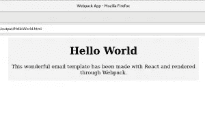

# 使用 React 和 Webpack 开发电子邮件

> 原文：<https://medium.com/swlh/email-development-with-react-and-webpack-3f1639b5effa>


由于大多数电子邮件客户强加的特性和限制，电子邮件开发通常是一个被忽视的实践。

如果你想给你的产品带来愉快的用户体验，你必须确保你的产品设计在所有媒体上保持一致。

电子邮件是最有可能消费你的产品的媒介之一。因此，在撰写电子邮件时，坚持在其他环境下开发产品时所遵循的设计原则是非常重要的。

然而，电子邮件世界有其自身的特殊性，电子邮件必须建立在其中的约束通常意味着设计上的妥协。

## 我个人的电子邮件开发经验

我最近参与的一个项目为产品提供了一个新的外观和感觉，但需要发送一封关于它的电子邮件。

我们希望我们的电子邮件也能利用新的设计，理想情况下，还能利用我们已经为交付新 UI 而构建的工具和组件。

出于这个原因，我们决定建立一个电子邮件开发管道来帮助我们实现这个目标。

在这篇博文中，我将重点介绍如何使用 [React](https://reactjs.org/) 和 [webpack](https://webpack.js.org) 来构建 HTML 模板，并以电子邮件的形式发送出去。

尽管我提到了 [React](https://reactjs.org) ，但这个项目的关键在于 [webpack](https://webpack.js.org) 是如何被配置成一个小型电子邮件开发环境的。我很确定同样的配置可以很容易地适应其他框架。

## 制约因素

这个项目必须允许我们在电子邮件开发中重用 [React](https://reactjs.org/) 组件。我们还希望对其进行结构化，以便允许多个电子邮件模板重用我们现有的组件库。

最后，我们希望能够生成一个单独的 HTML 文件作为输出。

## 我们开始吧

我在 [GitHub](https://github.com/alediaferia/blog-examples/tree/master/webpack-react-email) 上创建并推送了一个示例项目。不耐烦就去看看:)

## 项目结构

我们将通过一种方式构建项目，允许在同一个存储库中制作和托管多个电子邮件模板。

```
.
├── output/
├── package.json
├── README.md
├── src/
│   ├── components/
│   │   └── SectionOutline/
│   │       ├── index.js
│   │       └── index.scss
│   ├── index.js
│   └── templates/
│       └── HelloWorld/
│           ├── index.js
│           ├── index.scss
│           └── index.test.js
├── webpack.config.js
└── yarn.lock
```

*   `[templates](https://github.com/alediaferia/blog-examples/tree/master/webpack-react-email/src/templates)`文件夹将包含所有将要构建、预渲染和发布到输出文件夹的电子邮件模板
*   `[components](https://github.com/alediaferia/blog-examples/tree/master/webpack-react-email/src/components)`文件夹将包含您想要跨模板重用的所有可重用的 ReactJS 组件
*   `[output](https://github.com/alediaferia/blog-examples/tree/master/webpack-react-email/output)`文件夹包含您选择构建的模板的 HTML 输出

## 网络包.配置. js

webpack 配置文件可能是这个项目中最重要的部分。构建配置将通过注入所有需要的信息并将其预先呈现为 HTML 来选择合适的模板进行构建。

让我们从我们的 webpack.config.js 的头开始。

```
const path = require('path');
const webpack = require('webpack');
const HtmlWebpackPlugin = require('html-webpack-plugin');
const PrerenderSPAPlugin = require('prerender-spa-plugin');
const HTMLInlineCSSWebpackPlugin = require('html-inline-css-webpack-plugin').default;
```

如您所见，配置正在导入一些有用的插件。

特别是， [PrerenderSPAPlugin](https://www.npmjs.com/package/prerender-spa-plugin) ，将负责预渲染整个模板并从中生成一个静态 HTML。这是在幕后使用[木偶师](https://github.com/GoogleChrome/puppeteer)实现的。

这里另一个重要的点是[htmlinlinecssbewebpackplugin](https://www.npmjs.com/package/html-inline-css-webpack-plugin)，它将帮助我们将 css 转换成生成的 HTML 中的内部`<style>`节点。这对电子邮件特别有用。

## 动态条目

我们希望能够从`templates`文件夹中所有可用的模板中编译出一个模板。为了做到这一点，我们将创建一个函数，该函数将返回要为 webpack 配置导出的配置散列。

```
const config = (env) => {
  return ({
    mode: 'production',
    entry: {
      // this will be filled in dynamically
    },
    output: {
      filename: '[name].js',
      path: path.join(__dirname, 'output'),
    },
    module: {
      rules: [
        {
          test: /\.(scss|css)$/,
          use: [
            'css-loader',
            'sass-loader',
          ],
        },
        {
          test: /\.js$/,
          exclude: /node_modules/,
          use: {
            loader: 'babel-loader',
          },
        },
      ],
    },
    plugins: [
      new PrerenderSPAPlugin({
        staticDir: path.join(__dirname, 'output'),
        indexPath: path.join(__dirname, 'output', `${env.entry}.html`),
        routes: ['/'],
        postProcess: context => Object.assign(context, { outputPath: path.join(__dirname, 'output', `${env.entry}.html`) }),
      }),
      new HtmlWebpackPlugin({
        filename: `${env.entry}.html`,
        chunks: [env.entry],
      }),
      new HTMLInlineCSSWebpackPlugin(),

      // the DefinePlugin helps us defining a const
      // variable that will be 'visible' by the JS code
      // we are rendering at runtime
      new webpack.DefinePlugin({
        "EMAIL_TEMPLATE": JSON.stringify(env.entry),
      }),
    ],
  });
};
```

如您所见，强制的`entry`字段尚未设置。我们将稍后处理它，并且我们将要求它通过命令行传递。

该条目将用于通过将其值传递给 [PrerenderSPAPlugin](https://www.npmjs.com/package/prerender-spa-plugin) 来加载正确的模板。它还将用于告诉 [HtmlWebpackPlugin](https://webpack.js.org/plugins/html-webpack-plugin/) 如何命名结果文件。

最后，我们按照 webpack 期望的方式导出配置:

```
module.exports = (env) => {
  const entry = {};
  entry[env.entry] = './src/index.js';
  const cfg = config(env);
  cfg.entry = entry;
  return (cfg);
};
```

无论我们指定什么条目，我们总是将它与我们的入口点关联起来:`index.js`。

`index.js`文件负责加载模板并将其嵌入到我们的电子邮件布局中。

查看完整的`[webpack.config.js](https://github.com/alediaferia/blog-examples/blob/master/webpack-react-email/webpack.config.js)`以获取更多信息。

## 动态模板

这是`index.js`文件的内容:

```
import React, { PureComponent } from 'react';
import ReactDOM from 'react-dom';
import { Box, Item } from 'react-html-email';

/*
 * The EmailContainer will be the body of your Email HTML body.
 * It will receive the right template to load and inject from Webpack
 * and will attempt to load it here and include it in the DOM.
 * 
 * This class expects the EMAIL_TEMPLATE const to be defined.
 */
class EmailContainer extends PureComponent {
  render() {
    // EMAIL_TEMPLATE is defined by the webpack configuration and enables us
    // to include the right template at compile time
    const Template = require(`./templates/${EMAIL_TEMPLATE}`).default;
    return (
      <Box width="600px" height="100%" bgcolor='#f3f3f3' align='center'>
        <Item align='center' valign='top'>
          <Template />
        </Item>
      </Box>
    );
  }
}

ReactDOM.render(<EmailContainer />, document.body);
```

这就是奇迹发生的地方。每个模板都将嵌入到这个代码中，这个代码将为电子邮件生成最终的 HTML 输出。如你所见，我从方便的 [react-html-email](https://github.com/chromakode/react-html-email) 项目中导入了几个组件，该项目负责为电子邮件世界提供一些有用的组件。

`Template`对象是从`EMAIL_TEMPLATE`常量字符串中动态加载的，该字符串是在执行这段代码时定义的。我们能够做到这一点是因为我们使用了 webpack [DefinePlugin](https://webpack.js.org/plugins/define-plugin/) :

```
// the DefinePlugin helps us defining a const
// variable that will be 'visible' by the JS code
// we are rendering at runtime
new webpack.DefinePlugin({
  "EMAIL_TEMPLATE": JSON.stringify(env.entry),
}),
```

该插件将负责将常量设置为我感兴趣的电子邮件模板的完整路径。在我们的例子中是`HelloWorld`模板。

## 运行它

```
yarn webpack --env.entry=HelloWorld
```

生成的 HTML 将存储在`output`文件夹中。



hello world template rendered result

我知道。不是最漂亮的邮件，但我会把设计留给你。:)

我希望你喜欢这篇文章。如果你有任何反馈，请告诉我。不要忘记在 [GitHub](https://github.com/alediaferia/blog-examples/tree/master/webpack-react-email) 上查看完整的项目。

*原载于* [*一个 dev 的主线程*](https://alediaferia.com/2018/07/29/email-development-rendering-webpack/) *。*

[](https://medium.com/swlh)

## 这篇文章发表在《初创企业》杂志上，这是 Medium 最大的创业刊物，有 355，974 人关注。

## 订阅接收[我们的头条](http://growthsupply.com/the-startup-newsletter/)。

[](https://medium.com/swlh)