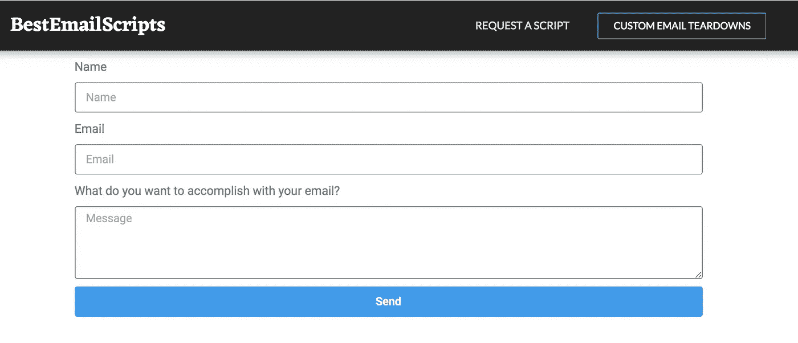

# 给你回复的电子邮件脚本

> 原文：<https://medium.com/swlh/email-scripts-that-get-you-replies-92f3c5c2e954>

[***TL；DR-BestEmailScripts 已启动产品搜索。这是申请和获取最佳电子邮件脚本的首选之地，有助于你拓展人脉、拓展业务并获得理想的工作。***](https://www.producthunt.com/posts/best-email-scripts)

知道如何发送一封清晰且易于回复的电子邮件会给你的职业生涯带来奇迹——尤其是在你不认识很多人的早期。

但是大多数人不得不通过艰难的方式来学习。我做到了。我花了几年时间给成千上万非常忙碌的人发电子邮件。

我给企业家、首席执行官、投资者、记者以及在学校、财富 50 强公司和大型非营利组织工作的人发了电子邮件。很多剧本都不是很好。所以我开发了自己的。

《BestEmailScripts.com》的核心剧本是我反复阅读的。当我与我的朋友和家人分享我的脚本时，更多的人想要使用它们。所以我在 BestEmailScripts.com 免费为你准备了这些。

更重要的是，我希望能够给你更多有用的脚本，帮助你扩大你的网络，并帮助你获得电子邮件回复——所以我们为你提供了一个请求新脚本的选项。

我把这些脚本教给了我的一对一客户，并用它们从以下客户那里获得了肯定的答复:

>世界著名的投资者。

>企业家杂志和快速公司等主要出版物的记者。

>连续创业者。

>知名且非常忙碌的作者。

这些脚本不是为了“有说服力”而设计的——它们是为了工作而设计的。它们被设计成易于回复和易于理解。这一转变将极大地提高你的邮件打开率和回复率。

## 请求脚本

该网站发布的 12 个脚本是我在职业生涯中和与客户打交道时最常用的。我们知道电子邮件脚本有大量的用例，我们为你内置了一个功能，让你请求你自己的脚本。

如果有很多人会使用它，我的团队会为你的目的开发一个脚本，用电子邮件发给你，然后上传到网站。

## 一对一的拆卸和反馈

有时候，在写一封重要的邮件时，你只需要那种一对一的反馈。这是一项我通常收费 200 多美元的服务，对 BestEmailScript 用户收费 196 美元。

这些[一对一的拆卸](https://zakslayback.com/2018/03/02/send-sales-emails-connecting-linkedin-case-study-teardown/)对于任何想要个性化指导的人来说都是完美的，并且可以挖掘他们发送电子邮件的对象的心理。

BestEmailScripts.com 的最终目标是成为你可以请求和访问运行良好的电子邮件脚本数据库的地方。无论你是刚刚开始你的职业生涯，寻找一份新工作，还是你的工作需要你发送大量的电子邮件，我们都可以帮助你得到回复。

[**在产品搜索上查看一下(并给它一个支持票！)**](https://www.producthunt.com/posts/best-email-scripts)

## 这篇文章发表在 [The Startup](https://medium.com/swlh) 上，这是 Medium 最大的创业刊物，拥有 336，210 多名读者。

## 订阅接收[我们的头条新闻](http://growthsupply.com/the-startup-newsletter/)。

