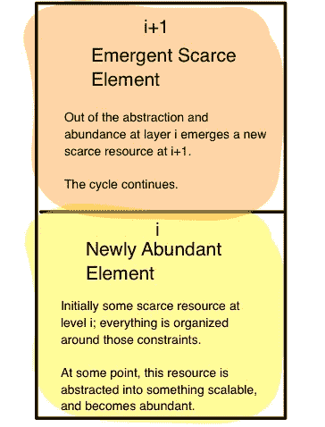
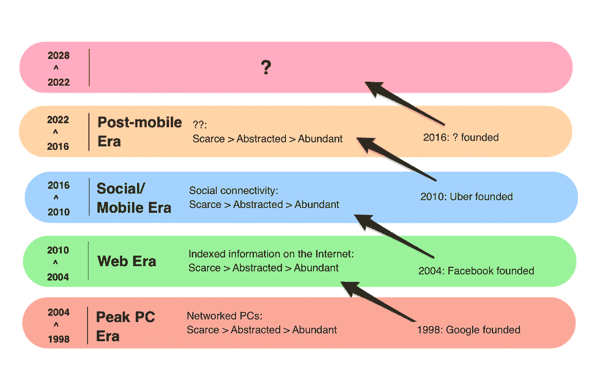

# 涌现层，第一章:稀缺、抽象和丰富

> 原文：<https://medium.com/swlh/emergent-layers-chapter-1-scarcity-abstraction-abundance-5705666e4f15>

**您好！如果你是第一次来这里，谢谢你看我在 Medium 上写的东西。我不再在这里发布太多了——我已经完全转而在我自己的网站上发布了，**[**【alexdanco.com】**](http://alexdanco.com)**。我还写每周时事通讯，每周日出版，你可以在 danco.substack.com******注册。我写的很多，不想让你错过！所以请首长那边** [**订阅**](http://danco.substack.com) **。****

***这是一个四部分系列的第 1 部分，紧急层。如果你还没有看过介绍，我邀请你这样做* [*这里*](/@alexdanco/emergent-layers-an-introduction-f91c3cbe0175#.4iz7xgc7y) *。***

**有一个基本但有力的概念，所有的钱都是在摩擦点产生的。当我以 10 美元的价格卖出我花了 5 美元的东西时，我就赚钱了。我有什么权利这样做？某种摩擦:毕竟，在一个没有摩擦的世界里，销售会收敛到 5 美元的价格。长期赚钱——即持续盈利——意味着一个人或一家公司能够坐在一个可防御且不可避免的摩擦点上。这种摩擦力从何而来？它是如何出现的，又是如何消失的？一个很好的起点是检查稀缺元素和丰富元素之间的差异，或者像 Nassim Taleb 在《黑天鹅》中对不可伸缩和可伸缩实体的分类那样。**

**借用塔勒布的话:让我们来看看贾科莫的命运，他是一位生活在录音音乐出现之前的 19 世纪意大利音乐家。在这个时候，音乐表演显然是一件不可扩展的事情:如果你想从音乐中得到娱乐，你需要亲自去见音乐家。因此，Giaccomo 无法大规模出口他的作品，但米兰的大型歌剧歌手也无法出口，否则他们可能会与他竞争。地理和地理上的接近是一个很大的摩擦点——由于镇上只有少数其他音乐家，只要他的声带保持良好状态，贾科莫就可以设定一个公平的价格，并赚取可观的利润。**

**现在想象一下留声机的发明会发生什么。突然间，可怜的贾科莫开始和米兰的大人物竞争了！他的交易单位(他的声音)已经被抽象成蜡盘上的蚀刻画。对镇上的居民来说，这是一大进步。他们现在只需支付以前的一小部分，作为回报，他们可以收到一个优秀艺术家的无休止的可播放录音！但对贾科莫来说，这太糟了。身体上的接近，这曾经是一个摩擦点，他可以从中获取收入，现在很容易绕过；对他来说，赚钱变得更加困难，甚至根本拿不到报酬。即使贾科莫能够使用他自己的录音设备，也无济于事:一个新的摩擦点出现了，*分配*，他没有处理这个问题的技巧。**

**想想这里发生的三件非常重要的事情:**

1.  **音乐表演，以前是有形的，稀缺的，不可扩展的元素，通过技术被抽象成可扩展的东西。结果对普通人来说非常好，他们现在可以在自己的家里欣赏世界上最伟大的艺术家，比支付 Giaccomo 亲自表演的费用更少。**
2.  **Giaccomo 赚钱变得非常困难！当这种相变发生时，他从中获利的摩擦点——物理上的接近——不再重要。从音乐中赚钱很快就变成了赢家通吃的事情。从贾科莫的角度来看，这是一个黑天鹅事件——不可能事先看到，可以追溯解释，后果严重。贾科莫可以抗议，“这不公平！”他是对的。这是*不*公平。这就是有趣的地方。**
3.  **在音乐表演的新的可扩展性中出现了一个新的稀缺和不可扩展的元素:发行。一个全新的行业诞生了，我们现在称之为唱片公司，它们坐在新发现的摩擦点上，榨取利润。**

**这个比喻对我们有用有两个原因。首先，它简洁地展示了当技术变革抽走了一个稀缺元素，一个摩擦点因此消失，商业模式因此重新安排时会发生什么。一般来说，结果对最终用户来说是好的，但对那些依靠摩擦点谋生的人来说是坏的。第二，它非常深刻地说明了从稀缺资源中赚钱和从丰富资源中赚钱之间的区别。它们是完全不同的练习。**

**现在让我们回到今天。在现代科技崛起的过程中，它对世界的影响一直由一群精挑细选的公司引领，这些公司碰巧也赚了大笔钱。这些公司并没有赚到所有的钱，因为他们比竞争对手稍微努力一点，就像 Giaccomo 可能会与他的当地音乐家同伴竞争一样。他们赚钱有三个原因:他们是镇上唯一的游戏，他们设定价格，世界不得不玩。**

**这些年来，这些王朝式公司的例子包括英特尔、微软、思科、谷歌、苹果，现在还有脸书。毫无疑问，这些公司对世界的影响是巨大的:它们不仅价值高得不成比例，而且对塑造未来进程的影响力也大得不成比例。然而，人们不禁要问:这些公司是如何达到这种状态的？是什么让他们有资格成为镇上唯一的游戏，以一种贾科莫甚至无法想象的方式？为什么没有人能有效地与他们竞争呢？**

**“垄断”一词在这里是恰当的。但谷歌有一些非常不同的地方，例如，与上个世纪垄断稀缺资源和榨取客户的公司相比。谷歌并没有垄断一种稀缺资源。谷歌将稀缺资源抽象为可扩展的丰富资源:互联网上可用的信息和索引知识。他们不会通过扣留资源和抬高价格来行使传统的垄断权力:谷歌会通过让每一个用户更容易获得甚至更强大的资源来行使他们的权力。当更多的信息被添加到互联网上，谷歌变得更强，而不是更弱。脸书不会通过限制谁可以和谁做朋友来施加垄断权力；他们发挥自己的力量，抽象出社交图，并完全提供服务，如果你想接触这些用户，他们是唯一可行的选择。当更多的人上网时，脸书变得更强大。**

**技术世界的一个基本原则是，当它向上和向外进入世界其他地区时，它是通过建立在这些丰富资源的基础上并逐步利用它们来实现的。我们可以将我们今天所了解和理解的世界(包括它的限制、商业模式和大家普遍理解的成熟行业)视为形成一个层，我们称之为第一层。随着时间的推移，某些元素变得抽象并随后变得丰富，其他元素则成为新的稀缺元素，或者因新的原因和新的商业模式而发挥作用。理解这是如何工作的关键技能(值得练习！)能够在堆栈层之间上下工作，以便了解何时一个丰富且可扩展的元素在堆栈的层 *i* 中发展，而其稀缺、不可扩展的对应元素在一个新的层中出现，我们将该层称为层 *i+1* 。**

****

**为了正确理解技术堆栈，最好从最底层开始，通过不断增加的抽象层向上推进，这样我们就能感受到事物是如何层层叠加的:**

**美国英特尔公司(财富 500 强公司之一ˌ以生产 CPU 芯片著称)**

**第一层的原始稀缺资源:专用芯片上的计算能力。回到晶体管发展的早期，你想要的产品功能越多，你需要的单一用途晶体管密度就越大。这种“功能密度”是由早期的半导体公司建立和竞争的:肖克利、飞兆等等。然后一些人(在飞兆半导体，后来在英特尔)说，嘿，让我们把微芯片的功能抽象成我们给它的指令——换句话说，让它普遍可编程。现在，你可以在一个芯片上做的不同操作的数量变得无限，只要你能为它写汇编语言。英特尔通过制造微处理器，获得充分的领先优势，然后确保一切都为英特尔汇编语言编译而变得巨大。计算能力成为了一种丰富的资源(正如我们在摩尔定律中所看到的)。英特尔占据了主导地位并获得了巨额利润，而一种新的稀缺资源出现在 i+1 层:PC 硬件。**

**微软**

**第一层的原始稀缺资源= PC 硬件。在个人电脑的早期，制造商可以在许多性能方面竞争——内存、速度、功能等等——同时充分区分彼此。但是很难标准化人们可以在任何计算机上运行的通用功能和应用程序，这使得这些用例很难快速增长——直到比尔·盖茨和保罗·艾伦意识到，嘿，现在还没有软件行业，但会有，所以我们应该开始它。微软将计算机的功能抽象成软件，所以现在任何人都可以在微软软件的基础上编写自己的软件，而不必担心底层机制。个人电脑成了一种随处可得的商品，微软成了主导者，利润丰厚。一种新的稀缺资源出现在第 i+1 层:连接这些 PC 并让它们相互对话的能力。**

**加拿大白鲑**

**第一层的原始稀缺资源=网络接入。每个人都想参与早期的互联网，但将一个节点与另一个节点真正联网并让它们彼此交谈的能力是一场噩梦。随着互联网上的流量呈指数级增长，当你知道现有的网络协议将在 18 个月后过时时，试图围绕这些协议进行构建是一个巨大的问题。思科通过制造和销售能够适应这种不断变化的环境的网络设备，抽象出了所有这些，使互联网成为你可以“只需连接”就能工作的东西。互联网接入成为一种大量可用的商品，随着围绕互联网协议的整合，思科成为主导并获得了巨额利润。在第 i+1 层出现了一种新的稀缺资源:对包含在这个网络中的信息的理解。**

**谷歌**

**第一层的原始稀缺资源=互联网上的可索引信息。现在互联网上有这么多没人知道如何组织的东西——AOL、Yahoo Directory、Excite 等等都有他们各种各样的解决方案，这些解决方案有点用，但后来被网页的指数增长无可救药地超越了。因此，如果你想找到任何东西，你不得不使用这些门户网站，这些网站充斥着各种功能，为你提供所有这些噪音和垃圾，但不是你真正想要的。然后 Larry 和 Sergei 想出了办法，嘿，让我们用链接来抽象互联网上页面之间的关系，这样可索引的信息就可以大规模增加，变得丰富。索引化的互联网知识变成了大量可用的商品，谷歌成为了主导者并获得了巨额利润。一种新的稀缺资源出现在第 i+1 层:消费 web 内容的人之间的关系。**

**脸谱网**

**第一层的稀缺资源=使用互联网的人与人之间的联系。互联网上充斥着大量的人和内容，但真正的人与人之间的互动仍然相对稀少和困难。因此，所有将人们与内容、广告和服务联系起来的尝试都是功能填充的、垃圾的、臃肿的和糟糕的。脸书向前迈出的关键一步是将“互惠友谊”抽象成一个功能性的社会图表。我们已经看到了自那以后发生的事情:脸书，和一般的社会联系，已经爆炸，成为一个新的丰富的资源。脸书变得占主导地位，利润丰厚。**

**如此循环往复——从稀缺到抽象再到丰富，然后是新发现的稀缺。如果我们愿意，我们可以把这个框架投射到未来，尽管需要非常谨慎。(我们将在后面详细讨论如何做到这一点。)**

****

**这种分层的一个重要方面是，在每一个更高的抽象层次，人们可以用来创造价值和获取利润的杠杆越来越长。你可以通过查看这些占主导地位的公司的员工人均市值来了解这一点:**

**英特尔:10.6 万员工，550 亿收入，1.49 亿市场资本**

**微软:12 万员工，930 亿收入，4.29 亿市场资本**

**谷歌/ Alphabet: 6 万名员工，750 亿美元收入，5100 亿英镑资本**

**脸书:1.3 万名员工，60 亿美元收入，3.2 亿英镑资本**

**最近，Whatsapp 在几年前以 190 亿美元的价格卖给了脸书，这对双方来说都是一笔大买卖，员工人数达到了两位数！抽象是一种强大的东西。**

**这里要理解的一个不明显但很关键的一点是，对于第一批围绕稀缺要素动员起来的第 n 个行动者来说，最后一个行动者的到来和最终主导地位将被视为某种黑天鹅事件。通过抽象出稀缺资源，而不是围绕其稀缺性进行组织，这些公司成为第一个完全参与 i+1 级沙盒的公司，这与 Giaccomo 所在的 I 级不可扩展的稀缺性管理沙盒相反。可以肯定的是，任何成为最后一个行动者的公司都有一些(或者可能很多)运气——许多事情都必须是正确的，我们往往不会听说那些独立地得出正确想法但由于任何原因(运气或其他原因)而未能成功的公司。此外，正如我们将在后面看到的，有时那些最后行动的公司根本没有意识到他们手上有什么。但是在他们的规模真正扩大之前，他们会是谁，他们会做什么，为什么他们会和第一批 *n* 玩家有什么不同，这些都不清楚。贾科莫很容易将自己与镇上的其他音乐家相比，甚至与米兰的伟大音乐家相比。但是他不去想在一个录制音乐的时代他可能如何竞争；他不知道该问什么问题。**

**举一个更近的例子:过去十年里，许多初创公司都在追逐交通运输市场，我敢肯定，他们都把自己描述为“可扩展”的投资者。与此同时，整个硅谷都在忙着放弃优步，因为它最初只是提供黑车服务的一种更好的方式，很少有人了解 UberX 所需的司机-乘客信任的真正可扩展潜力。这里的教训应该牢记在心:当第一批 *n* 公司追踪一个问题时，无论他们在推销中使用什么语言，他们的商业模式通常不会真正超越任何人都能看到和理解的第一层限制。它们更容易理解，对“理性投资者”来说更有意义，并且需要更少的非线性思维跳跃来理解。因此，当最后一个行动者出现在 i+1 水平时，他们是一个黑天鹅事件:很少有人预见到他们的机会，他们的影响是巨大的，每个人都在事后合理化发生了什么。**

**从稀缺到抽象，再到第一层次的丰富，再到第一+1 层次的新出现的稀缺，这种循环并不是简单的直线前进。伴随着技术进步的“主干”,我们看到分支萌芽，产生了许多伟大而有价值的公司，它们拥有赢家通吃的动力。通过在一个新发现的丰富资源的环境中蓬勃发展，分支公司通常会发现其他新的或邻近的稀缺资源可以从他们新的强大优势中完全征服。这些相邻行业的巨头通常没有机会——新的科技公司正在利用整个科技栈的杠杆作用，因此正在加速蚕食世界其他地区。最终，胜出的公司通过完全不同的商业模式赚钱，受到的约束也与它们的前辈完全不同。**

**我们可以用一句简单的话来概括这个循环:**

****在堆栈的第 i+1 层，新的有价值的资源是在第 I 层从稀缺到抽象再到丰富的转变中出现的稀缺资源。****

**在第 2 部分中，我们转换话题，看看单个客户的水平:为什么他们有他们的需求，他们如何被过度服务和服务不足，以及什么造就了一个潜在的爆炸性市场。然后在第 3 部分，我们将把这两个方面放在一起。**

**[你可以在这里阅读第二部分。](/@alexdanco/emergent-layers-chapter-2-overserved-and-underserved-customers-6d5ce546531d#.o0plkmo7z)**

***想要更多？* [*订阅片段*](http://s23p.us10.list-manage.com/subscribe?u=d7f0f45160075006b25756cd0&id=159d546edd) *，我们的编辑简讯@社会资本(由我策划)，新章节出来你会第一个发现。快乐阅读！***