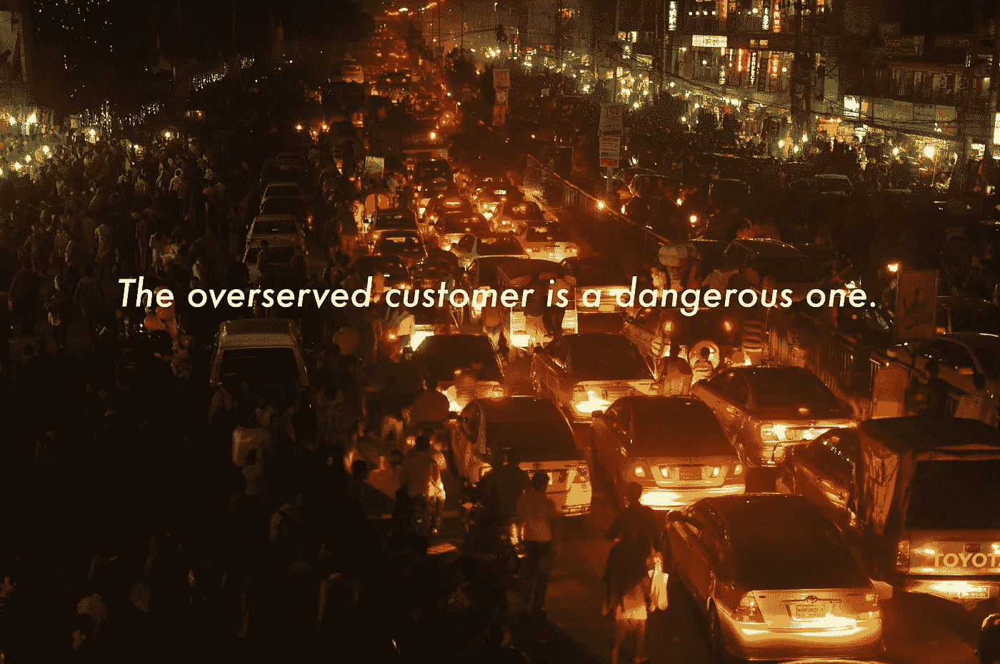
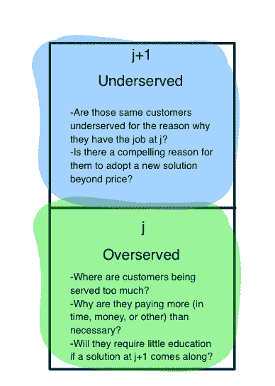

# 紧急层，第 2 章:服务过度和服务不足的客户

> 原文：<https://medium.com/swlh/emergent-layers-chapter-2-overserved-and-underserved-customers-6d5ce546531d>

**您好！如果你是第一次来这里，谢谢你看我在 Medium 上写的东西。我不再在这里发布太多了——我已经完全转而在我自己的网站上发布了，**[**【alexdanco.com】**](http://alexdanco.com)**。我还写每周时事通讯，每周日出版，你可以在 danco.substack.com******注册。我写的很多，不想让你错过！所以请首长那边** [**订阅**](http://danco.substack.com) **。****

**这是四部分系列的第二部分。如果你还没有这样做，我们邀请你从介绍开始，这里可以找到**，这里可以找到第一章***。*****

****在第 1 章的[中，我们关注了从稀缺到抽象再到丰富的宏观层面的转变，以及这是如何创造爆炸性供应的条件的。在本节中，我们将从微观角度来看两种客户痛苦——服务过度和服务不足——之间的相互作用，以及它们的相互作用如何在单个用户层面创造了爆炸性需求的条件。](/@alexdanco/emergent-layers-chapter-1-scarcity-abstraction-abundance-5705666e4f15#.savcw9o11)****

****理解技术领域市场进入的一个有用框架是颠覆理论，正如克雷·克里斯滕森(Clay Christensen)在《创新者的困境》(The Innovator's Dilemma)中所阐述的。在颠覆理论中，该框架中最不受重视但最重要的部分之一是谁是*被过度服务的客户*的想法——现有解决方案超出他们需求的客户。****

****这里要把握的一个重要概念是“待完成工作”的概念:客户“租用”产品的基本需求。如果我午餐饿了，我可能会租一个三明治来满足我的需求。另一方面，如果我要举办一个晚宴，我可能会请一个更好的人吃饭，以便也能给我的客人留下深刻印象。如果你买了一块 20 美元的天美时手表，你就是在雇佣它来做“告诉我时间”的工作。如果你买了一件价值 2 万美元的奢侈品，你是在雇佣它做一件完全不同的工作:“让我感到富有和了不起，同时向别人展示我的财富”。诸如此类。****

****待完成工作框架特别有价值的一个地方是帮助你发现产品的真正竞争对手。著名的奶昔故事就是一个很好的例子:总而言之，一家快餐公司想要增加奶昔的销量，并根据顾客将奶昔视为甜点、奖励、款待等等的概念，理论化了各种营销策略和改进。然而，在随后的观察中，大部分奶昔是在早上 6 点到 8 点之间出售的，该公司意识到一些深刻的东西:这些奶昔是由那些在早上通勤期间感到无聊的人购买(“租用”)的，他们想要一些东西来打发时间。奶昔所做的工作实际上与他们之前认为的大不相同，基于这种新的理解，产品和营销策略的后续转变被证明是相当成功的。****

****回到中断理论，我们将从该框架中使用的关键元素是被过度服务的客户的概念:被现任者提供过多服务的客户。在成熟的行业中，每个人都同意什么是稀缺资源，核心约束被很好地理解和组织，我们看到这种情况经常发生。随着现有公司相互竞争业务，客户都得到了充分的服务(为了手头的工作)，竞争变成了一场特征竞赛，产品的改进或扩展速度超过了客户的使用能力。客户需要的和得到的之间存在不一致，这种不一致体现在“我在这上面花了太多的钱和时间。”至关重要的是，当客户为某项特定工作提供的服务过多时，这就为一个拥有某种可扩展技术优势的新竞争对手进入低端市场带来了必要的关键空间和氧气。过度服务的本质为现有企业创造了强大的激励，促使它们不去*与颠覆性的进入者合作，而是向更高的利润率撤退。*****

****让我们看几个例子。想想《创新者的困境》中的钢铁厂故事:大型综合钢铁厂最终是如何被低成本的小型钢铁厂颠覆的。在这个故事中，小型钢铁厂最初通过生产极其廉价的低等级钢材进入市场，用于螺纹钢和其他要求非常低的应用。他们的利润率非常低——比现有公司习惯的利润率低得多——因此，现有公司花费资源追求他们没有任何战略意义。当然，小型工厂有一个关键优势——一种新技术，使他们能够以更低的成本结构运输和扩大规模——通过向小型工厂提供关键的氧气(非挑剔的客户资金)在市场底部起步，大型现有企业犯了一个严重的错误。要理解这个故事最关键的元素是:这种情况的关键因素是存在一群被现任者过度服务的客户——毕竟他们需要的只是廉价的螺纹钢。****

****一个更近但仍然“经典”的例子，让我们看看 Airbnb。Airbnb 之所以能够起步，是因为酒店业有一个关键的客户群——最初是年轻人，尽管不完全是年轻人——他们受到酒店业许多方面的过度服务。酒店为顾客提供多方面的服务——舒适度、隐私、忠诚度奖励计划等等——这些对于那些不太在乎这些东西的特定顾客群体来说并不重要；他们只是想要一个住的地方。这给了 Airbnb 一个关键的氧气，让它得以迈出第一步，然后以比万豪可能竞争的低得多的成本结构向上扩张。被过度服务的客户是一个非常强大而危险的客户:他们知道自己在寻找什么，当新进入者提出正确的建议时，他们不需要接受教育。如果新进入者做对了一些关键的事情，他们会看到一大群早期采用者，他们不需要什么刺激、教育和提前通知。这是开公司的一个很好的基础。****

****现在让我们考虑另一种痛苦:得不到充分服务的客户。他们的痛苦似乎更直接:他们有一些基本需求没有得到满足。但这种情况比看起来更棘手:如果一群客户有真正的需求，那么为什么公司不介入提供解决方案呢？有什么条件？这可能是因为解决方案实在太难，或者面临技术或可行性障碍。也可能是顾客没有*意识到*他们有问题。无论哪种方式，都很困难:从一个新进入者的角度来看，你正在处理两种糟糕情况中的一种。要么你有很大的技术、监管或其他进入壁垒(这让事情变得很难)，要么你正在与一群不知道他们有你试图解决的问题的客户打交道(说实话，这通常意味着你的市场可能实际上并不存在)。失败的创业公司和注定失败的计划充斥着这样的例子。****

****现在，让我们将这两种类型的客户难题放在一起。如果顾客同时被过度服务和服务不足，会发生什么？这可能吗？****

****事实证明，这种情况不仅可能发生，而且经常发生。而且非常不稳定。弄清楚这是如何工作的诀窍需要冒险超越中断理论一步，并把要做的工作重铸为一个由低层次到高层次需求的堆栈本身。就像我们在第一章中讨论技术堆栈的层次一样，我们可以将客户需求或要做的工作描述为它们自己的堆栈。如果我们以这种方式改写奶昔的例子，我们就能挑出顾客真正寻找的各种(和美味的)成分。作为顾客，在这种情况下，我关心的是奶昔表现的“厚重和质感”元素。为什么？因为，更上一层楼，我想要一些分散注意力的有趣的东西。为什么？因为我想有一种方法能让我在上下班途中保持平静和快乐。为什么？因为我早上要去上班。为什么？因为我要挣工资。****

****最终，这是一种更完整的看待待完成工作框架的方式，我认为这种方式可以更好地理解不同的产品和服务如何通过在价值栈中上下移动来相互竞争。在这种情况下，我们可以看到，奶昔的竞争不仅仅是其他种类的便携式食物——它也是脱口秀、优步和失业。(当然，购买奶昔的许多其他原因——例如，不健康的美味——与不同的性能要素竞争。许多失业的人仍然喝奶昔。)****

****现在，考虑潜在的客户群，他们在某项工作的某个特定方面得到了过多的服务，同时在该工作的某个更高级方面却得不到充分的服务:他们首先有这种需求的原因。这是一个强有力的组合:一群客户知道他们想要什么，不需要接受这方面的教育，他们有一个令人信服的迫切理由放弃现有的解决方案，采用一个新的解决方案，而不仅仅是价格。这是一个爆炸性的组合。****

****我们可以把为顾客提供服务的最初工作描述为 j 级工作，在职者争夺顾客的金钱，产品将不可避免地趋向于过度服务。与此同时，我们可以将更高级别的工作描述为处于 j+1 级别，它包含客户的更高级别目标，其中公司*不是*，无论出于何种原因，目前为任何人服务:****

********

****让我们看一堆例子。****

****以优步为例:你有一大群顾客(包括我自己)，他们因拥有自己的汽车而受到过度服务。如果你的车在 95%以上的时间里都是闲置和停放的(这大约是北美的平均水平)，很明显你拥有这辆车是多余的！然而与此同时，同样的一群客户在 j+1 级别得不到充分的服务，或者说*为什么*他们首先拥有一辆车的原因——“我需要在特定的时间到达特定的地方”。你要遵守时间表，这很难。****

****请注意，这两个条件都必须成立，优步才能工作。如果客户没有得到过多的服务，他们很难放弃当前的解决方案。(考虑一个每天驾驶车辆数小时的人。他们很少过度使用他们的汽车，也不太可能转而使用优步做同样的工作。)与此同时，如果他们没有在更高层次的工作上得不到足够的报酬(在特定时间给我安排职位)，那么新解决方案真正有吸引力的唯一方式就是大幅降低价格——这导致了一个艰难的商业模式。这是外界观察人士对优步的另一个误解，他们惊呼:“我不明白这怎么会比拥有一辆汽车便宜！”嗯，事情是这样的——优步没有*比开车便宜，因为它在很多方面都比你自己开车要好！你不必担心停车、保险、饮酒、保养、汽油或其他任何事情。现有解决方案同时存在服务过剩和服务不足的情况，这是优步如此引人注目的原因，在某种程度上，其他拼车服务或拼车服务不太合适。优步工作是因为它便宜，但它的吸引力是因为它更好。*****

****让我们看看另一家公司，它最近在这两个方面都做得恰到好处:Slack。许多中小型企业发现自己同时受到微软企业堆栈和其他大型、功能丰富的团队平台的过度服务，但对 j+1 级别的工作服务不足:“帮助我实时了解我的公司正在发生什么。”斯莱克一针见血，现在他们出发去比赛了。****

****Airbnb？如前所述，有一部分旅行者受到 j 级酒店行业的过度服务——他们不需要连锁酒店的舒适、隐私和忠诚度奖励计划。然而，他们还得不到更高层次的服务——这就是为什么他们可能首先旅行的原因——这可能是为了体验一种新的文化，并在那里有宾至如归的感觉。在 j+1 水平上，Airbnb 在这一性能要素上优于酒店。因此，Airbnb 不仅通常比住在连锁酒店便宜，而且还有一个令人信服的理由来使用它，那就是在任何地方都有归属感。****

****像 Dropbox 和 box 这样的在线文件共享公司呢？许多客户和企业发现自己在 j 级受到了陈旧的文件管理服务、FTP 服务器、本地夜间备份等的过度服务。与此同时，他们在 j+1 级别上得不到充分的服务:他们只是希望每个人都能无缝、同步地访问他们的资料。这些盒子提供了一个非常令人信服的转换理由:它们不仅比自己做任何事情都便宜，而且在几乎所有方面都更好！****

****Snapchat 怎么样？许多消费者——尤其是青少年——发现自己被随时涌入我们手机的大量媒体、内容、照片等服务过度了。与此同时，我们很容易觉得被一个更高层次的 j+1 理由忽视了，这就是为什么我们*希望*在第一时间被娱乐——在那一刻感受真实的当下和彼此的联系。Snapchat 出色地服务了这些用户，用一款完全解决了这些用户的两个痛点的产品反驳了“我们不需要另一个照片共享应用”的人群。****

****在某些方面，Snapchat 的完美定位让人想起了脸书在其爆炸性的早期所取得的成就。2004 年，互联网上充斥着大量垃圾内容——要阅读的页面、要玩的游戏和要消费的内容多得超出了任何人的想象。然而，这可能是一个非常孤独的地方——很难与人分享内容，建立真实的联系，并一起享受这些经历。更高层次的工作——人际关系——明显得不到充分的服务。脸书完全正确，我们已经看到了后来发生的事情。****

****总之，让我们最后一次回顾一下，为什么这种过度服务/服务不足的组合如此有效:****

****如果客户只勾选了“服务不足”框，那么很可能你正在处理一个 a .非常难的问题，或者 b .客户没有意识到他们已经有了问题。这不是一个很好的位置——很难建立一个初始解决方案并吸引早期采用者。****

****如果他们只勾选了“超额服务”框，那么顾客就知道他们想要什么——但可能他们只是被价格所驱使。这也不是一个很好的位置:你可能很快就会有很多用户，但是很难从他们身上获得任何利润。****

****当这种组合排队时，一组客户就有机会在 j+n 待完成工作层次结构中向上跳一级。****

****我们的外卖:****

****当发生这种情况时，客户在 j 级被过度服务而在 j+1 级被服务不足的特殊组合，解释了我们如何不时地看到需求为零的市场，然后突然一条垂直线笔直向上。****

****这些市场在哪里出现，如何出现，围绕哪些资源？我们将在下一节看到这一点，届时我们将把 I 列(稀缺性>抽象性>丰富性)和 j 列(服务过多+服务不足)连接在一起。****

*****你可以在这里阅读* [*第三章*](/@alexdanco/emergent-layers-chapter-3-explosive-growth-23cc44688999#.p7cman4ti) *。*****

*****想要更多？* [*订阅片段*](http://s23p.us10.list-manage.com/subscribe?u=d7f0f45160075006b25756cd0&id=159d546edd) *，我们的编辑简讯@社会资本(由我策划)，新章节出来你会第一个发现。快乐阅读！*****