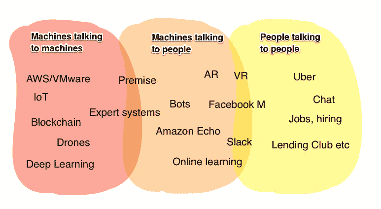
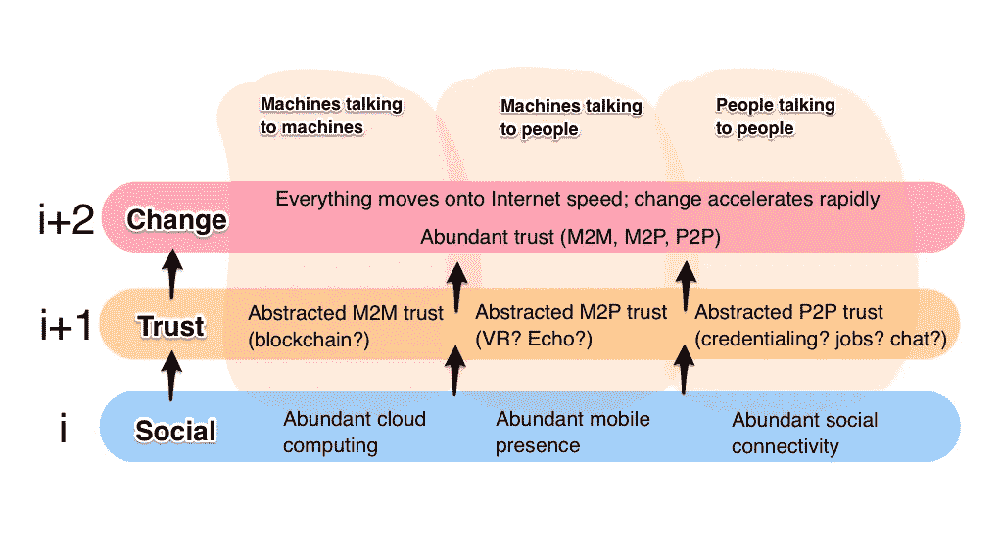

# 涌现层，第四章:对未来的一些推测

> 原文：<https://medium.com/swlh/emergent-layers-chapter-4-some-speculation-about-the-future-7964d89dc1c3>

**您好！如果你是第一次来这里，谢谢你看我在 Medium 上写的东西。我不再在这里发布太多了——我已经完全转而在我自己的网站上发布了，**[**【alexdanco.com】**](http://alexdanco.com)**。我还写每周时事通讯，每周日出版，你可以在 danco.substack.com******注册。我写的很多，不想让你错过！所以请首长那边** [**订阅**](http://danco.substack.com) **。****

**这是我们在《社会资本》的新兴层次系列的最后一篇文章。要从头开始，请在这里头**。****

***在第一部分的[中，我们看到了稀缺>抽象>富足循环，以及它如何在专栏 I 中创造了推动我们前进的新技术层。](/swlh/emergent-layers-chapter-1-scarcity-abstraction-abundance-5705666e4f15#.7b8txocc0)***

***在[第 2 部分](/swlh/emergent-layers-chapter-2-overserved-and-underserved-customers-6d5ce546531d#.mtdo977m2)中，我们研究了 j 列中服务过度和服务不足客户的性质，以及它如何创造了爆炸性需求的条件。***

***在[第 3 部分](/swlh/emergent-layers-chapter-3-explosive-growth-23cc44688999#.fno6nmdik)中，我们将 I 列和 j 列放在一起，并通过这个框架回顾性地检查公司，以了解它通常如何组合在一起。***

***在这最后一节，我们将对未来做一点推测，看看它如何适应这个 i/j 框架，而不会扭曲得太厉害。***

***追溯到很久以前，我们可以看到人类如何从一开始就通过抽象创造新的价值:***

***-基本的安全和食品要求被抽象到公共部落中，让我们可以做更多新的事情。***

***-彼此之间的交流被抽象成语言，让我们可以做更多新的事情。***

***-互相帮助和交易被抽象成货币，让我们可以做更多新的事情。***

***-人类和动物的肌肉被抽象成蒸汽、气体和电力，让我们可以做更多新的事情。***

***-我们的日常认知工作(以及更多工作)被抽象成一个智能机器网络，让我们可以做更多新的事情。***

***最近，在现代技术堆栈中:***

***-计算能力被提取到可编程芯片中，使其变得非常可用(英特尔也因此获得了大量资金)***

***-个人电脑硬件被抽象成软件，这使得它变得非常有用(微软也因此赚了很多钱)***

***-网络参与被抽象为通用设备和协议，使其变得非常可用(思科也因此获得了大量资金)***

***-对互联网内容的索引理解被抽象成 PageRank，使其大量可用(并为谷歌带来大量资金)***

***-人与人之间的联系被抽象到社交图中，这使得社交图变得非常有用(脸书也因此获得了很多钱)***

***这个过程可以使用我们的 i / i+1 / j / j+1 框架来可视化和理解:***

******

***为什么会这样？是什么让 I 列和 j 列如此契合？我认为，要实现的最重要的精神飞跃是抓住*稀缺*和*被过度服务*之间的联系。这似乎违反直觉:为什么我在一个由稀缺资源管理的环境中被过度服务？不应该是相反的吗？***

***当一种资源稀缺时，每个人都知道它是稀缺的，人们和企业会这样对待它——稀缺的资源意味着一个摩擦点，而摩擦点提供了赚钱的潜力。回想一下第一章中我们的朋友 Giaccomo，他从一个地理摩擦点上赚了钱。他的顾客是服务不足，还是服务过度？答案是两者都有！因为音乐在那个时间点是一个不可扩展的实体，他们别无选择，只能雇佣整个现实生活中的人来娱乐他们——这是一种过度服务。(当然，贾科莫并不介意——他就是这样赚钱的。)他们也没有足够的选择——他们只能选择贾科莫和他的朋友。随着留声机的出现，音乐被抽象成一个可扩展的实体，稀缺的资源变得丰富，表演的关键元素从服务过多转向服务不足。***

***让我们回顾一下到目前为止堆栈的演变:***

***电路> Bits >机器>联网互联网>索引网络>社交/移动>(当前)>？***

***哪些稀缺资源正在被抽象成大量可用且可扩展的实体？我认为它看起来像下面的一组:***

***[云—移动—社交]***

***云计算正在成为一种丰富的资源，被 AWS、VMware 和其他公司抽离。***

***移动现在无处不在，无处不在，已经被 iOS 和 Android 成功地抽象掉了。我们看到了一个有趣的分支分布，iOS 得到了喜欢的人，Android 得到了其他人，他们都赢了，而手机恐龙输了。***

***最后，现在社会联系是丰富的，无处不在，脸书赢了。***

***如果你向前看，看看每个人都在做什么，我们可以把它映射到一个光谱上，如下所示:***

******

***当然，并不是所有的东西都完全符合这种情况，还有其他很大程度上在其他地方的有前途的创新领域(例如生物学中正在发生的事情)。但总的来说，这似乎是我们前进的总方向。***

***所以我们在这里可以问的问题是:什么是新的稀缺资源，如何以一种丰富的方式抽象它们，然后什么新的稀缺资源将从中出现？我们是否可能处于一个分支点，不同的技术“分支”在同一基础主干上向不同方向生长？这些分支将如何相互关联？最后，由于这些转变，现有的职位和权力结构将会重新安排？***

***在云领域:如果 AWS 准备成为下一个版本的英特尔，谁是他们的微软？现在仍然是云的早期阶段，很难知道这两种结果中的哪一种会发生:是像英特尔那样，当汇编语言在他们的产品上实现标准化时，一家公司能够获得主导市场地位，还是像无线运营商那样，他们花费数万亿美元的资本支出，却发现自己变成了支持苹果印钞引擎的可互换哑管道。此外，随着互联网开始进入一切事物(不仅仅是“你的洗衣机与你的恒温器对话”，还包括更多大规模的工业应用)，你将会得到更多的东西，随时随地计算更多的数字。因此，如果云计算和“万物互联”正在变得越来越丰富，那么现在什么是稀缺的呢？哪里的人们得到了过多的服务？***

***一种可能的情况是，机器在相互交流的能力上被过度服务了，但是暂时还不能真正地相互信任。(我们还没有真正的系统来处理这类事情。我不确定我们大多数人知道该问什么问题。)机器可以通过 API 调用和其他标准化接口与其他机器对话，但这种方式是形式化的，类似于一群彼此完全不了解的人可能会如何交互。这在不久的将来可能会改变，特别是当分布式机器网络开始执行涉及不确定性的任务时(无人驾驶汽车是一个主要例子，未来肯定会有其他巨大的行业以这种方式运行)。***

***接下来，我们来看看移动。现在已经很清楚，充斥着垃圾和垃圾内容的臃肿应用商店不会成为未来创造新价值的永久模式。但是什么是？下一个稀缺资源是什么，它将如何被提取出来并变得丰富？***

***我认为我们在 Amazon Echo 身上看到了一些主要线索:它真的感觉像是我们使用手机的许多方式的抽象，这些方式让我们感觉超负荷、饱和和连续。如果你在和 Alexa 一起生活了一段时间后阅读了人们对它的评论，你会听到很多这样的评论:“不用在家里处理你的手机令人耳目一新。更快的决策。减少早晨和晚上进出的精神负担。”听起来超级有前途。这里的稀缺资源实际上是一种人机信任:“更少的精神开销”本质上意味着我们成功地抽象出了以前稀缺的东西——我们依赖和信任机器的能力，以及我们日常生活中一些非常重要的元素！太深刻了。如果我们考虑一下这种新的稀缺资源——人与机器之间的信任——在我们正在建设的其他一切东西——脸书 M、机器人、虚拟现实/增强现实、在线学习——的背景下，会有一些非常酷的影响。***

***最后，社交怎么样？下一个稀缺资源是什么，它将如何被提取出来并变得丰富？***

***在这里，再次，紧急稀缺资源是信任。房间里的大象是优步。暂时忘记交通——优步之所以如此有趣，是因为彼此之间丰富的连通性让我可以信任和依赖他人的时间和资源，就像他们是我自己的一样——优步开始抽象掉信任，这就是它的工作原理。类似的事情也发生在聊天上:随着在聊天中长大的新一代长大成人，我们发现与他人互动(尤其是通过文本)比以前舒服得多。按需经济的许多承诺都建立在这一理念之上——如果互联网和社交图像一个集体信任经纪人一样行事，各种新的更有效的商业模式都是可能的。有时它是有效的，有时它是令人失望的。但不管怎样，信任作为丰富的社会联系中新的核心稀缺资源出现，似乎很有意义。***

***所以，实际上，在这三个类别中——机器与机器交谈，机器与人交谈，以及人与人交谈——所有这些类别中都出现了一个中心主题。这似乎是某种信任:机器信任其他机器，人类信任机器，人类信任其他人类。***

***这是如何成功抽象化的？***

***P2P:我们已经看到优步和他的朋友们(Airbnb 等)通过授权他人使用资产来实现这一点，比如你的时间/车辆和你的房子。我以前在[访问经济](https://alexdanco.com/2015/02/02/the-rise-of-the-access-economy/)中写过这个问题，在那里我解释了为什么我不喜欢“共享经济”这个术语(如果它感觉像共享，你这样做是错误的)，以及我认为这一切都将走向何方。另一个有趣的故事是，当这种抽象的信任在社会环境中更广泛地适用于证书颁发时会发生什么。目前，我们寻找工作和为钱而工作的方式是围绕着约束组织的，当信任和凭证变得抽象和充分可用时，这些约束基本上消失了。从教育开始，围绕证书颁发的权力等级很可能会发生某种形式的重新排列，所以这是一个值得关注的转变。因为最终重要的是一个人信任另一个人的能力，一个从根本上组织起来的潜在正确的事情是聊天——或者类似的事情。这里的创造新价值是什么意思？随着社会信任在第一层次完成了从丰富到丰富的抽象，什么在第一+1 层次出现了新的稀缺？***

***M2M:一台机器如何信任另一台机器？那是什么意思？在这种情况下，我们也有一个早期的领跑者，至少在知识的意义上:比特币和区块链。比特币确实非常酷，尽管就像其本质上的任何协议一样，它是一只很难预测的野兽。如果 AWS 是英特尔，比特币是 TCP/IP，那么谁是微软(谁抽象掉了构建在英特尔之上的硬件)，谁是思科(谁抽象掉了接入互联网的能力？)对于后者来说，比特币胜出的可能是 21 世纪这样的公司。但是在其他应用中(例如在不确定的条件下需要互相信任的无人驾驶汽车)，就不那么清楚了。***

***M2P:这是真正有趣的事情发生的地方——人类和机器之间的边界。同样，这里值得关注的一个关键产品是 Amazon Echo，它可能会抽象掉我们用手机做的许多事情(我们通常以一种笨拙的、史前的方式与之交互)，并充当特洛伊木马，带来非常不同类型的产品和服务。***

***那么这里应用 j 列怎么样？人们的各种工作在哪些方面被过度服务或服务不足？***

***回答这个问题的方法可以是问，人们有什么需求在当前的工作级别上得到满足，而不是在更高的工作级别上得到满足，因为信任是稀缺的？许多尚未被科技行业大幅重组的大型剩余行业——教育、医疗保健、金融服务——都是因为围绕信任的根本约束而以现有方式组织的。不涉及太多的细节(我们将把具体的案例留到以后的文章中)，这里有很多机会，这些行业的客户和最终用户发现他们被这些行业的某些方面过度服务，而对更高层次的需求服务不足。如果这些学科之间的信任被抽象成某种可扩展的、丰富的东西，就像优步(举例来说)正在实现的那样，那将是非常令人兴奋的时代。***

***与此同时，这一切的另一个后果是:随着互联网进入一切事物的内部，每个人和所有事物都开始相互信任，我们正在向一个现象靠拢，即所有事物都开始进入互联网时代。***

***什么是互联网时间？这就是互联网公司和普通公司的区别:普通公司每年发布 1-2 次新产品；一家互联网公司天天发代码！这是完全不同的时间尺度。在互联网上，事情不断变化。当计算和互联网进入一切事物，包括我们自己的认证和信任时，每个人和所有事物都进入了互联网时代。在一个缺乏信任、停滞不前、变化缓慢的世界里。在一个充满信任的世界里，事情进展得非常快。***

***后果如何？可能在信息定义的一层(稀缺>抽象>丰富)之后，然后是社交连接定义的一层(稀缺>抽象>丰富)，我们可能会进入信任定义的一层(稀缺>抽象>丰富)，然后是事物开始快速移动的一层。这个互联网时代会是什么样子？很难说，因为我们不知道我们现在的信任时代要怎么化解。但是，一旦 M2M、M2P 和 P2P 之间的信任变得充足，这(可能是极端的！)结果可能是，它最终释放了世界的状态，开始快速变化。具有讽刺意味的是，世界信任度的戏剧性*增加*将导致世界的*停滞*减少——这是一件非常好的事情，但也非常可怕。***

***这是为什么呢？世界在应该改变的时候没有改变，主要原因是因为现有权力结构的摩擦。(这并不是对“男人”的极端咆哮；事情就是这样。)这些权力结构中有许多是围绕约束建立的，当对各种化身的信任经历了抽象到丰富时，这些约束就消失了。因此，我们将会看到变革以远高于我们目前所经历的速度席卷全球。奇怪的是，i+2 层的下一个稀缺资源可能是稳定性(或类似的东西)。***

******

***在这个变化丰富而稳定稀缺的世界里，谁赢了？无论谁是*反脆弱者—* 公司和服务不仅仅是为了改变而存在，而是在改变中茁壮成长。(阅读纳西姆·尼古拉斯·塔勒布的书[抗脆弱:从无序中获得的东西](http://www.amazon.com/Antifragile-Things-That-Disorder-Incerto/dp/0812979680/)了解更多关于这个概念。)那些公司是谁？无论谁提供原语:这些通用服务构建模块可以为任何人、任何目的使用，只要他们能够在变化中茁壮成长，他们就不需要预测未来。AWS，由亚马逊、脸书、Y Combinator、Medium、比特币完成。当然还有更多——有些我们知道，有些我们不知道，有些还不在这里。***

***归根结底，对于创建这些公司的人(以及我们试图识别它们的人)来说，归根结底就是:谁在为客户创造新的、真实的价值？谁在为一个稀缺而有价值的资源构建一个抽象，将它转化为一个丰富可用的资源？一个 n 对 1 的公司是从这种抽象和随后的丰富中产生的吗？结果是什么权力结构重新排列？***

***偶尔，我们会发现一家公司发展非常迅速，但鉴于其市场的最初概念，其增长速度似乎没有意义。这是一个转瞬即逝的时刻，你不得不问一个问题——这可能是基本的东西吗？这不仅仅是像往常一样，我们应该购买更多的股票吗？如果这些问题开始以令人烦恼的速度出现，我们可以通过这个框架运行机会，看看有多少部分匹配(或不匹配)以及为什么。***

***要问的问题是:***

***1.询问第一列中的每个方框:***

***什么样的稀缺资源被抽象成可扩展的东西，从而修改或消除了以前组织的业务模型的约束？***

***这家公司能拥有和垄断的突发稀缺要素是什么？(这里要问的关键问题是，未来是否会出现这种情况，即该公司事实上“拥有”x，如果其他人想以某种方式分享 x 的好处，他们必须通过这里)***

***2.询问 j 列中的每个方框:***

***这家公司的客户在哪些方面得到了过度服务？记住，被过度服务并不意味着被服务得太好，而是太多。客户当前的产品是否充斥着从未使用过的功能，或者在其他方面感到“饱和”？客户是否(用他们的金钱、时间或其他)支付了超出严格必要的费用？***

***这家公司的客户在哪些方面没有得到充分的服务？是否有更高层次的原因或客户的工作没有完成？最关键的是，除了价格之外，客户是否有令人信服的理由来采用新的解决方案？***

***3.询问 I 和 j 之间的交互:***

***想想到目前为止还没有完成的 j+1 的更高层次的工作。为什么在那个层次上没有成功的解决方案，这是否与最近由于层次 I 的丰富性而消除的约束有关？在 j+1 时满足客户需求的最优方案是否有一条清晰的路径，可以在 i+1 时垄断某些要素或资源？我们公司的条件是否适合成为镇上唯一的游戏，他们制定规则，世界必须参与其中？***

***不是每一家主要的新技术公司都符合这个框架——但是如果一家公司*确实*非常符合，那么我们在评估机会时应该考虑这一点。这个框架的目标不是做出决定，而是给我们一个结构，让我们更有效地相互讨论。***

***用好这个框架实际上会看起来有点像 Mad Libs:***

***在当前的行业中，客户被过度服务:他们在 _ _ _ _ _ _ _ _ _ 上花费了太多的时间、金钱或其他，这感觉是低效的、饱和的或浪费的。他们接受 ______ 服务的真正原因是因为他们有更高层次的需求。不幸的是，很难在这个层次上直接为这些客户服务，因为存在一些通常难以识别的约束 ________。***

***然而，当 _________ 因为 _ _ _ _ _ _ _ _ _ 而变得可扩展和丰富时，这种约束就消失了。当这种情况发生时，_______ 现在可以通过以前所未有的全新方式利用丰富的元素 _ _ _ _ _ _ _ _ _ 来直接满足客户更高层次的需求。当这种情况发生时，就会出现一种新的稀缺资源，_______。久而久之，赚了所有钱的公司就垄断了 ______，成为镇上唯一的游戏。***

***对于那些想玩这个疯狂的 Libs 风格模板的人，我们很乐意看到你的想法贴在评论里。***

***因为这一章很大程度上是推测性的，所以可能没有任何一个核心的“要点”——但是可以带走一些有用的要点:***

*   *****试图强迫未来适应任何特定的模式对任何人都没有好处。然而，想象一下，当我们把我们正在构建的前沿放在 i+1/j+1 框架之上时，可能会有不同的分类或想法，这可能仍然是一个有用的练习。*****
*   *****如果某样东西看起来似乎非常合适，那么可能值得问一些后续的问题，比如是否有一个机会没有被恰当地利用。*****
*   *****未来是一个大的、怪异的、有趣的游乐场！我们唯一知道的是，它会和我们想象的不一样。最好赌一下抗碎裂性。*****
*   *****我们期待看到您使用 Mad Libs 模板！*****

***这标志着这个由四个部分组成的系列的结束；谢谢你的阅读。请继续关注下一批帖子，这些帖子将着眼于问题的另一面:当价值崩溃时会发生什么？这个系列将在 6 月的某个时候推出。如果你想了解最新情况，我邀请你[订阅 Snippets](http://s23p.us10.list-manage.com/subscribe?u=d7f0f45160075006b25756cd0&id=159d546edd) ，这是我们在社会资本的邮件列表——作为额外的奖励，你会看到我们每周都在阅读的内容，并了解我对本周活动的看法。快乐阅读！***