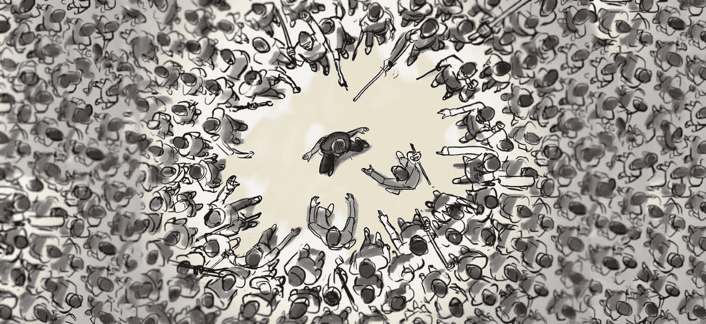

# 突现的暴政:我们所有人内心痛苦的种子

> 原文：<https://medium.com/swlh/emergent-tyranny-the-seed-of-human-suffering-within-us-all-72583cfd6bb1>

## 在你的心魔摧毁你最爱的东西之前，勇敢地面对它们

The Great Red Dragon and the Woman Clothed in Sun — William Blake, ca. 1803–1805 [1]

> “普遍地开导人民，身体和精神上的暴政和压迫就会像恶灵一样在黎明时消失。”——托马斯·杰斐逊

人类暴政的能力及其出现的趋势——随之而来的是对苦难的贪婪和无法满足的胃口——似乎在整个人类社会和各个时代都是普遍的。然而，我越是试图分离出它的起源，理解它的心理轮廓，我就越是发现我们这个物种的恶魔元素与人性元素不可分割地交织在一起——通常是正面描绘的——比如爱、同情和安全。暴政并非没有这样的理想；这是面对不确定性时追求它们的策略。*事实上它可能代表了* [*人类最古老的战略*](https://www.nature.com/nature/journal/v513/n7518/full/nature13727.html) 。

然而，这是一个不完整的策略，并且伴随着一系列不良的——通常是致命的——副作用。那么我们如何避免呢？我相信，通过理解和控制我们内心暴政的出现，我们可以建设一个没有肥沃土壤的世界，让暴政的“恶灵”可以更大规模地种植它们令人窒息的藤蔓。为此，我想回答以下问题:

*   ***是什么*力量沉淀了*暴政的心理根源？***
*   ***为什么**暴虐行为会随着人类行为规模的扩大而出现*？**
*   一个人如何与这些自我毁灭和毁灭世界的倾向作斗争？

理解并遵循以下几点，就是对自己的生命负责，并宽恕那些可能会被你欺压的人的生命；这是对暴政的出现完全承担个人责任，并在将我们的世界从它的魔爪中解放出来的过程中尽自己的一份力量。

## 暴政的心理根源

为了我们的目的，让我们把暴政定义为:

**残忍、不合理或任意使用权力或控制**

*这种倾向是从哪里出现的？很容易想象那些运用这种权力或控制方法的人是一个与众不同的品种；不像我们，他们是无情的怪物，将他们暴虐的意志强加给无辜的人。当然，这是一个讽刺。这是我们创造的一幅漫画——作为一面盾牌——来保护我们自己免受困扰的怀疑，即暴政的倾向潜藏在我们自己的灵魂深处*。但不幸的是，*潜伏着* *它确实如此。***

*考虑到运用这种倾向经常会带来灾难性的后果，为什么它会存在于我们每个人的内心呢？乔丹·彼得森博士的开创性著作《映射 [中的](https://www.youtube.com/watch?v=I8Xc2_FtpHI)[意为](https://jordanbpeterson.com/wp-content/uploads/2016/11/Peterson-JB-Maps-of-Meaning-Routledge-1999.pdf)》详细探讨了我认为最令人信服的理论，该理论认为，暴政的能力存在于我们体内，是一种防止不确定性侵入我们原本稳定的心理环境的策略。换句话说，**暴政是我们用来保护自己免受不必要的负面情绪状态影响的心理屏障，是抢先进行痛苦变革并为使用过时的世界模式辩护的工具。**或者如彼得森所说:*

> *“暴虐的父亲绝对统治，而王国枯萎或瘫痪；他的衰老和年龄只能与他的傲慢、顽固和对邪恶的视而不见相匹配。他是专制或极权国家的化身，其“目标”是将所有活着的人还原为单一死亡的“过去”人格的表现。”[2]*

*但是怎么可能去专制自己呢？想象 ***自我暴政*** ，有助于将自己的欲望和需求人格化为“内在的神”【3】。把你的头脑想象成一个充满内在神灵的万神殿，每个神灵都追求自己的需求(爱、饥饿、成功、认可)。有时他们*会合作*，但往往他们*会争夺*意识的统治权*行为的主导权* 。也就是说，直到另一个神变得强大到足以收回缰绳，追求自己的目标。例如，随着你的最后一餐逐渐回到过去，你的饥饿之神的力量越来越大，最终从所有其他人手中夺取统治权，指引你找到食物的来源。*

**

*Ancient Inner Gods — The “heart deities” of Taoism*

*但也许你最终来到了一家全新的 *餐厅*，因为你的新鲜感之神暂时偷走了饥饿的缰绳(卑鄙的混蛋)，现在你必须决定吃什么。尽管饥饿目前的力量，他现在面对的是一个其他神的缰绳叫嚣主机。当然，新鲜感又来了，它想尝尝你从未见过的难发音的菜。但也有熟悉感——谁喜欢鸡肉，还有担心——谁对照你的饮食限制清单检查菜单。当然，虚荣心和健康联合起来支持希腊沙拉。最糟糕的疑问是——那个令人无法忍受的扫兴者——只想走出门去。你是做什么的？*

*关键是，你的整体行为是竞争和合作力量的*竞技场中相互作用的结果，*而不是某种*先天“自我】*或*“身份”*的必然结果。我们的*意识自我——*行使自由意志的那部分自我*——*可能会干预这样的决定，但不是强制性的；这种干预需要实践，类似于国内思想政治的微妙练习。就像在日常政治中一样，干预需要大量的精力，而且可能会相当混乱、低效、彻底激怒。但是随着时间的推移——并且相对于一个人的目标——一个解决方案出现了:我们创造了一套*规则*来管理在任何给定的时间哪个上帝能够掌权，一个*心理图式*将一个人的环境中的 [*事件的*意义映射到一个人的*行为反应，作为世界*中的行动。这种映射*就是*你，并随着你在生活中的前进而演变。你使用到的*策略* *干预和管理你内心的神随着时间的推移而进化，也许从裁判，到执行官，到政治家，教练，父母，或者其他完全不同的人。*](https://www.nature.com/articles/s41562-017-0208-0.epdf?author_access_token=xzjZ9Oe-Kv2XJYHp_Zmst9RgN0jAjWel9jnR3ZoTv0OfirWR7nT6MLiwwrLvq7v0yZz2p4veM6dUCHIVpgbFOxY38jk3UplRfTIWXO6N1U5xwch2lLckOmVYkbPFBGAH8FwHvp8zdd-dhratF4Rzqg%3D%3D)*

*然而这和暴政有什么关系呢？我们对自己内心神的意识力量和控制程度提出了一个重要的道德问题:一个人的*意识自我*和他内心神之间的适当关系是什么？一个人应该在正在展开的心灵戏剧中扮演什么角色？正是在这里，我们许多人不知不觉地陷入了 ***自我暴政*** 。当我们感到我们已经失去了对我们内心之神的控制时——当我们通常的*心理模式*不再实现我们期望的结果时——我们会求助于暴政的滥用工具，而不是勇气、好奇心或同理心。*面对新的挑战，* *我们错误地在过时的策略上加倍下注，弊大于利。我们鞭笞、监禁或惩罚，而不是引导成长所必需的勇气。**

**

*He’s easy to spot in another, but can you find him in yourself?*

*自我暴政有多种形式:我们可能会因无法控制的事情而惩罚自己；我们可能会因为小错误而严厉责备自己；我们可能试图熄灭我们自己的基本人类需求，而不是改革我们满足这些需求的方式；我们可能会在毒品或酒精中淹没我们不喜欢其声音的内在神灵；最糟糕的是，我们可能*避免必要的牺牲*在当下，被这种牺牲可能带来的变化*石化*。所有这些反应都有一个共同点:*对未知的恐惧*。这种恐惧——以及相应的增强控制的愿望——代表了对不确定性的自然进化反应。但问题来了:让这些本能支配一个人对不确定性的反应，可能会成为一个对自己需求万神殿不合理的暴君。*

*在我们的一生中——通过对自己实施暴政——我们在我们的实际需求和我们实际满足的需求之间划出了一条越来越大的鸿沟。这种不匹配产生了更多的恐惧、不确定性和混乱，这反过来进一步扩大了差距，最终引发螺旋式下降到自己设计的地狱中。因此，我们越来越讨厌那些我们无法控制的部分；当我们内心的暴君在回应我们越来越徒劳的自我抑制时，我们变得*完全憎恨自己* ***。所有更大形式的暴政都源于这种自我仇恨。****

## *社会暴政的出现:超越自我，感染他人*

*大多数人都熟悉汉斯·克里斯蒂安·安徒生 19 世纪的童话《公主和豌豆的故事》。据说，一位王子的母亲设计了一个贵族测试，她在 20 个床垫下放了一粒豌豆:如果公主——她必须睡在这个床上——注意到任何不对劲的地方，王子可能会消除对她贵族身份的担忧。*

**

*A small change at a lower layer distorts the layers above it*

*无论你对 19 世纪丹麦的社会习俗有什么看法，这个故事都有助于想象系统内部的深层变化是如何在更高层次上发展成有意义的事件的。豌豆制造了*扭曲*，通过许多不同的*层床垫向外向上回响。那些足够敏感或积极的人可能会注意到哪怕是最轻微的这种扭曲。但是这和 ***自我暴政*** 有什么关系呢？**

*就像豌豆一样，我们的行为通过社会的许多层面向外向上产生反响。我们如何对待自己将影响我们对待他人的方式，这将影响他们对待自己和他人的方式，如此类推。随着时间的推移，这些行动中的一些可能会*抵消*——不会产生整体影响——但*许多不会*。我们的许多行为与他人的行为相结合，在越来越大的社会背景下创造出越来越大的集体行为模式。你的行动很重要，即使它并不总是立即显现出来。此外，你的*行为与*行为直接相关，甚至与我们社会的最高层行为直接相关，因为所有的社会结构*都是自下而上* *形成的*，即使许多社会结构后来是自上而下*管理的*。金字塔的每一层都是它上面的基础，如果没有坚实的基础，金字塔就会倒塌。*

*因此，通过暴虐自己，一个人直接促成了社会各阶层暴虐行为的产生和生存。存在许多这样的层次，但是让我们从四个可识别的互动类别来追踪这种出现的模式，按照规模增加的顺序:*

*   *自我暴政——如上所述的自我暴政*
*   ***人际暴政**——个人对其他个人的暴政*
*   ***不对称暴政**——个人与群体之间的暴政*
*   *集体暴政——群体之间和群体内部的暴政*

*这些类别之间的界限可能会变得模糊，因为个人与社会的关系很像水分子与海洋的关系——鉴于所有层都不断相互作用，很难画线。但是就像床垫一个叠一个，这种相互作用和混合正是允许较低层次的行为在较高层次创造出新的行为模式。*

*让我们来看看这个*突发暴政*的过程会是什么样子。如果——当不确定性的*之龙*抬起头来——你习惯于使用专制策略来管理自己内心的神，那么当人际不确定性出现时，你很可能会使用同样的策略来管理他人的行为。例如，如果我经常用内疚来管理自己的情绪和欲望，当我觉得有必要管理你的情绪和欲望时，我也会这么做。这并不一定是因为我不喜欢你或想伤害你:不，这是因为内疚是一种*熟悉的工具*我习惯于*用它来对付不确定的恶龙，而此刻*你就是恶龙*。在* ***的*领域里，我们就是这样把自己的专制本能强加给彼此的——如果你愿意的话，这是更高层次的*突发暴政*的痛苦交响曲的前奏。*****

据统计，在经历了将 ***【自我】*** 和 ***人际暴政*** 作为社交策略的*短期个人成功*后，一些人将在他们的社交群体中担任有权力的职位。这一不幸事件标志着 ***不对称暴政*、**的开始，在这种暴政下，暴君控制了一个群体。需要注意的是*这不是不可避免的*，很大程度上取决于相关群体的*道德价值观和行为*。例如，一个由具有强烈反规范的个人组成的群体，以及一种最大限度地减少个人层面暴政出现的文化，将会减少暴君控制群体的事件。尽管如果一个暴君被赋予统治一个群体的权力，这个群体更有可能通过另一种形式的 ***不对称暴政*** : *群体对个人的虐待*。作为一个集体有机体，暴君的傀儡们会很容易地利用暴政来对付其他人。历史上的例子比比皆是，最终都被提炼成了 [*多数人暴政*](https://en.wikipedia.org/wiki/Tyranny_of_the_majority) *的思想。*正如希腊诗人[欧里庇得斯](https://en.wikipedia.org/wiki/Euripides)在他的[俄瑞斯忒斯](https://en.wikipedia.org/wiki/Orestes_(play))中所说:

> "当一个甜言蜜语但内心邪恶的人说服暴徒时，国家就会陷入巨大的灾难."

The tyrant uses the mob to target anyone identified as a threat to prevailing dogma

一旦群体参与进来，我们就为最后一类做好了准备: ***【集体暴政】*** *。众所周知，一旦一个群体感到他们受到了另一个群体的暴政统治，就非常容易出现世仇。通常——尤其是在马克思的影响之后——我们把这种行为称为压迫。当然，鉴于触发事件背后的各层紧急暴政之间的复杂相互作用，责任很少落在单个团体或个人的头上。但是一旦被点燃，这种争斗会持续很长时间，当尸体堆积时，参与者会忘记突发事件。焦点变窄，导致对*消灭对方*的偏执狂痴迷。*

例子比比皆是:共和党和民主党，资本家和社会主义者，基督徒和穆斯林，资产阶级和无产阶级，ANTIFA 和 alt-right，以及越来越多的——最悲惨的——男人和女人。一条共同的线索贯穿了这些争斗。在他们的两极分化状态中，反对者都有一种倾向，那就是过分简化他们的故事——他们的*心理模式——*以适应意识形态模型，这些模型 [**证明并强化了他们的**](https://en.m.wikipedia.org/wiki/Confirmation_bias) **关于世界应该如何运转的观念*不可避免地不足。尽管他们自己只提供了部分解释，却没有给对手的故事留下任何空间。仅仅是另一种意识形态叙事的存在，就破坏了这个群体对自己片面且不充分的故事的自信；*更糟糕的是，竞争故事通过突出对手最脆弱和站不住脚的信念，揭露了曾经隐藏的耻辱。 **因此双方都宁愿消灭对方，也不愿追求必要的自我完善。****

毫无疑问:一旦暴虐行为达到这种规模，将妖怪放回瓶子里几乎是不可能的——否则难以想象规模的致命灾难将成为可能，或许是不可避免的。[降级是罕见的](https://en.wikipedia.org/wiki/Cuban_Missile_Crisis#Crisis_ends)，而且取决于解决困难的集体行动问题，失败的 [远多于成功的](https://en.wikipedia.org/wiki/Nash_equilibrium)。作为一个物种，我们经常在这样的游戏中失败。不幸的是，对于地球上的生命来说，现代的创新如热核弹头成倍地增加了人类失败的代价。

鉴于*不摧毁一切*——包括我们自己——的重要性，我们应该怎么做？

## 防止暴政的出现:勇气、好奇心和同情心

蝴蝶效应提供了一个经常被引用——也经常被滥用——的涌现行为的例子。故事是这样的，一只蝴蝶在非洲海岸扇动翅膀，通过一系列级联事件在德克萨斯州引发了一场龙卷风。诚然，这是一个延伸，尽管它的数学似是而非。但是如果 70 亿只蝴蝶以一种松散协调的方式行动会怎样呢？如果这 70 亿只蝴蝶中有很大一部分感染了一种控制它们如何扇动翅膀的病毒会怎么样呢？*那还有什么可能*？从[我们知道](https://www.amazon.com/Phase-Transitions-Primers-Complex-Systems/dp/0691150753)的影响可能相当深远，可怕的是:*我们很像那些蝴蝶，我们的* [*信念很像控制我们如何扇动翅膀的思维病毒*](https://www.amazon.com/Virus-Mind-New-Science-Meme/dp/1401924697) *。*

Even butterflies tyrannize.

信念，特别是你的 *信念*，随着时间的推移，在控制你的行为方面扮演着重要的角色。尽管大多数人觉得他们选择了相信他们所相信的东西，但是潜在的信仰动力看起来更像是感染，而不是购物。随着文化的发展，它们会产生思想。这些想法塑造了他们所感染的人的行为，随着时间的推移，这种行为的成本和收益决定了这些想法的生死。如果一个想法存在足够长的时间，它就会成为一种信念。正如我们所见，*坏想法*会驱使整群人走向[文化](https://en.wikipedia.org/wiki/Nazi_Germany)、[经济](https://en.wikipedia.org/wiki/Nuclear_arms_race)或[文字](https://en.wikipedia.org/wiki/Heaven%27s_Gate_(religious_group))自杀。今天活着的每个人都存在于跨越亿万年的完整的生物繁衍链的末端，但也许更重要的是，我们每个人都存在于跨越数千年的完整的 T42 信仰链的末端。

尽管现代经验主义者几乎已经否定了世界上的主要宗教，但我相信，通过新兴暴政的镜头来重新审视这些进化成功的道德框架是值得的。正如亚历山大·索尔仁尼琴在他震惊苏联的杰作《古拉格群岛》中所说:

> 我开始理解世界上所有宗教的真相:它们与人类体内的邪恶斗争。把邪恶从整个世界驱逐出去是不可能的，但是把它限制在每个人的内心是可能的。"

然而，一个人的哲学或宗教只能指明方向，不能决定行动。**抑制自己内心的暴政和邪恶的责任是每个信徒在生活中最根本的道德要求；它像灯塔一样照耀着所有那些寻求将他们的生活与人类的创造性力量联系在一起的人，以反对其灭亡的恶魔三元组:暴政、怨恨和欺骗。一个人必须将*意识自我*与恶魔三要素的敌人结盟:勇气、好奇心和同理心。**

一个人必须与勇气结盟，以容忍各种形式的不确定性:痛苦、随机、混乱和失败——承认这些力量是人类经历中不可避免的特征。当一个人发现自己的信念和当前现实之间不匹配的新解释时，*需要勇气*在行动的世界中实际检验它们，用新的和未经证实的策略*面对不确定性*。

Summon your inner hero, or end up dragon food — *Cadmus Slays the Dragon,* [Hendrik Goltzius](https://en.wikipedia.org/wiki/Hendrik_Goltzius)

*一个人必须与好奇心*联合起来，去理解、探索和产生想法，解释一个人*期望的未来*和一个人*目前的不足之间的不匹配。*这种不匹配往往会表现为恐惧或焦虑，这种情绪会使人在决定接近或回避之前冻结。随着每一次撤退，一个人相对于恐惧的来源变弱，在不确定性的*龙面前退缩。相反，我们可以利用好奇心作为一种工具，将我们对龙的看法从一种威胁转变为一种易于接近的发现和积极发展的机会。*

一个人必须有同理心来原谅自己和他人的失败。期待完美是通往暴政的快车道。只要*改善*的意愿存在，人们就必须唤起同理心，而不是愤怒。此外，同理心必须与勇气相结合，因为自己或他人的失败会带来更大的不确定性，恐惧会伴随着愤怒。记住，*固定完美在这个世界上是不存在的*；我们只能不断努力改进——为了我们自己和这个世界，我们需要这个复兴的过程。为了让我们活下去，我们欠所有死去的人。

如果我们寻求减少世界上的暴政，我们必须开发、实施并不懈地实践建设性地管理我们的情绪和驱力的策略。随着我们作为一个物种的成长，我们已经进化出越来越复杂的策略来做到这一点。人类的神话、宗教和哲学是管理*突发暴政、*的文化策略的典范，因此值得最强烈怀疑的无神论者的欣赏和思考。*我们必须从某个地方开始*。当然，这些系统仍然不完善。此外，科学在我们文化中的爆炸性增长，以及随之而来的*颠覆性创新的冲击，*只会让我们更加意识到先前系统的不完美。但是毫无疑问，我们将神话和宗教——具有比科学更深远的进化根源的文化技术——讽刺为逝去的过去的不重要的遗迹，这是我们的危险。作为人类，我们需要*连贯的、适应性强的道德框架*来帮助指导我们的行动，如果没有这些框架，我们将继续用不完整的、经常是致命的意识形态伪造品来替代。

对抗暴政的道德哲学的*在有意识的自我* *中的涌现起源*代表了第一步。但是在我们采取行动之前，我们必须感觉到在我们文化的表面下对理智的日益增长的需求。我们必须*感觉到* *我们骨子里*缺乏平衡和成长 *。我们必须将人类进化的需求内在化——在恶魔摧毁我们最爱的一切之前，与他们对抗。*

用卡尔·荣格不朽的话来说:

> 情感是所有意识形成的主要来源。没有情感，就没有黑暗向光明的转化，也没有冷漠向运动的转化

你感觉到了吗？

## 如果这些想法引起了你的共鸣，我真的很感激你愿意通过鼓掌在媒体社区传播这个信息。

## [支持我写作](https://www.patreon.com/matthewpirkowski):

这不是我的日常工作，尽管我希望它是。如果你在这些文字中发现了价值，并且希望我能不断地在这个世界上精心制作更多像这样的内容，请考虑在 Patreon 上支持我的。让我们一起建设一个更美好的世界…

## 在 Twitter 上关注我:

尽管我对 Twitter 普遍不屑一顾，但它有它的用途。

## [在 Instagram 上查看我的短诗和摄影:](https://www.instagram.com/matthewpirkowski/)

我旅行；我拍照；我写短诗。[它们看起来像这样](https://www.instagram.com/p/BYfgv2ZgydJ/?taken-by=matthewpirkowski)。

## [支持激发这篇文章的人](https://www.patreon.com/jordanbpeterson):

在过去的一年里，我阅读了大量乔丹·彼得森博士的内容。更详细的解释见脚注 2，但长话短说，我[在 Patreon](https://www.patreon.com/jordanbpeterson) 上支持他，你也应该支持。

## 脚注:

1.  布莱克的画描绘了《启示录》中的一段标志性的话:*“他的尾巴画出了天上星星的三分之一，并把它们扔到了地上:龙站在准备分娩的女人面前，在她的孩子一出生就要吃掉她。”—启示录 12:4* 。值得注意的是，这体现了暴政的原型形式。英雄之星——闪耀着希望的典范和行为的指路明灯——受到暴君的攻击和部分破坏，因为它们的潜在不稳定性威胁到暴君对死去的过去的统治。除此之外，龙在攻击社会过去和现在的英雄时，威胁要吞噬新生儿。这种对无辜儿童的威胁体现了暴政的趋势，即掠夺社会赖以再生的物质:新的知识和潜力，这些都是英勇获得的。
2.  摘自乔丹·彼得森的*意义地图。我怎么推荐这本书都不为过。我一生中读过很多书，这本天才的杰作对我的生活和世界观产生了无比深远的影响。通过令人信服的假设和唤起一个人对自己和对世界的责任，彼得森的作品让我将多年的思考综合成连贯的形式，并给了我分享这些创作的勇气。上面的许多想法代表了我自己的想法与他的想法的吻合，所以把这看作是与上面的任何想法——可能是所有想法——相关的一般属性。毕竟[*nihil sub sole novum*](https://en.wiktionary.org/wiki/there_is_nothing_new_under_the_sun)。*
3.  尽管这种语言在现代经验主义者的头脑中引起了直接的怀疑，但我开始意识到用这种语言讨论内部心理学是很有意义的，因为它依赖于我们在拟人化时更清楚地理解抽象概念的一般能力。如果你愿意，你可以通过行为经济学的视角更有经验地将这些想法概念化。在像丹尼尔·卡内曼的系统 1 和 2 这样的理论框架中，“内在的神”与系统 1 的无意识、直接和非理性的力量平行，而一个人的有意识的自我与系统 2 的较慢的、分析性的、有意识的思想平行。
4.  卢姆斯登、查理斯 j 和爱德华·O·威尔逊。基因、思维和文化:共同进化的过程。世界科学，2005 年。通过双重遗传理论——一种描绘生物和文化之间进化关系的理论——的精彩*绝技*。

## 这个故事发表在[的《创业](https://medium.com/swlh)》上，这是一份有超过 256，410 人关注的媒体出版物。

# 订阅[获取头条新闻](http://growthsupply.com/the-startup-newsletter/)。

