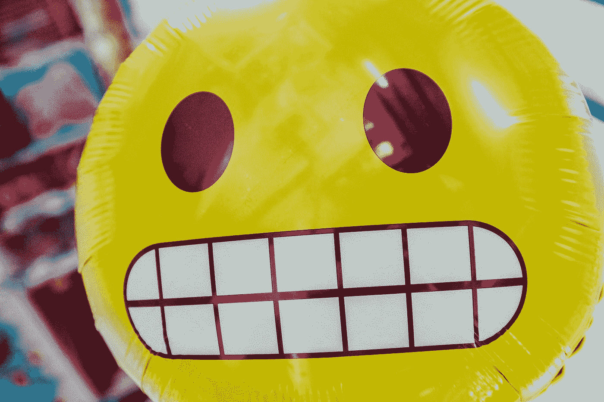

# 表情符号正在把我们变成没有感情的机器人

> 原文：<https://medium.com/swlh/emojis-are-turning-us-all-into-emotionless-robots-1099f5c7b6cc>

Photo by [Bernard Hermant](https://unsplash.com/@bernardhermant?utm_source=medium&utm_medium=referral) on [Unsplash](https://unsplash.com?utm_source=medium&utm_medium=referral)

你知道我想念什么吗？给爱人和朋友写长信。我怀念和一个我几乎不认识的人做笔友的日子，怀念花时间写信，用我们过去称之为“文具”的漂亮贴纸点缀的日子。我怀念阅读别人的文字，了解他们的真实感受，因为他们从生活中抽出时间坐下来给我写信。