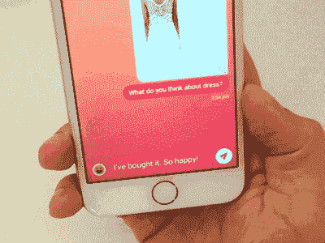

# 情感智能设计:为什么你的手机应用需要它

> 原文：<https://medium.com/swlh/emotionally-intelligent-design-why-you-need-it-in-your-mobile-app-3dfb847b7991>

几乎我们所有人都有智能手机。我们每天都在使用各种应用程序——文档管理、驾驶辅助、字典、锻炼追踪、[大脑拼图](https://anadea.info/blog/7-cool-apps-for-boosting-your-brain-power)、当地天气、条形码扫描仪，应有尽有。App Store 和 Google Play 里的应用多如天上的星星。

现在想想你智能手机里的应用程序。你能说出至少 5 个原因，说明你为什么选择了你现在使用的应用程序，而不是同一个类别、功能相似的其他应用程序吗？您将设备内存“提名者”的列表缩小到了两个。两个都符合你的需求，都有很好的评论，但出于某种原因，你还是选择了唯一的一个应用程序。

现在我们要开始了。我们大多数人可能没有意识到[情绪对我们的决策有多大影响](https://en.wikipedia.org/wiki/Emotions_in_decision-making)。查尔斯·达尔文在他 1872 年的著作中指出，不同的[情感有助于人类生存。技术和生物学似乎是截然不同的。然而，可以肯定地说，在创建一个应用程序时考虑用户的情绪将有助于你在激烈的市场竞争中生存。](https://en.wikipedia.org/wiki/Evolution_of_emotion)

说《碟中谍》或者科技不能兴起情绪反应？有没有看过科学家拳打脚踢测试波士顿动力机器人的视频？

我们都以某种方式强调这些科技生物。智能技术正在朝着人类情感识别迈出大步。

# 网络和移动 UX 设计正走向积极情绪

视觉设计的无关紧要和乍看难以察觉的细节，如果没有这些细节，应用程序将无法继续工作，通常会比应用程序的整体概念引起用户更大的情感反应。例如，这个有趣的功能通过摇动智能手机来表达聊天中的情绪。

这些细节赋予了产品独特的身份，有助于在个人层面上与用户建立沟通。这种技术被称为情感用户体验设计。

让我们来看看“404 未找到”页面。这是一个激发网站访问者情绪的好地方。大多数到达 404 错误页面的用户会尝试尽快离开。如果小型网站可以监控其链接的正确性，那么在大型网站上，跟踪导致文件或页面被删除或移动的断开的链接会变得更加困难。经过深思熟虑的 UX 设计的 404 页不仅会为访问者提供相关材料的链接，还会激发他们的兴趣，鼓励他们探索你的产品。

Image source: [pixar.com](https://www.pixar.com/404) / [theuselesswebindex.com](https://www.theuselesswebindex.com/error/)

为情感而设计也适用于教育应用。例如，在开发电子学习系统 [STAV 在线](https://anadea.info/projects/stav-online)时，我们使用了 UX 设计中的情感元素，因为情感可以创造动力，吸引学生的注意力，并使记忆教育材料变得更容易。

# 情感 UX 设计——互动关系之路

情感的表达是自然的。我们所有人从小就学会了识别情绪。当我们在网上聊天时，我们使用表情符号、表情符号来让人们理解我们的感受。现在，技术正在学习识别用户的情绪。每年，我们都会看到越来越多的情商被整合到移动体验中。

情商不仅仅是用户执行某些动作时出现的动画效果。今天，手机上的情绪智能是一种让用户体验更愉快、更有趣的方式，从而让你的应用程序更受欢迎。

市场巨头——安卓和苹果正试图通过开展机器学习研究来简化与他们服务的交互。到目前为止，情绪智能设计有 4 个关键要素:

*   个性化，
*   对话界面和语音识别，
*   人脸检测和表情分析，
*   生理参数分析。

# 个性化

应用程序中的个性化创建了与用户的联系。当你去找发型师，说你洗头时喜欢更冷的水，这就叫定制。当你下次去找发型师时，他/她记得你的偏好，这就叫个性化。个性化推送和应用内通知让用户感觉很特别。

例如，最大的点播音乐流媒体服务 **Spotify** 使用确定跑步节奏的技术，并根据结果为慢跑者提供合适的播放列表。适合跑步的音乐非常振奋人心。所有不知道这个应用的慢跑者都已经对它感兴趣了吧？

# 对话界面

不久以前，人们仅通过文本与计算机互动。而今天，随着[人工智能](https://anadea.info/blog/artificial-intelligence-pandoras-box-or-the-holy-grail)的发展，自然语言理解和处理算法的进步给了我们对话界面和[聊天机器人](https://anadea.info/blog/what-is-a-chatbot-and-how-to-use-it-for-business)以便让我们与科技的交流更加自然。

情感语音技术无可争议的领导者之一是 Beyond Verbal 公司。他们开发了一个移动应用程序，可以分析原始的 10 秒钟记录，并提取表明情绪、心情、说话习惯、压力以及用户健康状况的数据。

互联网巨头基于对话式人工智能开发了大量设备和服务，如苹果的**谷歌助手**、苹果的 **Siri** 和微软的 **Cortana** 。例如，由亚马逊的 **Alexa** 语音助手控制的免提设备可以在合适的时间叫醒你，打开你喜欢的音乐，查找和阅读新闻，甚至订购食物外卖。

不再需要键入您的请求。你可以说出来，带有语言处理的应用程序会为你找到一切。图形界面在移动应用程序开发中仍然很流行。然而，随着对话界面的蓬勃发展，我们将像理解你心情的老朋友一样与应用程序交谈。

# 人脸检测和表情分析

笔记本电脑或智能手机无需输入密码即可识别您。汽车、社交媒体网络、商店——都欢迎你，一见到你就叫你的名字。这就是人脸检测的工作原理。

眼睛之间的距离、鼻子的宽度、下巴的长度——当你看着另一个人时，你会无意识地捕捉到所有这些细节。计算机通过结合所有这些指标并获得人脸的数学公式来实现这一点。

有许多方法可以在移动应用程序中通过人脸检测产生更好的用户体验。例如，iPhone X 具有 **Animoji** 功能，可以创建您自己的动画角色，这些角色使用您的声音并复制您的面部表情。

[via GIPHY](https://giphy.com/gifs/adweek-fox-apple-10Y1Tu4y6gy94Q)

# 生理参数分析

现代智能手机有许多传感器，可以检测血压、脉搏和皮肤温度。你会问，这和情绪有什么关系？

我们所有的想法和情绪都会立即影响肌肉张力和肌肉工作。在经历这种或那种情绪时，我们会紧张，或者相反，放松特定的肌肉群。例如，愤怒可以导致手部肌肉紧张度的增加，如果这种愤怒的背后是想要打击冒犯者的话。负罪感通常会导致隐藏或消失的欲望，然后头会不经意地沉入肩膀。

例如 **Sentio Solutions** 公司设计了一款手环，通过监测生理参数来追踪、识别和收集人类情绪的信息。然后，移动应用提供推荐，这些推荐应该为用户形成积极的习惯，包括情感上的习惯。

# 情感 UX 设计与开发。魔法？技术！

在情绪智能设计行业有许多即将到来的分叉。还有更多的研究和技术挑战需要解决。但有一点是明确的，使用情商给专业 UX 设计界带来了无尽的机会。

如果你喜欢感性的用户体验设计理念，并希望将其融入到你的应用中，我们乐意为你提供帮助！无论你的想法是什么，我们的移动应用开发者团队都能让它成真。

*最初发表于*[*anadea . info*](https://anadea.info/blog/emotionally-intelligent-design-why-you-need-it-in-your-mobile-app)*。*

## 这篇文章发表在 [The Startup](https://medium.com/swlh) 上，这是 Medium 最大的创业刊物，拥有+368，366 名读者。

## 在此订阅接收[我们的头条新闻](http://growthsupply.com/the-startup-newsletter/)。

