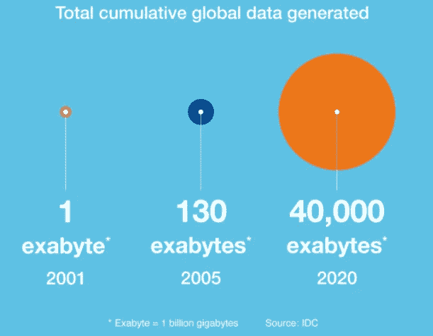

# 假装无知的帝国

> 原文：<https://medium.com/swlh/empire-of-feigned-ignorance-53370e39f4c2>

## 向自己承诺一场个人革命

Jean-Phillipe Delberghe On Unsplash.com

> 文明的存在是基于地质学上的认可，可能会不经通知而改变——威尔&阿里尔·杜兰特

生活是美好的。如果你认为你的世界没有延伸到与直接的朋友和家人的日常经验的有限边界之外，那是舒适惬意的。狭隘的世界观意味着，我们正在推动重大问题，希望下一代能够聪明地纠正我们的错误。总的来说，我们建立了一个假装无知的帝国。只要我们在自己的茧中快乐，就可以选择忽略困扰我们世界的更广泛的问题。我天生不悲观，但我也相信为他人而活的梦想不是哲学上的理想，而是时代的需要。

当我们在这个假期聚在一起的时候，想想在未来创造和推动一场革命。创造一场个人革命，而不仅仅是一个决心。一个决心，常常会被打破。然而，对你选择的使命的承诺将会改变你的生活方向，去追求一个独特的、无私的目标。

我个人的革命是“创建一所示范学校，为印度农村地区的妇女提供免费或补贴教育”。或许，这种模式可以被全世界效仿。现在，想象一个未来，我们每个人最终都会实现至少一部分宏伟的理想主义梦想。世界会变得更好，因为我们努力了。

这篇文章提供了一种方法来打破你对全球和地方问题的假装无知，并通过追逐梦想来采取行动。建立在错觉上的帝国是一座纸牌屋。我们有机会将它重塑成一个乌托邦式的理想。但愿，我们鼓起足够的勇气这样做。

# 金钱是一个空洞的承诺

明年要做的第一个决定是对你和你的家庭承担经济责任。在咖啡和其他小额增值支出上节省的每一美元都可以投资到更光明的未来。俗话说，慈善始于家庭。因此，在你考虑为他人而活的使命之前，确保你有一个稳定的金钱基础。这使得金钱成为达到目的的手段。仅此而已。

甚至当人类处于第二次世界大战的痛苦中时，来自 44 个盟国的 730 名代表聚集在新罕布什尔州布雷顿森林的华盛顿山酒店，创建了一个基于将每个国家的货币与金本位制挂钩的国际货币交换体系。这意味着一国货币的价值与一种叫做“黄金”的稀缺商品联系在一起。这见证了世界对黄金的信任。

布雷顿森林协定于 1971 年 8 月 15 日被美国单方面废除。由此开始了一个世界信任政府的时代。反过来，政府相信上帝。因此，今天美钞上的“E Pluribus Unum”字样。

21 世纪见证了通过中本聪的同名比特币实现的信任去中心化。今天，世界正在向一个既不是货币也不是公认资产类别的密码符号投入数十亿美元。

因此，只有那些日日夜夜为钱而活的人才会发现钱的真正价值。然而，为了思考一个更高的目标，重要的是不要把金钱混为我们存在的理由，而是做好事的工具。

# 为什么看新闻

到 2020 年，我们将累计生成 40，000 的数据。想想吧。对于人类来说，很难将注意力集中在可以通过智能手机轻松获取的海量数据上。

towardsdatascience.com

简单来说，新闻=事实+色彩。当我读新闻时，我收集事实，并听取双方的意见。对数据的矛盾评估，这并不总是可能的。然而，在阅读新闻的同时阅读适量的国际文学将有助于你形成自己对世界现状的看法。

当我读 Sujatha Gidla 的《大象中的蚂蚁》等书时，我理解了一个局内人对印度种姓制度的看法。我也不能假装不知道妇女被剥夺选举权这个非常现实的问题。作为一名业余经济学家，我明白释放女性的潜力将对国民生产总值产生乘数效应。因此，用影响力投资的同一支箭击中两个目标。

在这方面，我一直很钦佩一个名为 Pratham 的非营利组织的工作，它通过“*Baal wadis*”的概念将教育带回家。本质上，它包括来自不同背景的志愿者去低收入和中等收入的社区，包括贫民窟教孩子。

我是通过一份当地报纸了解到普拉瑟姆的。在我的生活中，我遇到过许多记者，他们想用自己的天赋让社会变得更好。不幸的是，几乎所有机构都依赖于其参与者的财务稳定性。同样，我能理解困扰第四等级的腐败。然而，这仍然不能抹杀这样一个事实，即需要媒体工作者的不懈努力，才能让我们了解信息，讽刺的是，让我们受到良好的教育。

# 清晰之旅

旅行给了我实际比较的礼物。我已经决定不那么依赖纸上谈兵的批评家来阐述我的世界观。我穿过一些最落后的村庄，来到了印度的心脏地带。我的人生旅程让我看到了世界上很大一部分人生活在文盲造成的黑暗中的困境。根据世界扫盲基金会:

> 2015 年全球 7.81 亿成年文盲中，三分之二是女性。可悲的是，尽管识字率每年都在大幅提高，但专门针对女性的识字率却落后于这一趋势。联合国可持续发展目标旨在到 2030 年消除所有人的文盲。也就是 10 年多一点！如果我们想达到这个宏伟的目标，我们还有一些严肃的工作要做。

游历三大洲，我看到的相似之处多于不同之处。在一次去印度一个偏远村庄的旅途中，一位妇女曾经告诉我，她最想要的就是她的女儿接受教育。她说“虽然村子里没有电，但教育将是照亮村子未来的电力”。

不是通过施舍而是通过提供尊严来实现金融包容性，这是一个人能够给予的最大礼物。在当今世界，如果没有教育，几乎不可能提供有尊严的工作。这一知识坚定了我通过教育改善妇女状况的决心。为此，没有什么比坚强、独立的女性的真实例子更有力量了。

# 非理性乐观

宏伟的新年决心有点非理性乐观的味道。你可能会被嘲笑，你关于社会变革的想法会被驳回。不幸的是，没有时间去听那些不以事实为依据的批评者。

明年，我们将见证脆弱的全球经济增长(预计在 4%左右),充满地缘政治不确定性，并因技术的出现而变得更加不确定。如果不是每个人都有为他人而活的使命，就很难推翻经济不平等，创造一个人人都能获得幸福的世界。

礼萨·阿斯兰写道:

> “不管我们是否意识到这一点，也不管我们是否是信徒，当我们想到上帝时，绝大多数人想到的都是我们自己的神的版本。”

根据我的经验，我可以向你保证一件事——如果你真的想通过成为一个更神圣的自己来改变世界，宇宙会合谋帮助你。从这个意义上说，让你的梦想成为自我实现的预言。

## 这篇文章发表在 [The Startup](https://medium.com/swlh) 上，这是 Medium 最大的创业刊物，有 275，057 人关注。

## 订阅接收[我们的头条](http://growthsupply.com/the-startup-newsletter/)。

