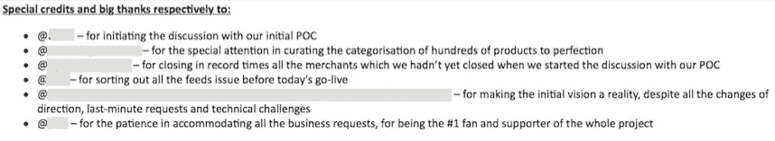
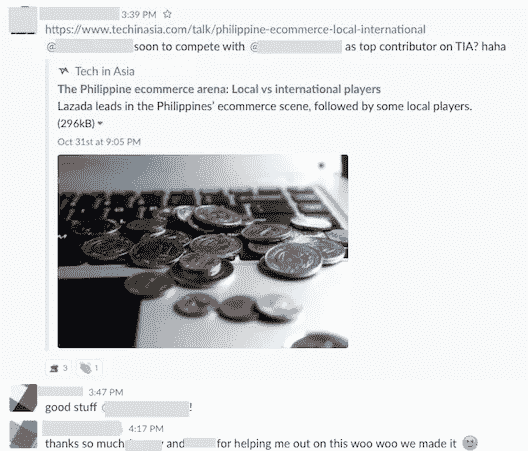
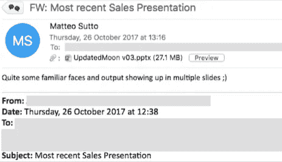
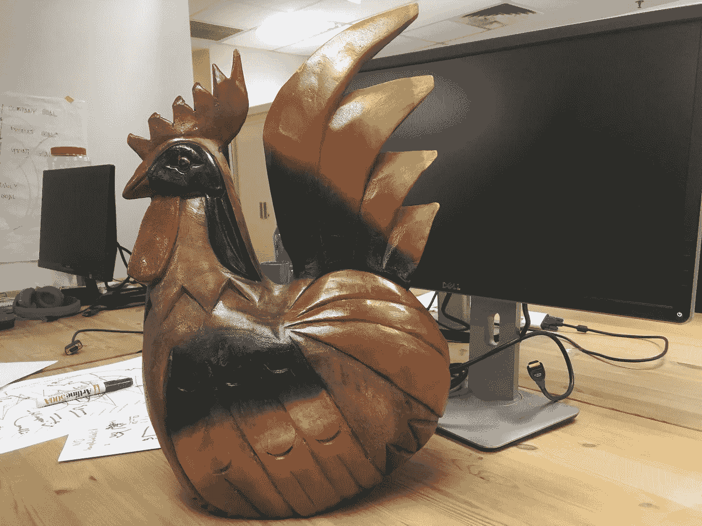
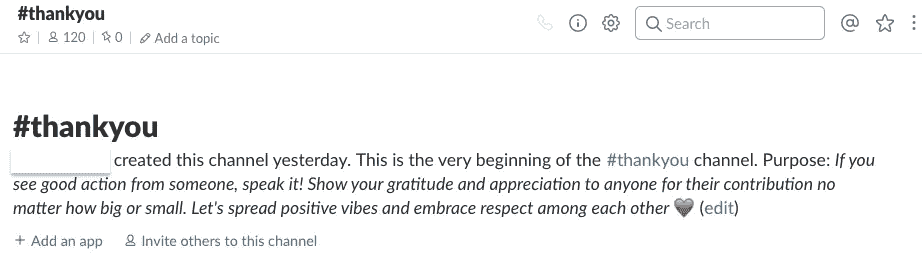
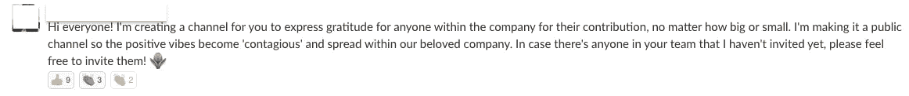
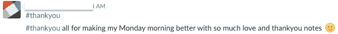
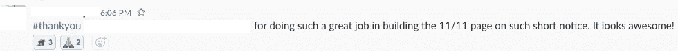
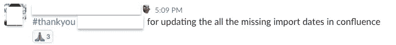

# 员工认可 101——如何欣赏团队的工作

> 原文：<https://medium.com/swlh/employee-recognition-101-how-to-appreciate-the-work-of-your-team-s-b16f834b1267>

## 在快速发展的组织中实现有效员工认可的指导原则和可行技巧(即创业公司)

> “人们很少会在批评中发挥出自己的最大潜力，但真诚的欣赏会让他们发挥出最佳水平”——戴尔·卡内基

如果你的公司正在进行任何内部调查来衡量你的员工的总体快乐程度，很可能“没有得到足够的认可”在员工不满意的方面得分很高。

## 作为一家公司，你为什么要关心员工的认可？

[大量](https://www.prnewswire.com/news-releases/new-bersin--associates-research-shows-organizations-that-excel-at-employee-recognition-are-12-times-more-likely-to-generate-strong-business-results-177627921.html)[的](http://appreciate.octanner.com/2015_02_WP_DriversofGreatWork)[研究](http://web.education.unimelb.edu.au/assets/pospsych/Predicting%20Job%20Satisfaction-%20Contributions%20of%20individual%20gratitude%20and%20institutionalized%20gratitude.pdf)证明，获得更多的个人认可是推动员工实现更高绩效的最重要因素之一。

哈佛商业评论[对美国廉价航空公司捷蓝航空](https://hbr.org/2016/02/the-benefits-of-peer-to-peer-praise-at-work)的一项研究显示**报告被认可的人每增加 10%**，捷蓝航空的保留率增加 3%,参与度增加 2%。

鉴于公司更换一名员工会产生巨大的成本，任何组织都应该毫不犹豫地将认可作为组织的优先事项之一。

这对于初创企业和快速发展的组织来说尤其重要，因为在这些组织中，很大一部分管理人员都是第一次管理团队。

以下 5 条原则，任何经理都可以在团队中推广赏识，以及我们在 [iPrice](http://ipricegroup.com/) 介绍的一些具体做法，让赏识成为我们公司文化的支柱之一。

# 1)给予诚实和具体的表扬

如果你遵循一个“认可日历”,你的感激会完全失去意义。你团队中的每一个人都应该在某个时候得到认可，但只是在合适的时候，当她/他真正值得的时候。

感谢某人的“好工作”或“努力工作”是不够的。你需要用具体的解释来证明你的赞美是正确的。为什么这个行动让你离你设定的目标更近了一步？

要做到这一点，你需要确切地知道事实和谁促成了它。在大多数情况下，产出永远不会是一个人的结果。如果你不确定，在公开表扬某人之前，问问你认识的对结果有贡献的人，看看整个**贡献者名单**。

Praise following the Go-Live of iPrice’s partnership with Samsung Indonesia

也试着**尽可能及时地给予表扬**，不要等到任何正式的月度/季度/年度绩效评估。等待太久会增加你忘记事实的机会，你的赞美也不会显得真诚。

# 2)公开表扬，私下批评

公众的赞扬会让你的欣赏更有分量，从而激励这个人做更多同样的事情。这也让你有机会向你的团队和整个公司重申公司的价值观。

这条规则的主要例外是，如果你知道接受表扬的人不喜欢任何形式的公开认可。作为一名经理，你有责任充分了解你的员工，以便能够根据他们的喜好调整工作方式。

当涉及到批评时，任何公开的批评通常都会产生负面的后果。这使得接受者更难接受，因为她/他的自然防御反应会被触发。如果你需要批评电子邮件，只需回复那个人，删除邮件中的其他人。

*(上述说法的变体是沃伦巴菲特的格言——“点名表扬，分类批评”)。*

# 3)表扬不应该只来自直接经理

尽管相当一部分赞美自然应该来自员工的直接经理，但你也应该尝试鼓励赞美从其他方向流出。特别是:

*   **团队成员之间的横向表扬:**除了直接经理的表扬之外，这可能是最重要的认可形式。在你的团队成员中建立一种相互欣赏的文化，将会大大提高你的团队的和谐程度，从而提高他们的工作效率。可以说，他们比任何人都更了解日常工作。来自同事的赞赏通常会被认为是更真诚的。

iPrice Content Marketing team celebrating first article in TechInAsia of our new joiner

*   来自最高管理层的表扬:作为一名经理，你也应该一直表扬你的报告，直到 C-Level /首席执行官。然后，您可以将从他们那里收集的意见反馈给员工。我发现这比给你自己的主管发电子邮件和抄送你的报告更好。在大多数情况下，在我看来，这是一种让你(经理)看起来比员工更好的方法。
*   **跨团队表扬:**作为经理，你通常能看到其他团队的活动和交流，而你的下属却无法看到。如果您在此类沟通中发现对您的任何报告所做工作的任何间接形式的赞赏，请确保让他们知道。

Sharing praise across teams

一个例子可以是由销售部门完成的展示营销团队所做工作的演示。作为一个假想的营销经理，为什么不把这种含蓄的赞赏明确地传达给你的团队成员呢？

# 4)庆祝完成的工作，而不仅仅是最终的结果

你的员工为实现他们的目标所付出的努力完全在他们的控制之下，但最终的结果往往不是这样。

按照流行的格言*“唯一重要的是结果”*生活会导致严重的动机扭曲。这对创业公司来说尤其如此，因为它们的经营环境非常不稳定。

另一个极端是，你不应该仅仅因为员工遵循了默认的“程序”就表扬他们，这会对公司的创新能力产生负面影响。你在推动他们尽可能努力地、创造性地工作，以实现公司的目标。作为经理，你有责任充分了解他们的日常工作，以便能够评估哪些因素在他们的控制之下，哪些不在他们的控制之下。

在员工取得任何最终成果之前表扬他们的第二个原因是，通过庆祝小的中期胜利，你可以让团队在长期项目中保持动力。

# 5)平均分配赞美

如果你足够幸运，在你的团队中有一个或几个表现出色的人，他们不断超越并不断打破任何设定的目标，那么风险就在于你把你的赞美过度集中在一个或几个员工身上。

这可能会让接受表扬的人感到越来越不舒服，并在你的团队中形成一种嫉妒的文化。你不想发生这种事。

试着在你的团队中尽可能平均地传播赞美，而不是关注每个员工的相对进步。只要方向是正确的，不管进步有多小，你都想发出一个鼓励的信号，激励这个人做更多同样的事情。

# 作为一家公司，你能做些什么来激励欣赏文化？

在 [iPrice](https://iprice.sg/) 公司，我们最近在全公司范围内引入了两种做法，以激励越来越多的欣赏文化的传播。

## “哎呀，猴子”

这一想法完全归功于金·斯科特*(*[*@金博尔斯科特*](http://www.twitter.com/kimballscott) *)，*前谷歌和苹果高管，著有[激进坦诚](https://www.amazon.com/Radical-Candor-Kick-Ass-Without-Humanity/dp/1250103509) *(顺便提一下，这本身就是一本很棒的管理书籍)。*

这个想法包括以下内容:

> 我在 20 世纪 90 年代工作的一家初创公司的首席技术官丹·伍兹(Dan Woods)开发了一套我所见过的最廉价、最有效的团队表扬和批评激励系统。他用一个鲸鱼标本(有时是一只狗)来鼓励表扬，用一个猴子标本来鼓励公众的自我批评。我非常崇拜他的系统，甚至偷了它，这可能是我在 Juice 和 Google 最有效的管理工具。
> 
> **——**事情是这样的:在每次全体会议上，我邀请人们互相提名，以赢得为期一周的虎鲸比赛。这个想法是让团队中的人站起来，谈论他们看到其他人做的一些非凡的工作。前一周鲸鱼的获胜者决定了本周谁应该得到鲸鱼。**
> 
> *****猴子****——*接下来，人们给自己提名毛绒猴，我们给它取名“呜呜”。如果有人在那一周搞砸了，她/他可以站出来，讲述这个故事，获得自动原谅，并帮助防止其他人犯同样的错误。**

**以及在 Google Adsense Ops 的全体会议中实现的一个例子:**

** [## 一只狗和一只猴子在谷歌教给我的管理知识

### 在周二下午的全体会议上，我们的 75 人 AdSense 运营团队审查了最重要的指标…

tomtunguz.com](http://tomtunguz.com/a-dog-and-a-monkey/) 

我们在 iPrice 的每周全体会议上引入了同样的做法，这对我们来说也是一个奇迹。我们只是添加了自己的个人风格，用狮子和公鸡代替了鲸鱼和猴子:)

iPrice’s very own Rooster

## #谢谢松弛频道

我们最近创建了一个专门的 Slack 频道，以感谢那些让别人的一天变得更快乐的人。只有一条规则可以遵循:贡献再小也没关系。

#thankyou Slack channel in iPrice

上线不到 48h，已经上升为我公司 Slack 最受欢迎的频道。

**

# **结论**

**正如我们的 *#thankyou* 频道实验所证实的，感激的表达是有传染性的，会像野火一样在你的组织中蔓延。**

**或者用更学术的术语来说，引用 [Lea Waters](http://web.education.unimelb.edu.au/assets/pospsych/Predicting%20Job%20Satisfaction-%20Contributions%20of%20individual%20gratitude%20and%20institutionalized%20gratitude.pdf) 的话:**

> **通过传染和提升效应，感恩的表达在整个组织中被放大并相互扩展，这有可能对所有员工的工作满意度产生积极影响**

**最后也是最重要的原则是,**雇佣那些深切并真诚关心同事的人。如果你的经理真正欣赏他们团队的工作，乐于看到他们的员工成长，并将他们的职业发展作为他们的首要任务之一，那么向他们表达感激之情就会自然而然。****

**最后，引用大卫·诺瓦克和他的 [HBR 的文章](https://hbr.org/2016/05/recognizing-employees-is-the-simplest-way-to-improve-morale):**

> **记住，认可是一种特权，而不仅仅是你待办事项清单上的另一项。作为一个领导者，你有特权喂养人们的灵魂，帮助他们自我感觉良好。通过喂养他们的灵魂，你也会喂养你的灵魂作为回报。**

## **感谢您阅读这篇文章——如果您喜欢这篇文章，请在下面给它一个心形或推荐它，这样其他人也可以找到它:)**

****

## **这个故事发表在 [The Startup](https://medium.com/swlh) 上，Medium 的出版物拥有超过 256，410 人的关注。**

# **订阅[在这里获取头条](http://growthsupply.com/the-startup-newsletter/)。**

****