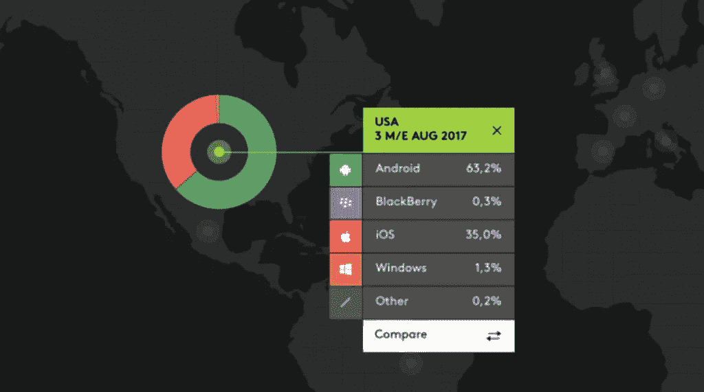
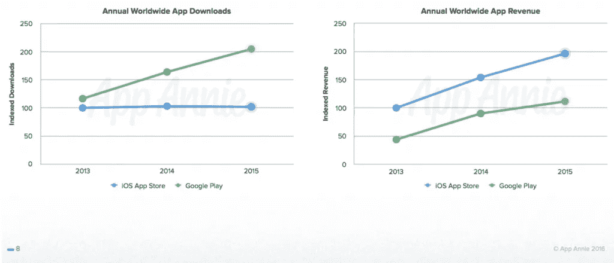
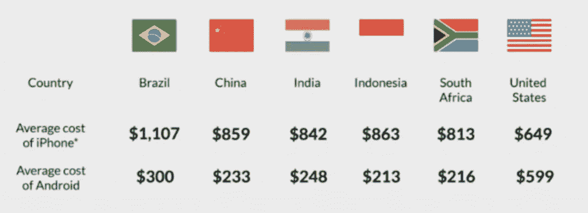

# 结束辩论:创业公司应该使用 iPhone 还是 Android 应用程序？

> 原文：<https://medium.com/swlh/ending-the-debate-should-startups-launch-with-an-iphone-or-android-app-99f60fc49910>

苹果还是安卓？

这是一场持续多年的辩论。企业主、软件开发人员、营销人员、大学生、销售人员、医生、爱书人、讨厌书的人…

无论你是谁或做什么，你要么是 iPhone 用户，要么是 Android 用户。

没有中间地带。

如果你的一个朋友甚至建议你放弃心爱的 iPhone，转而使用最新的三星 Galaxy，你们的友谊很有可能会破裂。有两个部落，不能一边一只脚。

看看这则取笑 iPhone 及其用户的三星广告吧:

想想你的朋友、同事和你上班路上遇到的陌生人。他们站在哪一边？他们是苹果队还是安卓队？

你认为哪一方正在赢得移动军备竞赛？

嗯，苹果最近一直在崛起…

在 iPhone 8 和 8 Plus 发布之前，苹果在美国取得了显著增长，[整体市场份额跃升近 4%](https://techcrunch.com/2017/10/13/ios-and-samsung-market-share-now-tied-in-the-u-s/)。这一跃升让他们与三星打成平手，表面上看起来令人印象深刻。这意味着苹果即将成为老大，对吗？

不完全是。

现实是这样的:

Android 仍然是第一，甚至还没有接近。

仅在美国，[安卓占有大约 63%的市场](https://techcrunch.com/2017/10/13/ios-and-samsung-market-share-now-tied-in-the-u-s/)，而苹果仅占 35%。

每碰到一个 iPhone 用户，就有两个 Android 用户舒服地嘲笑那些信誓旦旦的 Siri 和 iOS。也就是说，你，一个出色的初创公司创始人或开发者，不应该问你的朋友认为哪种设备更适合他们。你应该问的问题是:

# 哪种设备最适合你和你的创业公司？

表面上，你可能认为答案是显而易见的。

Android 市场份额> iOS 市场份额，因此 Android 胜出。

当然，这个等式并不那么简单。不仅仅是用户总数的问题；这里还有一些其他的变量需要考虑。在我们深入研究这些变量到底是什么之前，让我们把问题向前推进一步:

# 你应该投资这两种设备，还是专攻其中一种？

在大多数情况下，简单的答案是两者都有，但前提是你有足够的资源来实现它。

当你为 iOS 和 Android 开发一个移动应用程序时，你就进入了这两个市场，并允许近 99%的智能手机用户访问你的应用程序。你可以获得双方的利益。

不幸的是，你只有这么多的开发人员，让他们把注意力从你的核心产品上转移可能是不可能的，或者说现在对你的业务来说是正确的。

因此，即使你最终计划发布一款适用于两种操作系统的应用，你也需要决定先走哪条路，这又把我们带回了最初的问题…

哪种设备最适合您和您的企业？

在你一头扎进一个或另一个市场之前，考虑以下三件事:

# 1.苹果应用通过应用内购买产生最大的收入

虽然苹果应用商店中的移动应用的市场份额可能较低，但它们通过应用内购买产生的收入要高于安卓应用。事实上，仅游戏应用在 2015 年 12 月就创造了超过 10 亿美元的收入。

这意味着 iPhone 用户比 Android 用户更有可能进行应用内购买或升级到高级订阅。

虽然市场上安卓应用的数量在稳步增加，但它们产生的收入仍然落后于苹果应用商店的应用——截至 2016 年，苹果应用产生的收入比谷歌 Play 商店应用多 75%。

# 2.新兴市场正专注于安卓系统

当谈到亚洲、非洲和南美洲的新兴市场时，Android 稳坐榜首，这与价格和可访问性有很大关系。

截至 2015 年末，安卓在巴西和印度[的市场份额高达 90%](http://blog.jana.com/blog/2015/09/10/apple-cant-touch-androids-market-share-in-emerging-markets) 。

在这些国家，Android 设备比 iPhones 更实惠。

在许多新兴市场，iPhone 的价格几乎是 Android 设备的四倍。当你考虑这些国家的平均收入时，就不难看出为什么他们的居民会涌向 Android 了。

考虑到智能手机用户通常会变得多么忠诚，Android 的早期市场主导地位将很难与苹果竞争。

# 3.为苹果开发一个应用程序更加一致

如果将 Android 应用程序开发与 iOS 开发进行比较，在兼容性和一致性方面有明显的领先优势。

因为 Android 是一个开源项目，所以很难确保你的应用程序在所有设备上兼容。对于苹果来说，这种兼容性更加一致——当你为一个 iOS 设备开发东西时，它通常可以在所有设备上运行。

仅这一点就能在开发过程中为您省去一大堆麻烦(更不用说时间了)。

所以我们的问题是:苹果还是安卓？

从各方面考虑，这不是一个容易的决定。如果您仍在努力选择立场，我们很乐意帮助您找出最适合您和您的企业的方式。

[今天就联系我们](http://content.mindsea.com/schedule-your-free-meeting-with-our-product-strategist)，我们会告诉您哪种操作系统最适合您的需求。

你们是苹果队还是安卓队？请在下面留言告诉我们你站在哪一边，为什么。欢迎热拍。

*原载于 2018 年 3 月 5 日*[*【www.mindsea.com*](https://www.mindsea.com/iphone-or-android-app/)*。*

## 这篇文章发表在 [The Startup](https://medium.com/swlh) 上，这是 Medium 最大的创业刊物，有 303，461+人关注。

## 在此订阅接收[我们的头条新闻](http://growthsupply.com/the-startup-newsletter/)。

