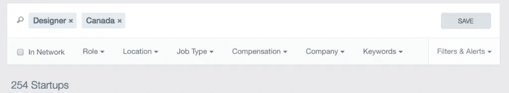
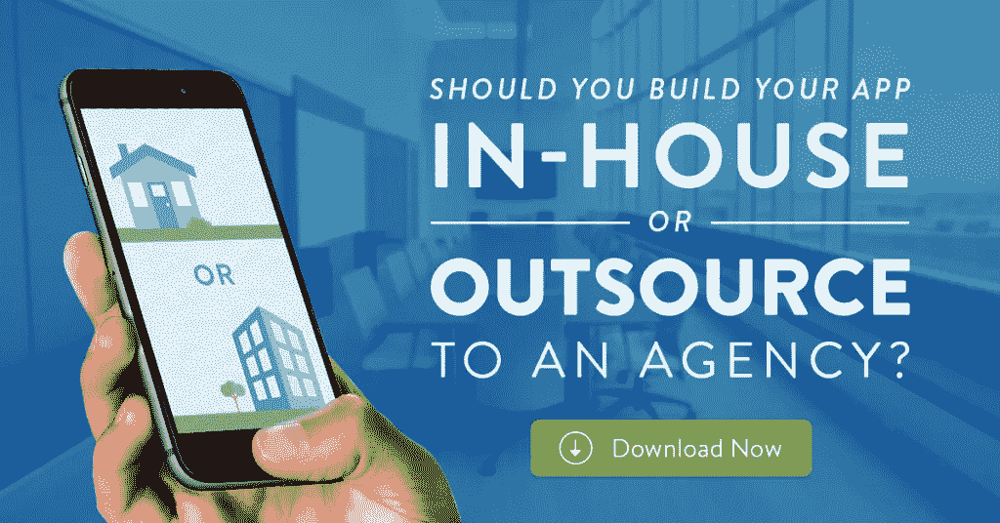

# 结束争论:创业公司应该外包设计还是雇佣设计师？

> 原文：<https://medium.com/swlh/ending-the-debate-should-startups-outsource-design-or-hire-for-it-e913333ec1db>

我想你会同意我说的创业很难。

掌舵的人必须身兼数职，必须不断寻找机会，才能走得更远。随着创业公司的竞争越来越激烈，寻找优秀人才也变得越来越困难。

因此，创业公司正在寻找任何地方和任何地方来建立他们的团队。早期的团队活力无疑是未来成功的最重要指标之一。这就是为什么许多创始人在开始规划招聘路线图时会问一个简单的问题:

***我们应该外包设计吗？***

这是一个在创业社区激烈争论多年的问题，尤其是在推出移动应用的公司之间。有一些成功的创业公司外包了他们的移动应用程序设计*和*的例子，这些创业公司通过内部设计团队取得了成功。那么，一家初创公司如何决定[是雇佣还是外包](http://www.mindsea.com/2016/11/mobile-app-inhouse-outsource/)设计呢？

我们已经看到这两种策略都奏效了。因此，在这篇博文中，我们将讨论外包你的移动应用程序设计有意义的场景，以及雇佣一个设计团队可能会更好的场景。

我们开始吧。

## 创业公司为什么需要设计师？

首次创业者在寻找设计师时犯的最大错误是不知道设计师在团队中的角色。因此，我们看到很多创始人雇佣的人的专业技能与创业公司的需求不匹配。平面设计师和 UX(用户体验)设计师不是一回事。一个有 10 年印刷经验的设计师可能不太适合你的移动应用。

在你决定是否外包设计之前，你需要明确你需要什么类型的设计师。如果你不确定在招聘设计师时应该寻找什么，不要害怕接触同行或在论坛上提问，如黑客新闻或 Reddit 上的/r/Startups。另一个获得求职洞察力的好地方是 AngelList 上的求职网站。要利用 AngelList，注册并在搜索栏中输入“设计师”:

从那里，你会看到一份与初创公司设计角色相关的工作清单。寻找和你处境相似的创业公司，看看他们招聘的技能种类。使用这些信息来更好地了解你现在需要的技能和你将来可能需要的技能类型。

# 你应该雇佣设计师还是外包？

当你考虑是外包设计还是请设计师时，有三个主要因素会影响你的选择:成本、时间和行业。让我们来谈谈每一个因素以及它们对你决策的影响。

# 考虑预算因素

在创业公司中，保持低成本是最重要的因素之一。如果你已经筹集了种子资金或者有天使投资人，你也许可以雇佣一名设计师来加入你的创始团队。许多初创公司——包括 Airbnb 和 Twitter——都采取了这种方式，但并不是每个初创公司都负担得起。

初创公司通常会考虑外包设计，因为他们认为这是一种更具成本效益的方法，而且不会带来工资或股权等长期支出。如果资金紧张，最好请一个雇佣的人或者一个有创业经验的机构来帮你实现你的想法。

记住:如果你的预算迫使你雇佣未经考验或缺乏经验的人才，你就将你的创业公司置于危险之中。无论你决定外包还是雇佣设计师加入你的团队，这都是事实。你可能会收到不符合要求的设计，或者浪费时间在让你头疼的人才身上，而不是高质量的工作。这让我想到了下一点…

# 考虑时间因素

雇佣一个新的设计师来让你的应用变得生动可能是一个巨大的时间承诺。如果新设计师没有创业经验，或者没有达到你最初的期望，事情可能会很快变得很糟糕——项目很可能会因为设计师无法执行你的想法而被推迟。

如果你将设计外包给不是专家的人，这种情况也会成为一个问题。你不会相信有多少次我们不得不帮助创业公司解决一个烂摊子，因为他们聘请了他们最好的朋友的表弟来设计他们的应用程序，而不是聘请专家来开始。你知道他们说什么:

*“如果你认为聘请专业人士做这项工作很贵，那就等到你聘请业余人士的时候吧。”*

如果你想降低雇佣没有经验的人的风险，请[下载这个免费的问题清单，在雇佣他们之前，你应该问潜在的合作伙伴](http://content.mindsea.com/app-agency-checklist)。

如果你能雇佣一个在像你这样的项目上有丰富经验的公司或设计师，这种关系就是黄金。除了带来出色的体验，外部机构或设计师可以在几周内从最初的会议转向实际的设计和原型。我们的[蓝图流程](http://www.mindsea.com/blueprint/)采用了一种加速的方法，因此我们已经帮助许多客户在几天内从草稿变成了原型。

# 考虑行业因素

当你做这个决定时，最后一个值得考虑的因素是竞争格局。像广告业这样的行业将比像学术界这样的行业更重视设计。如果你进入了一个设计不那么重要的行业，你的技术团队有可能会做出一个成功的界面。如果你要进入一个以高质量设计为标准的行业，显然你必须引进设计人才才能成功上市。

关键不在于找到能让你的产品漂亮的人；关键是找到一个能解决问题的设计师或设计团队。一个好的设计师和一个伟大的设计师之间最大的区别是他们能够在你要求他们做的之外增加价值。最好的设计团队会在你发现之前就发现你入职流程的问题，并向你展示一种更好的方法，让你在竞争中脱颖而出。

# 包装东西

多年来，我们已经看到许多初创公司采取不同的途径来寻找正确的设计解决方案。像 Medium.com 这样的公司雇佣了代理公司，并取得了巨大的成功，而脸书这样的公司则把工作留在了公司内部。这完全取决于你的情况，但这场辩论的结论很简单:

是的。

创业公司可以也应该在有意义的时候外包设计。在某些情况下，你可能不需要雇佣第三方来全程指导你。例如，我们在他们的移动应用程序上与 [Proposify](http://www.mindsea.com/case-study/proposify/) 设计团队密切合作，但在我们帮助他们创建高保真原型后，他们的团队开始将最终产品投入使用。

如果你正在激烈的争论中，想知道外包是否适合你，请联系我们！ [**我们很乐意聊天。**](http://content.mindsea.com/schedule-your-free-meeting-with-a-senior-app-strategist)

想知道更多关于你是应该自己开发应用还是外包给代理的信息吗？

查看我们深入的资源，深入了解您需要了解的一切。

## 这篇文章发表在 [The Startup](https://medium.com/swlh) 上，这是 Medium 最大的创业刊物，有 295，232+人关注。

## 订阅接收[我们的头条新闻](http://growthsupply.com/the-startup-newsletter/)。

