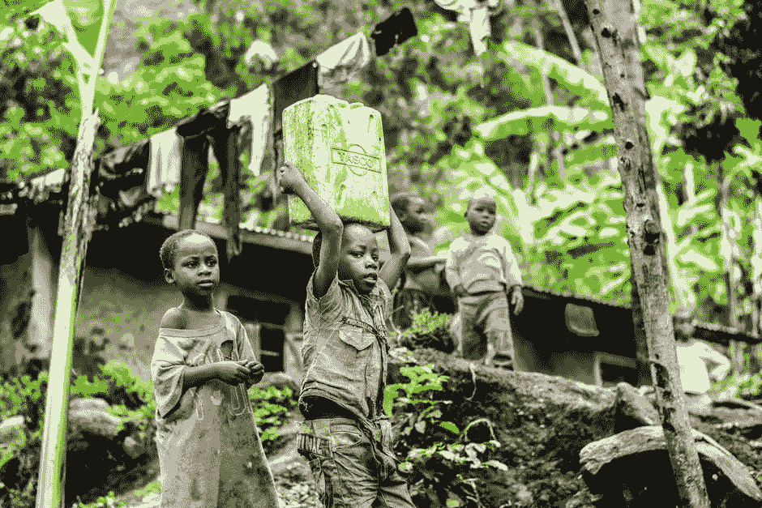
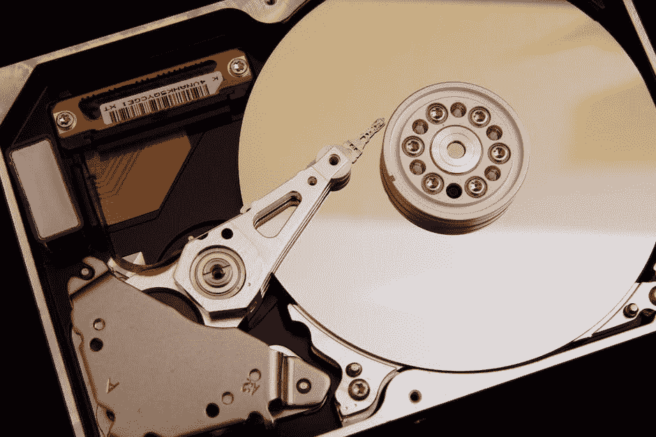

# 能源效率和安全性

> 原文：<https://medium.com/swlh/energy-efficiency-and-security-b2b7222988df>

本文原文使用 [CloudBurst](https://github.com/CurbShifter/CloudBurstDAPP) 存储在区块链上，可以从以下 CloudBurst ID 获取:CLOUD-9VRC-MB5N-SN6Q-HEEJS。

How every ICO sees it’s beginning as to save the world from fiat!

# **第一世界思维**

我们经常讨论经济系统是如何开始的，以及与加密货币相关的自然事物。我认为，我们打算“帮助”引入加密货币的这些地区到底发生了什么，这经常被误解。我想首先说明为什么这个问题在这个群体中经常被广泛误解，而且每次我去参加活动时，这个问题都更加相关。从这一点开始，我将回到加密货币所代表的一些核心基本面，有些人可能会觉得这令人不安，但我们不要对历史上最淫秽的“去你妈的”低头。但是，我们也不要忘记技术必须适应人们的需求。

当然，理解分散分类账的最初尝试中存在的问题是值得注意的。我想指出的是，这些事情的危险也是我们想要帮助的这些地区的人们面临的现实风险。

Actual environment in which use of cryptocurrency would benefit the people by not relying on fiat.

# **比特币**

比特币代表了一种方法，在这种方法中，使用加密功能保持建立在网络参与和挖掘基础上的分类账系统。这是理解比特币固有核心价值的关键。这代表了自货币问世以来，我们作为人民在历史上第一次；拥有一种我们可以直接对其结果做出贡献的货币，以及针对制度化银行体系的制衡体系。一段时间以来，散列法的大幅上涨现已稳定下来，这将使比特币开采变得稍微更加实用，但在委内瑞拉或非洲等地区仍非常危险。

然而，比特币的引入确实给这些地区的一些个人带来了严重的担忧。它引入了对电力系统的严重依赖，并且为了操作任何工作证明硬币，你将需要非常大量的电力。对任何密切监视其人民的人来说，大量使用电力通常是一个危险信号。即使在美国，这种情况也经常发生在执法部门，通常是在室内大麻种植场的愚蠢战争中。

# **工作证明的危险**

在世界上一些服务最不发达的地区，使用 ASIC 或 T2 GPU 是一种高风险。你可能会笑，但你真的应该考虑没有良好的电力基础设施或独裁的国家。电力不是免费的，它通常是任何优秀的情报机构在使用时首先监控的东西。这通常是一个政权发现反政府组织或者在某些情况下[矿区](https://news.bitcoin.com/mining-round-up-venezuelan-authorities-raid-miners-taiwanese-miner-shot-for-debt-to-investors-estonian-wind-farm-starts-mining/)和个体[矿工](https://hackernoon.com/extortion-police-raids-and-secrecy-inside-the-venezuelan-bitcoin-mining-world-6e97a25e7402)的方式。让我们不要忘记，在这些环境中，当权者也非常希望阻止那些试图挑战权威的人。

[人们必须真正理解，住宅或企业的大量用电可能会危及他们的生活和他们所爱的人。如果有一种方法仍然可以在本地和全球范围内使用一种货币，几乎任何人都可以在不披露他们正在挖掘加密货币的情况下挖掘这种货币，那会怎么样？从而允许他们使用不依赖于第三方的硬币，并且也可以在全球范围内使用，而不需要大量的电力使用，这可能危及他们的安全。](https://www.cnbc.com/2017/08/30/venezuela-is-one-of-the-worlds-most-dangerous-places-to-mine-bitcoin.html) [Burstcoin](https://burst-coin.org) 允许低功耗采矿。这为改变经济体系开辟了道路，而不需要空投物资。个人可以利用他们已经拥有的硬盘开始采矿。我们经常尝试谈论运营安全，所以让我们在了解这一点的基础上真正展开对话。

All hdd, sdd, or any incantation of storage media could be mined.

# **能力证明**

[Burstcoin](https://burst-coin.org) 使用容量证明作为共识，从而允许挖掘硬盘空间。这使得任何人都可以在不使用大量电力的情况下采矿，并开辟了使用突发钱包提供的通信信道的途径。通过保持不信任，网络可以相应地适应人们的需求。这为经济系统提供了必要的灵活性和伸缩性。通过使用一个共识，任何人都可以用一个硬盘来采矿。这降低了准入门槛，也不会影响用户订购驱动器。我提到了几年前的一个[事件](https://www.techdirt.com/articles/20140124/10564825981/nsa-interception-action-tor-developers-computer-gets-mysteriously-re-routed-to-virginia.shtml)。随着情报机构的发展，他们通常会囫囵吞下人们正在命令或做的事情，这样你仍然可以挖掘，而不会损害你打算挖掘的信息。有了这个硬盘驱动器也不需要每次更换新的模式出来，在采矿过程中具有竞争力。这允许挖掘器和节点在未来以很少的基础设施继续良好运行。从而加强网络并提供更多的节点来保持分类帐的分散。

这为个人提供了最大的好处，因为他们也可以在他们使用加密货币的发展过程中对什么是需要的或不需要的有发言权。在使用公共链时，他们还可以使用 CloudBurst 等工具，这些工具允许使用实际的链上存储，这可以用于开始存储财产契约和其他有价值的信息的服务，以防止篡改纸质系统。这也可以为钱包的其他功能打开大门，这些功能可以作为替代品用于创建经济系统。

我还想指出一些经常被忽视的突发的额外好处。与可以浏览 jack 和 mine 的工作验证算法不同，使用 Burstcoin，他们需要重新绘制驱动器。这也适用于您的设备被盗的情况。驱动器将需要被重新放置，或者如果它们被开采，它们将继续提供奖励给从其取出驱动器的个人。然而，任何人都可以更改配置。此外，在极端情况下，驱动器可以被删除，并且在需要检查的情况下不会成为红色标记。如果我们想真正讨论操作危险和操作安全，让我们但是请不要天真地理解技术是如何工作的。

# **硬道理**

我被问了很多关于我如何设想委内瑞拉采用加密货币的问题，以上是在某些环境下需要采取的确切方式。这就是技术允许自己被用于这些类型的场景的地方。我们应该使用合适的工具来完成这项工作，我不希望任何人出现上述情况，我也为你和你的家人感到难过。这里提供的信息是为了让你可以开始探索如何理解加密货币的观点。比特币的诞生并不是为了回到过去，创造一堆 ICO，让你 KYC 自己成为未来的一部分。老实说这应该是第一个危险信号。它提出了一个变化，表明人们可以操作他们的金融系统。Burstcoin 代表了这样一种方式，它既不会损害工作证明所提供的功能，又能保护用户免受大量用电的影响。

## 这篇文章发表在 [The Startup](https://medium.com/swlh) 上，这是 Medium 最大的创业刊物，有+396，714 人关注。

## 订阅接收[我们的头条](http://growthsupply.com/the-startup-newsletter/)。

