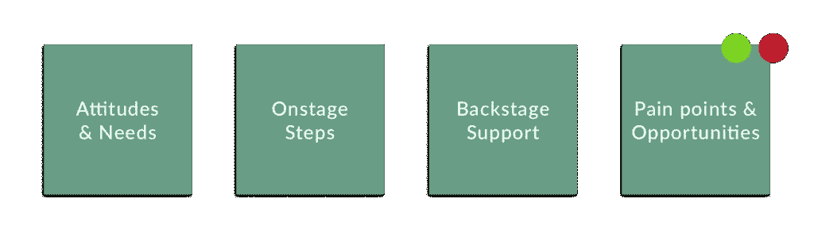

# 用旅行地图吸引您的客户

> 原文：<https://medium.com/swlh/engage-your-customers-with-journey-maps-59575929b8d6>

“没有产品是一座孤岛。产品不仅仅是产品。这是一系列紧密的、完整的经历。考虑产品或服务的所有阶段——从最初的意图到最终的反思，从第一次使用到帮助、服务和维护。让它们无缝地协同工作。这就是系统思维。”—唐·诺曼

为了设计和实施整体创新的解决方案，我们动量设计实验室的团队不断努力在我们的设计过程中实践换位思考。一种方法是创建客户旅程地图。

## 这么多术语，这么少时间。

在我们深入细节之前，让我们先奠定基础。根据交互设计基金会的说法，客户旅程图是一种可视化工具，包括客户与产品或服务的关键交互、他们的感受、目标和机会领域。它用于假设一个产品将如何被获取、使用和整合到该产品的大环境中。这里有一个例子:

## 太好了，但是为什么要采用它呢？

**1。理解系统中抽象和隐藏的关系。**

客户旅程图植根于以人为中心的设计，这是一种依赖于同理心的实践。作为以人为中心的设计师，我们必须为端到端的用户体验进行思考和设计，这些体验受到服务或产品所属的系统的不同部分和阶段的影响。

*Oracle . CX Journey Mapping Workshop . designingcx.com*

**2。在影响实际体验的人群中建立直接的客户共鸣。**

数据往往无法传达客户的挫折和经历。另一方面，故事可以做到这一点，在商业和设计中，最好的讲故事工具之一就是客户旅程图。它不仅可以用来与用户互动，还可以成为组织通过团队内的联系、合作和协调来了解更多客户的强大方法。

**3。鼓励富有成效的讨论。**

客户之旅应被视为一份活文档。它可以在项目的早期创建，也可以在后期创建，作为用户测试的一部分来比较和分析体验。奥斯汀设计中心的创始人兼主任 Jon Kolko 在他的书*关于交互设计的思考*中写道，这些地图经常能够“非常有效地鼓励对异常案例的讨论，比如失败、误解或产品退货”。

## 我们既是空谈者也是行动者——以下是我们在动量设计实验室的做法:

**1。研究:**

所做的定性和定量研究的程度因项目而异。之后，开始创建一个所有接触点的列表:客户在寻求满足特定需求和目标时与品牌内外的互动点。

**2。合成:**

与你的团队合作，讨论和假设在经历的每个阶段可能会发生什么，并将它们分成逻辑部分:思考、感受、行动。

**3。讲个故事:**

你要突出机会领域，并使用视觉设计的基本原则，如对比和色彩理论，以吸引人们对你试图传达的东西的注意。

## 有一点要记住…

如果你试图取悦每个人，你不会取悦任何人。

通过传达对顾客行为和互动的深刻理解，我们设计流程的构思阶段允许更有针对性和创新性的想法出现，以适应环境。为有意义的体验而设计需要专注。旅行地图可以帮助我们理解和诊断体验问题，以便重新构建和想象新的体验。

## 要点:

把它当工具用。给你单位的人看看。通过添加新的便利贴来丰富多彩，包括编辑或新发现。我们的最终目标是通过理解复杂系统并不断采用最佳工具来为客户提供最佳体验。

最初发布于 momentumdesignlab.com 的[，作者 Rawan Koeissi](http://momentumdesignlab.com/engage-your-customers-with-journey-maps/)

## 这篇文章发表在[《创业](https://medium.com/swlh)》上，这是 Medium 最大的创业刊物，有 289，682+人关注。

## 在这里订阅接收[我们的头条新闻](http://growthsupply.com/the-startup-newsletter/)。

