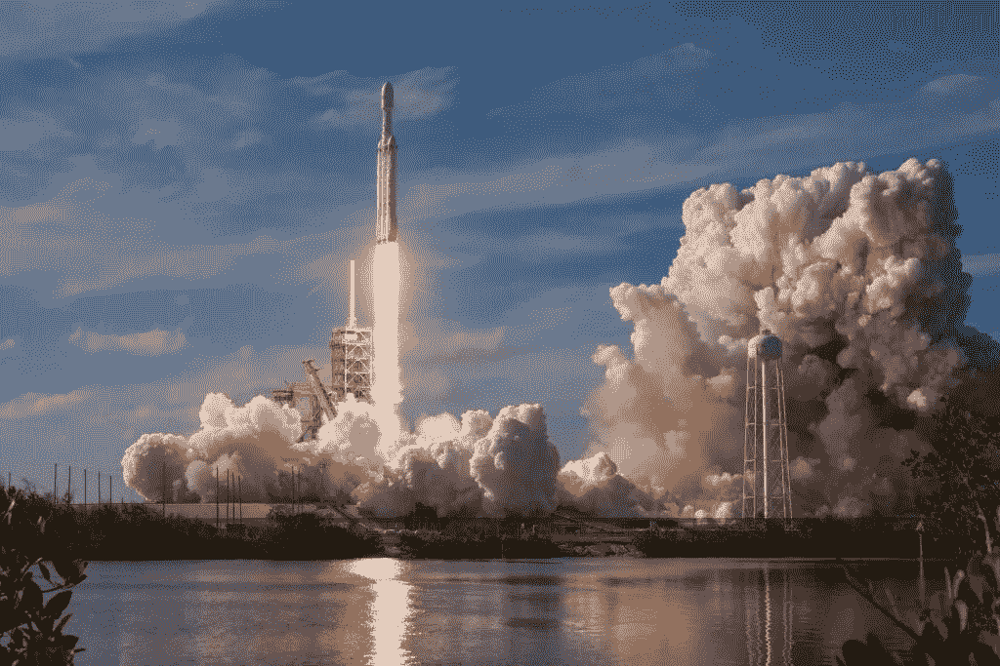

# 策划一次成功的产品发布

> 原文：<https://medium.com/swlh/engineering-a-successful-product-launch-63737833a5d7>

## 如何不做导致大爆炸的大爆炸

Photo by [SpaceX](https://unsplash.com/photos/OHOU-5UVIYQ?utm_source=unsplash&utm_medium=referral&utm_content=creditCopyText) on [Unsplash.](https://unsplash.com/search/photos/launch?utm_source=unsplash&utm_medium=referral&utm_content=creditCopyText)

# 慌，慌！

这是发射的前一天。

工程团队看起来很紧张。他们的桌子上、垃圾桶里和地板上都有空的外卖咖啡杯。凯莉无精打采地趴在键盘上，透过手指看着显示器。这是…