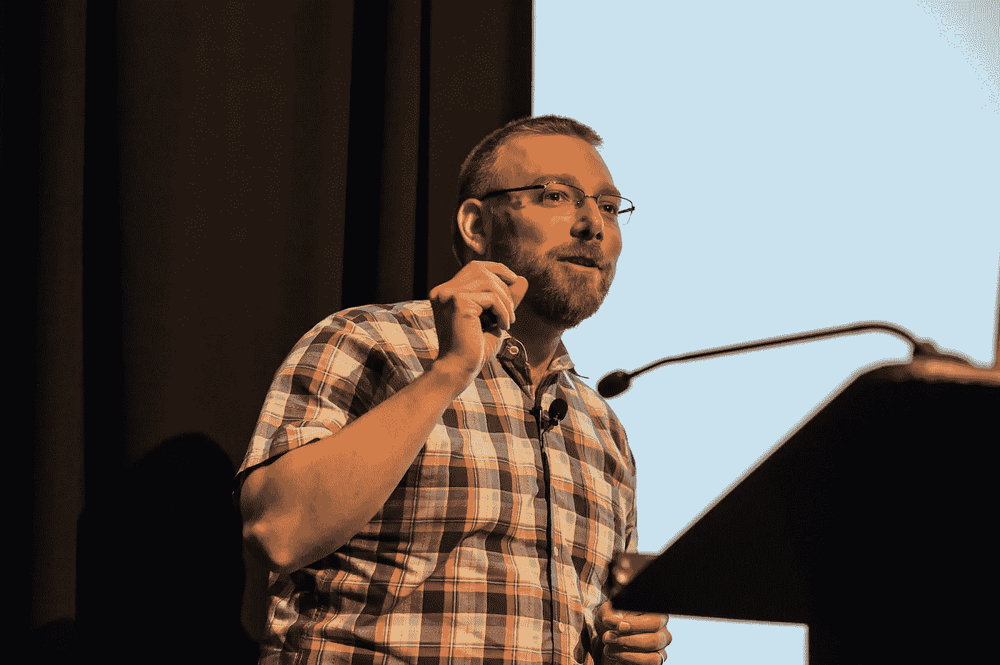
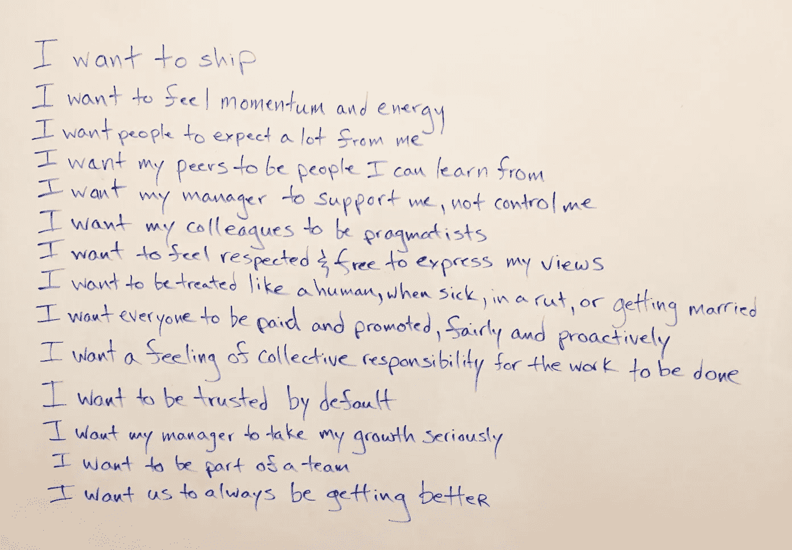

# 像工程师一样思考，建立一个健康的组织

> 原文：<https://medium.com/swlh/engineering-your-way-to-a-healthy-organization-7dc8eb8d4d83>

## Greenhouse 的工程副总裁分享了一个定义团队结构、价值观和文化的框架

扩大公司规模最困难的事情之一是有效地发展你的团队。从这个角度来看，迈克尔·布福特有点与众不同。2012 年，他被聘为[温室](http://www.greenhouse.io/)的第一名工程师，此后他的团队扩大到 60 名工程师，为 2000 家公司开发和管理软件。他这样做几乎没有任何自愿的损耗。

他成功的关键是什么？事实证明，工程师们拥有完美的技能组合来弄清楚一个团队——它的结构、价值观和文化——应该是什么样子。

> 工程师们有一套设计系统的系统，他们所学的过程可以应用于从软件到组织的任何东西的构建。

无论你是否是工程师，你都可以使用迈克在[first mark 2017 年首席技术官峰会](https://hackernoon.com/leadership-tips-for-ctos-46c3b565bd52)上概述的流程来帮助你深思熟虑地扩大业务规模。

## **第一步:定义问题**

识别问题或需求是任何工程问题的第一步，也是设计一个伟大组织的第一步。对于后者，Mike 建议敲击白板，就你想加入的理想公司进行一些头脑风暴。

列出你理想工作场所的所有方面:无论你是初级开发人员、中层经理还是高管，你的组织整体应该是什么样的？答案会因你个人的目标和价值观而异。

为了指导您，下面是 Mike 为 Greenhouse 定义的“开发者乌托邦”:

现在，将你的目标提炼为一个定义性的陈述，包含列表中最重要的价值观。迈克的定义陈述是:

> 雇佣并保留一个稳定的、自我修复的高质量软件工程师团队，他们高效、不断改进、授权并相互尊重。

你选择的咒语将锚定你的想法，并作为剩下的过程中的指路明灯。

## **第二步:需求收集**

为了提取需求，从第一步开始回顾你的工作。从你的问题定义——你的定义陈述——你可以找出实现它的必要条件。

根据他的定义性陈述，Mike 的要求变成了:

*   我想**聘请** **高素质、受人尊敬的软件工程师**
*   我想**保留一个稳定的团队**
*   我希望我的团队**不断进步**
*   我想要一个**授权和自我修复的团队**
*   我希望我的团队能够**高效**

在需求收集过程中，了解自己的局限性是很重要的。如果你无法支付谷歌的薪水，也无法用奢华的便利设施吸引求职者，那么你就必须用其他东西来说服他们。可能是你的公司愿景，或者给员工更多自主权。

考虑这些关于你的局限性的问题:

*   我的预期输入和输出是什么？
*   我有多少时间…我是早期还是晚期公司？
*   我得花多少钱？
*   有我正在寻找的人才供应吗？
*   考虑到这些因素，我的期望现实吗？
*   这是最迫切需要解决的问题吗？

想想你的约束如何影响你能做什么，然后相应地优先考虑你的需求。

## **第三步:勘探和设计**

拿出你的优先需求，并开始询问每一个问题。一个特定的要求将如何影响员工？将使用哪些指标来衡量成功？你在创造你想要创造的东西吗？

从一个关键需求开始，把它分解成越来越小的模块，直到你一直分解到功能层。

*Breaking down one of Mike’s key requirements to the function level.*

通过将所有微小的决定结合起来，你将会制定出一个创建理想组织的策略。

> 这不仅仅是你的组织结构图；这是你的价值体系，你的释放过程。而是你奖励的，无视的，骂的。所有这些都可以用你设计程序的方式来定义。

Mike 强调，在此阶段让其他团队成员参与进来至关重要。你的团队对你作为经理所做的决定也有很深的兴趣，可以帮助你过滤掉任何坏主意。

不要忘记在其他公司寻找灵感。看看他们做对了什么，如何解决类似的问题。设计模式是存在的，你不需要为每一个需求重新发明轮子。

## **第四步:实施**

一旦你回答了你的问题，设计了你的结构，是时候实施了。对 Mike 来说，他首先建立了基本的界限、流程和协议，包括:

*   总是在进步
*   在交流中要尊重对方
*   确保定期进行职业发展对话
*   支持来自前线的变革
*   经理为工程师工作

你的出发点对你的愿景来说是独一无二的，你不可能一下子实现所有的事情。从你的 MVP 开始——在这种情况下，最小可行的产品是一个你可以用来建立反馈的简单过程。

请记住，并不是所有事情都容易回滚。在开始时要注意你选择设定的文化标准，因为其中一些将成为基础。例如，如果你不一开始就强调对客户的完全透明，可能很难改变这种问责文化。

## **第五步:验证**

通过召开回顾会、一对一会议和询问关于组织的哪些部分正在工作、哪些部分没有工作的探索性问题，定期获得团队反馈。所有这些都将提供有用的反馈和验证，因此您可以做出正确类型的更改和权衡。

Mike 还建议利用数据。查看指标，例如:

*   你的流失率高吗？
*   工作完成了吗？
*   你能继续运输吗，还是一切都停止了？
*   人们看起来快乐吗？

发出带有具体提示和问题的调查问卷，以了解具体情况，尤其是在较大的群体中。最后，迈克说，继续迭代！重复是你提高和发展你强大、健康的组织的方式。

*温室在 FirstMark 组织的一次活动上发言。要获得更多关于扩大公司规模的有用建议，请点击* [*点击这里*](http://firstmarkcap.com/driven/) *参加我们的下一次公共活动。*

## 这篇文章发表在 [The Startup](https://medium.com/swlh) 上，这是 Medium 最大的创业刊物，拥有 274，707+读者。

## 在此订阅接收[我们的头条新闻](http://growthsupply.com/the-startup-newsletter/)。

