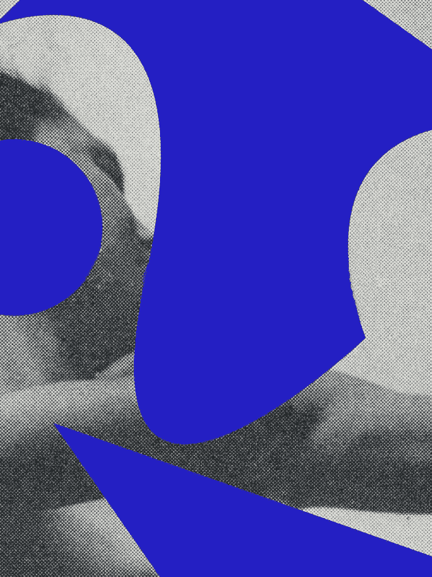
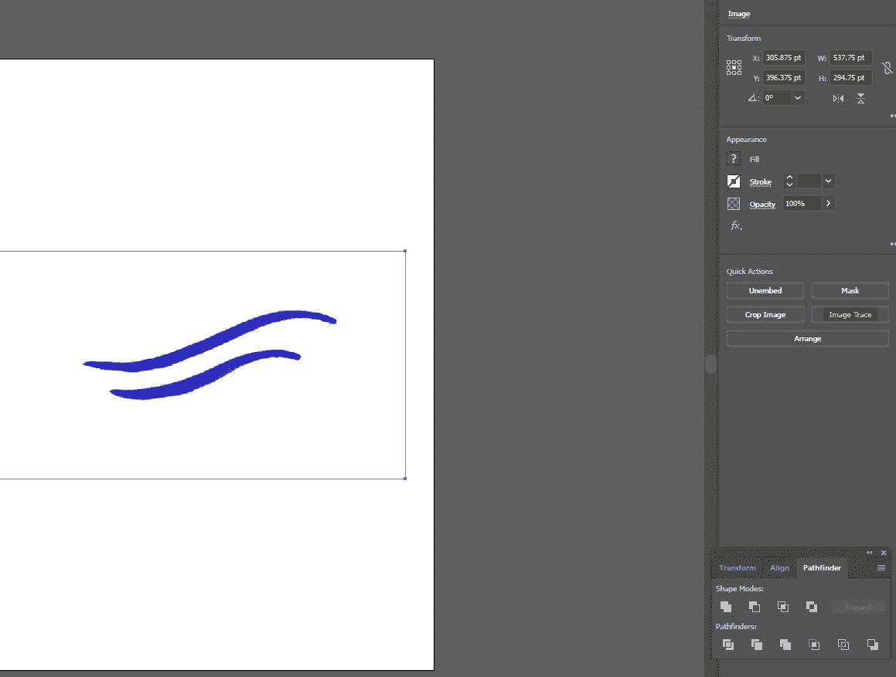
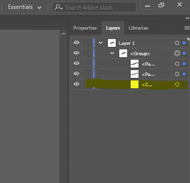
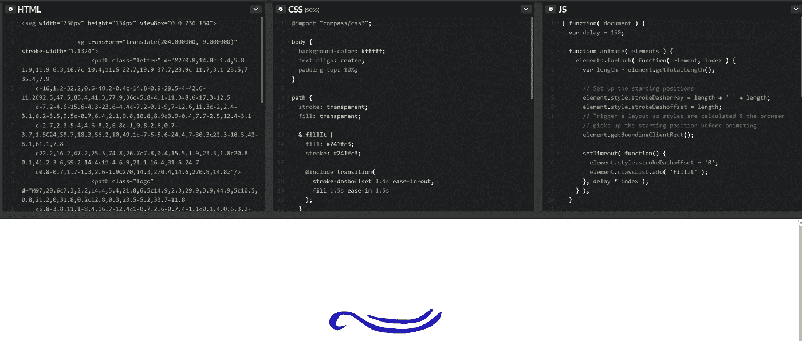
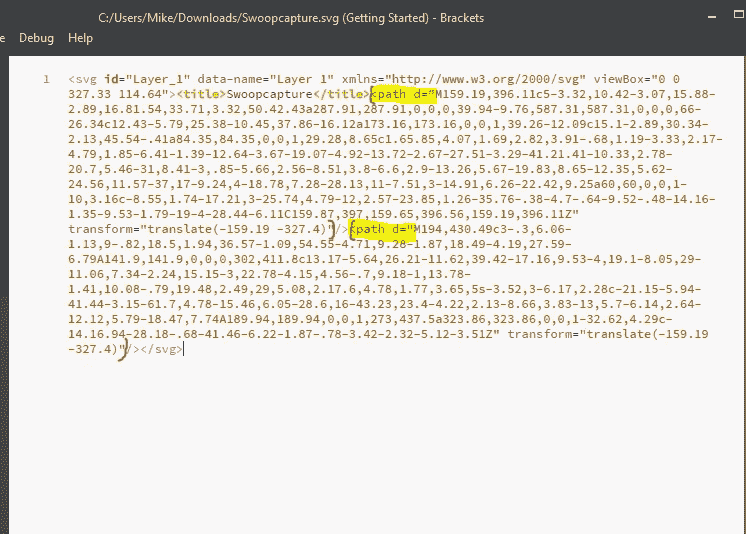
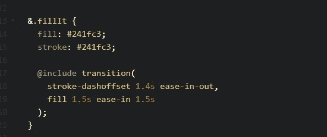
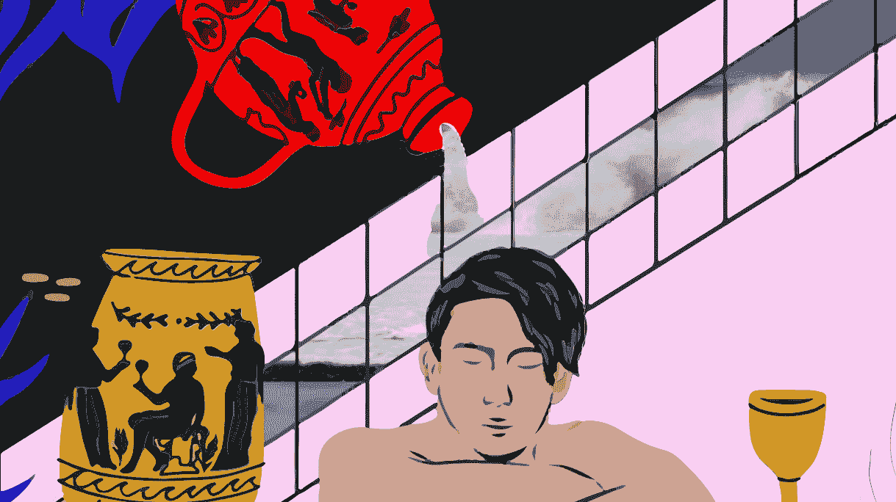
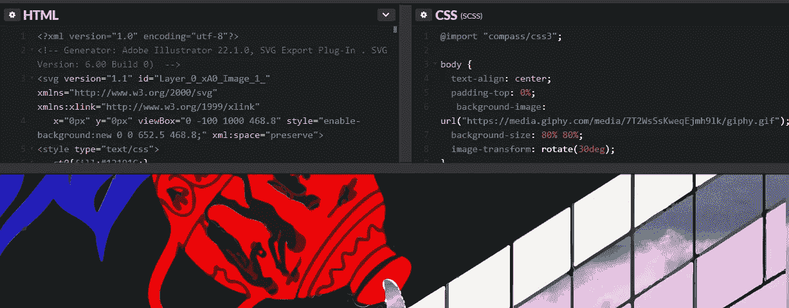
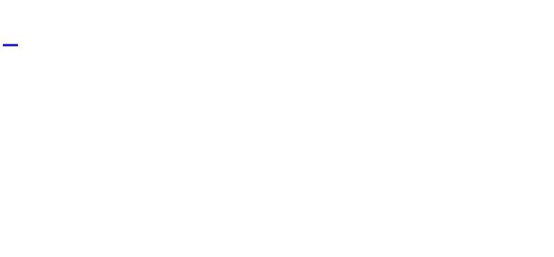
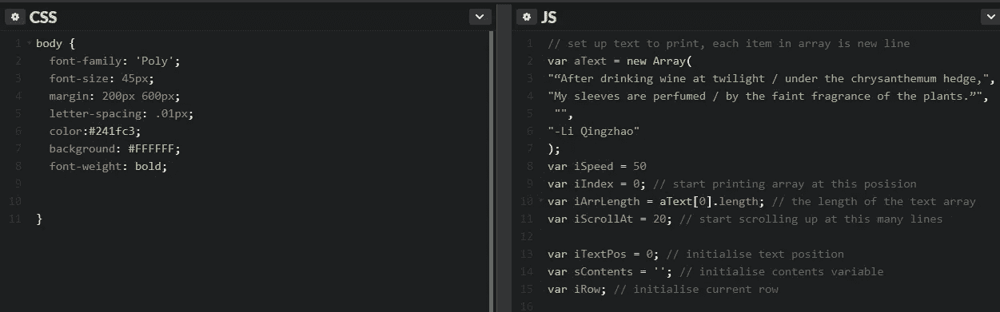

# 增强媒体的设计过程

> 原文：<https://medium.com/swlh/enhancing-mediums-design-process-d8126ef986d0>

## 使用 SVG 动画使媒体栩栩如生

如果你还不知道，我是一个媒体迷。这个平台对作者来说是民主的，对读者来说是特别设计的，算法是为设备兼容性/SEO 量身定制的。

随着媒体平台的扩展，一份出版物引起了我对一个特别漂亮的版面的兴趣: [*【不羁的身体】*](/s/unrulybodies/the-body-broken-by-alcohol-42e2d2ac86d) *。*

虽然微妙，但设计技巧——引用、分隔和图形——非常诱人。当我通读的时候，我想象着如果页面上的艺术真的能活过来会是什么样子。

我还知道可以使用 HTML/CSS/JS 中的 web 开发技巧来制作 SVG 动画，给静态图像注入一定程度的活力。

Codepen.io 展示了大量可能的演示，因此帮助我修补了一些简单的技术来制作*难以驾驭的身体*图形。

因此，用最少的代码，一个作家可以很容易地动画他们的博客。

我们将使用的应用程序有: [Codepen.io](http://codepen.io) (为我们的 SVG 制作动画的 HTML/CSS 编辑器)；[ScreentoGIF](http://www.screentogif.com/)(将&编辑的 SVG 动画录制成 GIF)，以及 [Adobe Illustrator](https://www.adobe.com/products/illustrator.html) (创建 SVG 图像)。

与 JPG 或 PNG 图像不同，SVG 很容易用 CSS/JS 操作。因此，这个过程的第一步是用 Adobe Illustrator 打开一个图像，使用 Image Trace(为了简单起见，我选择了黑白),然后展开，以便准备 SVG。

这将图像分成不同的路径。跟踪这些路径使您可以在以后轻松地操作零件。

图像描摹完成后，请务必删除图层部分中徽标周围空白区域对应的路径。对于这样一个简单的例子，这就是我们在导出为 SVG 之前需要做的所有事情。所以接下来，单击 File->Export as，并指定 SVG。

现在，是时候打开一个 Codepen 模板了。人们已经发布了数以千计的 SVG 动画示例，您可以在掌握基础知识的同时进行搜索和修改。我们将首先使用这个简单的例子，你可以自由编辑。对于不熟悉的人来说，它看起来很混乱，但只需几个参数就可以轻松操作。

接下来让我们看看我们刚刚用 Adobe Illustrator 生成的 SVG。在您的计算机上找到该文件，右键单击，然后用您选择的代码编辑器甚至普通的记事本打开它。如果您在 Illustrator 中正确隔离了图层路径，您应该会看到这样的 SVG 代码，其中只有两个不同的图层路径:

我提供的现有代码笔看起来很相似，只有两个不同的路径用于 HTML 部分的 SVG:“logo”和“letter”。因为这两个路径名已经在 CSS/JSS 中链接起来了，所以让我们保留“logo”和“letter”这两个术语。对于我们从 Illustrator 渲染的 SVG 代码中的两层中的每一层，在每个相应的“d=”后复制括号中的所有内容然后在 codepen 中，替换每个“d=”之后的所有内容。在这些行内复制和粘贴时要小心。这是代理 SVG 代码的最简单的方法，我们可以在后面讨论更复杂的细节。

在 CSS 部分，我们可以改变简单的参数，比如笔画/填充颜色，调整动画播放的速度等等。这个简单的动画制作完成后，我们可以进入最后一步，将动画捕捉为 GIF 格式。

最后一步的 [ScreentoGIF](http://screentogif.com) 软件使用起来非常简单——只需按下 Record 并裁剪你的屏幕以适应动画。一旦录制完成，编辑在应用程序中非常直观。使用删除以前的帧，Yoyo 功能，使 GIF 无缝地来回重复，然后减少帧数(加载更容易)。如果 GIF 看起来有偏移，请使用裁剪功能。如果不想让 GIF 无限播放，也可以在某一帧设置“覆盖”功能。

在我们的下一个 SVG 技巧中，我们使用了一个高清视频，比如冰岛的 [Vimeo 视频](https://vimeo.com/134008155)。再次使用 ScreentoGIF，记录和裁剪高清视频的一个漂亮的部分(在这个例子中，我已经记录了海浪撞击的片段)。保存 GIF 后，将文件上传到类似 [GIPHY](https://giphy.com/upload) 的主机上，复制链接。我们可以使用这个链接作为一个新的 [Codepen 模板](https://codepen.io/mikecodesign/pen/pVPyoz)的 CSS 背景，然后我们将继续在它上面放置一个分段的 SVG。受 [r/cinemagraphs](https://www.reddit.com/r/Cinemagraphs/top/?t=month) 的启发，这种技术可以创造出非常酷的东西。

对于这种技术，我们不需要为 SVG 的任何部分制作动画。我们仍然生成一个 SVG，但只是为了**剪切图像的特定部分，所以我们可以通过门户**看到一些背景 GIF。在 Adobe (Illustrator 或 Photoshop)中，擦除或快速选择并删除图像中要透明的部分。在您仔细剪切之后，我们现在想要遵循与上面相同的 SVG 生成步骤。做一个图像跟踪，扩展，然后导出为 SVG。

在记事本中打开文件的 SVG 代码，并将整个代码粘贴到 Codepen 模板的 HTML 部分。(注意 CSS 部分中的 GIPHY 链接，它用于将您之前创建的 GIPHY 链接粘贴到背景中。)在背景中，您也可以粘贴静态图像。CSS“background-size”调整背景中 GIF 的大小，等等。您可以通过更改“视图框”的数字来调整 HTML 部分中 SVG 图像的大小，但这需要一些小修小补才能弄清楚。

**我们的下一个技巧不使用 SVG，可以用来制作引用动画。**向“[加夫拉](https://codepen.io/gavra)”脱帽致敬，“我[分叉这台打字机](https://codepen.io/mikecodesign/pen/wjwNdM)效果使用媒体的字体和颜色为我们出版物的报价格式。更改其余参数相当简单。改变 JS 部分的速度和文本，以及 CSS 中的边距/字体/颜色等。

总而言之，你不会想让你的博客充满这样的效果。然而，如果这些技巧中的任何一个以一种微妙的和创造性的方式被使用，我认为你可以真正地把你的写作带入生活。

因此，如果你有如何做得更好的建议，请在下面或 Twitter 上发表评论。

在推特上关注我 [@burningw0rds](https://twitter.com/burningw0rds)

## 这个故事发表在 [The Startup](https://medium.com/swlh) 上，这是 Medium 最大的创业刊物，拥有 327，829+人关注。

## 在此订阅接收[我们的头条新闻](http://growthsupply.com/the-startup-newsletter/)。

