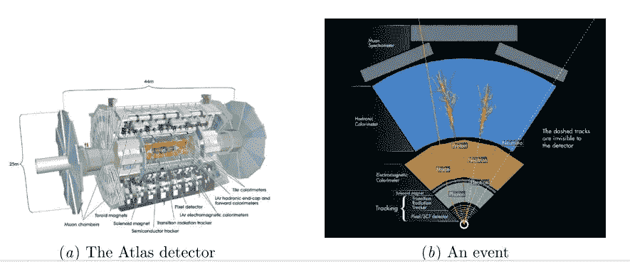
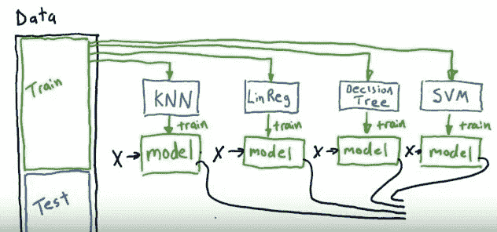

# 合奏(目前的形式)并不总是答案；在粒子物理探索中使用人工智能，特别是深度学习的案例研究

> 原文：<https://medium.com/swlh/ensemble-in-present-form-is-not-always-the-answer-a-case-study-of-using-ai-specifically-deep-3498706fda63>

桑斯卡·古普塔和苏坎特·库拉纳

数据科学和人工智能不仅改变了社交媒体、股票市场分析、电信行业、医疗保健和交通等，甚至还通过帮助粒子物理研究扩展了我们对宇宙的理解。让我们通过最近的一个实验来强调这一点，并简要谈谈几位数据科学家希望在这个方向上用数据科学和人工智能做些什么。我们不会谈论通过这些实验揭示的物理学，而只会谈论实验的目标，因为我们仍在向成为物理学家迈出小步，所以我们会谈论我们熟知的东西，即人工智能。我们已经为你张贴了链接，让你自己检查物理。我们希望有一天我们能够像了解人工智能一样了解物理；也许随着一些未来的大脑植入或真正的长寿或剪切顽强，这一天也会到来。我们也迫不及待地想解决这些问题。在这里，我们只是简单地讨论人工智能中的两种截然不同的方法，它们被用于数据科学和人工智能的另一个前沿领域。

最近组织了希格斯玻色子机器学习挑战，促进了高能物理学家和数据科学家之间的合作。比赛在 kaggle 上举办，有很多人参加。

 [## 希格斯玻色子机器学习挑战

### 使用 ATLAS 实验来识别希格斯玻色子

www.kaggle.com](https://www.kaggle.com/c/Higgs-boson) 

希格斯玻色子又名上帝粒子在几年前被发现，从那时起，科学家们就努力根据希格斯玻色子的特征和性质，在标准模型中为它找到一个固定的位置。ATLAS 是欧洲粒子物理研究所的一项粒子物理实验，在该实验中质子被高能击碎，并对碰撞后的数据进行分析。当希格斯玻色子分解时，形成两个τ粒子，因此通过知道τ粒子的存在，可以确认希格斯玻色子的存在，但是τ粒子的能量很低，并且通常被背景噪声所支配。

Image source: [https://atlas.cern/discover/detector](https://atlas.cern/discover/detector)

为了解决这个有趣的问题，几位工程师排起了队。Kaggle 上的几个参与者使用了深度神经网络。也就是说，一些人使用了集合方法。那么在这种情况下，哪种方法赢了呢？

 [## 深度学习-维基百科

### 深度学习架构，如深度神经网络、深度信念网络和递归神经网络，已经被广泛应用

en.wikipedia.org](https://en.wikipedia.org/wiki/Deep_learning) 

虽然你们可能都知道深度神经网络和深度学习(如果你没有查看上面粘贴的 wiki 链接)，但你可能没有听说过集成，所以让我们来谈谈它。它涉及学习模型的聚合以提高准确性。系综方法可以类比于群体智慧的现象。例如在节目《谁想成为百万富翁》中，涉及观众投票的生命线是最准确的。

 [## 集成学习-维基百科

### 在统计学和机器学习中，集成方法使用多种学习算法来获得更好的预测…

en.wikipedia.org](https://en.wikipedia.org/wiki/Ensemble_learning) 

模型的组装通常有三种方式:

1.  委员会:它包括模型的未加权平均值
2.  **加权平均值**:这里涉及到权重，即较好的预测值被赋予较大的权重。
3.  第三种方式涉及将不同较弱模型的**预测作为特征来训练整个最终模型**。

集成方法类似于多层感知器，其中每一层为下一层产生一组特征，不同之处在于，在多层感知器中，所有层同时被训练，而在集成中，模型的训练是一个接一个地完成的，并且它们被组合用于后处理。

使用集成学习器的一些优点是更少的错误和更少的过拟合。

Image from [https://www.youtube.com/watch?v=sVriC_Ys2cw](https://www.youtube.com/watch?v=sVriC_Ys2cw)

哪种方法赢了？

深度神经网络被认为是最准确的，因此它赢得了挑战。DNN 展示了从训练集中有限的特征集中推断新特征的能力。它搜寻并发现了与已知特征相关的其他特征。它发现了深度学习在没有被明确告知的情况下创造特征的能力。它减少了对特征工程的需求，特征工程是机器学习实践中最耗时的部分之一。

虽然在这种情况下，DNN 是一个明显的赢家，但人们必须记住，DNN 不是 panacia。DNN 的一些常见缺点是:

只有在数据量很大的情况下，它才能胜过其他机器学习算法。

训练它在计算上是昂贵的，因此它需要大量的计算能力，结果硬件成本增加。

学到的东西不容易理解。其他分类器(例如决策树、逻辑回归等)使理解正在发生的事情变得容易得多。

你可能会问，如果合奏包含深度学习组件会怎么样；你必须尝试一下，或者等库拉纳实验室的人来尝试一下。我们希望通过这个小例子来展示人工智能是如何渗透到所有知识分支的。当我们尝试它的时候，除了混合一些人工智能方法，设计新的方法(你必须等待)，我们也希望使用我们在噪音分析方面的工作来解决这个问题。不要让最后一句话仅仅作为自我推销而溜走，要想得更深。我们相信，包含确定性方法的噪声分析方法将与深度学习和集成类方法一起工作，以解决未来的问题。

— — — — — — — — — — — — — — — — — — — — — -

关于:

Sanskar Gupta 是一名与 Khurana 博士一起研究人工智能在粒子物理中的应用的研究人员。

Sukant Khurana 博士经营着一个学术研究实验室和几家科技公司。他也是著名的艺术家、作家和演说家。你可以在 www.brainnart.com 的[或 www.dataisnotjustdata.com](http://www.brainnart.com)的[了解更多关于苏坎特的信息，如果你希望从事生物医学研究、神经科学、可持续发展、人工智能或数据科学项目的公益事业，你可以在 skgroup.iiserk@gmail.com 联系他，或者通过 linkedin](http://www.dataisnotjustdata.com) [的 https://www.linkedin.com/in/sukant-khurana-755a2343/](https://www.linkedin.com/in/sukant-khurana-755a2343/)联系他。

这里有两个关于 Sukant 的小纪录片和一个关于他的公民科学努力的 TEDx 视频。

 [## Sukant khu Rana(@ Sukant _ khu Rana)|推特

### Sukant Khurana 的最新推文(@Sukant_Khurana)。创始人:https://t.co/WINhSDEuW0 和 3 家生物技术创业公司…

twitter.com](https://twitter.com/Sukant_Khurana) 

## 这个故事发表在 [The Startup](https://medium.com/swlh) 上，这是 Medium 最大的企业家出版物，拥有 287，184+人。

## 在这里订阅接收[我们的头条新闻](http://growthsupply.com/the-startup-newsletter/)。

