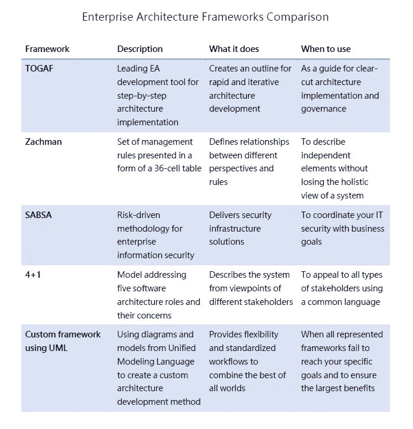
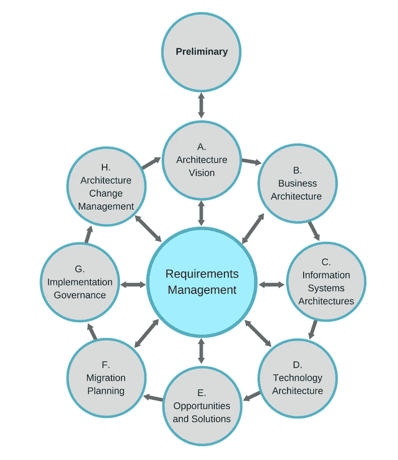
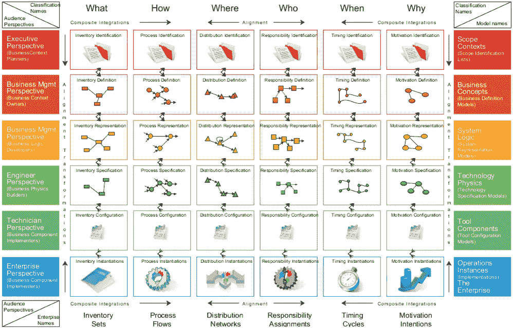
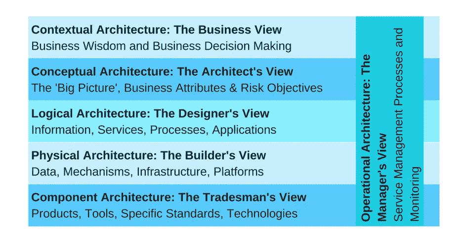
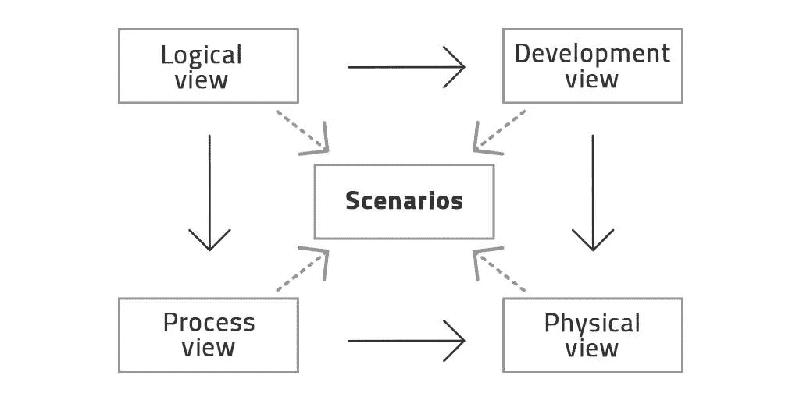
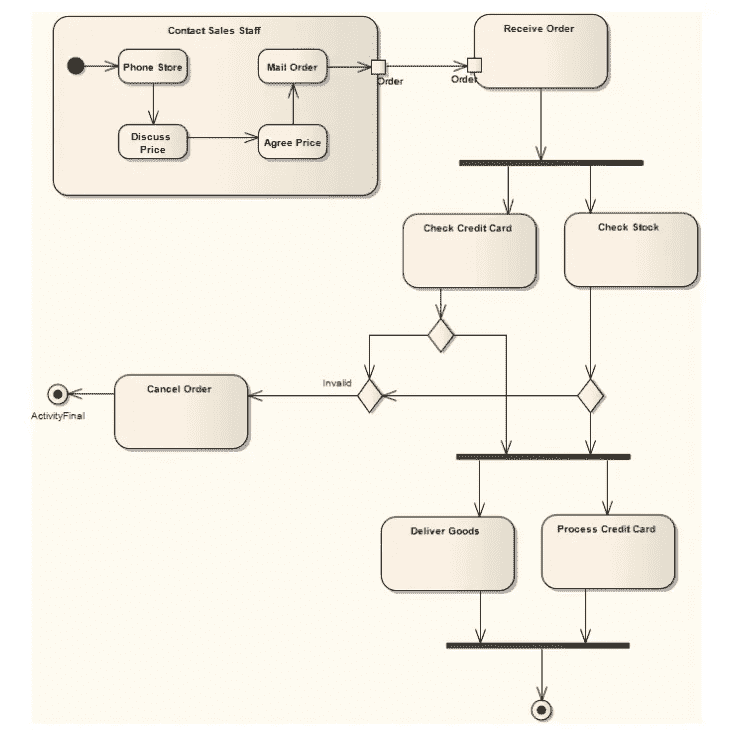

# 企业架构框架:记录您的变革路线图

> 原文：<https://medium.com/swlh/enterprise-architecture-frameworks-documenting-your-roadmap-to-change-6c7a3349a19a>

在一个组织中促进创新需要一种熟练的结构化方法。如果您看不到公司内不同的系统(包括业务系统和技术系统)是如何协同工作来实现您的目标的，那么当 IT 项目没有交付它们所追求的价值时，请不要感到惊讶。就像任何变革一样，现代化需要一个整体和系统化的方法，为这个渐进过程的每个阶段奠定基础。

**企业架构**是路线图——包括评估、规划和设计您的企业使用技术来实现其目标的实践。负责这种无缝转换的人是**企业架构师**。他们广泛的技能，以及他们与股东和 IT 专家找到共同语言的能力，使他们能够引导公司达到理想的状态。我们已经讨论了[企业架构师在业务中的角色](https://www.altexsoft.com/blog/business/how-enterprise-architects-close-the-gap-between-technology-and-business/#utm_source=MediumCom&utm_medium=referral)，现在我们将重点介绍他们在规划和可视化转型时使用的工具和方法。

企业架构考虑组织的复杂系统。为了管理这种复杂性，企业架构师使用标准化的方法或框架，帮助他们以公认的方式记录系统的行为。让我们快速比较一下最流行的框架。

现在，我们将深入探讨每个框架的功能和使用机会。请继续阅读，了解如何将它们应用到您的组织中。

# TOGAF——持续架构开发的标准框架

开放组架构框架(TOGAF)是由包括戴尔、Cognizant 和微软在内的领先公司的 300 多名企业架构师开发的。TOGAF 的开发可以追溯到 1995 年，它当前的版本 9.1 包含了在此期间实现的所有改进。该工具有一个通用的词汇表，旨在支持大型和小型企业的所有层次的架构。

TOGAF 建立的快速开发架构的方法(*架构开发方法*或 ADM)是一个循序渐进的过程，描述了一个循环中安排的十个阶段。在过程的中心，您可以找到需求管理——反映调整每个阶段的变更和需求的持续过程的阶段。

*TOGAF 架构开发方法*

## 它的元素代表什么？

**初步阶段** —定义原则、关注点、 以及对未来架构的需求
**架构愿景** —选择架构范围和方法以与利益相关方保持一致
**业务架构** —使用建模方法描述架构愿景
**信息系统架构** —建模数据和应用架构
**技术架构** —将系统描述转化为架构实现的基础
**机会和解决方案** —定义改变当前架构的主要步骤 对于目标一，实施计划的基础
**迁移计划** —描述实施的预计成本、时间表和路线图
**实施治理** —为架构部署的不同阶段分配治理职能
**架构变更管理** —提供对技术和业务变更的监控

## 你什么时候会使用 TOGAF？

*   以可控的方式转变组织的架构和流程
*   反复调整你的过程和当前的目标
*   在从关键需求评估到实际实现的所有阶段支持架构开发过程

财富 500 强公司中有 60%已经采用了 TOGAF。由于其广泛性，该框架具有高度的适应性，并且培养了敏捷性和协作性。然而，与任何被广泛认可的方法一样，它也受到了一些批评，因为它专注于理论的方法很少能付诸实践。因此，请记住，尽管 TOGAF 很受欢迎，但它并不是包治百病的灵丹妙药，应该被用作指南，而不是可行的计划。

# Zachman 框架——协调角色和想法的跨维度矩阵

Zachman 框架不是一种方法论，而是一个描述如何从不同角度看待不同抽象概念的模板。

这个二维矩阵由六行(视角)和六列(基本问题)组成，它的交叉单元以详细和结构化的方式描述了企业的表现。Zachman 框架是规范化的，它的行和列不能被删除以保持系统的整体概观。尽管如此，它足够灵活，可以为任何范围的项目工作，清楚地关注每个元素及其目的，并在单元之间建立上下文关系。完成的方案不是架构；这是一个帮助管理和组织的工具。

*扎克曼框架*
*来源:* [*NoMagic*](https://www.nomagic.com/news/new-noteworthy/magicdraw-noteworthy?start=25)

## 它的元素代表什么？

按行表示的玩家是:

**高管视角** —寻求系统规模和成本信息的规划者
**业务管理视角** —希望了解业务流程如何交互的所有者
**架构师视角** —确定软件功能如何代表业务模型的架构师
**工程师视角** —应用特定技术解决业务问题的承包商
**技术人员视角** —给出指令的程序员
**企业视角** —安

这些列可以描述为:

**什么？** —企业数据每一行都要处理
**如何处理？** —一个组织的职能和流程
**在哪里？** —地理位置、物流、互联
**何时？** —业务周期和触发业务活动的事件
**谁？** —组织单元及人与技术的交互
**为什么？**——将商业目标和战略转化为具体手段

## 你什么时候会使用 Zachman 框架？

*   专注于独立的对象，而不失去整体视角和对象之间的关系
*   在与利益相关者的对话中，澄清每个级别应该关注什么，而不要深究技术方面
*   作为一个文档工具，可以很容易地与其他模型结合
*   简化团队内部的沟通
*   看看你已经描述了哪些观点，还缺少什么

# SABSA —协调业务和安全的风险管理框架

SABSA(Sherwood Applied Business Security Architecture)是一个运营风险管理框架，包括一系列模型和方法，既可独立使用，也可作为整体企业架构解决方案使用。这是另一个高度可定制和可扩展的框架——它可以在小范围内采用，然后在企业范围内逐步实现。

SABSA 严格遵循 Zachman 框架，并适应安全焦点。SABSA 使用我们已经描述过的 Zachman 的六个问题来分析安全架构开发的六个层次中的每一层。

*SABSA 的六层安全架构*

## 你什么时候使用 SABSA？

*   通过预先记录错误并在创建架构时牢记它们来避免错误
*   使您的安全体系结构与业务价值保持一致
*   建立可量化的指标来跟踪业务绩效，而不是技术绩效

# 4+1 视图模型——针对不同利益相关者的极简工具

4+1 方法背后的基本思想在于根据不同涉众的兴趣划分软件系统的不同方面。这是另一个类似 Zachman 方法的框架。该模型的创建者 Philippe Kruchten 认为，通过将一个架构分成不同的视图，它将从每个利益相关者的角度进行展示，无论是客户还是开发商。

它的四个主要视图被描述为:

**逻辑** —代表系统应该提供的功能、系统组件及其关系
**流程** —展示系统的性能、可扩展性、工作流规则
**开发** —关注软件模块、软件包和使用的环境
**物理** —考虑软件如何映射到硬件

第五个视图——**场景或用例**——代表整个系统的高层视图，并说明架构的一致性和有效性。这一观点适用于所有利益相关者。

*4+1 框架的场景或用例视图*

## 你什么时候会使用 4+1 模式？

*   区分不同视图的优先级并简化组织过程
*   与 TOGAF 等其他工具集成
*   轻松记录单个项目和公司的整个 IT 架构

# 使用统一建模语言(UML)创建定制的 EA 框架

大多数企业架构框架提供有限数量的观点和方面，因此结合使用它们是合理和常见的。没有一个建议的模型可以包含所有的措施，并满足每个组织的需求。然而，这允许企业架构师定制文档并创建系统的独立概述。

**统一建模语言** (UML)是一种描述性的可视化语言，提供用于标准化软件开发的可扩展图表。使用扩展机制——UML Profile，它可以很容易地针对不同的业务领域进行扩展和定制。企业架构师使用原型、标记值和约束来定制适合特定环境的语言，从而确保最终的模型能够满足企业特定的需求。

一些通用的 UML 图包括部署图，可视化系统的执行架构；活动图，模拟系统的行为以及这些行为之间的关系；以及序列图，表示工作流和协作。

*一个活动图的例子*
*来源:* [*火花系统*](http://www.sparxsystems.com/)

UML 模型允许企业开发一组过程和用例来可视化企业架构整体和其中的每个系统。这是一个复杂的工具，需要培训来操作和适应公司的需求，但是这种方法的好处与企业架构师的努力相关。

# EA 框架的问题

在 Zachman 框架——目前使用的最古老的 EA 工具——创建近 30 年后，一个问题出现了:框架带来了任何价值还是造成了伤害？以下是当今围绕企业架构框架使用的主要关注点。

*   文档不全面

尽管对 80 年代和 90 年代创建的最流行的框架进行了无数次更新，它们的现代版本仍然被认为是不切实际和过时的。此外，创建和维护 EA 文档需要的资源在许多创新公司的敏捷环境中并不总是可用的。

*   它们既费时又缺乏灵活性

大多数 EA 框架没有现代商业工具包那么动态，比如[商业模型画布](https://www.altexsoft.com/blog/business/using-business-model-canvas-to-launch-a-technology-startup-or-improve-established-operating-model/#utm_source=MediumCom&utm_medium=referral)。它们需要时间来计划，不支持改变，并且需要培训来发展和展示。更多的是关于文档而不是真正的创新行动，它们会因为过度使用而减慢过程。

*   完全整合是不可能的

每个框架的局限性并没有提供与公司新的和现有系统无缝集成的机会，并且需要进行显著的调整，这需要额外的资源。

这些担忧并不一定意味着三十年的实践已经导致 EA 框架变得过时。就像任何形式化的方法一样，Zachman 或 SABSA 被批评和扩充，在过程的开始和整个过程中被引入，并被企业架构师以不同的方式使用。确保利用框架中最有利的元素，并解决约束条件。

# 结论

企业架构框架对于规划和可视化很有价值。在架构变更的早期阶段，他们尤其有助于引导与利益相关者的对话，并可视化业务和 IT 协调的结果。然而，对于负责准备变革路线图的人来说，它们仍然只是工具箱。

在寻找企业架构实践时，注意他们在 TOGAF 认证之外的经验和能力，并听取他们关于与您的特定情况相关的框架和工具的建议。

***喜欢这个故事？为我们鼓掌，让更多的人可以找到它！👏***
原载于 AltexSoft 的博客:*[*企业架构框架:记录您的变革路线图*](https://www.altexsoft.com/blog/business/enterprise-architecture-frameworks-documenting-your-roadmap-to-change/#utm_source=MediumCom&utm_medium=referral)*

****

## **这个故事发表在 [The Startup](https://medium.com/swlh) 上，这是 Medium 最大的企业家出版物，拥有 297，332+人。**

## **在这里订阅接收[我们的头条新闻](http://growthsupply.com/the-startup-newsletter/)。**

****