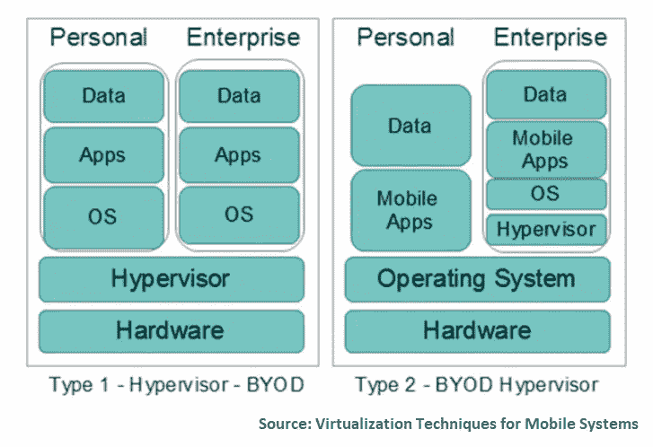

# 企业移动性管理:模型和解决方案

> 原文：<https://medium.com/swlh/enterprise-mobility-management-models-and-solutions-8d3d317d8eb6>

你是那种在走进办公室打开电脑之前就开始工作的人吗？我们大多数人在上下班的时候都会用手机接收商务邮件，并开始给同事发信息。回到 2012 年， [Forrester 发现](https://www.business.att.com/content/whitepaper/Forrester-Building-A-Case-For-BYOD.pdf)67%拥有智能手机的员工是在没有任何公司指导的情况下自己选择的。一年后，[迈克菲的一项调查](http://newsroom.mcafee.com/press-release/mcafee-finds-eighty-percent-employees-use-unapproved-apps-work)显示，80%的员工经常在工作中使用未经批准的 SaaS 应用。

所以，BYOD(自带设备)不再是一种趋势。这是现实。工作站和移动设备之间的界限如此模糊，问题不是*我们是否*接受企业移动性，而是*我们如何*做到这一点。

# 企业移动性是高效的，除非它极其有害

从总体上和理论上来说，通过移动设备即时访问操作杠杆对员工和组织都有好处。如果您在许多分散的地点运营，员工需要操作统一的管理软件，那么选择移动设备将会非常有益。

例如，建筑公司 Walsh Group[接受了 BYOD 需求](https://customers.microsoft.com/en-us/story/construction-firm-uses-cloud-based-tools-to-advance-mo)，让他们的项目经理直接从施工现场共享关键项目信息，而不是回到办公室并在那里配置蓝图。这使他们的成本估算速度提高了 20 %,使公司在竞争中处于领先地位。AltexSoft 为我们的一个客户开发了一个可定制的应用程序，供生产工人在现场完成数字清单、跟踪机器性能、拍摄故障硬件的照片等。这允许快速反应和及时的员工跟踪。

另一方面，如果你处理这些设备或让员工使用他们自己的设备，你应该承认人类是任何数据安全结构中最薄弱的一环。人们丢失智能手机，他们安装有害软件，复制信息并不负责任地粘贴它，或者只是让别人访问它。

这才是值得考虑的问题。

您如何控制对敏感企业数据的访问？你如何确保员工不会不负责任地分享这些数据？更重要的是，您如何在不侵犯员工隐私的情况下管理移动设备的使用？

1.  **平衡用户可访问性。**让您的企业移动性战略失败的最简单方法是过度管制对企业资源的访问。如果你的员工不得不采取多个复杂的步骤来登录，他们很可能只会在紧急情况下使用应用程序。或者，他们很可能会下载一些功能相同、可访问性更好的第三方应用程序。如果有懈怠，他们为什么要使用一个落后的，过度保护的企业信使？因此，考虑软件的易用性、外观和感觉，以及它的性能，所有这些都会促进采用。
2.  **在自带设备和企业设备之间做出明智的选择。** BYOD 在减少企业硬件投资方面很有优势。另一方面，智能手机、平板电脑、笔记本电脑及其更新方式不同的操作系统的多样性，对 IT 部门跨无数终端保持软件调整的能力提出了挑战。
3.  **根据运营需求定制数据保护措施。**对数据的访问各不相同，并且与您的员工参与应用程序的方式相对应。如果移动性旨在跟踪活动或输入数据以供进一步处理(如在餐馆中)，则可以完全或部分关闭对记录的访问。如果需要一些数据访问，请考虑多级保护。例如，设置多个用户角色将允许您基于每个级别的用户类型隔离有价值的数据。

在具体介绍企业移动性(EM)解决方案和任何可能适用的安全问题之前，让我们先定义一下 BYOD 和另外两种 EM 模型。

# 企业移动模型

在寻找最佳移动性策略模型时，组织已经开发了大量选项。三种最常见的方法是 BYOD、COPE 和 CYOD。

## 自带设备(BYOD)

BYOD，即在工作场所使用个人设备的做法，可能会有几种情况。在第一种情况下，员工可以在工作场所打私人电话或发信息，而老板可以在非工作时间联系他们。

第二种情况是，员工在出于职业目的使用设备时访问公司数据，公司支付他们的手机账单。

另一个场景描述了员工使用他们的设备工作和休闲，公司选择手机服务选项并支付费用。

**优势:**BYOD 模式对用户来说很方便，对没有购买设备费用的雇主来说也很有利。

**缺点:**由于各种设备的使用不受控制，这种模式存在安全和管理问题。例如，由于办公室中使用的设备类型和型号多种多样，IT 部门无法开发统一的支持系统。雇主还必须考虑如果员工离开公司，他们将如何从员工的设备中检索数据。前团队成员在销售部门工作时，需要特别注意数据检索。

理想情况下，员工在使用个人智能手机或平板电脑回复公司电子邮件、填写清单或打开和编辑文档时，必须对商业信息的完整性负责。现实情况是，公司必须制定设备使用政策，向员工解释这些政策，并实施技术解决方案来帮助他们保护设备和数据的安全。因此，第二种和第三种 BYOD 场景需要公司解决技术和法律问题。

## 公司所有，个人支持(COPE)

一些企业，尤其是金融和医疗保健组织，发现 BYOD 模式在监控和安全性方面风险太大，因此倾向于应对 BYOD。这些公司为员工购买设备，但给他们机会使用它们完成个人任务。虽然员工不拥有设备，但他们通常负责设备的维护和更新。这就是为什么这种企业流动模式要求工人具备良好的技术技能。

**优势:**借助 COPE 方法，IT 部门无需纠结于设备控制和保护，因为他们确切知道员工手头有多少设备和哪些设备。COPE 的另一个优势是组织可以自由地安装管理软件和/或在移动设备管理系统中集成设备。我们将在下面详细讨论。

这种模式允许解决与擦除丢失或被盗设备上的数据相关的监管和法律问题。作为设备所有者，组织可以避免无权远程删除个人设备上的公司数据的情况(在一些欧洲国家，公司被限制这样做。)

**缺点:**需要购买设备是这种模式的缺点之一。不过，如果批量购买设备，公司可以削减成本。雇主也有更多的机会谈判更好的服务合同，因为他们可以提供更多的潜在客户。由于员工负责保持设备处于良好的技术状态，IT 部门可以节省时间和金钱。只有当问题很复杂时，他们才会联系设备供应商或公司的技术支持。

## 选择您自己的设备(CYOD)

一家遵循 CYOD 政策的公司向员工提供了一系列经批准的小工具中的一种移动设备。因此，像在 COPE 中一样，公司是设备所有者。

员工可以出于工作和个人目的自由使用他们选择的设备。组织通过安装必要的应用程序并在需要时进行更新来维护它。通常，员工不被授予管理特权。这就是为什么员工必须通知 IT 人员他们想要进行的任何重要设置。

**优势:** CYOD 简化了 IT 团队的工作，因为它监控和支持有限数量的设备类型和型号。对于处理敏感信息的公司来说，CYOD 是一个不错的选择。一家公司拥有对设备的完全控制权，可以安装它选择的任何安全软件。因此，即使设备被盗，公司数据也不会受到未经授权的访问。

**劣势:**CYOD 的实施有其挑战性。组织不得不花费大量的金钱来购买和/或维护硬件。定期更新批准的设备列表也很重要，以免错过新的应用和技术。公司可以通过应用交付保持最新的尖端技术。

用户不满是另一个风险因素。员工可能不喜欢公司允许的设备的性能，从而导致生产力降低。

在去 CYOD 之前要考虑的另一件事是，维护不同类型的设备需要 IT 团队付出更多的努力。一家公司必须确保自己能够承担这样的举措。

# 企业移动解决方案的类型

在个人设备上运行企业应用程序和处理敏感数据的员工数量不断增加。在这方面，企业移动性(EM)解决方案必须解决各种数据和基础设施使用场景。当一起使用或以各种方式组合使用时，EM 解决方案可为公司数据提供安全保护，并为员工提供舒适的工作环境。

有六个企业移动性组件:

1.  身份管理
2.  移动应用和设备管理
3.  移动虚拟机管理程序和容器
4.  通过虚拟桌面基础架构(VDI)对应用和数据进行虚拟化访问
5.  文件安全和信息权限管理
6.  基于机器学习的保护

身份管理侧重于为员工提供对所有工作相关应用程序的简化访问。MDM(移动设备管理)和 MAM(移动应用程序管理)的概念适用于公司或员工拥有的移动设备和公司专用的应用程序。相应地，构建 MDM/MAM 基础设施的目的是保护敏感数据和保持移动设备健康。使用虚拟机管理程序或容器和虚拟桌面基础架构(VDI)的虚拟化旨在将业务和个人模式结合在单个设备中，并为任何类型的终端设备提供对工作应用和数据的安全访问。

现在我们来详细讨论一下。

# 1.身份管理

身份管理解决方案解决了员工使用流行的 SaaS 应用程序的问题。身份管理不再要求员工使用不同的名称和密码来访问多个应用程序，而是支持员工使用单一名称和密码来使用多个应用程序。

要考虑的主要功能:

*   所有应用程序的单点登录
*   支持您的组织使用的应用程序
*   组访问管理，允许经理向员工组分配访问权限，而无需列举任何特定用户(可以登录应用程序的用户)。这也意味着设置特定的访问规则，比如美国和加拿大销售部门的所有用户都可以访问这个应用。
*   除了单点登录之外，多因素身份认证还支持其他级别的验证
*   一些服务提供高级报告，这些报告采用机器学习技术来识别异常登录(未知来源、异常登录、可疑 IP 等)。)、使用报告、错误报告、活动日志等等。
*   远程访问本地软件

**如何集成身份管理解决方案。**通常，VMWare 或微软等领先供应商都有一系列受支持的公共应用，这些应用可以与身份管理软件集成。但是，当使用自定义应用程序或其他不受支持的软件时，您将需要额外的工程设计来实现成功集成。

显然，每个供应商集成场景可能有所不同，但一般来说，建议采取以下步骤:

1.  研究您的企业移动性供应商的身份认证要求。
2.  请检查您的应用验证是否与它们匹配。如果是这样的话，应用程序集成很可能只需要管理员级别的工作。
3.  如果它们不匹配，您将需要额外的应用程序定制来满足这些要求。

例如，[微软活动目录](https://azure.microsoft.com/en-us/services/active-directory/)定制应用集成的一些可能场景如下:

*   在发展阶段考虑整合。如果您只是计划构建一个自定义应用程序并考虑微软身份管理，您可以考虑进一步集成来进行开发。微软[为开发者精心列出认证场景](https://docs.microsoft.com/en-us/azure/active-directory/develop/active-directory-authentication-scenarios)，让应用兼容微软 AD。
*   **启用 SAML 2.0 支持或基于 HTML 的登录页面。**您可以根据要求更新现有应用。启用后，管理员可以使用专用工具[进行集成。](https://docs.microsoft.com/en-us/azure/active-directory/active-directory-saas-custom-apps)
*   **对于 Xamarin 应用，使用 Xamarin。Auth** 。我们已经详细讨论了 [Xamarin 的利弊](https://www.altexsoft.com/blog/mobile/pros-and-cons-of-xamarin-vs-native/?utm_source=MediumCom&utm_medium=referral)。综上所述，如果您选择跨平台开发和 BYOD，Xamarin 技术非常适合企业应用程序。对于基于 Xamarin 的应用程序，有一个简单的方法[在两个简单的步骤](https://blog.xamarin.com/authenticate-xamarin-mobile-apps-using-azure-active-directory/)中集成它们。

# 2.移动应用和设备管理

MAM/MDM 解决方案是围绕面向企业用户的设备和应用程序管理的理念构建的。基本上，它们提供了仪表板和管理环境来跟踪和远程控制所有主要平台(Android、iOS 和 Windows)上的设备和应用程序。通常，这些产品的功能可以分为两个常规任务组:设备管理和应用程序管理。

**应用管理。**MAM 功能旨在满足 BYOD 场景，即您的员工积极使用自己的设备工作，但不愿意让组织侵入他们的私人生活。员工在混合使用私人和工作相关设备的情况下使用单一设备可能会引发许多安全问题。MAM 允许在不牺牲用户隐私的情况下，通过管理应用程序来分离个人和工作使用。这意味着你可以对与工作相关的应用程序施加规则和监管，允许免费使用其他应用程序。

一些需要考虑的事项:

*   块复制和粘贴
*   阻止“另存为”并备份到个人云
*   对应用程序实施 PIN 访问
*   远程更新应用
*   从设备内存中擦除敏感数据
*   要求所有与工作相关的链接都在专用的托管浏览器中打开，等等。

**设备管理。**如果您将公司拥有的设备交给员工，您可以管理这些设备以避免任何公司安全漏洞。可以管理您系统中注册的设备及其驻留的应用程序。与 MAM 原则一样，您可以通过以下规则对注册的设备实施不同的策略，这些规则可能:

*   定义用户可以安装的可用应用程序或注册后自动安装的应用程序
*   定义评估哪些设备可以注册的合规性规则
*   管理设备上的安全设置
*   设置可以访问应用和资源(例如公司电子邮件)的条件
*   向企业基础架构的用户分配证书和 VPN/Wi-Fi 配置文件
*   远程擦除被管理设备上的数据等。

此外，您还有一个控制面板，可以向您更新设备健康状况、策略设置、管理的应用程序以及关于可疑内容的警报。方便！

大多数 EMM 系统——如行业领导者[AirWatch](http://www.air-watch.com/)——都有地理围栏支持。这允许定义与特定策略相关的地理区域。例如，许多医院为其员工提供平板电脑，平板电脑带有诊所管理软件，可记录患者症状并即时检索患者相关信息。为了确保敏感患者数据的安全，如果平板电脑离开医院的限定范围，地理围栏可以锁定该平板电脑。基本上，您可以将任何策略绑定到设备的地理区域。

**如何将应用与应用管理解决方案相集成。**像身份管理一样，受欢迎的 EMM 供应商支持与 AppStore 或 Google Store 中的某些应用程序集成。如果你的应用不在支持的列表中，你需要编程来实现这种集成。通常，有两条路可以走:

1.  **使用 app 包装工具。如果你有一个简单的应用程序，集成可能会相对简单。包装允许您管理应用程序，而无需直接调整它们的源代码。事实上，包装是一种技术，意味着应用程序代码将被自动反编译，特定的功能将被应用程序管理所取代。显然，这种方法有很大的局限性，建议战术使用。通常，包装将允许相对基本的管理，如数据传输限制、阻止复制和粘贴、阻止屏幕捕获等。为了提供一个深刻的 MAM，你需要 SDK。**
2.  **使用供应商提供的软件开发套件(SDK)。**SDK 是软件工程师用来实现与给定软件兼容的功能的一组库和工具。就 MAM 而言，使用 SDK 需要调整应用程序的源代码，或者在开发时考虑到进一步的应用程序管理。例如，使用 [AirWatch SDK](http://www.air-watch.com/solutions/mobile-application-development/) 你将能够管理密码策略、数据加密、集成认证等。

# 3.移动虚拟机管理程序和容器

移动虚拟化是支持组织内 BYOD 策略的有效技术。它允许雇主通过实施设备使用策略来保护公司数据的安全，同时允许员工使用个人设备进行工作。更重要的是，这种方法确保了雇主和雇员的隐私。

虚拟化可以通过虚拟机管理程序和容器来完成。

虚拟机管理程序(也称为虚拟机监视器/管理器)是一种用于在设备(主机)上创建和运行多个操作系统(OS)的软件。额外的操作系统称为虚拟(来宾)机(VS)。

容器允许将应用程序从一个计算环境抽象到另一个计算环境。它们为应用程序的运行提供了一个虚拟的隔离平台。

## 使用虚拟机管理程序的虚拟化

该解决方案需要使用移动虚拟机管理程序在单个设备上分离个人和业务内容。虚拟机管理程序允许在一个操作系统上运行个人应用，在另一个更安全的操作系统上运行商业应用。因此，用户只能通过企业应用程序访问公司数据。同时，组织没有办法侵犯员工的隐私。

通过虚拟机管理程序进行的虚拟化有两种类型。

**裸机虚拟化。**这种类型的虚拟机管理程序直接在设备硬件上运行，并且可以访问其资源。这可以优化两种操作系统的性能。由于这些操作系统彼此完全独立，因此前一个操作系统上可能出现的崩溃、错误或恶意软件攻击不会影响后一个操作系统。

由于这种布局，裸机虚拟机管理程序是专门为硬件虚拟化而开发的。换句话说，它们管理和控制各种虚拟机中众多应用程序的工作。这就是 IT 部门更喜欢在生产中使用它们的原因。

**托管虚拟化。**该虚拟机管理程序在主机移动系统软件环境中运行，位于运行于第二软件级别的主机操作系统和运行于第三软件级别的客户操作系统之间。与任何其他应用程序一样，虚拟机管理程序安装在来宾操作系统之上。这种虚拟化方法不太安全，因为来宾操作系统的性能取决于主机操作系统。因此，如果主机受到攻击，客户操作系统可能会失败。

**如何通过虚拟机管理程序实施虚拟化。**最大的虚拟化供应商——[VMware](https://www.vmware.com/)、[微软](https://www.microsoft.com/en-us/cloud-platform/enterprise-mobility-security)和[Citrix Systems](https://www.citrix.com/products/)——提供这两种类型的虚拟机管理程序。如果裸机虚拟机管理程序最适合您，请考虑 Oracle VM server、Microsoft Hyper-V 以及 VMware 的 ESX 或 ESXi 等虚拟机管理程序。在寻找托管的虚拟机管理程序时，考虑安装 Microsoft Virtual PC、Oracle VirtualBox、Workstation、Server 或 VMware Fusion。

## 容器虚拟化(应用容器化)

这种方法有时被称为操作系统级虚拟化，需要通过容器分离移动设备。与基于虚拟机管理程序的虚拟化不同，容器化不需要为每个应用程序启动额外的操作系统(虚拟机)。容器运行在单个主机操作系统上，访问单个内核，因此比虚拟机更高效。简而言之，容器可视化操作系统而不是硬件。

容器存储文件、系统库和环境变量——运行特定软件所需的组件。主机操作系统还限制容器对 CPU 和内存等物理资源的访问。因此，容器使用的主机操作系统物理资源更少。

移动设备具有个人和企业环境。工作环境由 IT 管理员提供支持，而用户可以在个人环境中自由地做任何事情。如果设备被盗、丢失、升级或员工离开公司，可以删除容器。

**如何实现基于容器的虚拟化。许多容器化工具都可以在互联网上找到，既有开源的，也有付费的。这里有一些免费的选项供你选择。**

[Docker](https://www.docker.com/what-docker) 是最受欢迎的集装箱工具供应商之一。它的开源平台允许为基于 Linux 和 Windows 的应用程序创建和操作容器。Docker 容器是可移植的:您可以在任何共享主机操作系统的系统之间移动它们，而无需更改代码。

[Kubernetes](https://kubernetes.io/) ，另一个免费的容器编排引擎，也有一个庞大的用户群体。该工具可以帮助您控制和维护众多容器的工作，因此如果您必须管理大规模的操作，它尤其有价值。Kubernetes 平台可以与 Docker 平台集成。

OpenShift 是一个强大的容器管理平台,“将 Docker 和 Kubernetes 带到企业中”与后一个引擎的集成允许用户自动化容器的开发、部署、维护和扩展。

## 容器和虚拟机管理程序比较

基于虚拟机的系统包括完整的操作系统、驱动程序、二进制文件或库，以及应用程序本身。由于容器共享主机操作系统，并保存具有相关二进制文件或库的单个应用程序，因此它不会像虚拟机那样消耗太多的服务器硬件内存。因此，就内存、CPU 工作和存储而言，容器化是一种更有效的方法。这种架构还允许在同一设备上启动和维护大量容器，增加了可伸缩性。

# 4.通过虚拟桌面基础架构(VDI)对应用和数据进行虚拟化访问

当应用于移动使用案例时，对应用和数据的虚拟化访问使员工有机会远程访问企业应用，同时降低公司的基础架构维护费用。

虽然通过虚拟机管理程序或容器和虚拟桌面基础架构(VDI)实现的虚拟化允许组织解决类似的管理和安全问题，但它们在数据存储方法上存在显著差异。

VDI(有时称为基于服务器的计算)需要在数据中心运行和管理桌面操作系统，而不是本地计算机、[瘦客户端](https://searchnetworking.techtarget.com/definition/thin-client)或移动设备。桌面图像通过远程显示协议按需交付，而企业信息则安全地存储在数据中心。这对用户来说没有区别。

在硬件层面，VDI 由一组主机组成，为连接的设备提供计算能力。

组织可以在持久和非持久的 VDI 方法之间进行选择。前者是为员工提供一个可以根据需求进行配置的个人桌面映像。后者需要可视化的桌面供组织内的公众使用。用户注销后，这些桌面会恢复到原始状态。

**优势:**除了确保数据的安全性，VDI 还可以节省与基础架构升级相关的成本。得益于在终端设备上进行的少量计算，IT 可以将过时的桌面转变为 VDI 客户端，从而延长其使用寿命。当需要购买新机器时，一个部门可以获得功能较弱的机器。

然而，在数据中心为用户存储持久 VDI 所需的操作系统、数据、应用程序和设置的成本可能会很高。因此，公司必须确定它有足够的资源来使用这种可视化技术。

**缺点:** VDI 也有一些缺点。网络连接有时可能会失败，如果失败了，整个团队的工作效率就会受到威胁。软件的许可和支持是 VDI 的另一个弱点。使用非定制桌面映像的公司更有可能面临许可问题。原因是一些协议禁止为众多设备提供软件。

**如何实施虚拟桌面基础架构。**你要做的第一件事就是对比市场上的 VDI 平台。我们建议看看 [Citrix](https://www.citrix.com/products/xenapp-xendesktop/resources/datasheet.html) 的 XenApp 和 XenDesktop(供应商提供 90 天试用期) [VMware](https://www.vmware.com/products/horizon.html) 的 Horizon 7，以及[微软](https://www.microsoft.com/en-us/cloud-platform/desktop-virtualization)的解决方案。

# 5.文件安全和信息权限管理

文件安全概念侧重于数据文件，而不是设备和应用程序。这是怎么回事？基本上，与前面讨论的软件类型一样，您可以对文件实施特定的策略，并定义允许谁查看存储的信息。通常，这些服务提供三种类型的策略:加密、身份和授权。您还可以配置阅读、编辑和打印文档的权限。另一个很好的特性是使用监控。即使文件离开了您组织的边界(例如，被发送给分包商)，您也能够跟踪指定的人何时以及是否打开了该文档，以及未指定的人是否试图打开该文档。还是……成功打开了。

然而，一如既往，还是有一些限制。例如，如果您是微软的粉丝，并且其产品在您的组织中无处不在，那么您很可能将信息存储在 Office 文件中。好吧，如果你这样做，最好使用 Azure 权限管理，因为微软经常支持他们格式的高级保护。

基本上，有两种类型的保护可用:

**原生保护。**并非所有文件都是生而平等的。供应商有一些格式列表，这些格式允许比其他格式更深的保护级别。对于受本机保护的文件，您可以将使用限制为只读，并分配编辑、复制和打印权限。例如，Azure Rights Management 支持对 Office 文件、pdf、TXTs、常见图像格式(如 JPG、JPEG、PNG、BMP 和其他一些格式)的本地保护([完整列表如下。](https://docs.microsoft.com/en-us/information-protection/rms-client/sharing-app-admin-guide-technical#levels-of-protection--native-and-generic))

**通用保护。**这种保护适用于不受支持的格式。未经授权的代理不能打开文件。但是如果授权的人打开了文件，你就无法控制复制和打印之类的事情。因此，授权代理可以将信息发送到您的安全舒适区之外，服务将只能提醒用户保护建议。

在这个市场上还有其他强大的玩家，如[维拉安保](https://www.vera.com/product/)。在专注于办公文件的同时，Vera Security 还为 DropBox 中的文件共享提供了额外的保护，并可以锁定电子邮件附件。它目前正计划推出电子邮件加密。

# 6.基于机器学习的保护

实现移动安全性的另一种有效方法是采用机器学习技术来检测异常和潜在的恶意活动。一些软件包有现成的基于机器学习的解决方案，可以大大简化这层保护的实施。例如，[高级威胁分析](https://www.microsoft.com/en-us/cloud-platform/advanced-threat-analytics)包含在微软的 EMM 套件中。如果您的供应商软件不支持此类高级分析，请考虑聘请顾问来评估您的 EMM 基础架构。

拥有设备和应用程序使用的长期记录，您可以利用交互历史来构建能够检测无关使用事件的机器学习模型。基本上，通过采用这种类型的威胁分析，您将极大地减少任何数据泄漏。我们已经在我们的 [7 步策略指南](https://www.altexsoft.com/blog/datascience/machine-learning-strategy-7-steps/)中讨论了机器学习的采用。看看那里，了解你现在可以做些什么来着手这项倡议。机器学习算法可以应用于各种可能的威胁行为:

*   侦察活动
*   查找泄露的凭据(例如，帐户凭据以纯文本形式发送，或者某些帐户显示工作时间异常)
*   横向移动(发现异常资源访问)等。

# 尽早考虑企业移动性和安全性

员工移动性和 BYOD 是企业安全方面的颠覆性趋势。随着企业信息变得越来越容易被访问，我们应该尽早以明智和平衡的方式解决这一威胁。

到 2020 年，企业移动市场预计将增长到超过 45 亿美元，年增长率为 27%。该软件已经可供企业使用，因为它有一个既定的供应商池，并且在许多方面，是一种可替代的商品。事实上，消费者通常基于价格、客户支持或 UX/用户界面质量而不是功能集来选择 EMM 解决方案。没有一个主要的 EMM 层(1)单点登录和身份管理、2)移动应用管理(MAM)和 3)移动设备管理(MDM)需要大量的工程工作来集成。

因此，一般建议是从小处着手，在将设备交给员工或将应用程序上传到他们的智能手机之前，考虑移动管理软件。然后，您可以逐步扩展到其他保护级别，如文件安全性和高级威胁分析。

**喜欢这个故事吗？鼓掌让我们知道，这样更多的人可以找到它！**👏
原载于 AltexSoft 的博客:“[企业移动管理:模型与解决方案](https://www.altexsoft.com/blog/cloud/enterprise-mobility-management-models-and-solutions/?utm_source=MediumCom&utm_medium=referral)”

## 这篇文章发表在 [The Startup](https://medium.com/swlh) 上，这是 Medium 最大的创业刊物，有 322，555+人关注。

## 在这里订阅接收[我们的头条新闻](http://growthsupply.com/the-startup-newsletter/)。

