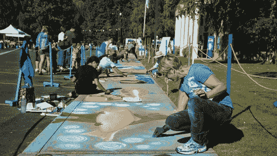

# 企业家和艺术家:同一个人

> 原文：<https://medium.com/swlh/entrepreneurs-and-artists-one-in-the-same-905aad8c5f1>

我的旅程和其他人的一样——我从婴儿开始，并从那里进化。在我看来，我的职业发展有些…古怪。当我写这篇文章的时候，我已经写了我第一部小说的三分之二，经历了两次失败的创业，一次收购，而我只有 26 岁。

# 它开始的地方

我清楚地记得在丹佛大学(T2)学习金融时和同学的一次谈话，我不想每天穿西装打领带去上班。(*应该看到墙上的字……*)

大学毕业后我做的第一件事是什么？我接受了一份穿西装打领带的银行家工作。毕业后大约五天，我开始了我的第一份全职的、看不到尽头的“大男孩”工作。当我看到我的许多同龄人也这样做时，我也看到一些人花时间周游世界，探索新的文化，尝试创新的职业，全心全意地投入到奇妙的未知中。

在将近两年的时间里，我觉得自己好像是在旁观自己的生活。但是，当我的银行生涯即将结束的时候，我不禁感激我在这段时间里学到的一切。我学会了如何在工作场所运作，我精通协作和自主，我与了不起的人建立了联系，最重要的是，我学会了珍惜*牺牲*、*努力*、*耐心*和*创造力*。

# 培养对创业的热爱

正是在这段牺牲的时间里(将近一年的时间是在沙发上度过的)，我发现了真正的自己和我想要成为的人。大多数好故事都是从一个好朋友开始的。

我的朋友在创业公司工作，并大量参与了博尔德技术社区。他所做的对我来说总是难以置信的困难。甚至在大学里，我一直知道我想追求某种类型的创业，但我完全不知道从哪里开始。

他花时间向我和我们的另一个朋友展示了如何在你的电脑上本地托管一个基于 WordPress 的网站，内容管理系统的一些基础知识，SEO 的高级概念，以及我可以从哪里开始在线学习 HTML 和 CSS。

随着我学得越来越多，我想学得更多，做得更多。我不断进步的动力，加上我所学的技能，让我最终放弃了银行家的工作，开始了我在一家初创公司的第一份工作。从那时起，我爱上了在创业公司工作的速度、决心和创造力。

# 创造性的一面

因为我总是感觉落后两步，所以我不仅致力于发展专业技能，也致力于个人技能。在我童年的大部分时间里，我的父母都是小品作家、演员和歌手。我的母亲是一位才华横溢的女裁缝，她也做过一些服装设计，甚至在当地的小学教了几年音乐。

我相信我的成长经历让我觉得我的研究生生活缺乏一定程度的创造力。当我开始建立和维护网站时，我发现我真正的爱和激情在于网站上的内容。我一直是一个如饥似渴的读者，我猜随着时间的推移，我也想成为一个坚定的作家。

所以我开始写作……除了数字内容写作，我开始写短篇小说、个人日记、小说、电视剧本，现在——甚至尝试写单口喜剧。

生活中，总有那么几个故事会一直粘着你。为了让你们理解为什么我认为创造力在所有行业、所有行业都如此重要，我想分享两个描述这一点的小故事。

# 我的妈妈和爸爸

(请原谅我和我哥哥的尖尖的发型……)

我父亲的故事:在我 10 岁或 11 岁的时候，我的父母决定执导一部当地的高中音乐剧。他们的一个朋友找到他们，看他们是否有兴趣。我父母非常犹豫。这会占用很多时间，报酬很少，而且他们会试图控制**高中生** …

但是，经过深思熟虑后，我的父母接受了这项任务。直到今天，我爸爸会告诉你这是他一生中做过的最有成就感的事情之一。许多年前，这所学校根本没有戏剧系。我的父母非常自豪能给这些孩子一个机会去体验如此贴近他们内心的东西。

听我父亲讲述这些孩子在第一次现场表演后是如何容光焕发的，即使是最悲伤的人也会会心一笑。在接下来的四年左右的时间里，我的父母继续执导音乐剧，给这些学生提供他们迫切想要的机会。许多年后，我的父母甚至被邀请参加一些学生的婚礼！

这样一件小事对社区和那些学生生活的影响一直伴随着我。给人们一个创造性的出口和尝试新事物、发现自我的机会，可以改变一个人的一生。

**来自我妈的故事:**不幸的是，我妈在我 16 岁的时候去世了。但是我最美好的回忆来自于小时候我们一起在河边读《T2·哈利·波特》。我妈妈坚信，创造性领域的教育(音乐、写作、表演、歌唱、艺术等)。)也可以帮助你更好地学习和记住更传统教育领域(科学、数学等)的其他概念。).

我相信我在那里继承了我对阅读和写作的热爱。随着时间的推移，我开始相信和我妈妈一样的东西。我不仅相信这会让你更有弹性，还会让你成为一个更好、更有同情心的人。这个概念是我坐下来写这篇文章的全部原因。

# 联系:艺术家和企业家

人们倾向于认为企业家是割喉式的、神童式的、学者型的策划人。**我不同意**。当然，总会有例外，但我总的认为企业家只是简单的*勤奋*、*耐心*、*牺牲*、*创意*、*、*、——**、*、*就像艺术家*。***

企业家是同一个人，在当地的咖啡店里卖他们的作品，只是市场不同而已。小说家的办公桌和小型创业公司的共同工作空间是一样的。一个创始人筹集风险资本的旅程和一个编剧让他们的电视试播集被选中的旅程是一样的。一个音乐人第一次卖掉一个场地，似乎和一家初创公司成功收购或 IPO 是一样的。

类似的例子数不胜数..

**最后一个想法:**我不记得在哪里听过这句话，但它确实让我产生了共鸣:人们会花 400 美元购买坎耶·韦斯特(Kanye West)的新运动鞋，但不会通过购买 30 美元的 t 恤来支持他们朋友的电子商务业务。

我为自己的工作感到自豪，因为我可以将自己内心的艺术家和企业家融合在一起。尽你的一份力量。支持你的朋友、当地艺术家、企业家和企业。不仅在经济上，而且在道德上。我们有道德义务继续支持未来的创意者、创新者和梦想家。

(因为我喜欢他们的广告，这是我能想到的最好的送人地点，去[State Farm ' s Neighborhood of Good](https://neighborhoodofgood.statefarm.com/)网站帮助寻找当地的慈善机构。)

## 这个故事发表在 [The Startup](https://medium.com/swlh) 上，这是 Medium 最大的企业家出版物，拥有 343，876+人。

## 在这里订阅接收[我们的头条新闻](http://growthsupply.com/the-startup-newsletter/)。

