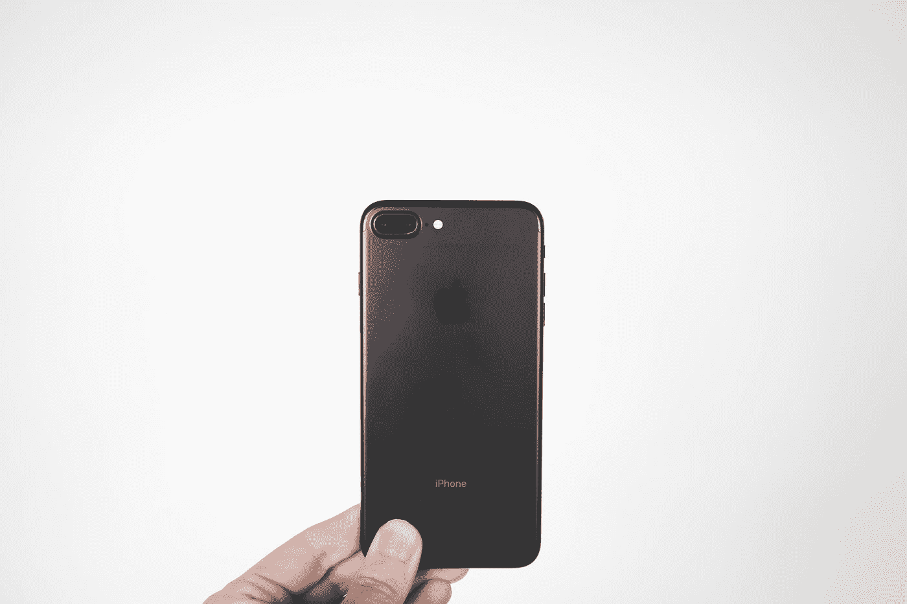

# 创业者:你精神疲惫吗？

> 原文：<https://medium.com/swlh/entrepreneurs-are-you-mentally-exhausted-a86fc6809f1a>

Photo by [NeONBRAND](https://unsplash.com/@neonbrand?utm_source=medium&utm_medium=referral) on [Unsplash](https://unsplash.com?utm_source=medium&utm_medium=referral)

## 今天是开始信息饮食的时候了

我在几英里外就能看到它。十年后，信息排毒将成为一件事。

人们将支付*只是*来获得与信息脱节。你会为一次静修经历付出代价。这些中心会没收你的手机和笔记本电脑，这样你就可以在无聊中享受天赐之福了。

或者，您将向服务提供商支付费用，让其在特定的时间和日期断开您的互联网连接。

你上一次感到无聊是什么时候？

你总是手里拿着一些东西在摆弄——电话、书或笔记本电脑。我们每秒钟都在消耗信息。

我有罪。

当我年轻的时候，我早上洗澡不用花三十分钟。现在，我花了将近一个小时坐在马桶上，向下滚动 newsfeed infinity 或查看 Instagram 模型。

说*是*如果你知道我在说什么。

我们不喜欢在孩子面前抽烟的人。或者当胖子不为他们的体重做点什么的时候让他们感到羞耻。但是那些无法停止使用手机的人呢？

这是一种瘾。我们必须承认我们有，我们应该开始我们的排毒。我可以花几个小时消耗媒体和信息。我们都经历过。

> 我需要为我的文章研究股票市场的年增长率。这看起来是个不错的视频。这是一个优秀的维基百科条目。我很有效率，是的！

五分钟后，[你正在看猫视频](https://www.youtube.com/watch?v=XyNlqQId-nk&t=33s)。这就是我们从高效走向另一个极端的速度。

我不是反互联网。这是我和所有人经历过的最好的事情。但是太多的好事都是坏事。适度使用一切。我们醒着的大部分时间都被它束缚着，这没有任何帮助。

了解每个人的一切令人疲惫不堪。

开始信息饮食。周末休息，或者在一天的第一个和最后一个小时休息。控制你分配精神内存的地方。

那么一旦停止消费，你会怎么做呢？创造。

用你的双手做一些事情——做饭，煮咖啡，或者唱歌跳舞。和朋友一起吃午饭。用笔和纸写字。或者坐下来看看眼前的东西。

回头见，我的朋友。

## 这篇文章发表在 [The Startup](https://medium.com/swlh) 上，这是 Medium 最大的创业刊物，有 323，238+人关注。

## 在这里订阅接收[我们的头条新闻](http://growthsupply.com/the-startup-newsletter/)。

