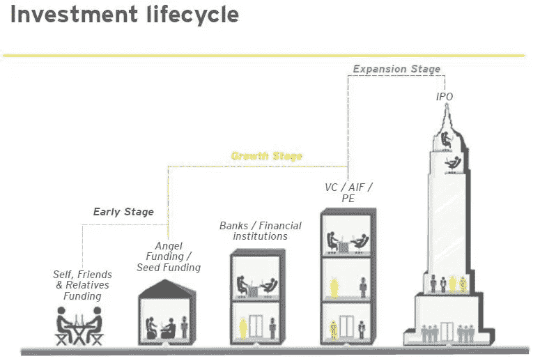
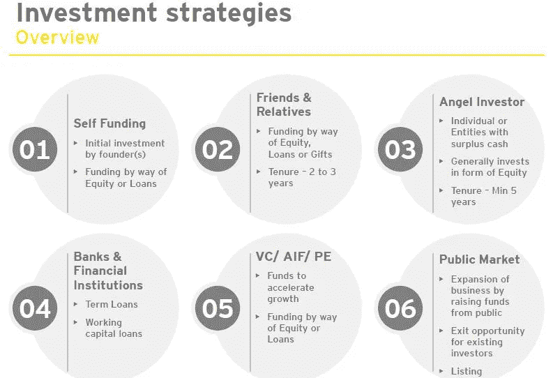
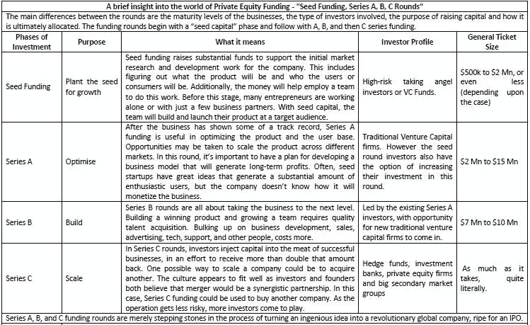
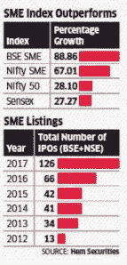
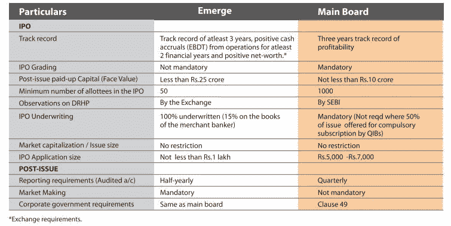
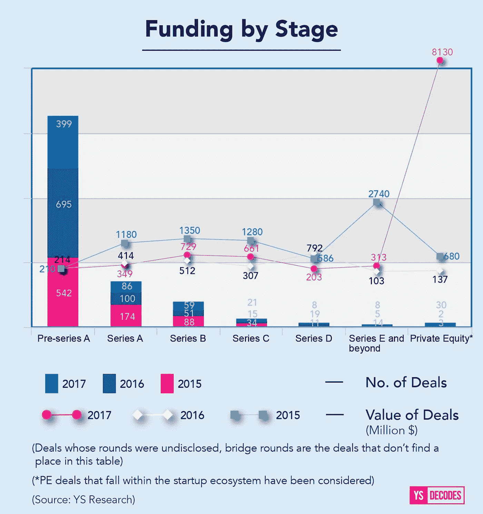
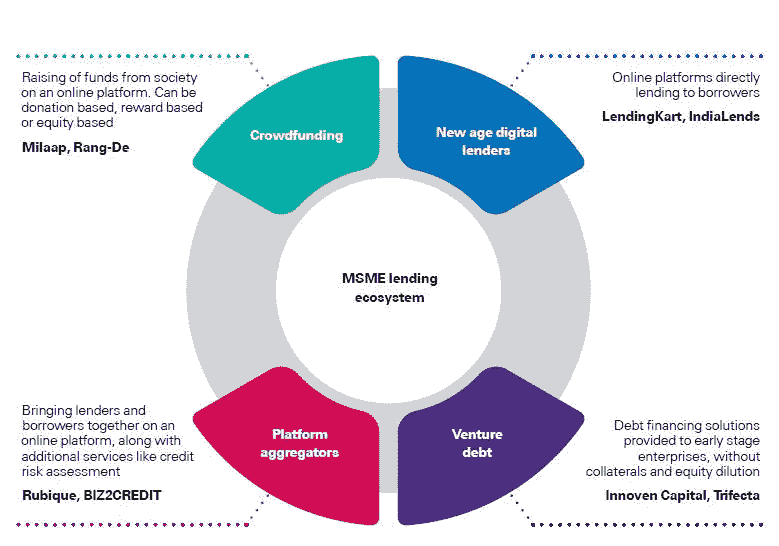

# 初创企业和中小微企业的股权融资:入门

> 原文：<https://medium.com/swlh/equity-funding-for-startups-and-msmes-a-primer-baa4eb6a3625>

——***阿拉斯帕雷***

*许多企业家发现自己在筹集资金和决定股权和债务时进退两难。有很多关于股权的共同担忧，即失去控制权和放弃股权，这导致他们转向债务融资，而忽略了这种策略固有的风险。尽管有时可行且有效，但在错误的时间举债对大多数创业公司来说可能是一种死亡愿望，并使他们走上失败之路。最重要的是，许多微小中型企业并不十分热情，也不知道其他各种融资选择。*

*来自可信投资者的私募股权资金对中小微企业有许多积极作用，如增加净值和加强账面，指导更好地承受动荡的商业环境，灵活安排投资回报，获得高水平的智力资本等。此外，就监管合规性而言，私募股权融资比公开发行融资更容易。应对股权融资稀释的误解的一个简单方法是——通过增值私募股权管理拥有 10 亿英镑的 35%比通过自己的汗水、鲜血和眼泪拥有 10 亿英镑公司的 90%要好。*

*本文将分析创业公司的不同阶段，私募股权投资作为战略投资者的角色，各种融资轮次，当前的私募股权投资场景(包括中小企业的 IPO 前景)以及中小微企业的新兴生态系统*

****启动生命周期****

*每个大企业都曾经是小企业。了解小企业从自筹资金到最终 IPO 阶段的资本生命周期有助于为您的企业找到正确的解决方案。*

*典型的投资生命周期可以用下面典型的投资策略来说明*

**

*Investment lifecycle*

**

*Investment Strategies*

****融资轮次****

***种子***

**

*从这轮融资中获得的资本用于发展创业公司的创始团队，资助产品开发，在某些情况下，甚至促进早期创收。*

*种子投资中包含的是对产品/市场契合度的强烈迹象的预期，以及某种程度的牵引力(以不断增长的等待名单或月环比收入增长的形式)将开始出现，为以后的融资铺平道路。*

*传统上，种子轮是天使投资者的储备，但现金充裕的风险投资基金和大量初创公司的激增吸引了更多风险投资公司进入种子轮投资。*

*最近的例子*

*[Unitus Seed 投资可预测项目](https://inc42.com/buzz/predible-health-unitus-seed-fund-cancer/)*

*[Ankur Capital 领投农业科技初创公司 Agricx Lab 的 50 万美元种子基金](https://inc42.com/buzz/ankur-capital-agricx-agritech/)*

*[算法交易平台 Kuants 筹集种子资金](https://www.vccircle.com/algorithmic-trading-platform-kuants-raises-seed-funding/)*

***A 系列***

**

*收入增长是 a 系列游戏的名称。在这一点上，一家初创公司预计会有明确和不断增长的产品/市场契合度证据，转化为来自新客户的显著收入增长和 ARPA(每账户平均收入)的增加。*

*正是在这里，营销和销售变得更加重要。到目前为止，增长通常是由单一(并不总是可扩展的)渠道驱动的。*

*为了保持快速增长，有必要开发新的销售和营销流程，确定新的渠道，并抓住你的目标客户。*

*最近的例子*

*[健康科技初创公司 eKincare 获得 A 轮融资](https://yourstory.com/2018/01/ekincare-series-a-funding/)*

*[背包熊猫在首轮融资中筹集 140 万美元](http://www.finsmes.com/2018/02/backpacker-panda-raises-1-4m-in-series-a-funding.html)*

*[Pratilipi 在由 Omidyar Network 牵头的一轮融资中筹集了 430 万美元](http://www.livemint.com/Companies/p846LGr28FTiCP5F7K8hhM/Pratilipi-raises-43-million-in-funding-round-led-by-Omidya.html)*

***系列 B***

**

*在 B 轮投资中，投资者正在寻找下一个增长阶段:将你所学的一切转化为规模效益的能力。*

*实际上，B 轮投资可能会让初创公司进行大规模招聘(业务开发、战略客户、营销和客户成功)，扩展到不同的细分市场或尝试不同的收入来源，在戏剧性的情况下，甚至收购具有竞争优势的企业。*

*最近的例子*

*[医疗科技初创公司 Axio 筹集了 740 万美元资金](https://inc42.com/buzz/rnt-capital-funding-axio/)*

*[Edtech 初创公司 AEON Learning 筹集 320 万美元资金](https://inc42.com/buzz/edtech-startup-aeon-learning-funding/)*

*[金融科技初创公司 EarlySalary 获得 1570 万美元 B 轮融资](https://inc42.com/buzz/earlysalary-fintech-funding/)*

***C 系列+***

**

*C 轮融资是为了推动大规模扩张，比如进入一个新市场(通常是国际扩张)，或者推动其他业务的收购。*

*C 轮之后，理论上来说，创业公司可以筹集的投资轮数是没有限制的:一些公司将通过 D 轮、E 轮以及更多轮来筹集投资。*

*鉴于目前能够成功的创业公司数量相对较少，融资金额也存在巨大差异，投资视具体情况而定。*

*[Zoomcar 在由 Mahindra 领导的 C 轮融资中筹集了 4000 万美元](http://www.livemint.com/Companies/Kw9pDom5b3Fy2BhyfXg9QI/Mahindra-to-invest-up-to-Rs176-crore-in-Zoomcar.html)*

*[BigBasket 从阿里巴巴融资 3 亿美元，其他](http://www.livemint.com/Industry/F6wUuKOIjcbRYsIk7ED6mO/Alibaba-leads-300-million-funding-for-Bigbasket.html)*

*融资回合可总结如下:*

**

*Data in the above table has been collated from the article [https://www.investopedia.com/articles/personal-finance/102015/series-b-c-funding-what-it-all-means-and-how-it-works.asp](https://www.investopedia.com/articles/personal-finance/102015/series-b-c-funding-what-it-all-means-and-how-it-works.asp)*

****NSE 涌现——中小企业 IPO 平台****

*中小企业(SME)在融资竞赛中已经超过了它们的大型竞争对手，它们的股票往往比那些名字更吸引人的股票表现好得多。这为寻求通过可靠有效的平台筹集资金的中小企业提供了一个很好的选择。*

*受投资者兴趣的刺激，132 家中小型企业筹集了创纪录的卢比。2017 年通过首次公开募股(IPO)筹集了 178.5 亿欧元，是上一年筹集资金的三倍多。*

**

*筹集的资金用于业务扩张计划、营运资金需求和其他一般公司用途。*

*Zota Healthcare 在今年的首次公开募股排行榜上领先，它筹集了 1000 万卢比。58.50 亿卢比，其次是欧洲印度新鲜食品有限公司，它扫荡卢比。5126 亿。从地理上看，古吉拉特邦继续在 IPO 领域占据主导地位，为中小企业交易所贡献了 51 家公司，其次是马哈拉施特拉邦(39 家)、中央邦(11 家)、德里(8 家)、拉贾斯坦邦(6 家)、特伦甘纳邦(4 家)、西孟加拉邦(3 家)，安得拉邦和旁遮普各有两家公司上市。*

*在审查期间上市的公司代表了不同的行业基础，如媒体和娱乐、制造、纺织、工程、金融、化工、农业、食品加工和建筑。*

*与主板上市要求相比，典型的上市要求更容易理解，如下所示:*

**

****印度当前的私募股权场景****

*2017 年，大部分处于后期阶段的交易开始起飞，人们对早期阶段感到担忧，早期阶段仍然面临压力，尽管资金仍然集中在本加卢鲁、德里-NCR 和孟买。2017 年以 820 笔交易向印度创业生态系统投入创纪录的 137 亿美元而告终。*

*今年的投资价值高于 2016 年和 2015 年，当时的融资额分别为 40.6 亿美元和 84 亿美元。然而，2016 年和 2015 年的交易数量更多，分别为 1034 笔和 913 笔。*

**

****注:新兴生态系统****

*一些金融科技初创公司利用技术构建可扩展的解决方案，将中小企业与潜在的贷款人联系起来，以满足量身定制的要求。*

*除了将贷款人与中小企业联系起来，这些市场还提供一些增值服务，如初级承销、风险评估、基于规则的匹配和无缝支付结算引擎，以实现中小微企业和投资者的双赢。*

**

***私募股权公司和中小企业:它们如何合作***

*印度的中小企业和创业公司可以说有一种典型的行为，如:*

*-不重视系统和流程*

*-促进者驱动的中小企业往往在与促进者本身密切相关的技能组合中得分较高。推广者的核心竞争力成为了公司的核心竞争力*

*-客户是通过一个紧密的网络获得的，有时这些客户是在发展的初始阶段获得的*

*-超出基本客户水平的运营规模往往会受到限制，这最终会阻碍公司的发展*

*建立在增长的基础上是私募股权投资可以发挥作用的地方。潜在的价值创造是这个阶段所需要的，它可以对组织的各个方面产生增量效应。*

*因此，很明显，对于这类中小企业来说，创造价值的重要因素是通过以下方式实现的:*

*-获得新客户以增加收入*

*-高效的系统和流程，确保组织资源的最佳利用*

*-通过激励和定义明确的目标来团结员工*

*这就是运作中的私募股权基金的专业知识能够为中小企业创造巨大价值的地方。*

*带来成本领先地位的技术干预、确保雇佣业内最优秀人才的人力资源干预，以及通过经济高效的营销媒介创造需求，都是通过私募股权创造价值的一些例子。*

*MSMEmitra.com 为没有内部财务管理机制的初创企业和企业提供财务咨询和商业顾问服务。对于这类企业，MSMEmitra.com 在评估实际融资需求、找出最合适的融资方案(债务、私募股权或两者结合)以及寻找资金来源方面提供帮助。MSMEmitra.com 还向初创企业和微小中型企业提供援助，以确定和利用适用的[计划和补贴](https://msmemitra.com/home/schemessubsidies)的好处。*

*如果你是一个企业主，并需要我们的援助，为您的业务的资金需求，与我们联系在 support@msmemitra.com*

*访问[https://msmemitra.com](https://msmemitra.com)网站，对适合您企业的最佳融资方案做出明智的决定，并了解如何利用适用于您企业的计划和补贴*

*感谢您的阅读。*

*—*

****关于作者:*** *Alastair Pavrey 是一位金融和投资专业人士，在向买方和卖方参与者提供基于交易的金融咨询方面经验丰富，热衷于了解印度私募股权、风险投资和中小企业生态系统并为其做出贡献。你可以在推特上关注 Alastair Pavrey—@ Alastair Pavrey。**

***免责声明:***

**文中观点仅代表作者本人。这篇文章是从各种公开材料和二手资料中整理出来的，MSMEmitra.com 不能保证内容的准确性。本文得出的观点和预期是基于作者和 MSMEmitra.com 编辑团队对该行业的分析。要求读者在做出任何具有内在财务风险的决定之前，先检查他们那端数据的真实性。**

**

## *这篇文章发表在 [The Startup](https://medium.com/swlh) 上，这是 Medium 最大的创业刊物，拥有+ 370，107 名读者。*

## *在这里订阅接收[我们的头条新闻](http://growthsupply.com/the-startup-newsletter/)。*

**