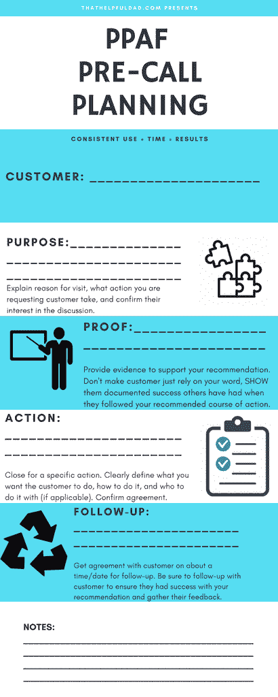

# 销售代表致电前规划基本指南

> 原文：<https://medium.com/swlh/essential-guide-to-pre-call-planning-for-sales-reps-7a0b5807938>

改善客户关系和增加销售的关键

Source: Pixabay CCO

总结:在这篇文章中，我将解释与销售相关的电话拜访前计划的重要性，谈论我使用的称为 *PPAF 电话拜访前计划*的方法，分享我关于如何使用 PPAF 方法快速有效地进行电话拜访前计划的技巧，并且还会给你一份免费的打印材料，这样你就可以自己使用 PPAF 方法了。你可以在这篇文章中以书面形式获得信息，或者通过下面的视频观看。

我也邀请您分享您对致电前计划的建议和反馈——我一直在寻找新的想法来改进。

这是 PPAF 拜访前计划方法的直观概述…

编者按:在这篇文章中，我将讨论医药销售行业中的拜访前计划，但这种策略适用于几乎任何面向客户的销售互动，这种互动具有长期的销售周期。

# 致电前规划—我是谁？

Michael Stoppa

*   首先让我说，我并不把自己标榜为销售大师，我也没有写过任何关于销售的畅销书(至少现在还没有)，相反，我更喜欢谦逊的道路。话虽如此，我确实每天都在现实世界中生活和呼吸着销售，在过去的 25 年里，我一直是一名**一线**(也就是与客户互动)销售人员。我并不是因为发明了“打电话前”计划而居功，也不是说 PPAF 方法是最好的。我在这里只是想和你分享我在漫长的销售生涯中学到的一些策略，这些策略给我带来了显著的变化。
*   我每天都用 PPAF 方法。它工作了。**我认为 PPAF 方法是我销售成功的“支柱”之一。**在我的职业生涯中，我曾在多个行业工作过(金融服务、医药销售、零售、医疗设备销售等)，无论是哪个行业，我都有幸年复一年地持续超额完成销售指标——我目前已经连续 7 年实现 100%以上的销售指标，收入和销量每年都在增长，我可以告诉你，PPAF 方法是成功的重要因素。
*   此外，几乎所有我培训过的销售代表或多年来与我共事过的经理都称赞我将 PPAF 方法作为一种最佳实践，他们中的许多人已经在自己和团队中采用了这种方法。
*   今天我与你们分享 PPAF 方法，因为[我喜欢给人们提供帮助他们成功的实用解决方案](https://thathelpfuldad.com/)。这就是我的博客。

Video Version of this article

# 什么是致电前规划？

“拜访前计划”的概念并不新鲜，为了我们讨论的目的，我们将对拜访前计划进行如下定义:如果“拜访”本身就是客户互动，那么“拜访前”就是*在*互动之前的准备工作。

**为什么要花时间在“拜访前”计划上？**

持续进行拜访前计划有很多好处。我喜欢把拜访前计划看作是一种高投资回报率的“投资”。考虑以下情况…

1.  **时间是宝贵的** —我们生活在一个快节奏的世界，似乎没有人再有时间了。致电前规划让您能够更好地利用与客户相处的有限时间。这也向他们表明你尊重他们的时间和你的时间——带着一份计划进来，你的专业性将是不言而喻的，这将立即增加你的可信度。
2.  **专注于你的目标**——你肯定有一个你想在客户拜访期间完成的目标，对吗？致电前计划将帮助您实现这一目标——不仅为您自己，也为您的客户。这种专注会给你更好的机会去实现目标。
3.  适当的准备会带来更好的结果。如果需要的话，打电话前的计划不会让你变成一个在电话中不能灵活应变的机器人，但它会让你准备得更充分。你将准备好证据来源，帮助客户对你推荐的行动更有信心，你将预测客户的异议并准备好解决它们，你将知道你想在哪里接听电话，等等。所有这些准备，加上你对特定目标的关注，将会增加你的目标实现。
4.  **方法的一致性:**如果你发现一个有效的策略，你想重复它，对吗？这就是打电话前计划的要点——这是一个行之有效的策略，如果你坚持使用它，你的结果也会改善。
5.  **带来价值** —制药行业有一句谚语“简短，精彩，然后离开”——你的客户没有时间整天陪你，他们很忙，但如果他们同意与你会面，那么他们这样做是希望你能为他们提供一些有价值的东西，让他们的工作变得更容易。使用拜访前计划可以让你以简化的方式向他们提供价值，并从长远来看赢得他们的尊重。这将导致客户*希望*见你，因为他们相信你能帮助他们。
6.  **更多销售** —销售的底线是更多销售，对吗？致电前规划为您提供了路线图，让每次客户互动都有更高的机会促成销售，因为奖品总是在眼前，您和客户都知道致电的目的。结果是更高的成交率。

# 拜访前计划的 PPAF 方法

我在上面提到过[我相信实用的解决方案](https://thathelpfuldad.com/)。在我漫长的销售生涯中，我接触过各种各样的致电前计划方法。在打电话前计划的情况下，有很多方法可以解决问题。PPAF 方法是我对电话前计划的最基本、最实用的解决方案。

PPAF 方法不是火箭科学，当你读到它时，你可能会说“啊，这是显而易见的。”虽然这可能是真的，但事实是我在任期内遇到的 90%的销售人员都不做任何拜访前计划，和/或没有一个他们遵循的一致方法，和/或不使用专注于特定销售目标的方法。因此，90%的销售人员很难持续完成销售配额。这种缺乏一致性的情况已经被无数销售代表的经理抱怨了很久，他们反复要求我分享 PPAF 方法作为最佳实践。

事不宜迟，下面是 PPAF 的致电前计划方法…

> *目的、证明、行动、后续。*

啊，就这样？是的，差不多。

我说过，PPAF 很简单。很好用。这很有效。**顺便说一句，一定要滚动到页面底部，以获得 PPAF 方法的免费打印本。**

同时，让我们更深入地了解一下 PPAF。

## **1-目的** —这就是你来访的原因。

*   我建议你在寒暄过后，首先向客户说明这一点。
*   例如，“嘿，医生，我今天来这里的原因是讨论你如何使用产品 X 来帮助患者 Y 的 Z 状态，这是你有兴趣讨论的吗？”
*   目的至关重要，因为它不仅能直接切入主题，而且有助于你和客户在互动中聚焦于一个明确的目标。在这种情况下，我们要求医生将产品 X 用于特定的患者资料(例如，条件为 Z 的患者)。这种关注让每个人都知道正在进行的通话的“路线图”。
*   专业提示:为了更进一步，我喜欢在实际拜访之前**就目的达成一致——我会在*之前*电话的“跟进”阶段和/或通过在会议之前向客户发送电子邮件来确定我即将进行的拜访的目的。这样你就可以说“就像我们上次通话时商定的那样…”或者“就像我在邮件中说的那样…”**
*   注意关于“你有兴趣吗”的**问题这是另一个关键部分。**这不仅能让你进入成交心态，还能让顾客进入“是”心态——假设他们对提议说“是”。
*   但是如果他们说‘不’呢？问得好。多年来，我发现许多销售代表非常害怕被拒绝，他们甚至不敢问像这样最基本的问题。*然而，你需要知道这个问题的答案，然后才能继续*。如果客户说他们对您的讨论不感兴趣，那么这是一个信号，表明在您继续进行与此目标相关的销售之前，您还有更多工作要做(例如，让医生为该患者开 X 产品的处方)。
*   如果你不问这个问题，而是继续进行销售拜访，你永远不会知道你的客户还没有准备好“购买”你的推荐。结果，你会浪费他们和你的时间，更糟糕的是，你会降低你在这位客户中的可信度。所有这些都可以通过问“你感兴趣吗”这个问题来避免。
*   现在假设他们说“是”，假设你的提议是合理的，并有可信的证据支持，那么问“你有兴趣吗”这个问题是一种试探性成交的形式，有助于客户将自己置于购买心态中，因此当你稍后采取行动时，他们会更倾向于同意你的建议。这是纯金的，很好用。

## **2-证据**——这是你支持自己推荐的“证据”。

*   在我们的制药示例中，它可能是临床再版，显示使用产品 X 治疗 Z 状态患者的疗效，也可能是您的详细信息或移动设备上的另一种视觉辅助工具。无论文档是什么，它必须是相关的和令人信服的。最重要的是，你必须准备好简洁地展示证据，清楚地表明为什么/如何相关——记住上面的“简短，精彩，离开”部分——这是这种心态的关键所在。
*   例如，“你看到鲍勃·埃文斯在《新英格兰医学杂志》三月份发表的文章了吗？埃文斯博士对患有 Z 状态的患者进行了一项试验，他发现使用产品 X 的患者能够将 Z 状态降低 35%。你对这项研究有什么看法？”
*   显然，不言而喻，这是一个淡化的例子。在制药业，还有其他展示临床的最佳实践(我更喜欢[肥皂法](https://www.kaptest.com/blog/med-school-insight/2016/06/22/what-m3s-need-to-know-for-soap-oral-presentations/))，对论文进行不带偏见的综述也很重要，其中包括对安全性的讨论。但希望你能明白，在这个例子中，我使用的证据显然与目的相关，我用语言表达出来并确认客户同意，我将我的行动设置为紧随其后，这是这里的关键要点。
*   注意:在本例中，“Bob Evans”是与我们的客户在同一个实践领域中受人尊敬的[“关键意见领袖”](http://mediakix.com/2017/08/kols-key-opinion-leaders-definition-influencers/#gs.TZ7efOw)，这一点很重要，因为如果我们知道我们的客户高度评价 Evans 博士是一位思想领袖，那么我们就能够有效地利用我们的证据来验证我们将要向客户推荐的行动。这就变成了“不要相信我的话，记住，这也是埃文斯医生为他的病人做的事情……”
*   这可能是**大多数销售代表为之奋斗的部分**，我在销售生涯早期也是这样做的。由于责任重大，人们很容易不花时间去真正了解您的证据来源，但不幸的是，当您想与客户一起使用它们时，这会导致问题，因为您最终会在 PPAF 流程的这一关键步骤中苦苦挣扎(或者更糟的是，您试图完全跳过这一步)。请不要这样做。当你无法提供证据和/或你无法自信地(简明扼要地)解释时，你将失去客户的信任，这一点你们双方都会感觉到。我知道。我去过那里。一点都不好玩。这是销售杀手。相反，做好了解证据来源的准备——这是一项投资，将获得 10 倍的回报。
*   你如何处理“证明”阶段？请在下面留言，这样我也可以向你学习。
*   我并不是说你必须成为客户业务各个方面的专家(例如，如果你是一名向医生展示的医药代表，没有人指望你是医生，也没有人指望他治疗的每一种疾病)，但你成为你产品的专家是合理的，你对你的证据来源有信心也是合理的，这样你就可以回答关于它的问题(或者知道在哪里/如何获得答案，如果这些问题超出了你的专业知识)。
*   专家提示:**证明步骤应该包括对话**，而不仅仅是你的独白。在演示过程中，使用签到问题来确保您的客户跟上并理解证据是很重要的。例子包括“你认为这项研究是如何建立的？”或者“这个试验中的病人和你的相似吗？为什么/为什么不呢？”或者“你在做什么与埃文斯医生相似/不同的事情？”或者“当你对患有 Z 状态的患者使用产品 X 时，你会得到什么样的结果？”
*   这个问答很重要，因为它会发现你在提出建议之前需要解决的任何隐藏的异议。

## **3-行动** —这是你的结案陈词。

*   你的成交是你希望客户采取的行动，你说得越具体，客户就越容易理解，你就显得越通情达理，就你建议的行动达成一致的机会就越大。
*   关于特异性的一句话——请记住，我们在这里并不是在奢求什么——也就是说**我们并不是要求我们的客户随意地为他所有患有各种疾病的患者使用产品 X。不。相反，我们只是要求他为患有 Z 状态的患者使用 X 产品，这一建议得到了一位关键意见领袖的研究支持，这位领袖受到我们客户的尊重，并以与我们提议的完全相同的方式使用 X 产品。这不是火箭科学。这是一个被证明有效的合理行动(就像 PPAF 方法一样！)**
*   到现在为止，您已经进行了健康的对话，您已经提出了支持您将要推荐的行动的证据，您已经解决了客户可能提出的任何异议，老实说，行动结束基本上是一个预料之中的结论，因为您和客户在整个通话中都专注于这个目标。现在是完成交易的时候了。
*   **继续我们的例子**，“那么，医生，你已经看到了 Evans 医生如何使用 X 产品来治疗他的 Z 状态患者，你说你也希望你的患者得到类似的结果。如果这是真的，那么要求你对患有 Z 病症的患者使用 X 产品是否合理？”
*   这是一个真正淡化的版本，我会对它进行更多的定制，但出于我们讨论的目的，它让我们明白了这一点— **行动追溯到证明，证明追溯到目的**。都是直线流动的。
*   其他定制包括:
*   “你现在有没有 Z 状态的病人？我们能在他们身上试用产品 X 并监测结果吗？”
*   “下一次你打算什么时候去看 Z 状态的病人？你愿意尝试 X 产品来帮助他们吗？”
*   “让我们这样做——下次你遇到 Z 状态的病人时，你试试 X 产品怎么样？然后**在我下一次就诊时，我们可以讨论你的结果**，看看你是否得到了和埃文斯医生一样好的结果。”
*   Pro 提示:下一级版本:“这个你怎么看？不如你在下几个 Z 型病人身上试用产品 X，我们会监控结果。同时，我还联系了 Evans 博士，看他是否有时间与我们进行现场会面，然后我可以与您的小组管理员合作，使用我公司的一个标签案例研究演示，就该主题建立一个互动论坛讨论。这对你和你的团队有价值吗？”(这使您能够**继续“关键意见领袖”销售策略**，并进一步鼓励和支持您的客户沿着您推荐的道路前进，这是一个很好的增值提议)。
*   “请记住，我是来帮助您取得成功的，所以如果您对 X 产品的使用有任何疑问，我和我的医疗团队都可以帮助您，这样您在这个过程中就不会孤单。”
*   **您使用了哪些最佳收尾实践？**我一直在寻找增加我的曲目，所以请分享！
*   与证明步骤一样，制药行业可能还需要包括其他要求。你所在的行业可能也是如此。根据需要修改讨论内容。

## **4-跟进** —这是你与客户安排下一次通话的方式。

*   任何取得长期成功的销售人员都会告诉你，对客户的持续跟进是他们成功的基本支柱之一。很多人可以完成一笔交易……然后再也见不到那个客户。正是那些跟进客户的人让客户买得更多，并让客户告诉*其他*客户你的情况(这导致更多的销售)。
*   在我们的示例中，我们将在当前的*通话中为我们的下一次通话设置类似这样的跟进，“好的，医生，你说过你会在接下来的几个患有 Z 状态的患者中试用产品 X，你还说过你认为你会有 3-5 个患者可以在接下来的几周内尝试这种方法，对吗？所以我两周后过来看看怎么样？我们下次见面什么时候合适？14 号早上 7 点在你见第一个病人之前可以吗？如果没有的话，16 号下午 4 点在你结束医院巡视后怎么样？”*
*   **你最喜欢的跟进方式有哪些？我很想知道你对这一重要步骤的想法。**
*   确保你真的做了后续工作！你投入了这么多时间和精力来促成这次销售。顾客接受了你的建议。销售结束了。生活是美好的。在这里很容易犯错误，专注于从其他客户那里获得更多的销售，但这将是一个错误。你这里有一个很棒的顾客。跟他们跟进。确保他们成功。确保他们是回头客。然后让他们也告诉他们的朋友——这是一条比总是试图从零开始开发新客户更容易实现更多销售的途径。
*   专业建议——如果你**与这位客户**建立了良好的关系，并且他们成为你产品的专家用户，一个全新的选择世界就展现在你面前——也许这位客户会成为你当地的关键意见领袖？也许他们会对有助于产品市场增长的研究感兴趣？也许他们会成为你的私人朋友，丰富你的生活？这就是有效跟进的力量，我可以告诉你这很有效，因为我已经通过跟进做了所有这些事情，甚至更多。试试看！

## **PPAF 附加提示**

1.  使用记事本——在我的销售拜访中，我总是带着记事本。我使用它有两个原因…

*   首先，因为**我在记事本**上写下了我的整个 PPAF，并在与客户互动时随身携带这个记事本——这确保了我的路线图一直摆在我面前，并帮助我继续朝着我的目标前进。
*   第二，因为**我会在通话过程中做笔记，以捕捉关键事项供后续跟进**。
*   如果这是我第一次和顾客打交道，我会问“你介意我做笔记吗？”在 25 年多的时间里，我从未遇到过顾客说“不”
*   我相信记笔记给这个过程增添了一种专业的氛围——它向客户表明我关心他们必须说的话，我认为这给了他们信心，我会实际做我说过我会做的事，因为我把它写下来是为了记住它。

2.为什么叫 PPAF？

*   显然，每个单词(目的、证明、行动、跟进)的第一个字母拼成了首字母缩写“PPAF”
*   我本可以把它改成别的东西，增加更多的步骤来创造一个更好的单词，但老实说，那只是营销上的一点小事。
*   PPAF 是一个独特的，公认的愚蠢的词，但它是如此的古怪，以至于它令人难忘——至少对我来说。我希望你会有同样的感觉。
*   PPAF——这很简单。很朗朗上口。很好记。试试看。

# PPAF 电话会议前的规划可打印

单击此处下载 pdf 版本的 PPAF 方法，您可以在自己的销售拜访中使用它…

> [T5【PPAF】前期策划 ](https://thathelpfuldad.com/ppaf-pre-call-planning/ppaf-precall-planning/)

# 这有帮助吗？

要获得更多类似的技巧，一定要关注我的博客。

同时，这里有另一篇受欢迎的文章，可以帮助你提高邮件回复率——也就是让更多的客户阅读和回复你的邮件…

Click the pic for 13 Tips to help you increase your email response rates

*原载于 2018 年 4 月 4 日 thathelpfuldad.com***。**

**

## *这个故事发表在 [The Startup](https://medium.com/swlh) 上，这是 Medium 最大的创业刊物，拥有 313，216+人关注。*

## *在这里订阅接收[我们的头条新闻](http://growthsupply.com/the-startup-newsletter/)。*

**