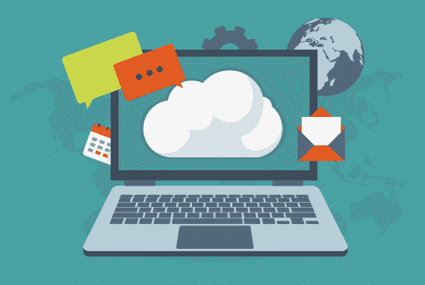

# 跟踪 SaaS 订阅的基本指标

> 原文：<https://medium.com/swlh/essential-metrics-for-tracking-saas-subscriptions-6d807a09112f>

Image courtesy of makyzz/Freepik

随着 SaaS 基于订阅的软件有望继续呈指数级增长，管理这种增长变得越来越重要。以下是开始跟踪您的 SaaS 订阅的指标列表。

*注意:要开始管理您的 SaaS，请考虑下载(免费)*[*SaaS 管理电子表格*](https://app.alpin.io/?utm_source=marketing-content&utm_medium=website&utm_campaign=saas-spreadsheet) *，其中汇集了许多指标。*

# 发现

首先，你要找到你的 SaaS 订阅。大多数公司都有大量的影子 IT。无论你的员工是否有意隐藏它们，这些应用程序都很难被发现。有很多方法可以隐藏这些[订阅，如果你选择接受，你的任务就是找到它们。](https://alpin.io/blog/managing-saas-spend/)

您可以从手动流程开始，例如询问他人或查看费用报告。这将发现整个组织中正在使用的一些应用程序。你可以使用像 Alpin 这样的自动发现工具来升级你的游戏，它可以使用各种方法来发现你的所有应用。

无论您选择哪种方法，您都需要收集每个 SaaS 订阅的一般信息。以下是您应该跟踪的一些数据元素:

*   应用程序名称(如果一个应用程序有多个合同，您需要确保每个名称都是唯一的)
*   订阅级别
*   许可证类型
*   应用所有者或管理员(职能和财务)
*   部门(分配成本中心)
*   类别(应用程序的类型)
*   付费或免费
*   合同详细信息的位置

# 成本/许可证/续订管理

一旦你有了应用程序的工作列表，下一步就是开始追踪你的成本和合同。通过[准确跟踪这些订阅](https://alpin.io/saas-asset-management/)，您可以提高效率并显著降低成本。主动管理这些合同将改善预算，帮助您[实现 SaaS 许可证合规性](https://alpin.io/blog/saas-license-compliance/)，并让您在续约谈判中占据上风。

你拥有的 Saas 应用越多，控制成本的工作量就越大。跟踪 SaaS 订阅续订可能是一项巨大的任务，如果处理不当，会耗费大量时间和资源(更不用说压力了)。这可能让人觉得新的注册和续订是一场永无止境的打地鼠游戏。

自动化可以消除这一耗时且容易出错的过程。Alpin 可以帮助您削减高达 30%的 SaaS 成本，管理续订，确保许可证合规性，监控和归档活动，获得重要事件的通知，等等。您可以在一个仪表板中管理您的所有 SaaS 应用程序，避免意外，并更明智地进行协商。

要跟踪的成本指标:

*   购买日期
*   续订日期
*   取消日期(即“通知”日期)
*   成本驱动因素(此订阅如何向您收费，例如，基于用户数量、GB 存储、数据库中存储的联系人、固定费用等。)
*   在您的合同中购买的单位
*   供应的单位
*   已调配和活动的用户(以识别未充分利用的用户)
*   利用不足造成的浪费支出
*   未正式预配的活动用户(以识别过度预配)
*   因过度调配用户而不符合许可证合规性所带来的财务风险
*   计费频率
*   计费时间
*   总成本
*   支付历史
*   历史和预计总成本

高级指标可能包括:

*   不同部门、地点等每个员工的成本。
*   如果特定部门、地点等的招聘增加 X%,预计总成本。
*   冗余/重复的应用程序浪费了开支

# 安全性

对您的活动应用程序的安全性进行广泛的研究，以及他们可以访问哪些数据，是一项艰巨而又必要的任务。根据 [Ponemon Institute 的调查](https://securityintelligence.com/know-the-odds-the-cost-of-a-data-breach-in-2017/)，数据泄露的几率已经增加到 1/4，平均成本估计为 362 万美元。此外，[超过一半的 IT 专业人员](https://www.mcafee.com/us/resources/reports/rp-building-trust-cloudy-sky-summary.pdf)已经确定 SaaS 的一个应用程序是恶意软件的感染源。你知道在你公司的幕后有哪些应用程序在运行吗？

你的用户告诉过你他们的游戏应用吗？约会应用？赌博应用？我们承诺，它们就在那里，它们不仅仅是浪费时间，它们也是潜在的安全风险。安全风险的另一个方面来自用户公开共享包含机密信息的文件。这种数据泄露会带来严重的后果。

要跟踪的安全指标:

*   每个应用程序的数据泄露历史
*   每个应用程序的已知漏洞
*   每个应用程序可访问的数据元素
*   授予每个应用程序的权限
*   每个应用程序符合 GDPR、HIPAA、ISO 27001 等标准和认证。

由于这些信息很难获得，所以可以考虑使用 Alpin 这样的解决方案，专注于 SaaS 应用程序的安全性。Alpin 不仅能为你提供信息，还能让你将存在安全风险的应用程序列入黑名单。Alpin 将告诉您哪些文件是公开共享的，这样您就可以采取行动，将数据放回内部。

我们希望这个列表能帮助你提高你的 SaaS 管理。免费下载我们的 [**免费 SaaS 管理电子表格，让你轻松入门。**](https://alpin.io/blog/saas-management-spreadsheet/)

了解 Alpin 如何帮助您只需两次点击即可发现 SaaS 的使用情况！

[**现在试试 ALPIN**](https://cta-service-cms2.hubspot.com/ctas/v2/public/cs/c/?cta_guid=4cb67a41-1f72-4a36-a4b3-16ac55232696&placement_guid=00e86a3c-0856-4a5d-9996-71c3ffdd2555&portal_id=2073692&redirect_url=APefjpGjP59RtO9nT2uSIKd57MqBK_jNQEKfEydvWF1mxSXUhIpyzBQYo0ouGcEkmpqeI__m-NFE4ctvBLbEQt22OL8VZ-TDsg7uJi4AFYOkWgeZpHvoO1AVqBbsfyzUql-hOAvgDjF61NJxU1HqD9qh6LN4fTVNeLQ4c2h6oE2ksrSvdTXyA6MGKB3M_5JPjnB63chgDSD8lIfkvjNB7ykpp_io33eam7Lpj8V3uEsxs4RS0ta7FUlvLe0IL-xbcC1X--OGN-cluD8icYbL6NpcJbLcc8ezDhl2tqu2IQY3EQO8BcTwRyqQK2MWnlKDYPJdTCYGSpPH&hsutk=5f92a9529c7ba0c5d8e62ad381d09caa&canon=https%3A%2F%2Falpin.io%2Fblog%2Ftracking-saas-subscriptions%2F&click=314cc827-f657-460e-affe-8d8e25d093ed)

## 这篇文章发表在 [The Startup](https://medium.com/swlh) 上，这是 Medium 最大的创业刊物，有 320，924+人关注。

## 在这里订阅接收[我们的头条新闻](http://growthsupply.com/the-startup-newsletter/)。

