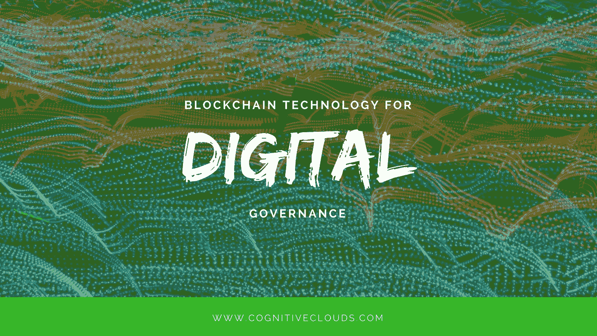

# 面向数字治理的区块链技术

> 原文：<https://medium.com/swlh/essentially-the-blockchain-is-a-global-shared-incorruptible-and-hence-trusted-ledger-of-economic-4889b8a321b5>

从本质上来说，区块链是一个全球性的、共享的、廉洁的、值得信赖的经济交易账本。它由所有参与者平等控制，保持透明，但不公开。把它想象成一个稳定增长的记录或块的电子表格，使用高级加密技术，创建一个永久记录，其中每个块链接到前一个块。为了确保其一致性，网络中的每个参与者都会对记录的每个条目进行验证和协调。

# 潜力

你可以对区块链技术进行编程，记录任何可以用代码表达并具有价值的东西，而不仅仅是金融交易。任何东西，从教育证书、财产契约、所有权、结婚证、财务账户、保险索赔、医疗程序到选票，都有无限的可能性。此外，区块链向从小型农村社区到大型社区的每个人开放全球经济。

# 应用程序

非中介化交易是区块链必须提供的重要潜在特征之一。例如，比特币没有中央单位或银行来监管这种货币。共识是常用的治理模式。如今，政府受托管理和保存官方记录，就像财产契约一样。很快，区块链可能会取代地方或州政府机构的角色，成为某些记录的真实持有者。

这样，通过问责制和完全绕过中间人，区块链阻止了腐败。去年，世界粮食计划署在巴基斯坦信德省开始测试以区块链为基地的现金和粮食交易。区块链拉近了他们与服务对象的距离，让他们的反应速度更快。有了在巴基斯坦初始阶段的经验教训，WFP 现在使用区块链进行身份验证，并使用生物识别登记数据来支付约旦阿兹拉克难民营难民的食品费用。随着 Aadhaar 卡在印度越来越普遍，印度在寻求转变为数字经济的过程中，下一个明智的步骤可能是采用区块链。从存储个人数据、维护私人和永久身份记录、帮助进行安全交易，到最终将印度转变为数字社会，区块链可以发挥至关重要的作用。

公民和政府官员是否会对这样的结构有足够的信心还有待观察。国家会是区块链的创造者，然后是管理者吗？这种结构可能会给市民带来更高的安全感。政府一直扮演着可信管理者的角色。像财产转让这样的交易，如果没有可信的管理者参与，可能不会得到公民的信任。

# 结论

把区块链想象成基础技术，就像互联网一样，各种各样的应用程序都是建立在这个基础上的。支付是区块链的第一个广泛应用，就像电子邮件是互联网的第一个大规模应用一样。区块链的应用已经扩展到支付之外，就像互联网迅速扩展到电子邮件之外一样。it 的最初应用是涉及审计的应用，如审计跟踪、信息谱系的重要记录、管理所有权、由于记录错误而必须协调的几个数据库或系统、管理物理或数字资产、管理涉及几个第三方的协议或合同。虽然区块链技术在更多方面得到应用，但培训、业务流程和专业知识，甚至商业语言都将发生变化。[区块链技术](https://www.zibtek.com/Blockchain-Application-Development-Service)和经济学将冲击标准商业思维和白话。

虽然区块链将有助于提高政府服务的执行，但它不能弥补一个低效的系统。通过使政府更加透明和负责，即使它阻止腐败，它也不能阻止虚假信息进入网络。即便如此，这对政府来说也是一个极具吸引力的机会。通过拥抱区块链，政府可以建立一个专注于实验和创新的官僚机构，一个寻求效率最大化的国家，以及一个基于技术承诺的可持续经济。

*原载于产品洞察* [***博客***](https://www.cognitiveclouds.com/insights/blockchain-technology-for-digital-governance/) *来自 cognitive clouds:Top*[***Ruby on Rails 开发公司***](https://www.cognitiveclouds.com/custom-software-development-services/ruby-on-rails-development-company)

## 这个故事发表在 [The Startup](https://medium.com/swlh) 上，这是 Medium 最大的企业家出版物，拥有 293，189+人。

## 在这里订阅接收[我们的头条新闻](http://growthsupply.com/the-startup-newsletter/)。

