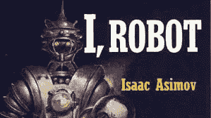
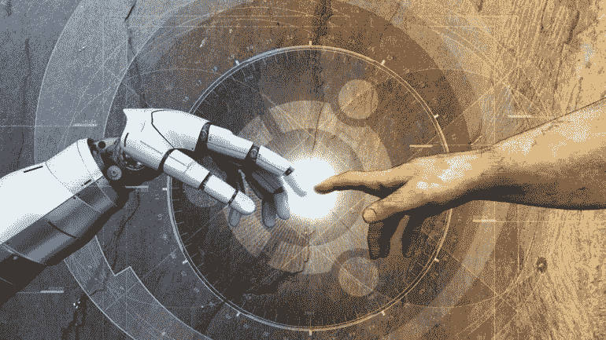
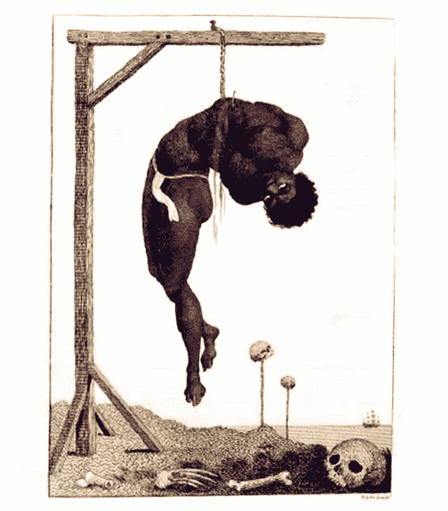

# 伦理、人类和人工智能

> 原文：<https://medium.com/swlh/ethics-humans-and-ai-ab5b0ef433d7>

由[**拉梅什·戈里·拉格万**](https://medium.com/u/2d339de77f89?source=post_page-----ab5b0ef433d7--------------------------------) **和** [**苏坎特·库拉纳**](https://medium.com/u/6d41261644a8?source=post_page-----ab5b0ef433d7--------------------------------)

I, Robot cover from Asimov’s famous novel

首先，伦理、道德和法律是截然不同的实体，尽管任何法律体系都是以执法者或守法者的伦理为基础的。伦理通常是绝对的，而通常由宗教和社会力量强制实施的道德是相对的。因此，尽管杀人在所有情况下都被认为是不道德的，但在许多社会的某些情况下，如战争或宗教认可的谋杀(例如，对叛教者的谋杀)，可能并不被认为是不道德的。法律以类似的方式与伦理和道德相互作用；因此，杀死一个被宣布为“国家敌人”的人，如被判“叛国罪”的人，或被指定为“敌方士兵”的另一个国家的武装公民，不被视为非法谋杀。另一方面，根据包括印度在内的许多国家的法律，安乐死是非法的，尽管一些宗教，如耆那教，可能不认为这是不道德的。

但是谁的行为可以被认为是道德的或不道德的或非法的呢？为此，我们来看两个自古以来就争论不休的哲学概念:人格和代理。

人格是承认一个实体有权享有某些权利，同时也要承担责任；由国家、宗教团体或社会习俗赋予的。就本文的目的而言，我们将仅限于考虑法律下的人格，因为其他形式在现代社会中是不可实施的。几乎所有国家的法律都承认两种形式的人格，自然人和法人。

今天，在几乎所有国家，所有超过法定年龄的人都享有完全的自然人格。这些人，无论是否是公民，都有权享有某些权利，承担某些义务，并对不作为或作为承担责任。低于法定成年年龄的人可能无法获得完整的人格，因此被限制行使某些权利(如投票)和追究犯罪行为的责任(因此未成年人不会面临法律的严惩)。

授予非人类实体法人资格，在法律上，这些实体将被视为“人”；这总是延伸到执行金融交易的主权国家、政府机构、公司、非政府组织、协会等，并可能在法院受到起诉。这是法律允许公司寻求法律保护和纳税的基本原则。此外，这种“法律拟制”还延伸到“独资公司”，在这种情况下，由一个人行使的职务可以具有独立的法律权利、义务和责任，而与行使该职务的人无关；一个国家的总统或总理就是最好的例子。

Image from [Computer Business Review](https://www.cbronline.com/internet-of-things/cognitive-computing/artificial-intelligence-learn-religion-morality-ethics-new-tech-fund/)

只有享有人格或受人格支配的实体才能被要求拥有道德。长期以来被宗教、社会或法律剥夺了人格的实体，无论是活着的还是其他的，如非人类的生命体、工具、机械装置，都不需要在道德基础上行事。这依赖于代理，代理是一个相关的哲学概念。

代理通常被定义为做出自己决定的能力和理解其后果的能力。作为法律专业人员或公司实体的人的代理被认为是完全形成的。一个成长中的孩子的能动性被认为是在发展，因此他们在达到法定成年年龄之前，免除了大部分责任，并被剥夺了几项权利。动物、植物、任何其他生物、工具或机械装置的作用被认为是不存在的。根据法律，它们是个人或公司实体的财产。如果无人认领，根据国家征用权原则，它们是国家的财产。

你会意识到代理是独立于情报的。大多数国家的法律不要求进行智力测试来授予代理权(尽管这是为什么儿童没有得到与成人同等待遇的基本假设)；因此，智障者在达到成年年龄时不会被剥夺法律人格。因此，无论一个动物或机械装置有多聪明，它都不属于任何媒介，因此也不属于任何人。

这是确定拥有人工智能的实体(以下简称 AI)的“道德”的法律基础。如果法律(比如法院或议会)在未来赋予人工智能设备以人格(或者像沙特阿拉伯的索菲亚已经发生的那样)，它将立即享有法律赋予的权利、国家要求的责任和法律强加的义务。这是对“人”道德行为的唯一要求。在没有法律人格，甚至童年的有限人格的情况下，任何实体都可能被视为财产。记住，人格并不足以赋予法律自由或某些权利。在美国第十三修正案颁布之前，黑人奴隶可以承担责任，但没有权利；同样，那些因犯罪而被监禁的人通常要对他们的行为负全部责任，即使他们的权利被严重剥夺。

Horrors of slavery and racism captured in a painting.

一个完全没有人格的东西的行为，因此是法律规定的“动产”(允许买卖)，因此将归于其所有者的“代理”。这就是全国步枪协会的观点，他们说，“枪不会杀人，人会杀人”，不管你可能会发现它有什么缺陷。在这种情况下，法律责任在于所有者。

我进行所有这些讨论的原因是为了提出这样一个论点:无论人工智能在伦理上受到怎样的训练，它都不会被追究责任，直到它被授予人格。因此，让我们讨论两种情况:

1.人工智能有人格:在这种情况下，人工智能对它的行为负责。在这种情况下，任何伦理难题，它都有望处理。因此，如果它面临这样一个难题:是杀死一个相反的、可能是无辜的一方来拯救其“所有者”或雇主的生命，还是杀死所有者/雇主来拯救大量的人，它需要做它认为最好的事情，并在法庭上面对后果。在这种情况下，你读过的所有评论和文章都应该检查是否有人格假设。这也是即时计算结果概率的讨论出现的地方。请记住，虽然人类的行动可以归因于冲动或突发奇想，但人工智能的行动总是经过计算和深思熟虑的。

2.艾根本没有人格:那么就不存在伦理问题。在这种情况下，人工智能是一个奴隶，无论是由国家所有(比如说，监督电力供应或控制交通)，还是由私人实体(比如脸书的人工智能系统)或个人所有(比如说无人驾驶汽车)，人工智能的任何行为都将对其所有者负责。因此，这种人工智能被编程为最大化其所有者的利益是很自然的，即使它不得不杀人。

3.AI 被赋予了有限的人格:这将是一个模糊的领域。然而，我认为这可能是艾萨克·阿西莫夫机器人定律的地方，机器人有责任，但与人类不平等。我们猜测(我们可能是错的)，许多机器人伦理文献将处于这一灰色地带，即使人格是隐含的而不是陈述的。

如果我们把人工智能发展成没有一般智能的专门人工智能，那么许多关于人格的辩论可能是不相关的，我们将处理人工智能伦理的其他方面，但我们怀疑迟早我们将不得不处理人工智能行为的伦理问题。未来蕴含着巨大的希望和危险；不用说，激动人心的时刻还在后头。

**关于:**

Raamesh Gowri Raghavan 先生是一位获奖诗人、著名的广告专业人士、历史学家和探索科学与艺术界面的研究人员。他还倡导大规模抗抑郁和预防自杀的努力。

您可以通过以下网址了解更多关于 Raamesh 的信息:

https://sites.google.com/view/raameshgowriraghavan/home

【https://www.linkedin.com/in/raameshgowriraghavan/?ppe=1 

下面是拉梅什讲述他的人生故事:

拉梅什和苏坎特正在合作几个关于科学、技术和艺术交叉的项目，以及关于心理健康的项目。

Sukant Khurana 博士经营着一个学术研究实验室和几家科技公司。他也是著名的艺术家、作家和演说家。你可以在 www.brainnart.com[或 www.dataisnotjustdata.com](http://www.brainnart.com)[了解更多关于苏坎特的信息，如果你希望从事生物医学研究、神经科学、可持续发展、人工智能或数据科学项目，为公众谋福利，你可以在 skgroup.iiserk@gmail.com 联系他，或者通过 LinkedIn](http://www.dataisnotjustdata.com)[https://www.linkedin.com/in/sukant-khurana-755a2343/](https://www.linkedin.com/in/sukant-khurana-755a2343/)联系他。

这里有两个关于 Sukant 的小纪录片和一个关于他的公民科学努力的 TEDx 视频。

## 这个故事发表在 [The Startup](https://medium.com/swlh) 上，这是 Medium 最大的企业家出版物，拥有 277，446+人。

## 在这里订阅接收[我们的头条新闻](http://growthsupply.com/the-startup-newsletter/)。

