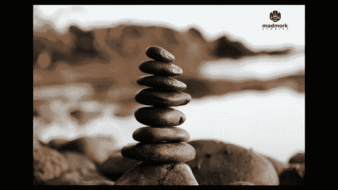

# 即使是创始人也需要平衡

> 原文：<https://medium.com/swlh/even-founders-need-balance-a25079a89ad9>

到现在为止，你可能已经读过，或者至少看过十几篇不同的博文和视频，关于你应该如何在 2018 年过上更好的生活。你将会被关于如何设定目标、为什么你需要保持一致、如何建立聪明且可衡量的目标以及你需要做什么来在接下来的两周内减掉 25 磅的帖子淹没。我来这里不是为了给你的列表增加一个帖子，而是为了给你提供一个视角，让你知道什么对我有用，我的创始人来找我帮忙时在寻找什么。

人类是复杂的生物。在任何一个特定的时间点，我们的生活中都会发生很多事情。通常，我们生活中的一件或多件事情有点不正常是完全正常的。当事情变得太不正常，我们开始感到不知所措，无法独自处理事情时，人们通常会进入恐慌模式。就我而言，当我去年决定突然转行时，我的首要任务立即变成了弄清楚我的生活该做些什么，并确保我的家人得到良好的供养。正如我在之前的**帖子中详细描述的那样，我经历了一次深刻的转型之旅，我必须深入挖掘自己想要的东西，将它与我的技能和经验结合起来，并在新的职业生涯中重新塑造自己，以确保我不仅在做有意义的事情，而且在这个过程中还能有饭吃。**

**然而，当我接近 2018 年并开始写下我的目标并对它们进行优先排序时，我突然想到:我不能简单地继续投入这么多精力，专注于建立我的业务。重要吗？是的。我必须继续努力吗？是的。我还有很多要学的吗？是的。我一天中有足够的时间吗？从来没有。**

**但在一瞬间，我回顾了过去 20 年的职业生涯，分析了我处理每一份新工作的方式以及我投入的精力。我把我的工作放在我生活中其他重要事物的背景下看待:我的家庭、朋友、健康、社区和精神。**

**我所看到的让我停了下来。这让我对 2018 年的思考比以往任何一年都更深入。在我换工作或创业的每一种情况下，都有一种模式在重复。我会热情地投身于新公司，几乎不惜牺牲一切。这项工作耗尽了我的精力。它成了我的生活。它变成了一种困扰。我将获得的成功和满足感，尤其是在一个新角色的早期，是我激情的燃料。它无情地驱使我前进。我越成功，就越努力。越多人鼓掌，我就越努力。事情变得越困难，我就越努力。**

**这就是问题所在。我牺牲了一切来工作。当我在工作中遇到问题时，这些问题的严重性会因为我在其他事情上投资不足而被放大。当我离开谷歌创办一家新的游戏公司时，我的婚姻最终破裂了。虽然我为了工作大量地上网，但我没有花足够的时间和朋友在一起；我的孩子们抱怨我“总是在工作”。因此，当我看着 2017 年以及我在开始我的新教练业务 madmork stories 时所取得的成就时，我知道尽管最终找到了我职业生涯的最佳状态，但我不能继续以过去 20 年的方式生活。我不得不调整我的优先事项。更重要的是，我必须以这样一种方式来设计我的生活，即使我的创业公司倒闭了，我的余生也不会因此而毁于一旦。**

**我必须找到平衡。我必须确保自己关注生活中长期被忽视的其他部分。鉴于我现在所做的事情，这一点变得更加明显:我是一名教练。我想帮助人们过上强大而有意义的生活。如果我在自己的生活中连一点平衡都没有，我怎么能做到呢？**

**平衡成为我 2018 年重点关注的领域。这是我人生中第一次，当我写下今年的目标时，我的职业和与工作相关的目标没有排在清单的首位。我选择把孩子和个人关系放在工作之前。这不仅让我感到自由，也让我觉得“正确”**

**平衡很重要，因为我们的生活中总有一些部分不以我们希望的方式运行。但是当我们处于平衡时，当事情不顺心时，我们能更好地补偿。当创业领域的事情充满挑战时(通常是这样)，希望我们有一个美好的家庭或伴侣可以回家。当我们和伴侣有问题时，我们可以向朋友寻求安慰和建议。当我们的产品在几个月内第五次被推迟时，希望我们可以期待与朋友一起骑自行车或在健身房与我们的教练进行拳击比赛。*把平衡想象成你的备用电池:当一个电池失效时，你有几个其他电池让你继续运转* ( [**发这个**](https://ctt.ec/0P6gE) )。问题是许多人把太多的时间和精力放在创业或事业上，所以当电池没电时，他们几乎没有备用电池。当你考虑到 90%的创业失败的事实时，你会意识到平衡更重要。**

**你是如何保持平衡的？**

**我用三个工具来调整我的生活，找到平衡。**首先，我找出我生活中投资不足的领域，并围绕它们制定 [SMART](http://hrweb.mit.edu/performance-development/goal-setting-developmental-planning/smart-goals) 目标，我将这些目标与我的年度目标一起添加到一个文档中。例如，我知道我的健康对我来说非常重要。所以我为自己的健康制定了两个目标:今年骑自行车 2000 英里，骑 2000 英里(一天 100 英里)。****

******第二个**，我正强迫自己在个人生活中使用同样的生产力工具，正如我在建立自己的公司时所使用的一样。对我来说，那就是谷歌日历和 Asana。如果我知道我需要去接我的孩子，参加篮球比赛或者家长会，这些都会被写进日程表。如果我知道我必须买电影票或给孩子们买些东西，它就会进入 Asana。疯狂？也许吧。有效？当然了。实际上，我去年就已经开始这样做了，而且很有帮助。通过将事情添加到我的日历和任务列表中，我不会忘记事情，我可以正确看待我个人的优先事项，并确保我实现它们。****

****Asana 在这里特别有帮助，因为我管理我的个人任务就像我管理我的商业任务一样。我把我的任务放在特定的标题下，加上到期日，每天检查什么是到期的，我落后了多少。当事情到期时，我手机上的应用程序也会给我发送通知，所以当我错过重要的事情时，我会有严重的负罪感。我也能把大项目分解成小任务。因此，如果我必须计划一个夏天的假期，我可以围绕航班、酒店、活动等添加子任务。****

****我在其他几篇文章中谈到了分享的重要性，这是关键:*你不能指望自己为自己的成功负责。你需要争取他人支持你的事业以保持诚实。* ( [**鸣叫本**](https://ctt.ec/9Fdt8) )。所以我的**第三个工具**就是分享。分享你的目标和抱负有助于你从“应该”这个词转向“去做”。你停止谈论和思考假设。相反，你做了一个决定，与一个或多个让你负责的人分享，这样你更有可能坚持到底。例如，在我的情况下，当我在与我的教练一起工作时有了某种见解，他经常会问我:“好吧，现在你有了这种见解，你打算用它做什么？”一旦我告诉他我要做什么，他会接着问:“太好了，你愿意承诺做这件事吗？如果愿意，你认为你什么时候能完成这件事？”在另一种情况下，我和我的一个朋友有一个协议，每两周我必须给他发一份简短的个人任务清单，这些任务是我在工作之外发展人际关系的。这促使我去思考这些事情，对它们进行优先排序，并围绕它们制定一系列计划。我以同样的方式与我的教练和朋友分享我的商业目标。它让我保持诚实。****

****与他人分享你的目标的另一件很酷的事情是，当你成功时，你的朋友也会成功。事实上，它变得具有传染性:你越分享你大胆的目标，那些与你分享这些目标的人就越希望你成功并鼓励你前进。****

****创业现场是艰苦的，没有什么会让你更累。但是，如果你耗尽精力，牺牲一切，以牺牲可能成功或可能失败的东西为代价，你可能会失去那些可以提高你成功几率的东西。所以努力工作的同时也要聪明:找出自己的弱点；努力寻求平衡；创建 SMART 目标；使用工具让你在工作和个人生活中保持高效，最后，与周围的人分享这些目标，争取他们的支持，帮助你成为你真正想成为的人。****

****准备好了吗？设置？分享！****

********

## ****这篇文章发表在 [The Startup](https://medium.com/swlh) 上，这是 Medium 最大的创业刊物，拥有 292，582+人关注。****

## ****在此订阅接收[我们的头条新闻](http://growthsupply.com/the-startup-newsletter/)。****

********