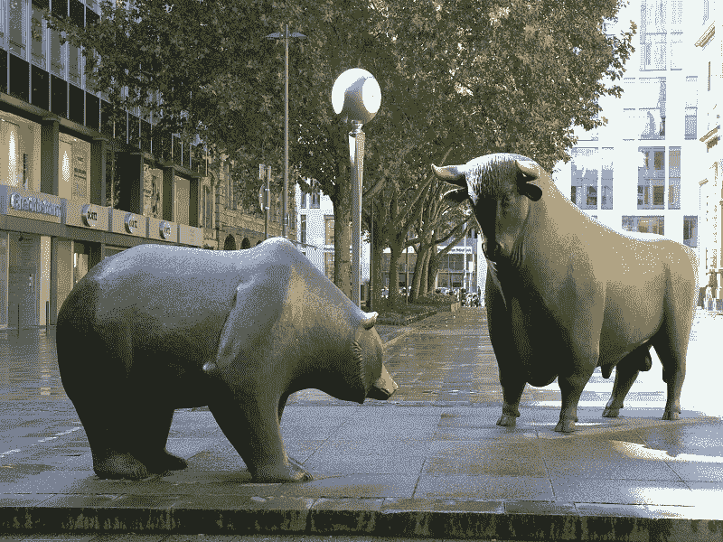

# 本周影响 BTC 的事件(2018 年 3 月 16 日)

> 原文：<https://medium.com/swlh/events-impacting-btc-this-week-march-16-2018-e988a506eab1>

# 比特币的现状

公牛队在 2017 年的最后几个月里狂奔。去年 12 月，比特币价格接近 2 万美元。在接下来的一个月里，一次大规模的调整在二月份结束，BTC 跌破 6000 美元。从 BTC 12 月份的高点到 2 月份的低点，下降了 70%以上。空头似乎已经从多头手中完全控制了市场。

Who Will Win?!

从 2 月到 3 月初，随着 BTC 在中国农历新年后建立了重要的蒸汽，多头建立了一些势头。这是一次短暂的反弹，BTC 从 2 月份的不足 6000 美元的低点反弹至 2018 年 3 月 5 日的 11600 美元的高点。

到 2018 年 3 月 9 日，比特币回到了 8400 美元以下[，看起来空头已经重新获得了完全的控制权。今天，2018 年 3 月 15 日，BTC 的房价为 8200 美元，仅略低于一周前的水平。](http://bitcoinist.com/bitcoin-price-everyone-bearish-bottom/)

要问的最重要的问题是:目前哪些事件正在影响比特币，比特币的价值可能会何去何从？

# 对比特币价格产生负面影响的事件

过去 10 天充斥着各种负面新闻事件，这些事件在短期内继续压低 BTC 的价值。这种负面情绪很大程度上是由撰写[文章](http://bitcoinist.com/nobody-cares-about-bitcoin-anymore-claims-article-about-bitcoin/)的角度造成的，这是不必要的。

其他事件确实是负面的，极大地改变了市场上买卖订单的总数。这一先前的市场熊市转折是由四大事件促成的:

1.  [监管行动](http://bitcoinist.com/sec-chairman-abide-law-watching/)(美国证券交易委员会和英国)
2.  [Gox 比特币转储](http://bitcoinist.com/tokyos-bitcoin-whale-has-sold-400-million-and-thats-just-the-start/)
3.  [Alphabet(谷歌)禁止所有与加密相关的广告](http://bitcoinist.com/google-ban-cryptocurrency-ads-bitcoin-not-affected/)
4.  [骗局 ICO — Giza](https://www.yahoo.com/news/fake-startup-uses-initial-coin-181233906.html)

这四个事件都在之前的十天内大幅降低了比特币和整体加密货币市场的价格。

要阅读关于过去一周影响 BTC 的重大事件的整篇文章，请点击此处查看:

[**比特币&加密市场继续下滑**](Bitcoin%20&%20Crypto%20Markets%20Continue%20Their%20Slide)

明天的主要文章将是一个特别突出的前 5 个 Altcoins 的一周！有些硬币在以下任一网站独家发售:

[**币安**](https://www.binance.com/?ref=15316928)

**[T5【隐视】T6](https://www.cryptopia.co.nz/Register?referrer=JaketheCryptoKing)**

**[**Bibox**](https://www.bibox.com/login/register?id=11305470&lang=en)**

****我感谢所有我的忠实追随者！我正在努力建立一个社交媒体形象，希望你也能在 Instagram 和 Twitter 上关注我！在被发布到留言板之前的几个小时，你可以关注 Instagram: JaketheCryptoKing 和 Twitter: JbtheCryptoKing。****

****现在王国不和谐:**[**https://discord.gg/qTjQp8W**](https://discord.gg/qTjQp8W)**(入群直接找我)。****

****

## **这个故事发表在 [The Startup](https://medium.com/swlh) 上，这是 Medium 最大的企业家出版物，拥有 306，792+人。**

## **在这里订阅接收[我们的头条新闻](http://growthsupply.com/the-startup-newsletter/)。**

****