# 常青树内容和搜索引擎优化流量(增长 237，648 次访问)

> 原文：<https://medium.com/swlh/evergreen-content-seo-traffic-growth-of-237-648-visits-d5b53bef7126>

你可能在想，“我不再相信 SEO 了。”或者你可能不相信长内容比短内容表现得更好。

或者，也许你不相信内容营销及其功效，因为那里有大量的内容。这两种说法都是不真实的…基于 2000 多字的帖子背后的数据科学。

Moz 和其他人一起做了一项又一项的研究，找出了表现最好的内容，SEO 或其他，毫无疑问，长于 2000 字的常青树内容比短内容获得了更多的链接、社交分享和更长的停留时间。

真的就这么简单……

在这篇文章的后面，我将向你展示我在 12 个月内为四个网站增长了 237，648 次有机谷歌流量的统计数据，我也将一步一步详细解释这个过程。

然而，创建引人入胜的常青树内容并不简单，除非你了解在这个过程中要采取的所有正确步骤。

但是我已经超越了我自己…

我将解开如何让长篇内容在谷歌排名的秘密；然而，我们需要首先从基础开始。请随意**直接跳到最适合**的部分，在那里你会发现这个过程。

## 什么是常青内容，有什么不同？

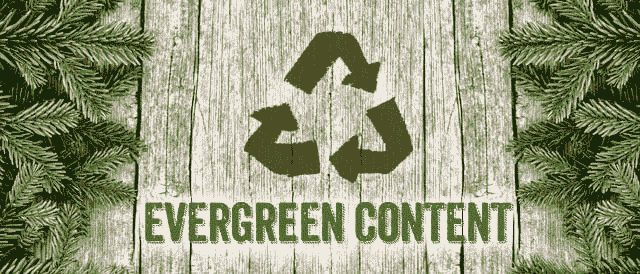

钉钉 SEO 进行了大量的规划和研究，但非凡的内容是伟大 SEO 的基础。此外，您正在创建的内容类型起着更大的作用。在很大程度上，有两种主要的内容类型:

*   热门的、短命的内容:及时的、与特定主题相关的内容，通常长度和深度都较短。这种类型的内容通常与新闻相关，但也可以成为一种趋势。由于其时效性，热门内容可以在短期内提升你的流量，但通常会随着时间的推移而消失。为了跟上最近的流行趋势，月复一月地不断发布新的热门话题，这可能会令人筋疲力尽。
*   常青内容:该内容专注于向读者提供永恒的、无价的、深入的信息。与热门内容不同，evergreen 内容不太关注及时的信息，而是关注 2 年、5 年、10 年或 20 年后相关的信息。常青树内容做得好，并遵循特定的程序，将导致更长期的搜索引擎优化流量，因为它包含的信息，人们将永远搜索和更全面的覆盖主题。此外，随着时间的推移，它将获得更多的社交分享和反向链接:这是获得谷歌关注的两种主要方式。

简而言之:这两种内容类型都为你的 SEO 提供了动力，但常青树内容提供了一个长期可持续的弧线(通常会随着时间的推移继续增长，而不仅仅是保持平坦)，而主题内容则是短期的。这并不会使主题内容或简短内容变得糟糕，它只是适合不同类型的内容，但不应该作为提高 SEO 流量的主要方式。

另一方面，常青内容需要广泛的研究(包括关键词和主题本身),通常比热门内容长得多，大约 2000-5000 字(有些高达 30000 或 50000 字)到 500-1500 字。

你可能会想，“这么英里。我不相信人们会真的去读一篇几万字的内容。”虽然人们的注意力持续时间越来越短，但如果你[就一个很多人都在搜索的话题提供深度信息，他们会阅读、链接并分享它](https://neilpatel.com/blog/why-you-need-to-create-evergreen-long-form-content-and-how-to-produce-it/)。当你想到 evergreen 内容时，就想到提示、指南等列表。[这篇来自 Marketo](https://www.marketo.com/content-marketing/) 的文章是关于内容营销主题的常青内容的一个很好的例子。

# 短格式内容和搜索引擎优化的问题

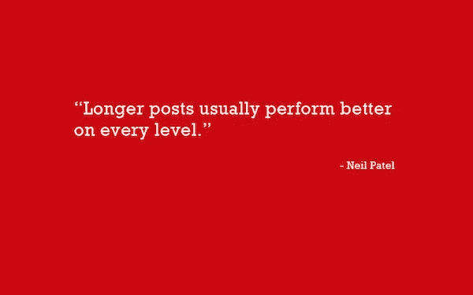

搜索引擎优化没有简单的方法。这是一项艰巨的工作，需要时间。也就是说，简短的形式或热门的内容是从 Goolge 之外的地方为你的网站赢得一些流量的快捷方式。那么，你为什么不在 evergreen 上做简短的内容呢？

顾名思义，话题内容就是，嗯，话题。只要一个话题或主题是流行的，话题内容就可以蓬勃发展，为你赢得流量。但这是假设你有大量的观众已经定期访问你的网站。

那么，如果你在社交网站上没有太多的追随者，没有太多的网站流量，或者没有太多的电子邮件列表，那又如何？

这正是使用常青树内容从谷歌获得 SEO 流量的时候……

你必须处理的另一件事是，当你的热门主题最后一次成为趋势时，你的内容也是如此。

不仅如此，因为短格式内容的创建速度非常快，所以竞争非常激烈。在 Moz 和 BuzzSumo 进行的一项研究中，他们发现 100 万篇文章中有 85%的篇幅不到 1000 字。但在同一项研究中，他们发现内容的长度和在社交媒体上获得的分享数量成正相关。

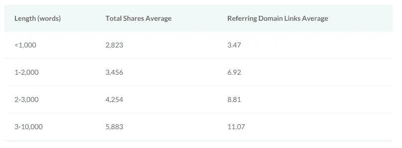

简而言之:简而言之的内容会导致更小(或者有时更大)的流量收益，但如果有的话，也总是在更短的时间内。

# 什么是域权限&页面权限？为什么两者对 SEO 都至关重要

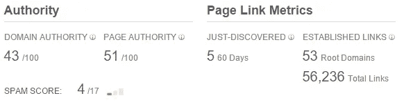

在我们深入探讨如何创建常青树内容之前，理解域权限和页面权限是很重要的，因为这两者在 SEO 中都起着巨大的作用。

如果你的域名或页面权限太低，SEO 的收益将永远不会到来。

[Domain authority](https://moz.com/learn/seo/domain-authority) (DA)是一个由多个第三方软件工具(Moz & [Ahrefs](https://ahrefs.com/blog/domain-rating/) 是其中两个)开发的系统，用于测量一个站点的潜在 [SERP](https://www.wordstream.com/serp) 性能，从 1 到 100，与网络上的其他域进行比较。DA 是由一系列因素决定的，包括网站的年龄、反向链接、受欢迎程度、信任度等等。如果一个站点的 DA 值很高，那么它的内容很可能会比一个内容相似但 DA 值较低的站点排名更高。

类似地，[页面权威](https://moz.com/learn/seo/page-authority) (PA)是一个评分系统，计算特定页面在 SERP 上的排名，但 [Ahrefs 称之为 URL 评级](https://help.ahrefs.com/ahrefs-metrics/site-explorer/what-are-ahrefs-url-rating-ahrefs-domain-rating-and-ahrefs-rank)。与 DA 非常相似，这是通过检查链接数、社交分享、信任和影响力来确定的。具有高 PA 或 URL 评级的页面比具有较低 PA 的类似页面更有可能在特定关键词短语中排名靠前。

你可能会认为你应该为阿达和 100 岁的爸爸而努力。首先，这真的很难做到。大多数媒体网站努力保持在 90 以上，他们每天都在生产内容。另外，重要的是不要认为这些指标是相对的，因为这不是谷歌告诉我们的分数。这些是第三方的最佳猜测(基于数据)。

基本上，你想知道你的网站和你的竞争对手的 DA 和 PA，这样你就不会花费大量的时间来创建你永远不会排名的内容。

# 但是如果你不打算长期坚持，就不要追求这个目标

什么？你在歌颂常青内容的优点，现在你说，不要做！？

是的，你没听错。

你应该坚持这个策略，但前提是你要坚持 18-36 个月。它不仅需要一段时间来编写和发布内容，而且还需要获得足够的链接、初始流量和社交分享来引起谷歌的注意。

只需要这么长时间就能看到结果…

此外，这是随着时间的推移而建立起来的事情之一，当你向谷歌证明你在你的主题上的权威时，通过从排名高的帖子链接到你最新的常青树帖子，下一篇文章的排名会变得更容易一些。

# 内容营销的好处:成为一家媒体公司，获得搜索引擎优化，并获得更低成本的广告

那么内容营销有什么好处呢？

两件主要的事情:来自谷歌的有机流量和较低成本的广告。

由于顶级共享和链接内容需要这么多的话，你可能想知道是否有另一种方法来加强你的搜索引擎优化。

我跟你坦白；没有。

那么，我们为什么还要为 SEO 投资常青树内容营销呢？

在当前的营销格局中，创造优质内容就是一切。事实上，营销和内容营销之间的界限，作为建立品牌知名度的一种方式，本质上是为你的品牌建立自己的媒体网站，胜过数字广告本身的有效性。越来越多的人不再关注广告。随着广告拦截器和盲广告的激增，以及数字广告成本预计将继续上升，在线广告的竞争将变得更加困难。因此，为什么不成为你自己的媒体公司，在那里你拥有广告渠道(你的博客流量，电子邮件列表，社交媒体等)。)?

获得受众的最快方法是让常青树内容从谷歌获得有机流量。

那么，为什么不为你的企业建立你的思想领导力，同时碰巧卖给他们一些东西呢？像媒体公司一样思考…

最重要的是，从长远来看，与数字广告相比，内容营销的每次转化成本更低。诚然，evergreen 内容的前期投资更多，但你会从谷歌上的内容排名中受益，月复一月，年复一年。相比之下，一旦你停止付费，数字广告就会停止。

对于门外汉来说，内容营销是一种涉及在线内容创建和共享的营销类型。就当是内容和推广的完美联姻吧。或者用[加里·维纳查克](https://www.garyvaynerchuk.com/)的话说:

“如果内容是王道，推广就是女王。”

内容营销的兴起有充分的理由:它能吸引注意力，强化你的品牌，几乎任何人都可以做到(尽管不是每个人都做得很好或成功)。最重要的是，内容营销可以为你的 SEO 流量创造奇迹。为了更清楚地了解内容营销如何为 SEO 服务，让我们看一个例子:

*   假设你有一家生产高级皮靴的企业。虽然你的网站看起来不错，但它并没有获得任何流量。所以，你转向谷歌，看看人们在搜索皮靴的时候都在搜索什么。事实证明，有一些关于保护靴子的指南，但是你可以创建一个好 10 倍的，管理他们所有的内容，并把你自己的添加到一个大的主帖子中。
*   你使用一个著名的工具，比如 SEMRush，对所有与皮革和靴子相关的东西进行广泛的关键词研究。然后，你创建了一个关于如何护理皮靴的杀手级指南，注意将已经排名的类似帖子的关键部分合并。你加载高质量的关键词(不是关键词填充)，一些链接到受尊敬的网站(再次排名)，视频，并使用适当的格式。
*   当读者开始找到你的指南时，他们开始与他们的朋友分享，然后他们与他们的朋友分享，等等。不仅如此，人们开始在他们自己的内容中链接到你的指南。这将为你的网站带来更多的流量，并建立你的页面权威。

显然，上面的例子过于简单，但它确实显示了内容营销的基本好处:流量，权威，排名，以及所有对 SEO 有益的东西。

“SEO 提出要求。内容营销满足了这些需求。”尼尔·帕特尔

在谷歌上简单而廉价地购买广告空间的日子已经结束了；随着市场的成熟，广告平台变得越来越昂贵。这适用于谷歌广告以及其他数字广告平台。虽然广告空间总是有所帮助，但许多互联网用户对他们的在线体验要求更多。人们想要答案，在他们决定从你这里购买之前很久，你的品牌就有责任通过内容营销免费向他们提供深入的价值。

# 7 种常青树内容(包括强大的奖金类型)

像所有营销的事情一样，常青内容并不像写一份长长的指南并在你的网站上发布那么简单。如果你这样做，你将会浪费更多的时间来创建没有长期流量(来自谷歌或任何地方)的简短内容。

常青树内容有很多类型，接下来我们将介绍 6 种最成功的类型。虽然 evergreen 内容的最终目标通常是提高流量、建立品牌知名度和加强 SEO，但每种内容类型都适合各种情况。

由于 longform evergreen 内容所需的工作，您可能需要外部公司的帮助，而不是依靠您的人力在内部完成。无论你如何处理长格式的内容，从长远来看，在你的 SEO 游戏中建立可信度是值得的。

只要确保你长期致力于此；如果你打算在 6 个月后期待结果，那就不值得追求了。这段旅程需要 12 个月，24 个月，甚至 36 个月才能有回报，但是会有回报的！

# [1。案例分析](https://searchengineland.com/seo-case-study-0-100000-visitors-12-months-277995)建立怪物信任

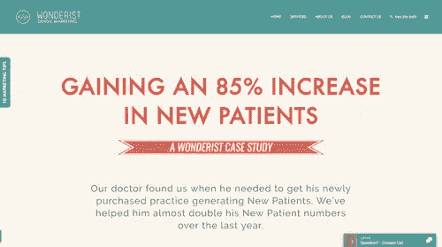

可以说，案例研究是常青树内容中最密集的类型之一，是建立你的品牌声誉和向你的受众提供有用信息的一个很好的方式。案例研究是对情况、受众、产品或其他主题的详细分析，这意味着它们需要广泛的研究和事实核查。话虽如此，扎实的案例研究不仅能吸引那些寻求答案或信息的人的注意，还能吸引竞争对手或该领域其他人的注意。这可以导致你的品牌和他们的品牌之间的在线对话，并获得更多的关注。

这类内容通过使用实例和精确的数据来证明你的观点，对建立信任非常有效！

看看我的这个例子。https://www . milesanthonysmith . com/blog/how-to-sell-books-on-Amazon

# 2.[列表文章](https://www.elegantthemes.com/blog/resources/how-to-write-a-compelling-list-post-for-your-blog)(有时称为列表文章)

常青列表帖子可能很棘手，因为列表帖子可能是常青的、简短的或热门的。像其他类型的常青树内容一样，常青树列表帖子需要关注一些有持久力的东西。把它们想象成一篇常青的文章，只是采用易于理解的列表格式。

[这份来自 SearchEngineJournal](https://www.searchenginejournal.com/10-key-content-marketing-tips-beyond/147410/) 的列表是一个很好的例子，因为内容营销是人们一直在研究和搜索的东西，随着内容营销游戏的变化，该列表只需稍作更新。他们的特定列表也很好地提供了更一般的建议，这些建议几乎不需要像内容营销的过于技术性的列表那样调整。

记住，你要扩大你的列表数量，至少要等于或大于你在谷歌首页上竞争的列表帖子的数量。如果竞争对手的清单是 10、13 和 23，那么你可能希望自己的清单是 31。为了让你的清单尽可能的常青，试着把重点放在一个话题中不太可能改变的更一般的方面。如果你要处理一个技术主题，列表可能是一篇更深入的文章的很好的补充，但要准备好随着事情的变化更有规律地更新它们。

看看这个例子，我曾帮助指导过我的一个客户。[https://learn.acendia.com/grant-writing-books/](https://learn.acendia.com/grant-writing-books/)

# 3.[常青视频](http://www.dummies.com/business/marketing/social-media-marketing/viral-videos-versus-evergreen-content-on-youtube/)打死电台明星

顾名思义，常青视频就像任何其他常青内容一样，具有持久力。也像典型的常青树内容一样，常青树视频专注于人们几乎总是在搜索的东西。上面的讲解视频，“如何用 Ro 制作完美的蛋糕”，来自[罗莎娜·潘西诺](http://rosannapansino.com/)，是一个很好的例子，因为它永远适用，不需要更新。

[讲解视频](https://blog.hubspot.com/marketing/explainer-videos)可能并不适用于所有情况，但 evergreen 视频处理可以应用于大多数其他 evergreen 内容模型:评价视频、“关于我们”视频、案例研究总结等等。

为了获得一些快速的 SEO 技巧来提高你的视频 SEO 游戏，[看看这个伟大的布莱恩·迪恩视频](https://www.youtube.com/watch?v=oR3DQRDoTVI)。

# 4.[专家综述](https://smartblogger.com/expert-roundup/)扩大与专家听众的分享

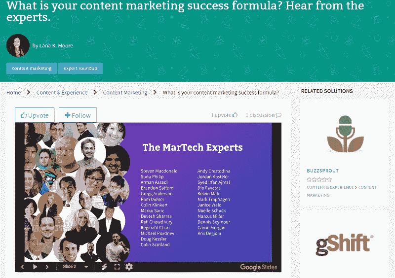

[专家综述](http://zacjohnson.com/expert-roundup-posts/)，所有关于某个主题或问题的专家意见的集合，是加强你的 SEO 的一个很好的方式，并且有巨大的反向链接和分享的潜力。

创建专家综述时，首先要找到与你的品牌相关的问题或热门话题。接下来，联系你所在领域的众多专家，询问他们是否会参与这个话题。他们通常会同意，因为他们希望扩大自己的影响力和品牌知名度，只要你的“要求”不会占用他们太多的时间。

最后，将这些答案整理成一个像样的格式，并确保链接到所有专家的社交媒体页面和网站，然后向他们展示文章，并请他们与观众分享。

自然，专家综述是社交媒体的磁石。通过在一篇文章中介绍如此多的专家，你就有了众多的“作者”,他们可能会在自己的社交媒体页面上分享这篇文章，让你的网站和文章暴露给所有的观众。

不仅如此，专家综述也是在你自己网站的评论中展开讨论的好方法，尤其是当他们提出一个困难或有争议的问题时。更多的人在你的网站上发表评论意味着更多的人可能会参与讨论并分享文章。最棒的是，你甚至不需要写很多东西，只需以一种有意义的方式将答案缝合在一起，并用一个介绍和结束段落来框定整个事情。

上面这个来自于 [MarTechExec](https://martechexec.com/article/content-marketing-success-formula-hear-experts.html#gs.vfCn1qI) 的例子在这方面做得很好，并通过添加有趣的 gif 来使文章更具可读性。

这里有一个例子，在他们的综述文章中，我被列为搜索引擎优化专家。http://www.robbierichards.com/seo/seo-metrics/

# 5.长格式信息图(也称为[猜测图](https://backlinko.com/how-to-get-backlinks)

并不是每一张信息图都像上面那张关于章鱼的信息图一样有趣和古怪，但是所有的信息图都应该赏心悦目，视觉上引人入胜，但在设计上不要太杂乱，并且是一种传播信息的好方法。

我说的不是一个 2 或 3 节的信息图。虽然创建一个[8-10 部分、高质量、引人入胜的信息图](https://learn.acendia.com/crowdfunding-for-nonprofits/)需要更多的时间和投资，但这是值得的，因为它将被分享和链接，而不仅仅是一个短片。

信息图很像常青树列表，是一种以视觉方式呈现复杂主题的有用方式。与 evergreen 的文章和视频不同，信息图表可以在不阅读或观看视频的情况下快速消化。这使得它们非常适合在社交媒体上分享。事实上，信息图表的读者比博客文章多 54%。信息图的缺点是它们需要大量的工作。首先，你需要一个熟练的设计师，他能让你的信息图漂亮而简单。大量信息图华而不实，但难以消化。另一方面，有些是简单的解释，但没有视觉上的愉悦。

你的设计师必须能够在两者之间取得平衡。最后，你需要根据你的主题和已经被分享的相似信息图(以及它们包括什么和看起来像什么)，对许多信息图进行广泛的研究和统计收集。

[我使用 Buzzsumo](http://buzzsumo.com/) 来识别已经成为趋势的信息图，并从已经成功的信息图中选择一个主题。这是我为客户创建的一个例子。[https://learn.acendia.com/crowdfunding-for-nonprofits/](https://learn.acendia.com/crowdfunding-for-nonprofits/)

# 6.操作指南:一步一步地引导他们

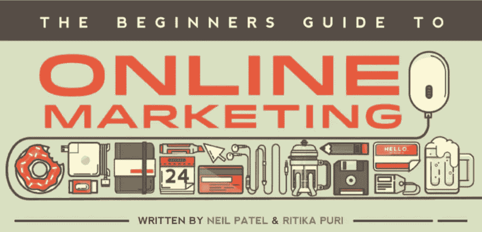

顾名思义，操作指南解释了如何解决某个问题或完成某项任务。就像讲解视频一样，操作指南应该解决人们长期寻找的主题或问题。

与列表帖子不同，操作指南是一个涵盖更深入或技术主题的好地方，在那里你需要展示和引导他们完成过程中的每一步。

quick prout 的这个[指南解决了一个困难且非常深入的问题:在线营销。这份特别的指南更进一步，使用大量风格化的文本和图像，以信息图表的形式呈现信息。然后，您可以点击每个部分了解更多信息，如电子书。](https://www.quicksprout.com/the-beginners-guide-to-online-marketing/)

如果一开始你觉得指南不适合你的品牌，做关键词研究，看看在你的行业里人们会问什么样的问题。人们很有可能遇到你知道如何解决的某种问题。

请参见另一个客户端示例:

[详尽的指南:如何撰写令人兴奋的资助提案(包括资助提案样本)](https://learn.acendia.com/how-to-write-a-grant-proposal/)

# 7.鱼骨变成了一根柱子

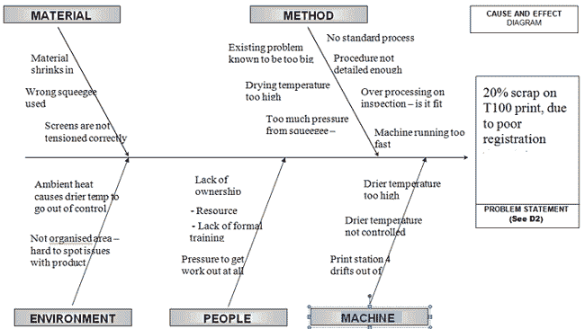

鱼骨图，也被称为[石川](http://asq.org/learn-about-quality/cause-analysis-tools/overview/fishbone.html)，传统上用于确定问题的可能原因。如今，鱼骨帖子更像是各种各样的超级列表，充满了与某个主题相关的 H2s 和 H3s。虽然这些列表仍然可以专注于解决一个特定的问题，但它们也可以更类似于一个提示或如何张贴。

您可能想知道这个图表作为 evergreen 内容如何有用。首先，我来解释一下什么是鱼骨帖:

这基本上是一个类固醇的列表帖子！关键是要找到与一个主题相关的关键词组，所以创建一个关键词组是很困难的，因为你必须首先识别它。否则，没有理由创建鱼骨帖。

看看我为我的客户做的这些例子，然后回来，我会进一步解释这个过程。

你是否注意到每个部分的许多标题都是外部链接？

在整篇文章中，H2s 和 H3s 是二级和三级标题。让这种方法如此强大的是人们在主要关键字之外搜索的关键字短语。这些成为你的 H2s 和 H3s，你向谷歌和你的观众证明你在这个话题上是权威的，通过添加外部链接到 H2s 和 H3s，这些链接本身就是权威的，排名也很好。

许多鱼骨帖子就此打住，但最后一步是为你最初有外部链接指向的 H2s 和 H3 创建一个内部帖子。但这些新内容必须在质量和深度上更好，否则谷歌不会认为这些内部内容是权威的，从而降低了主鱼骨帖子的整体影响。

如果做得好，这种方法可以创造成千上万，甚至几十万游客每月。

看看另一家公司创造的这个例子:

[145 种开垦家园的技能每个开垦者都必须装备齐全](https://homesteading.com/homesteading-skills-every-homesteader-should-know/)

这个帖子和它的子帖子每年从谷歌的有机搜索引擎流量中获得超过 700，000 的访问者！

# 我是如何从谷歌有机流量中获得 237，648 次访问的:常青树内容案例研究

“这一切听起来很棒，迈尔斯。但你采用这些策略的统计数据是什么？”，你可能会问自己。

那么，我的结果是什么？

我在 4 个品牌/网站上工作过，包括我自己的网站，并从谷歌获得了以下有机流量增长。

*   雷基先生增长了 362%；evergreen content 每月的新访问量超过 6700 次。
*   车库门先生从零有机访问到每月超过 2400
*   生皮男孩牧场增长了 140%；evergreen content 每月的新访问量超过 6600 次。
*   我自己的网站从零有机访问到每月 5000。

这相当于谷歌有机搜索引擎每年 237，648 次访问！相当强大的东西…

这是我一个满意的客户的话:

> *“像许多企业一样，我们在所谓的专家身上浪费了大量的时间和金钱，这些专家承诺通过他们最新的花招为我们带来在线业务。*
> 
> *然后我们和迈尔斯·安东尼·史密斯订婚了。迈尔斯和他的团队是合法的数字营销专家，使用常青树、长篇博客内容，将我们在 MrGarageDoor.com crom zero 的有机谷歌搜索流量增加到每月 2400 多次访问。他真正知道如何以正确的方式获得可持续的谷歌流量，根据潜在客户已经在搜索的主题制作高质量的内容。*
> 
> 如果你想增加谷歌的有机搜索流量，明智的做法是明确遵循迈尔斯的建议。”
> 
> [*——弗雷德·特拉克*](https://www.linkedin.com/in/fred-terlaak-a1b3101/) *，车库门先生有限责任公司总裁*

以下是对每个站点的更深入的分析:

雷基锁匠先生

*   谷歌搜索引擎的有机流量增长了 362%
*   每月仅谷歌有机流量就有 6700 次访问。
*   4800 个关键词的排名。
*   如果他们不得不从谷歌购买这些流量，他们每月将花费 46，800 美元。
*   第二张图表展示了我如何将许多关键词层层叠加，以获得每篇文章的最大曝光率；红框中的数字是每篇文章的关键词数量，有些在首页，有些不在首页。他们无处不在。

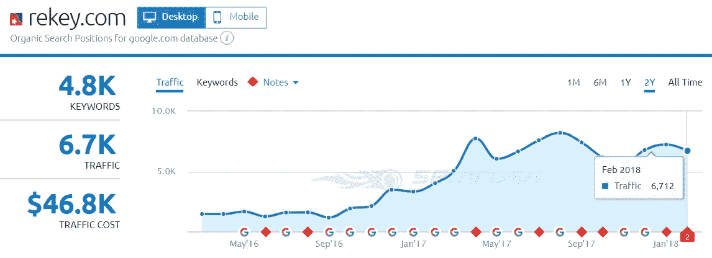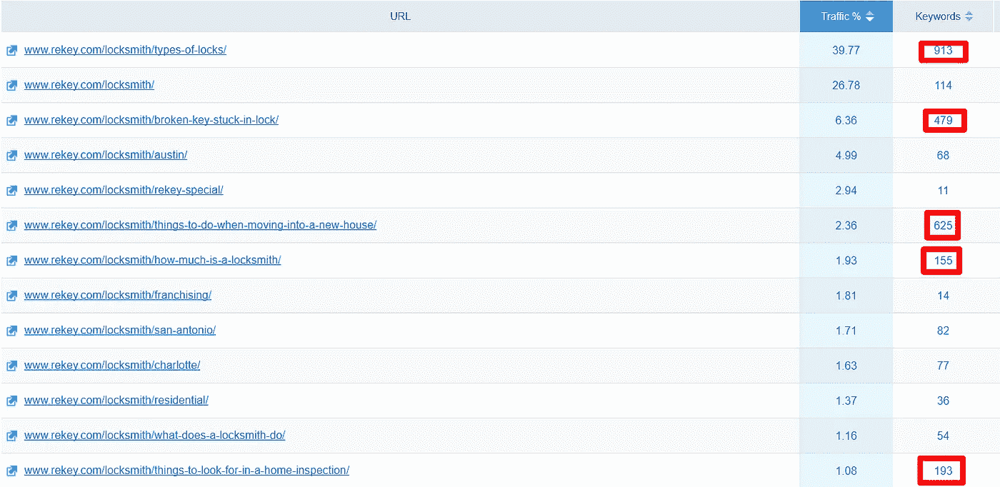

车库门先生

*   谷歌搜索引擎的有机流量增长了 417%
*   每月仅谷歌有机流量就有 2400 次访问。
*   4400 个关键词的排名。
*   如果他们不得不从谷歌购买这些流量，他们每月将花费 14，100 美元。
*   第二张图表展示了我如何将许多关键词层层叠加，以获得每篇文章的最大曝光率；红框中的数字是每篇文章的关键词数量，有些在首页，有些不在首页。他们无处不在。

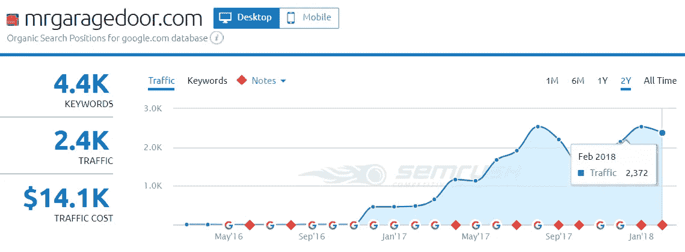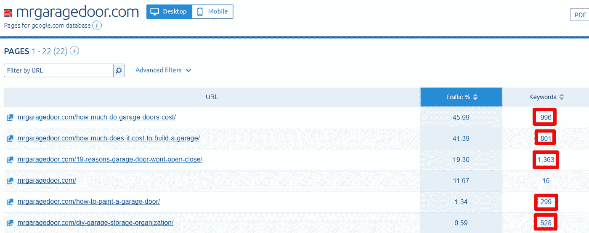

牛皮男孩牧场

*   谷歌搜索引擎的有机流量增长了 140%
*   每月仅谷歌有机流量就有 6600 次访问。
*   10，000 个关键词的排名。
*   如果他们不得不从谷歌购买这些流量，他们每月将花费 12，800 美元。
*   第二张图表展示了我如何将许多关键词层层叠加，以获得每篇文章的最大曝光率；红框中的数字是每篇文章的关键词数量，有些在首页，有些不在首页。他们无处不在。

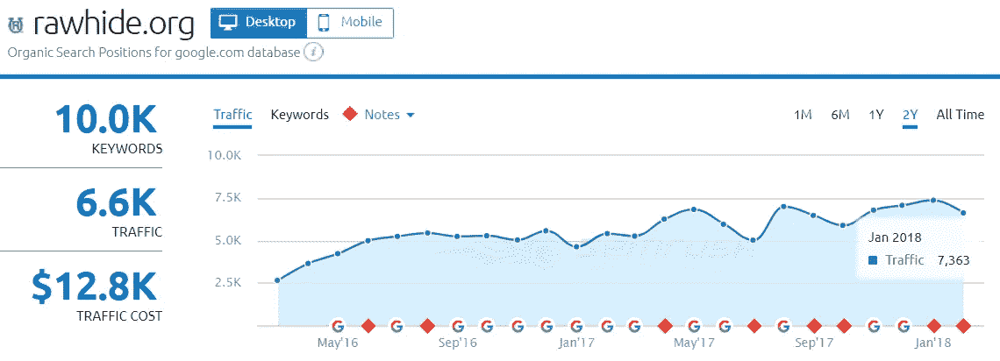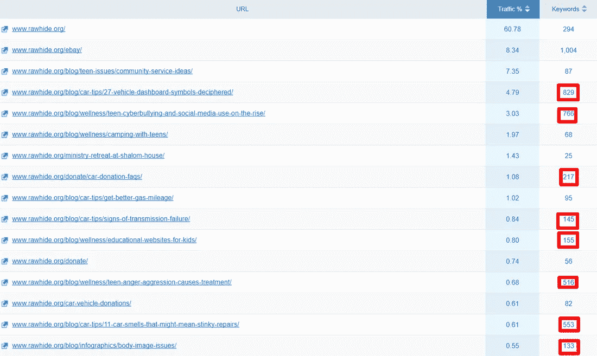

MilesAnthonySmith.com

*   谷歌搜索引擎的有机流量增长了 575%
*   每月有 4900 次来自谷歌有机流量的访问。
*   5000 个关键词的排名。
*   如果他们不得不从谷歌购买这种流量，他们将花费 4100 美元/月。
*   第二张图表展示了我如何将许多关键词层层叠加，以获得每篇文章的最大曝光率；红框中的数字是每篇文章的关键词数量，有些在首页，有些不在首页。他们无处不在。

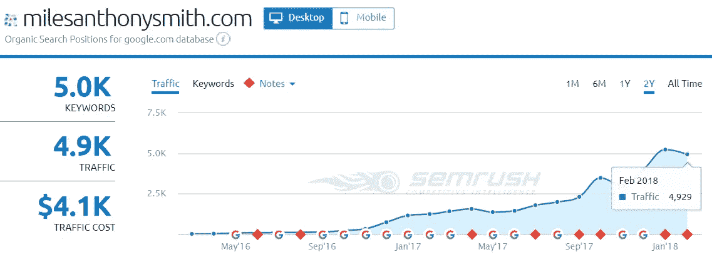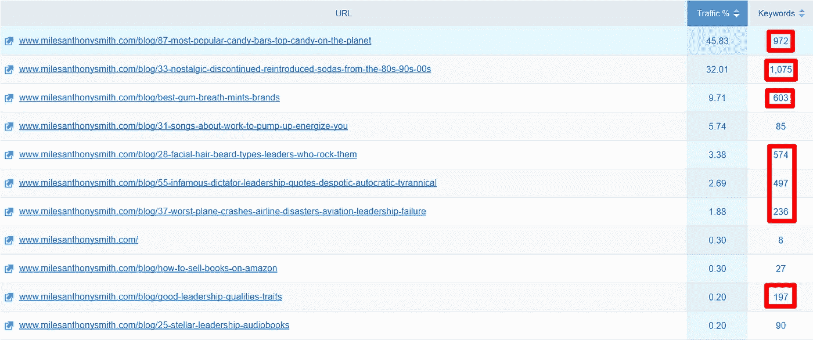

# 内容营销战略的 4 个关键阶段

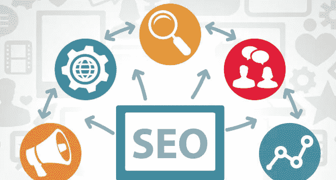

创建常青内容并不像把大量的文字、图片或视频放在一起，然后就收工那么简单。有一些最佳实践，你最好不要忽视。

为了成功，必须遵循以下每个步骤。如果你没有完成第三阶段和第四阶段，即使正确完成了第一阶段和第二阶段，也会导致无法从谷歌获得有机流量。

# 1.关键词研究是绝对必须的第一步

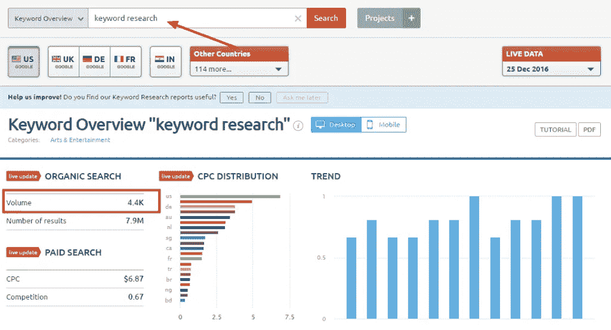

在你开始处理任何常青树内容之前，适当的关键词研究是必须的。虽然 Google Keyword planner 可以帮助你了解那里有什么，但没有什么可以替代 SEMRush 或 [Ahrefs](https://ahrefs.com/) 这样的付费工具，因为 KW Planner 专注于付费搜索量和竞争，这可能会对有机搜索产生误导。

在许多情况下，它们是非常不同的，仅仅依靠 KW Planner 可能会导致您锁定一个您永远不会排名的关键字，或者搜索量比您想象的要少得多。

像 SEMRush 这样的付费工具不仅可以帮助你研究你感兴趣的关键词，还可以向你展示你的竞争对手涵盖了哪些主题，以及他们的排名有多好。这对你的常青树内容至关重要，因为这将帮助你填补他们的知识空白，给你的内容一个优势。

在研究关键词时，你需要确定一个主要关键词和几个相关的次要关键词。争取一个搜索量在 500-1500 之间的主要关键词，除非你的域名权限已经很高，并确保没有太多的竞争。即使一个词出现在搜索量中，激烈的竞争也会让这个词的排名变得非常困难。当考虑二级关键词时，不要把自己限制在最低 500 的搜索量，因为较低的搜索量仍然是有益的。

# 2.管理(不是剽窃)&创造“网络最佳”内容

接下来，你会想看看排名在第一页的文章，寻找你想要的关键词。当创建你自己的常青树内容时，选择 3-5 个 H2 元素作为共同的标题/副标题，这些标题/副标题与谷歌第一页上的竞争对手页面的排名相同。

一旦你有了一个高层次的大纲，你就可以开始写那些 3-5 个 H2s，如果有保证的话，也许可以加上 H3s。调整你自己的节奏，这样你就不会以字数过少或过多而告终。

然后，找出与关键词短语相关的视频，这些视频在谷歌或 YouTube 搜索的第一页都有排名，然后把它们散布在整篇文章中。在整篇文章中添加图片，使文章在视觉上更有趣。毕竟，这些帖子有 2000+字，你需要文字以外的元素来吸引读者。

# 3.正确构建页面搜索引擎优化的七个关键

在写作的时候，重要的是要把注意力集中在这些主要的项目上，这些项目对谷歌的机器人抓取你的和其他网站很重要。这些信息帮助他们解析数据，更好地理解你的页面。通过给谷歌它想要的东西，让他们更容易理解，你就增加了你排名的几率。

1.  在元标题、元描述、H1、url 段和第一段中使用你的主要关键字。
2.  在 H2s、H3s 中撒上次要关键字和 [LSI 关键字](http://thecontentwrangler.com/2016/08/15/complete-guide-lis-keywords/#)，以及它们的必选正文副本。
3.  添加外部链接到其他权威网站和排名靠前的视频嵌入。这向谷歌表明，通过向你的读者提供其他外部信息，你是一个有价值的内容。
4.  [在 H2s 开始之前，添加一个“目录”](https://thrivethemes.com/table-of-contents/)；这让你的读者能够跳到他们想先读的部分，而不是费力地读完整篇文章。
5.  一旦你有网页排名，考虑添加内部链接到其他网页，你想通过页面权威。这是一个伟大的方式，使其他相关网页排名比你没有网页排名更快。
6.  创建[引用框](http://www.csus.edu/cascade/training/advanced/callout-boxes.html)和加粗斜体文本，以视觉上处理文案，吸引读者的目光
7.  使用图像、视频和/或信息图来增加视觉吸引力。

要更深入地了解页面搜索引擎优化，请查看这两个顶级的外部链接。替我向罗比问好！【https://backlinko.com/on-page-seo[T2](https://backlinko.com/on-page-seo)T5[http://www.robbierichards.com/seo/on-page-seo/
](http://www.robbierichards.com/seo/on-page-seo/)

# 4.内容分发和推广

还记得加里·维纳查克之前说过的话吗？

仅仅因为你的常青树内容完成并发布，并不能保证它会成功。

虽然有超过 200 个谷歌排名因素，但有几个仍然是最重要的:

1.  质量反向链接:注意我说的是质量，不是数量。
2.  社交分享:推特、脸书、Instagram、SnapChat 等。
3.  谷歌搜索引擎的点击率
4.  停留时间:这需要你的帖子获得一些初步的关注。使用你的电子邮件列表或其他人的列表向谷歌展示一些人正在阅读它并与之互动。

适当推广你的常青内容就是一切。我简直不能低估这一点！

但是，在你开始在社交媒体上分享你的常青树内容之前，你需要一个计划。看看上面的视频，看看加里是如何计算一切的。考虑你的目标受众，他们参与哪种社交媒体活动，他们可能使用什么标签，等等。即使你的常青树内容是无懈可击的，推广内容时不恰当的信息传递也会导致失败。

一旦你有了进攻计划，开始在社交媒体上分享你的想法。为了达到最大的效果，你还会想通过你的电子邮件来分享它，以触及你的受众，而不是在社交媒体上。然而，你可能需要通过付费内容分发网络来分发它，比如除了你自己的之外的 QuuuPromote。

同样，一份合适的新闻稿可以帮助传播消息，而且几乎不用花钱。尝试使用像 [PressAdvantage](https://www.pressadvantage.com/distribution/MILESANTHONYSMITH) 这样的服务，在真正的电视和广播网站上获得有保证的位置。虽然这些是“禁止关注”链接，而且它们确实会在几个月后过期，但它们是 100 多个高域名权威媒体网站发布新闻稿的品牌提及，所有这些都是有保证的。

最后，如果你选择了信息图作为你的常青树内容，考虑一种猜测式的方法来建立高质量的链接。关于如何做到这一点的更多信息，[请看来自 Backlinko 的这篇伟大的文章](https://backlinko.com/how-to-get-backlinks)。

另一种建立高质量链接的方法是提供奖学金，让大学链接回你的网站。

。edu 链接甚至比。com 人有。这是一个客户的例子，我们为他做了这种活动。【https://acendia.com/college-scholarship-high-school-seniors 

此外，不要低估通过电子邮件向你的订阅者列表请求社交分享或链接来获得内容链接的价值。

# Evergreen 内容的定期维护和更新

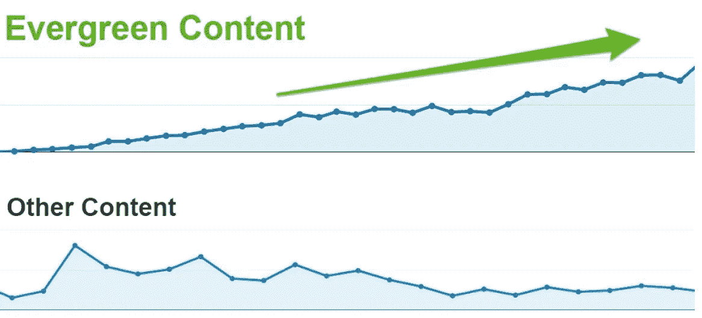

虽然“evergreen”这个名字可能会让你认为 evergreen 内容会一直运行，但这有点误导。即使是最好的常青内容也需要偶尔的修剪和护理。对于涵盖更多技术主题或随时间变化的内容来说尤其如此，例如内容营销或电子邮件营销技术。

在你的 evergreen 内容发布后，每月监控它的健康状况，看看它的排名如何。如果你注意到一部分内容开始下降，你完全有可能需要做一些额外的关键词研究，甚至用更新的图片、视频和文本来更新你的文章。

看看有哪些竞争者的作品排名，是否有比你的作品排名更高的作品。如果是这样，看看他们使用了哪些你没有使用的关键词或信息，并填补空白。

即使一篇文章表现很好，至少每 12 个月检查一下文章中的信息是否完全准确也是一个好主意。此外，看看是否有新的信息需要添加，以确保它尽可能是最新的。再次推广你的常青内容也无妨，即使它有点旧。如果这个话题因为这样或那样的原因成为新闻热点，那就更是如此。

另外，当你更新帖子时，确保更新上面的日期；谷歌和你的读者会注意到，增加你保持高排名的可能性。所有这些都将继续巩固你在谷歌 SERP 上的地位。

如果你有老的常青树内容，根本不排名，不要担心更新他们。战略性地将你的时间和精力集中在那些能给你时间投资带来最佳回报的帖子上。

# 感到不知所措&不知道从哪里开始？

你的脑袋可能被所有的“要做的事情”弄得晕头转向，事实是有大量的细节可以确保你做对。

但是不要放弃我！

常青的内容不是在公园散步，需要很多努力。如果您不确定从哪里开始，[联系](https://www.milesanthonysmith.com/contact.html)，我们可以看看如何帮助您创建一个完整的服务解决方案。一旦你开始获得牵引力，你的作品起飞，我们甚至可以实施一个训练方案，以确保您的团队继续建立在这种增长。

[请立即联系我，看看我的团队如何为您提供帮助。](https://www.milesanthonysmith.com/contact.html)

【www.milesanthonysmith.com】最初发表于**。**

**

## *这篇文章发表在 [The Startup](https://medium.com/swlh) 上，这是 Medium 最大的创业刊物，拥有 314，785+的读者。*

## *在此订阅接收[我们的头条新闻](http://growthsupply.com/the-startup-newsletter/)。*

**