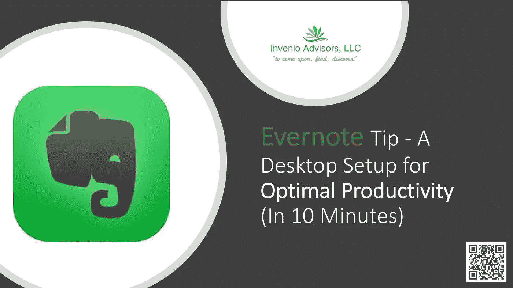
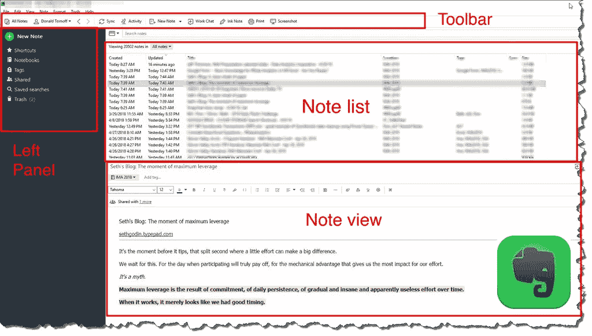
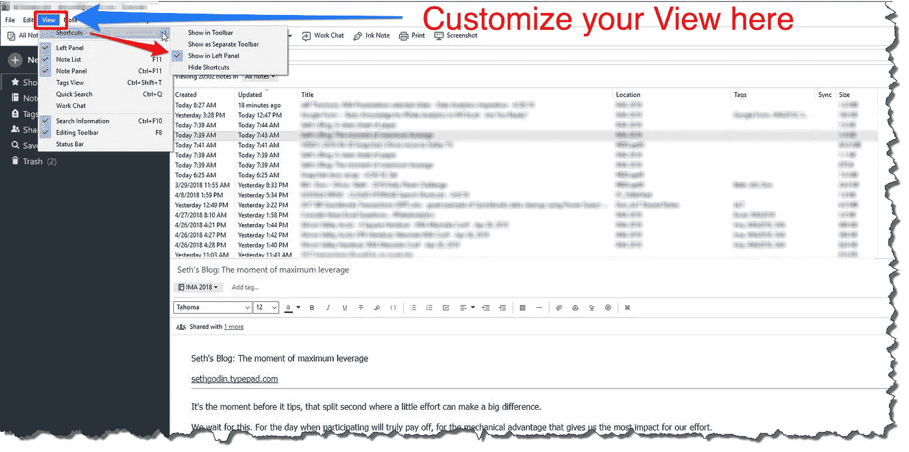
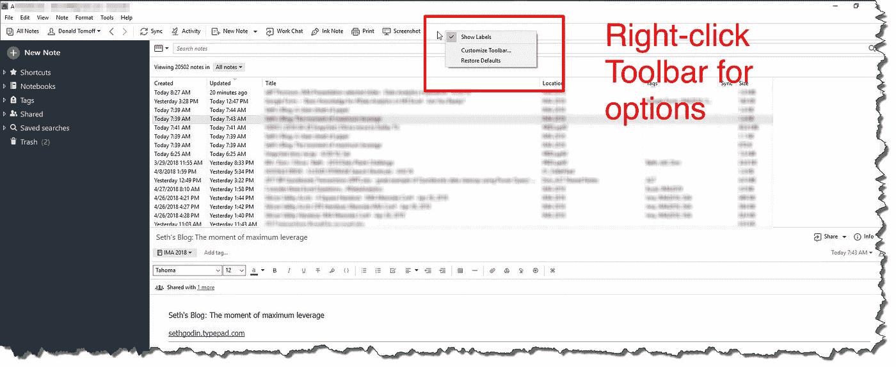
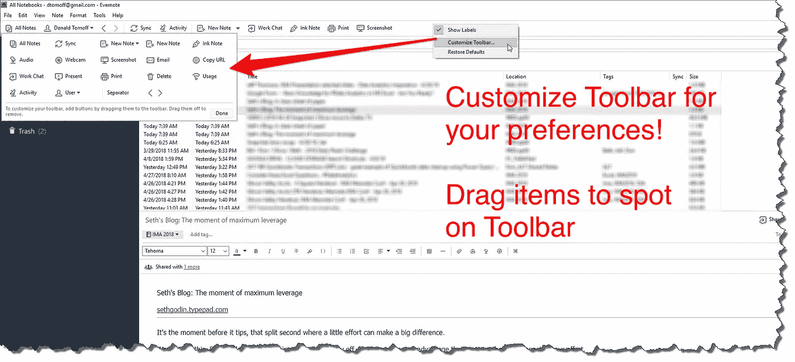
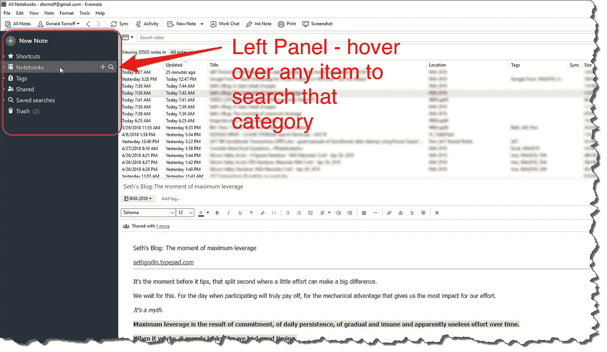
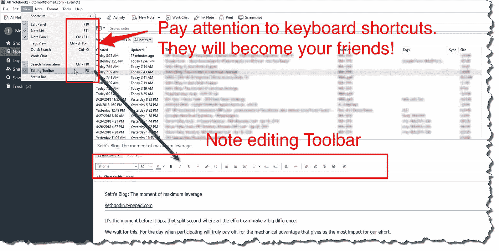

# evernote——实现最佳生产力的桌面设置(10 分钟)

> 原文：<https://medium.com/swlh/evernote-a-desktop-setup-for-optimal-productivity-in-10-minutes-7bb067045b93>

## Evernote 的界面可能会令人困惑，但也不尽然

**Evernote Tips**

**Evernote Desktop — Components of My Desktop Vi**ew

# 介绍

如果你使用 Evernote ，你可能已经意识到如何使用它的许多功能和快速获取东西并不直观。

但也有可能。而且不难！

> 定制你的界面来适应**你的**偏好，你会很快变得惊人的高效！

我经常与其他 [Evernote](https://medium.com/u/cc5554e706bb?source=post_page-----7bb067045b93--------------------------------) 用户、 ***进行这样的对话，所以下面我提供了我的偏好观点。您可能有不同的偏好，但我发现这种布局对我来说最有效。***

开始了…

# 浏览选项

## 1-激活视图菜单并选择您的选项

我选择的选项有:

*   **左侧面板**可见(左侧面板显示快捷键)
*   **显示音符列表**和**音符面板**—水平分屏
*   **搜索**工具栏
*   注意**编辑**工具栏

**Evernote View Menu Options**

## 2-自定义顶部工具栏

把这个想象成 Microsoft Office 中的“快速访问工具栏”。

我的设置是“显示标签”。

要进行更改，右键单击工具栏，将出现选项菜单。

**Modify the Evernote Toolbar**

点击“自定义工具栏”显示选项。

**Toolbar Options — Drag to Toolbar to Add**

## 3-使用左侧面板选项

**Evernote Left Panel — Access to Everything!**

左侧面板是 Evernote 中所有内容的入口！

*   ***快捷方式*** —将便笺拖到此处可快速访问最常用的项目。
*   ***笔记本***——这些都是你的“宽泛”范畴。使用少量或大量——这完全是个人喜好！
*   ***标签*** —标签很神奇。使用标签，这将大大提高您的搜索灵活性！
*   ***共享项目*** —这是您共享的任何内容—笔记和笔记本—或与您共享的内容。
*   ***保存的搜索*** —搜索内容是 Evernote 的威力变得真正明显的地方！一旦你开始搜索，你会想要保存频繁的搜索(例如，我的一个收藏是“ ***创建:第 14 天*** ”，它显示了最近 14 天创建的所有笔记)。

> 关于左侧面板，需要了解两个重要事项:
> 
> 悬停在任何项目上，你会看到一个浮动菜单——搜索是所有项目的选项(除了**共享**项目)。用这个。
> 
> 默认情况下，类别是折叠的。单击每个项目左侧的小箭头将其展开！

## 4-键盘快捷键

熟悉您经常访问的项目的键盘快捷键。它会源源不断地回报你！

**View Menu — Keyboard Shortcuts**

这些是我的 Evernote 桌面布局的基础。我希望这给了你一些可以帮助你的想法！

你还有其他建议吗？请在下面的评论中分享。

## 关于唐

> “是时候改变了”

Don 热衷于帮助专业人士和组织跟上并适应我们所处的不断变化的商业世界。

> [“你是做什么的？”](http://bit.ly/2pQwFdi)

## 和唐联系！

[LinkedIn](https://www.linkedin.com/in/dontomoff) ， [Flipboard](https://flipboard.com/@dtomoff) ， [Twitter](https://twitter.com/@dtomoffcpa) ， [Snapchat](https://www.snapchat.com/add/dtomoff)

## 这篇文章发表在 [The Startup](https://medium.com/swlh) 上，这是 Medium 最大的创业刊物，有 320，131+人关注。

## 在此订阅接收[我们的头条新闻](http://growthsupply.com/the-startup-newsletter/)。

