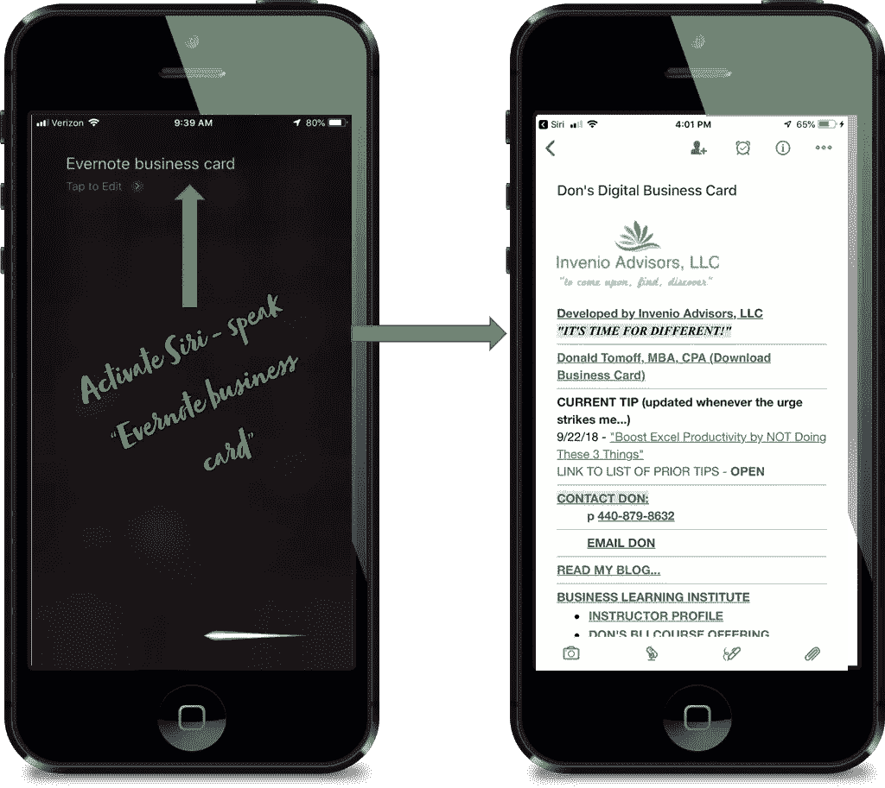
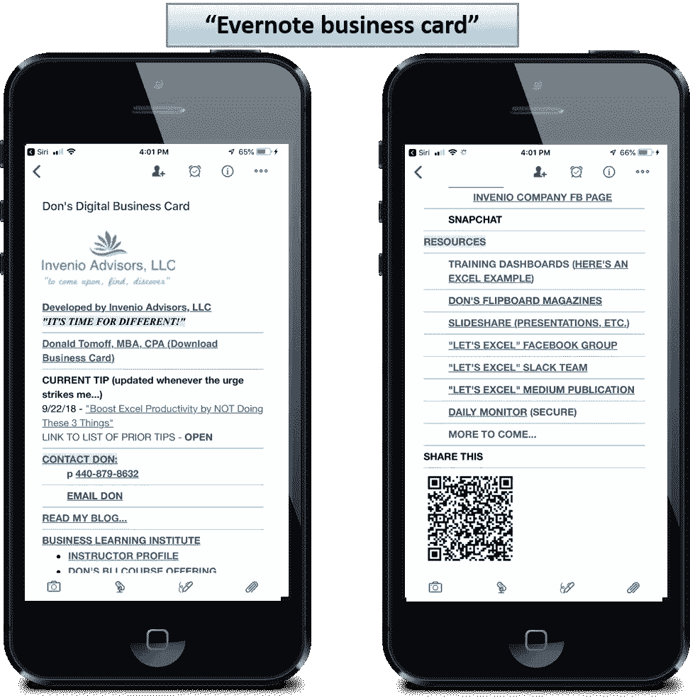
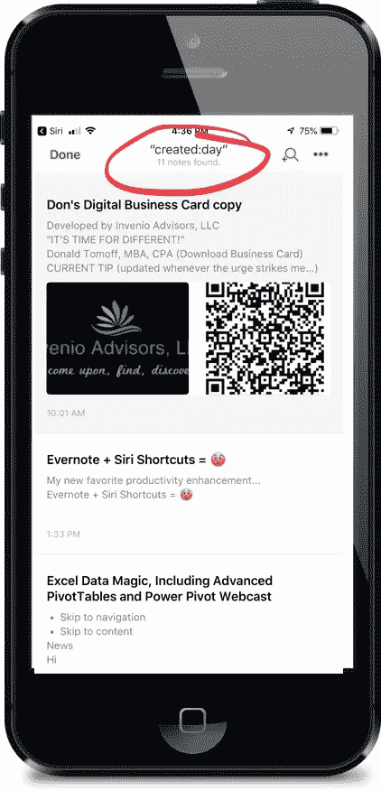
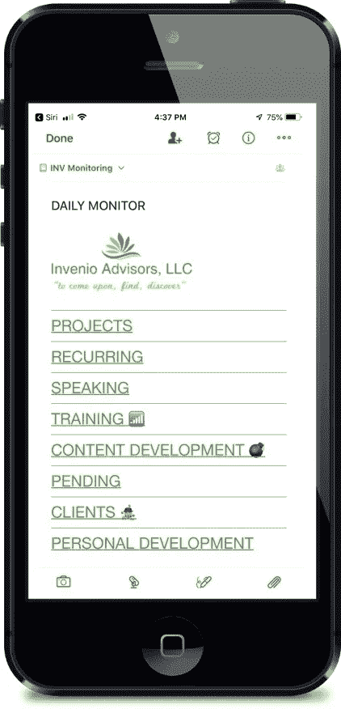
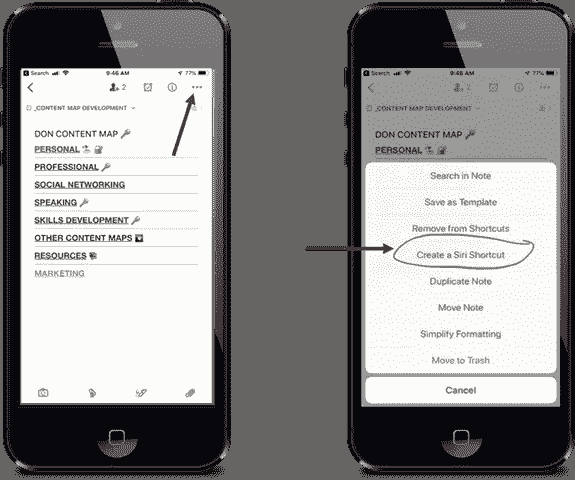
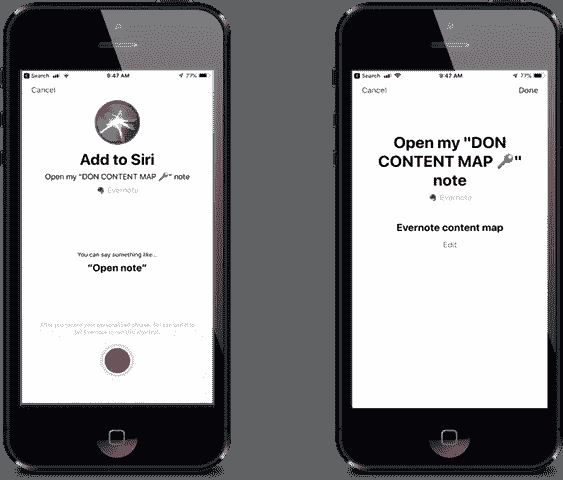

# Evernote 和 Siri 快捷键= Gamechanger！

> 原文：<https://medium.com/swlh/evernote-and-siri-shortcuts-gamechanger-e1d8bd76d51>

## 我认为这没什么大不了的——我错了！

**Siri Command Opens Evernote Note**

iOS 12 推出了适用于 iPhone 和 iPad 的[快捷方式应用](https://support.apple.com/en-us/HT208309)。

> “iPhones 版 [iOS 12](https://ios.gadgethacks.com/collection/ios-12-tips-news/) 最令人兴奋的新增功能之一叫做快捷方式，这是一个与 [Siri](https://ios.gadgethacks.com/collection/siri-tips-tricks/) 集成的工具，可以帮助你更快地完成工作。”—[Gadgethacks.com 文章](https://ios.gadgethacks.com/how-to/use-shortcuts-app-your-iphone-ios-12-for-custom-siri-actions-more-0185874/)

除了实际的快捷方式应用程序， *iOS 12 现在让我们能够为选定的应用程序分配语音激活的快捷方式*(现在，Evernote 是一个很好的应用程序！)

我最喜欢的生产力应用之一是 Evernote 笔记。语音访问笔记、保存的搜索、特定标签等。是一个生产力的提升，你不能真正想象，直到你设置它们！

# 我最喜欢的 Evernote Siri 快捷键

以下是我立即建立起来的六个快捷方式，我很快发现它们对我的工作流程有很大的好处:

## **1 —“印象笔记名片”**

打开我所有专业信息链接的数字资源卡，轻松共享。

**Digital Business Card**

## 2 — **《今日印象笔记》**

打开 Evernote，只显示我今天创建的笔记。

**Display Notes Created Today**

## 3—**“Evernote 待定”**

打开我的便笺，在那里我维护即时待处理的项目。我每天都看这个。

## 4 — **“印象笔记客户端 1”**

打开 Evernote，只显示带有特定客户端代码标签的笔记。多个版本—客户端 1、2、3 等。

## 5 — **《印象笔记每日观察》**

这是一个“目录”注释，我用它来“启动”我维护并需要频繁访问的不同内容。

**Evernote “Daily Monitor” Note**

## 6—“Evernote 这样做”

打开标有***do not this！*** (我最喜欢的标签之一，用于文章、视频或任何我想回头看的杂项内容)。

# **设置 Evernote Siri 快捷方式**

一旦你做过一次，这就非常简单了。方法如下:

*   访问 Evernote 笔记、搜索等。你想要捷径。访问“创建 Siri 快捷方式”。

**Access Note → Tap Create Siri Shortcut**

*   记录短语。确保这是你想要的短语。完成了。你也可以随时回来编辑。

**Record Phrase — Your Done. The Shortcut is now active!**

我上面关注的是 Evernote，但是其他应用也有这个功能。这里有一篇文章强调了其他具有 Siri 快捷方式功能的应用程序。

 [## 通过这十个应用程序，充分利用 iOS 12 和你的新 iPhone XS 的功能

### 你有了一部新手机，现在让它为你努力工作吧。每次 iPhone 更新都会带来大量新的 iOS 应用程序和…

appleinsider.com](https://appleinsider.com/articles/18/10/06/exploit-the-power-of-ios-12-and-your-new-iphone-xs-with-these-ten-apps) 

祝你好运！

我很想听听你最喜欢的 Siri 快捷键是什么。请在下面的评论中告诉我。

## 关于唐

> “是时候改变了”

Don 热衷于帮助专业人士和组织跟上、发展和适应我们所处的不断变化的商业世界。

> [“你是干什么的？”](http://bit.ly/2pQwFdi)

## 和唐联系！

[LinkedIn](https://www.linkedin.com/in/dontomoff) ， [Flipboard](https://flipboard.com/@dtomoff) ， [Twitter](https://twitter.com/@dtomoffcpa) ， [Snapchat](https://www.snapchat.com/add/dtomoff)

## 这篇文章发表在 [The Startup](https://medium.com/swlh) 上，这是 Medium 最大的创业刊物，拥有+ 376，225 名读者。

## 在此订阅接收[我们的头条新闻](http://growthsupply.com/the-startup-newsletter/)。

