# evernote——“我如何创建一个选中笔记的 Excel 列表？”

> 原文：<https://medium.com/swlh/evernote-how-do-i-create-a-report-of-selected-notes-67cf53bc8369>

## 常见问题——以下是我的解决方案

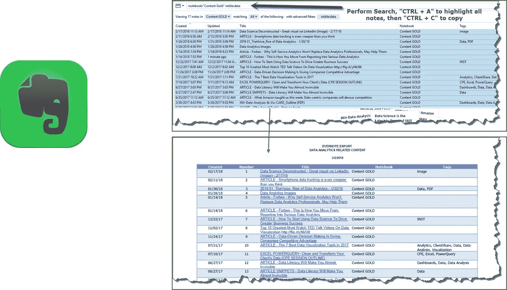

**Evernote Notes List → Excel → PDF Report**

> 你使用 Evernote 的次数越多，你就越有可能想要创建不同的笔记列表，你想要分享、查看或者只是从 Evernote 中分离出来。

以下是我被问到这个问题的几种情况:

*   提供给我老板的活动清单，
*   提供给团队的活动列表，
*   与他人分享的内容和资源列表，
*   我所进行的研究的资源和注释列表等。

所有这些情况都需要从你的 Evernote 账户中提取一个子集或过滤清单。

> 在这篇文章中，我将介绍一下我是如何做到的。

# 场景

我将于 2018 年 6 月在印第安纳波利斯举行的 [IMA 年会上发表演讲，我需要创建一份参考文档，以便在准备开始起草演讲时使用。](https://www.imaconference.org/index.cfm)

我使用 Evernote 作为我日常工作流程的一部分，每当我看到一些相关的或未来潜在的资源时，我就会收集内容。

> **我在 Evernote 上松散地组织我的内容，严重依赖可用的强大搜索功能。这就是 Evernote 的实力！**

所以，这是我的过程:

# 搜索并提取您的笔记

我有四个搜索词可以依赖:

## *包含在特定的笔记本中，标题中带有“数据”一词:*

*   ***笔记本=内容金***

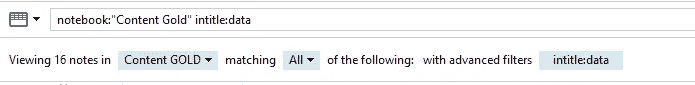

**Search EN Notebook “*Content Gold*” for any notes with “data” in the Note Title**

*   ***Notebook = invpresentation content***

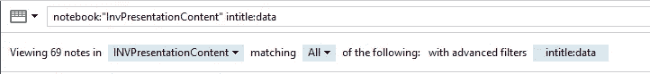

**Search EN Notebook “INVPresentationContent” for any notes with “data” in the Note Title**

*   ***笔记本=文章***

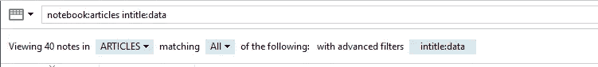

**Search EN Notebook “Articles” for any notes with “data” in the Note Title**

## 在所有笔记中搜索特定参数:

*   ***所有笔记，笔记标题中包含“数据”，即包含 PDF 文档***

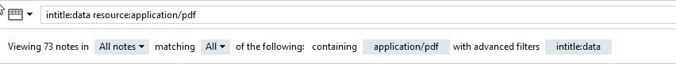

**Search EN All Notes with “data” in the title AND include a PDF document**

# 将笔记列表复制并粘贴到 Microsoft Excel 中

## 搜索、复制、粘贴和创建超链接

*   搜索，选择所有笔记(“CTRL + A”)并激活复制(“CTRL + C”)

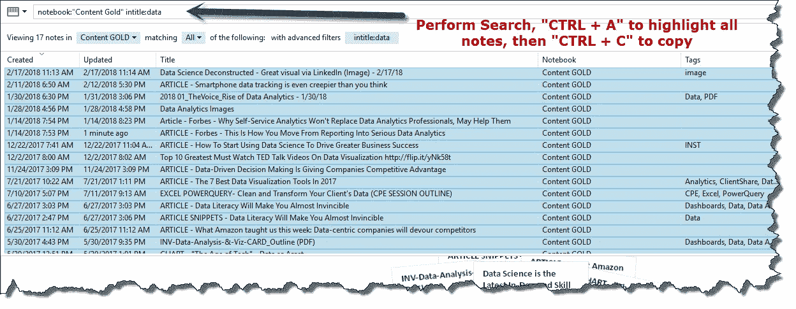

**Search results selected for copying into Excel**

*   打开 Excel，粘贴所选内容(“CTRL + V”)

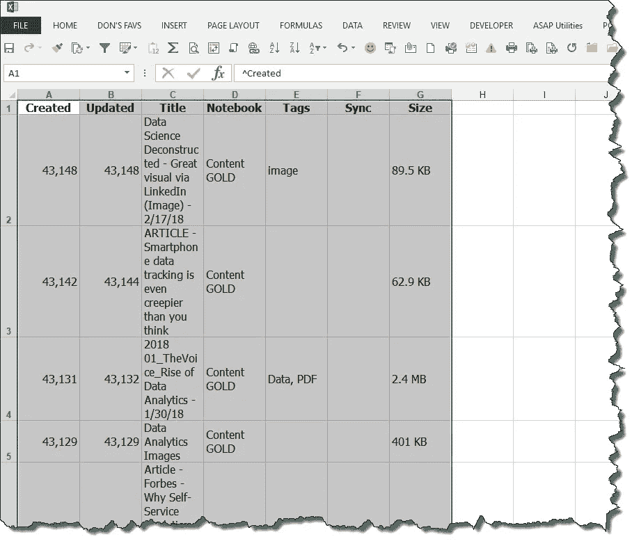

**Paste EN Note List into Excel**

*   关闭 Excel 的“文字环绕”功能(“ALT + H，W”)

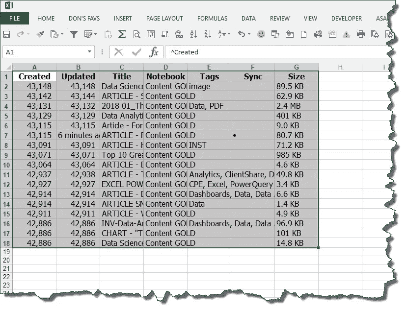

**Turn off Excel “text wrapping” feature to create condensed list**

*   现在，我希望标题列包含到 EN 注释的超链接，所以…

*返回 Evernote，选择笔记，点击鼠标右键，选择“复制内部链接”*

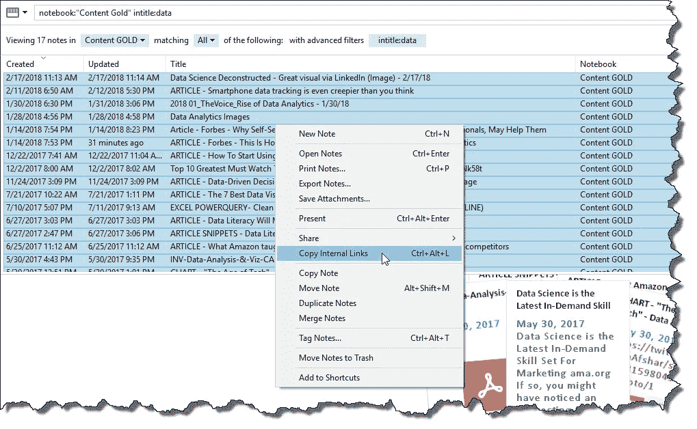

**In Evernote, Copy Internal Links to selected notes (CTRL + ALT + L)**

*转到 Excel 并粘贴链接(“CTRL + V”)，这将用超链接文本替换内容列表。*

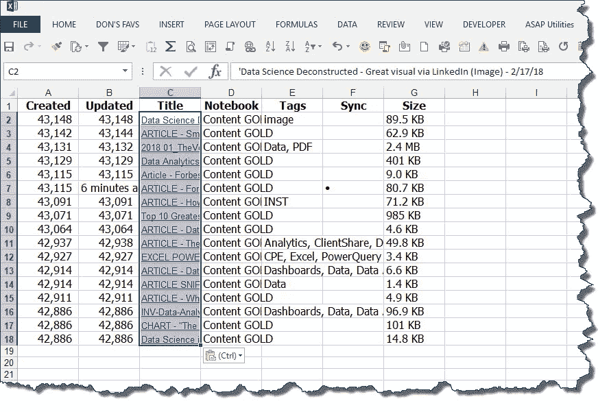

**Paste Links from EN to replace Excel List with Hyperlinks**

对剩下的 Evernote 搜索执行这个过程，然后我们将格式化数据以供使用！

## 格式化数据以供使用

为了便于使用，我执行了三个步骤:

*   格式化为表格(“ALT + H，T”)，选择所需的格式。

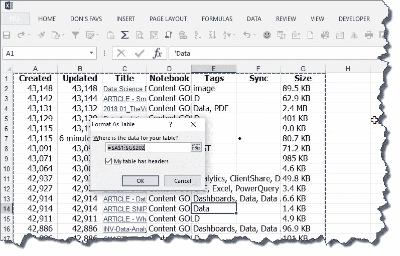

**Select and Format as Excel Table**

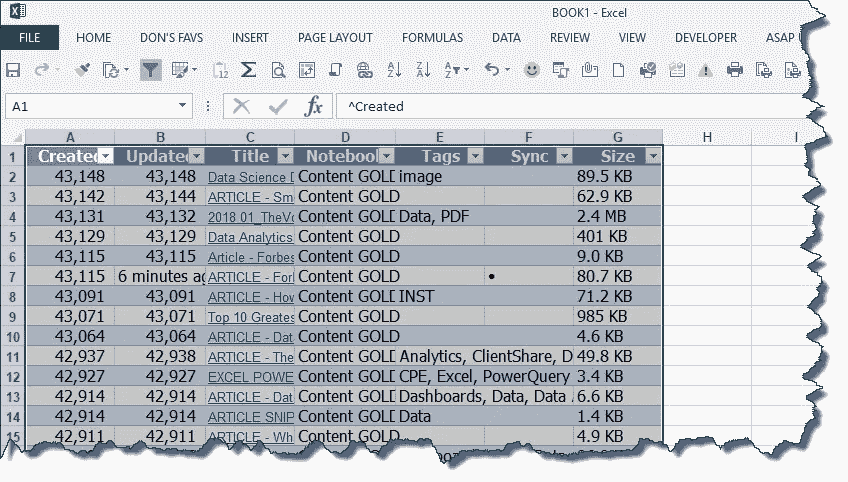

**Data List Formatted as Excel Table**

*   删除报表中我不想要的列。

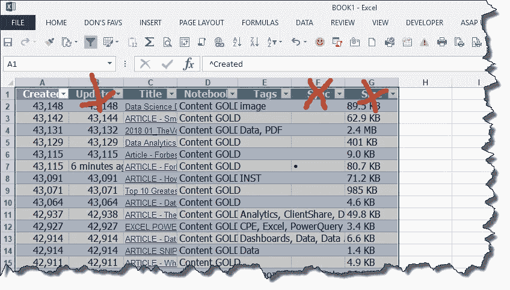

**Columns in Excel Table I am Deleting from my Report**

*   最终报告数据结构。

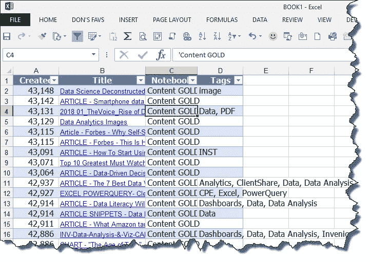

**Final data set for report**

*   根据我的偏好设置报告的格式。

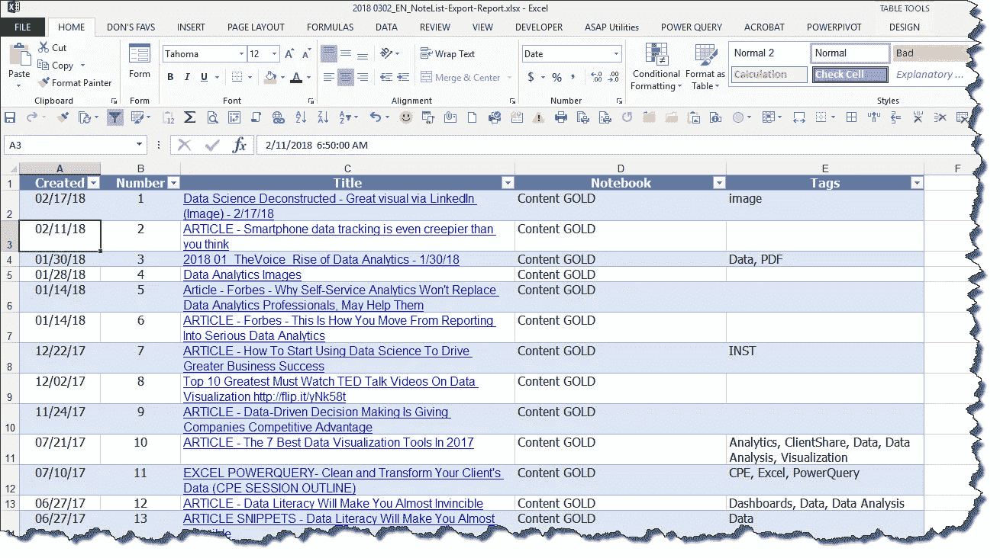

**Final EN report list — displayed to my preferences!**

# 使用最终报告

我不干了。

现在，我可以使用 Excel 工作簿或打印的 PDF，其中包含指向 Evernote 中数据的超链接。

这是 PDF 格式的报告。

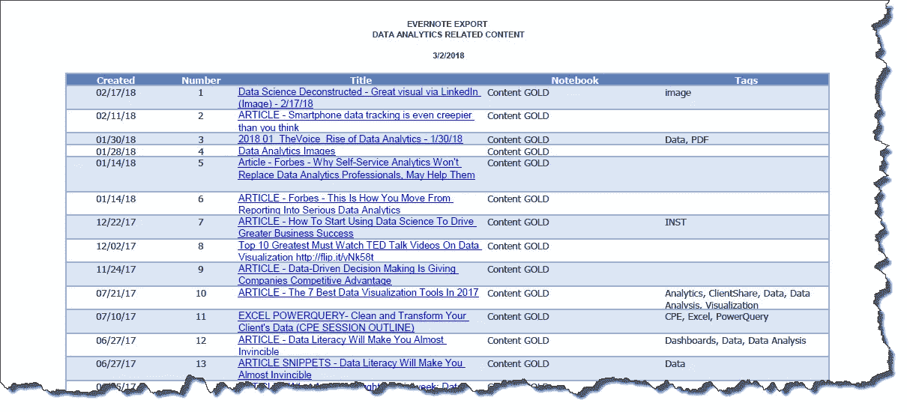

**PDF Report — Click or Tap on Hyperlinks to access Evernote Content**

在第 2 部分中，我将探索在我的移动设备上使用这个报告的过程。这是我喜欢的复习方法，所以我可以用笔记等来注释。

## 关于唐

> “是时候改变了”

Don 热衷于帮助专业人士和组织跟上并适应我们所处的不断变化的商业世界。

> [“你是干什么的？”](http://bit.ly/2pQwFdi)

## 和唐联系！

[LinkedIn](https://www.linkedin.com/in/dontomoff) ， [Flipboard](https://flipboard.com/@dtomoff) ， [Twitter](https://twitter.com/@dtomoffcpa) ， [Snapchat](https://www.snapchat.com/add/dtomoff)

[或者，谷歌我……我无处不在](https://www.google.com/webhp?sourceid=chrome-instant&ion=1&espv=2&ie=UTF-8#q=don%20tomoff%2C%20invenio%20advisors)

## 这个故事发表在 [The Startup](https://medium.com/swlh) 上，这是 Medium 最大的创业刊物，拥有 303，461+人关注。

## 在此订阅接收[我们的头条新闻](http://growthsupply.com/the-startup-newsletter/)。

