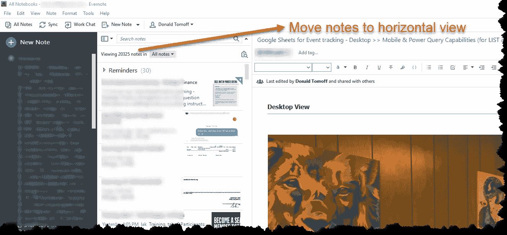
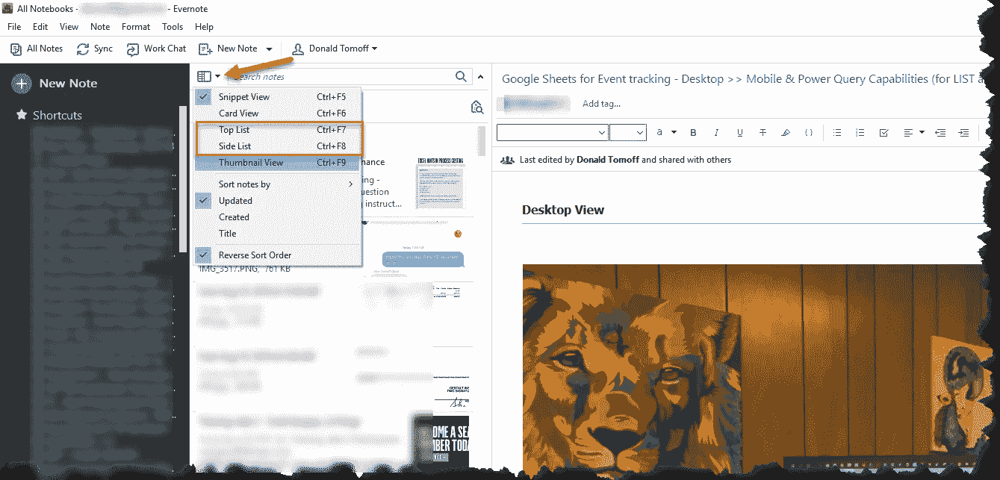
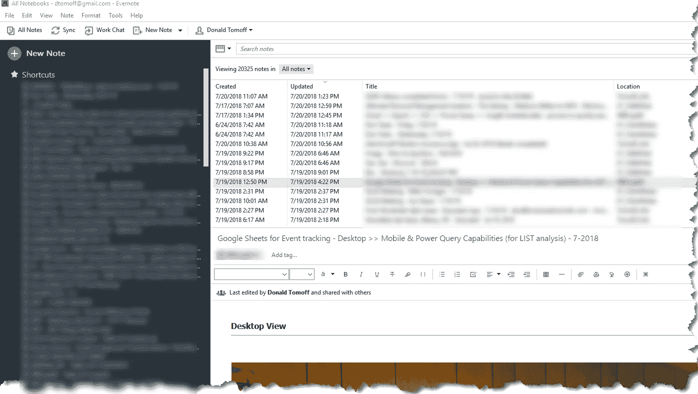
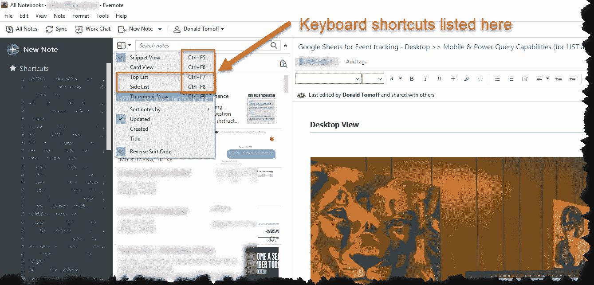

# Evernote 提示——改变笔记列表的位置

> 原文：<https://medium.com/swlh/evernote-tip-change-location-of-your-note-list-afd183a6a0b9>

## 这很容易，键盘快捷键让它变得超级简单

**Evernote Tips**

你用 Evernote 越多，你对你的设置就越挑剔！过去的一个帖子强调了我最喜欢的方法。

 [## evernote——实现最佳生产力的桌面设置(10 分钟)

### Evernote 的界面可能会令人困惑，但也不尽然

medium.com](/swlh/evernote-a-desktop-setup-for-optimal-productivity-in-10-minutes-7bb067045b93) 

在过去的几个月里，我已经多次回答了以下问题:

> “如何将笔记列表移动到水平分屏视图？还是返回侧栏“片段”视图？”

# 以下是方法

**Notes in Sidebar View**

点击“搜索注释”框左侧的下拉按钮

**Dropdown list menu**

点击“首要列表”——完成！

**Evernote with Notes in Horizontal View**

# **但这里有一个最好的提示**

使用键盘快捷键！

我经常想根据我正在做的工作改变笔记列表的位置。如果我主动记录笔记，我更喜欢在边栏中列出我的笔记列表(而不是在不同的窗口中打开笔记)。

**Keyboard shortcuts for selecting Note Views**

所以:

> Ctrl + F7 —水平分屏视图中的笔记。
> 
> CTRL+F8——边栏视图中的笔记(虽然显示为列表)。
> 
> CTRL + F5 —在代码片段视图中显示注释(我更喜欢侧栏中的这个视图)。

这将大大加快你使用 Evernote 的速度——并使你使用笔记变得更加容易！

## 关于唐

> “是时候改变了”

Don 热衷于帮助专业人士和组织跟上、发展和适应我们所处的不断变化的商业世界。

> [“你是做什么的？”](http://bit.ly/2pQwFdi)

## 和唐联系！

[LinkedIn](https://www.linkedin.com/in/dontomoff) ， [Flipboard](https://flipboard.com/@dtomoff) ， [Twitter](https://twitter.com/@dtomoffcpa) ， [Snapchat](https://www.snapchat.com/add/dtomoff)

## 这个故事发表在 [The Startup](https://medium.com/swlh) 上，这是 Medium 最大的创业刊物，拥有 358，974+人关注。

## 在此订阅接收[我们的头条新闻](http://growthsupply.com/the-startup-newsletter/)。

