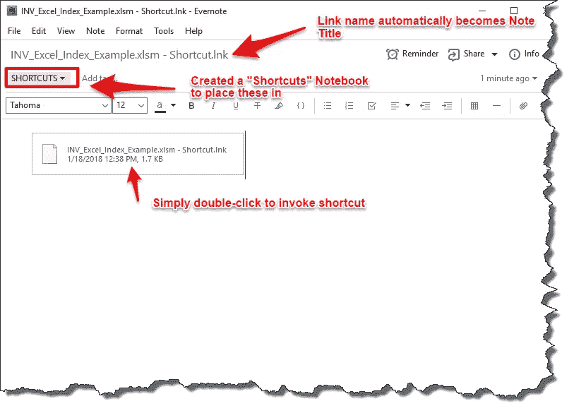
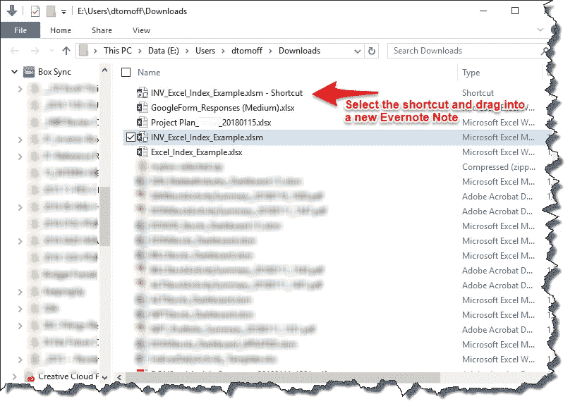
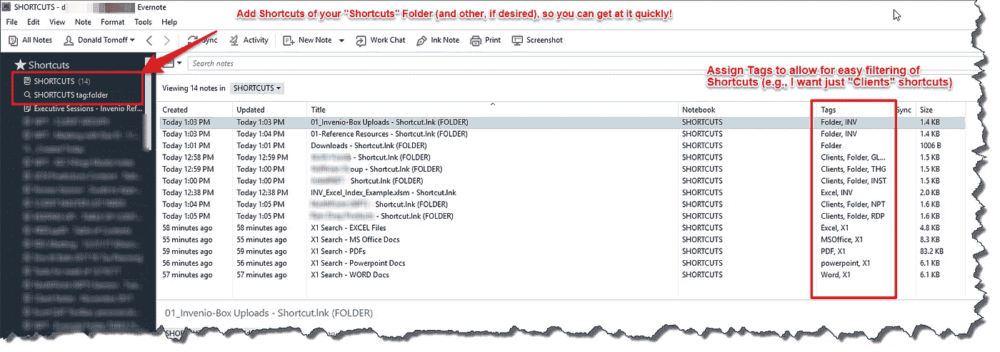
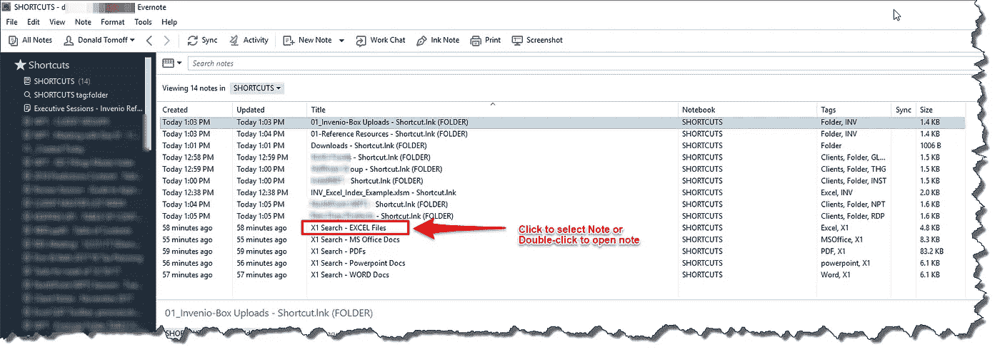
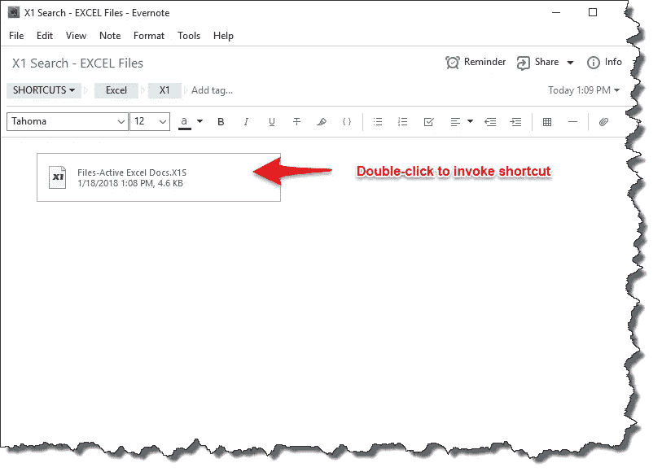
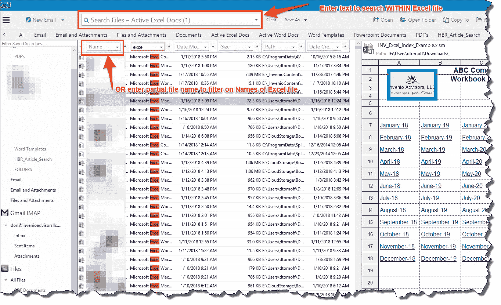

# #Evernote 提示——使用 Evernote 清理和简化快捷方式！

> 原文：<https://medium.com/swlh/evernote-tip-clean-up-and-streamline-shortcuts-with-evernote-ba2791da6f32>

## 清理桌面，变得更有条理！

**Shortcut Link Displayed in Evernote Note**

# 要解决的问题？

我们许多人创建快捷方式来获取我们的文件/互联网/文件夹等。更快更容易。

> 我们把这些捷径放在哪里？

以下是我在工作场所经常遇到的情况:

*   在桌面上(最终你会耗尽空间，很难找到它们)
*   在桌面上的文件夹中(数量不限，很难搜索和找到…)
*   分散在计算机或网络驱动器的子文件夹中(这真的不太好！)

一个更简单、更有条理的选择是使用 Evernote。

# 该过程

*   创建(或找到)要保存的快捷方式文件。

**Locate the Shortcut File to Put into Evernote**

*   打开 Evernote 桌面(我用的是 Windows)，开始一个新的笔记(Ctrl + N)

**Drag Shortcut File into a New Evernote Note**

*   我建议在 Evernote 中创建一个单独的笔记本(我使用“快捷方式”)来保存这些笔记。

接下来，继续这个过程。创建您想要的任意数量的快捷方式笔记，并将它们放在**快捷方式**笔记本中

**A List of Shortcut notes in a Notebook**

> 随着您创建快捷方式，此笔记本将继续添加笔记。

*   创建 ***Evernote 快捷方式*** (不同于“快捷方式”笔记)并将它们添加到你的 Evernote 快捷方式工具栏中。这将使您可以立即访问这些笔记——这是关键！

> 为笔记添加标签，如“Excel”、“文件夹”、“PDF”等。

*   随着笔记列表的增长(假设有 50 或 60 个)，您将需要过滤列表的子集。这就是标签非常有用的地方。

**搞定！**

# 它是这样工作的

假设我想查看我最近创建/访问的 ***MS Excel 文件的列表…***

*   选择包含该快捷方式的便笺(或连按以在单独的窗口中打开便笺)。

**Select the Evernote Note with Shortcut you want**

*   双击 Evernote 笔记中包含的快捷文件。

**Double-click the Shortcut file to invoice shortcut**

**X1 搜索**(我的搜索工具)打开，并按日期降序列出 ***Excel 文件*** (并表示我有超过 17，000 个 Excel 文件)。

> 从这里，我可以很容易地**改进我的搜索**，基于文件名的组成部分或我正在寻找的文件中包含的一些文本。

**X1 Search Listing Excel Files in Date Descending Order**

随着你对这个过程的熟悉，你将不再以同样的方式看待快捷方式。您将变得井井有条，能够快速访问您需要的任何内容！

> 说真的，不要再点击文件夹来访问你的文件了！祝你好运！

## 关于唐

> “是时候改变了”

Don 热衷于帮助专业人士和组织跟上并适应我们所处的不断变化的商业世界。

## “你是做什么的？”

我经常被问到这个问题。我的回应(不是你想的那样！)?点击这里查看！

## 和唐联系！

[LinkedIn](https://www.linkedin.com/in/dontomoff) ， [Flipboard](https://flipboard.com/@dtomoff) ， [Twitter](https://twitter.com/@dtomoffcpa) ， [Snapchat](https://www.snapchat.com/add/dtomoff)

[或者，谷歌我……我无处不在](https://www.google.com/webhp?sourceid=chrome-instant&ion=1&espv=2&ie=UTF-8#q=don%20tomoff%2C%20invenio%20advisors)

## 这个故事发表在 [The Startup](https://medium.com/swlh) 上，这是 Medium 最大的企业家出版物，拥有 286，184+人。

## 在此订阅接收[我们的头条新闻](http://growthsupply.com/the-startup-newsletter/)。

