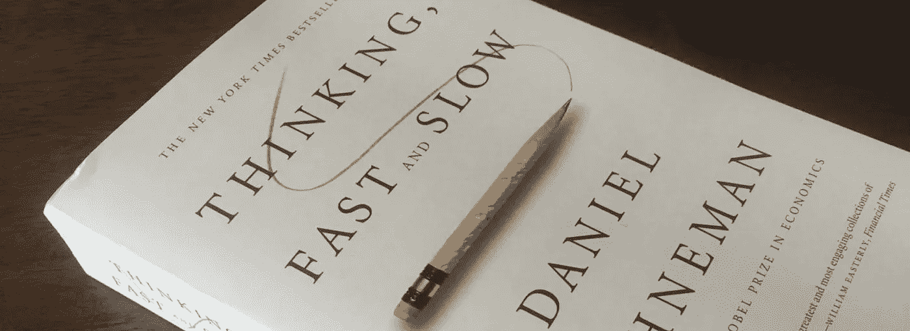
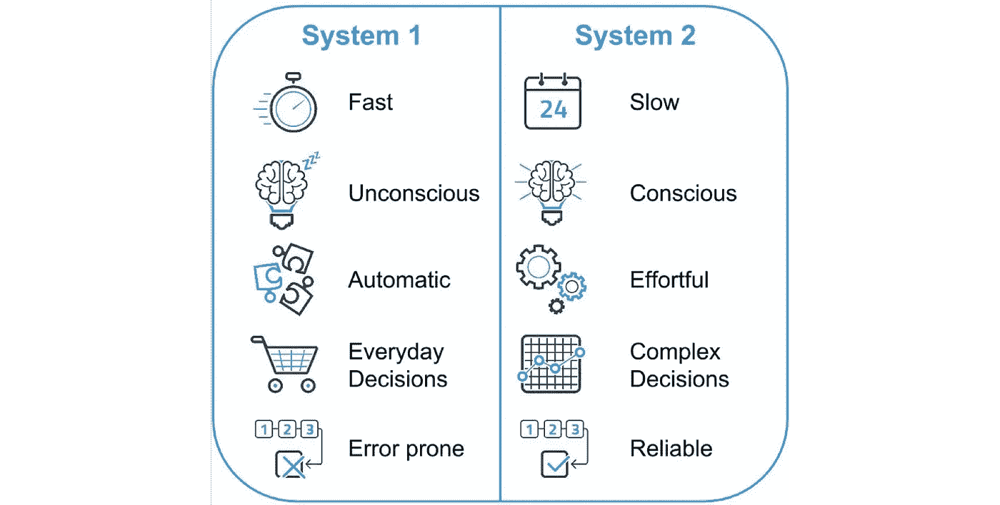
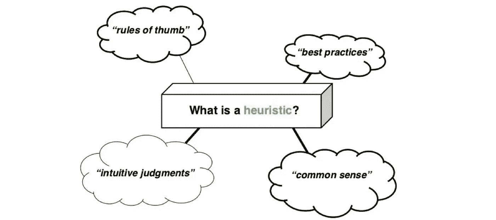
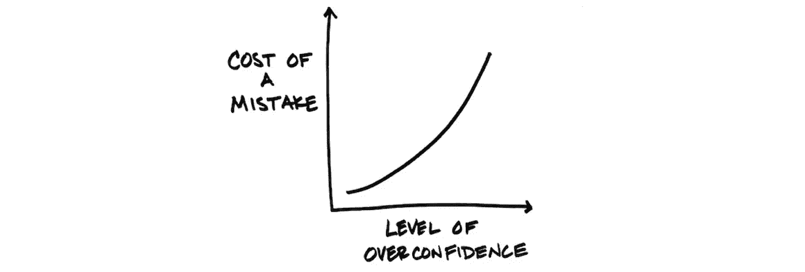
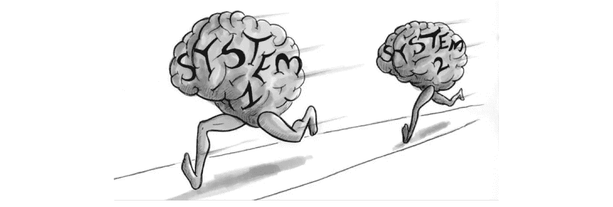
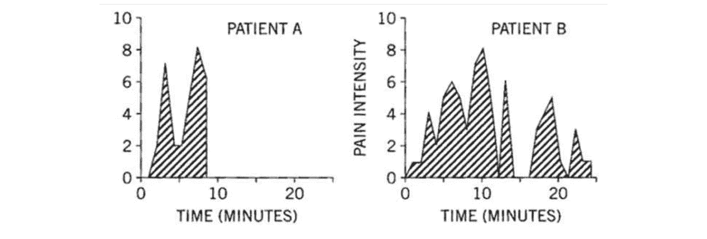

# 每一章的思考速度快，慢在 7 分钟

> 原文：<https://medium.com/swlh/every-chapter-of-thinking-fast-and-slow-in-7-minutes-5e6adf89cf39>

## 突破性畅销书的紧凑外卖

[Image Source](http://obedparla.com/thinking-fast-slow-understanding-human-behavior-review/)

大约一周前，我终于读完了丹尼尔·卡内曼的《思考的 [*、快与慢*](https://www.amazon.in/Thinking-Fast-Slow-Daniel-Kahneman/dp/0374275637) 。虽然是在 2011 年发行的，但这本畅销书在今天仍然和近八年前一样适用。

这是有充分理由的；让诺贝尔奖获得者[来研究心理学和大脑内部运作的复杂概念，通过实际应用和例子让任何人都能理解它们。](https://en.wikipedia.org/wiki/Daniel_Kahneman)

我已经看到我从书中学到的一些东西开始改变我做决定和处理偏见的方式。你会惊讶于我们对日常思维过程的控制是如此之少。

虽然不是最快的阅读速度，接近 600 页，但我可以回头看看，很高兴我努力了。此外，我认为以简单明了的方式分享我所学到的东西会很酷。

**其结果见下文，用一句话对*思考、快与慢*中的 38 个章节进行了分解。**

请记住，这本书的内容比我在一篇简洁的帖子中所能表达的要多得多，所以如果这些概念中的任何一个让你感兴趣，我强烈建议你去看看这本[杰作本身](https://www.amazon.com/dp/B00555X8OA/ref=dp-kindle-redirect?_encoding=UTF8&btkr=1)。

[Image Source](/@ryansheffer/founders-need-to-think-slow-move-fast-6b683e94c110)

# 第一部分:两种制度

**1。故事中的人物我们有两个主要的思考系统:系统 1 运行迅速，没有自主控制的感觉，而系统 2 处理任何类型的费力的精神活动。**

**2。注意力和努力** 我们通过将当前的任务分解成小步骤来进行长期记忆，从而避免认知超载；我们很自然地会被那些尽可能少用脑力的解决方案所吸引。

**3。懒惰的控制者** 系统 2 的主要功能之一是监视和控制来自系统 1 的建议，然而它通常是懒惰的，并且过于相信直觉。

**4。联想机** 系统 1 提供印象，印象往往转化为信念和行动；即使是最微不足道的想法也能引发其他想法，如此等等。

**5。认知轻松度** 当经历认知轻松度与紧张度时，你的表现会有所不同；紧张时你可能会犯更少的错误，但你不会有创造力。

**6。规范、惊喜、起因** 系统 1 的主要功能是维护和更新你个人世界的一个模型，这个模型代表了在其中什么是正常的。

**7。系统 1 对产生印象和直觉的信息的质量和数量根本不敏感。**

**8。判断是如何发生的** 在做出判断时，我们通常要么计算出比我们需要的多得多的信息，要么试图匹配不同维度的潜在强度。

**9。回答更简单的问题** 如果一个难题没有很快找到满意的答案，系统 1 会找到一个更简单的相关问题来代替回答。

[Image Source](https://www.jeremysaid.com/blog/heuristics-for-conversion-optimization/)

# 第二部分:启发和偏见

**10。小数目定律我们有一种强烈的偏见，认为小样本与从中抽取样本的总体非常相似。**

**11。当一个未知量的特定值影响了你对这个量的估计时，锚定效应就发生了。**

**12。可用性科学我们想到例子的容易程度经常被用来判断事件发生的频率。**

**13。可用性、情感和风险我们试图通过创造一个比现实更整洁的世界来简化我们的生活；在现实世界中，我们经常面临收益和成本之间的痛苦权衡。**

14。汤姆·W 的专长
高估证据、低估基础利率是常见的做法；你怎么知道你的情况不同？

15。琳达:少即是多给场景添加细节会让它们更有说服力，但实现的可能性更小。

16。比起从事实和统计数据中，你更有可能从个案或例子中学到一些东西。

17。回归均值
理解可量化绩效的自然波动很重要。

18。驯服直觉预测
为了产生无偏的预测，从平均值开始，并基于证据的匹配和估计相关性有系统地移动。

[Image Source](https://fs.blog/2015/04/bias-from-overconfidence/)

# 第三部分:过度自信

19。理解的错觉
我们相信，由于我们不断调整对世界的看法，我们理解了过去；这意味着未来也应该是可知的，然而我们对过去的了解比我们想象的要少。

20。有效性错觉
主观信心不是对判断是否正确的合理评价，而是一种反映信息连贯性和处理信息难易程度的感觉。

**21。直觉与公式** 每当你可以用一个结构化的简单公式代替直觉和印象时，你至少应该考虑一下。

**22。专家直觉:我们什么时候能相信它？在正常情况下，你通常可以相信专家的直觉，然而在处理不太规则的环境时，要多加怀疑。**

**23。外部观点** 我们倾向于根据最好的情况来计划项目，而不考虑之前所有类似的情况。

**24。资本主义的发动机** 对怀疑的压制助长了过度自信；试着用一个预死亡来使你的怀疑合法化。

[Image Source](https://bigthink.com/errors-we-live-by/kahnemans-mind-clarifying-biases)

# 第四部分:选择

**25。伯努利的错误** 伯努利的期望效用模型缺少一个参考点的概念，一个东西的价值很大程度上取决于一个人的现状。

26。前景理论
在混合赌博中，我们自然是厌恶风险的；而对于糟糕的选择，当肯定会亏损时，我们更有可能去寻找风险。

27。禀赋效应
我们自然赋予事物更多的价值，只是因为我们拥有它们。

28。我们通常努力避免损失，而不是获得收益。

**29。四重模式** 人类在损失领域寻求风险，就像我们在收益领域规避风险一样。

三十。罕见事件
人们常常高估不太可能发生的事件的概率；这导致我们在决策中对他们进行了过多的考虑。

31。风险政策
想象一下这个决定只是众多决定中的一个。

**32。奖励和惩罚塑造我们的偏好，激励我们的行动，所有这些都被不同的心理账户记录下来。**

**33。单次评估需要系统 1 的情感反应，而比较则需要更仔细的评估，通常由系统 2 进行。**

**34。框架与现实** 逻辑上不同的语句，根据被框架的方式，能唤起不同的反应。

[Image Source](https://www.mycustomer.com/community/blogs/tim-wade/the-cx-benefits-of-understanding-the-two-selves)

# 第五部分:两个自我

**35。两个自我** 我们有一个体验自我和一个记忆自我；后者记录分数并控制我们的学习以做出决定。

36。生活是一个故事
大多数人对自己的经历漠不关心，只关心收集起来的记忆，以便为不同的故事提供素材。

**37。体验幸福** 人们对自己生活的评价和他们的实际体验是相关的，但是不同的。

38。思考人生
幸福这个词并没有简单的含义，也不应该被当作简单的含义来使用。

# 包扎

经过一番思考，我意识到在*思考的篇章中包含了许多智慧，无论是快还是慢。太多的智慧无法用每章一句话来概括。然而，我希望这能为你提供一道有效的开胃菜，那就是小说本身。*

最后，我很高兴能够积极尝试将这些见解和概念融入到我的日常生活中，以便做出更合理、更明智、更公正的决定。如果我不呼吁你们也这样做，那将是我的失职。

丹尼尔·卡尼曼。思考，快与慢(第 407 页)。法勒，斯特劳斯和吉鲁。Kindle 版。

感谢阅读！如果你喜欢这篇文章，请继续向鼓掌按钮展示你的爱。如果你对未来的更多帖子感兴趣，请确保[关注我](https://twitter.com/cdeweyx)并订阅下面的[我的简讯](https://www.conordewey.com/)以接收任何新内容。想了解更多关于我和我在做什么，请查看我的网站。

## 这篇文章发表在[的《创业》(The Startup](https://medium.com/swlh) )上，这是 Medium 最大的创业刊物，有 355，974+人关注。

## 在这里订阅接收[我们的头条新闻](http://growthsupply.com/the-startup-newsletter/)。

