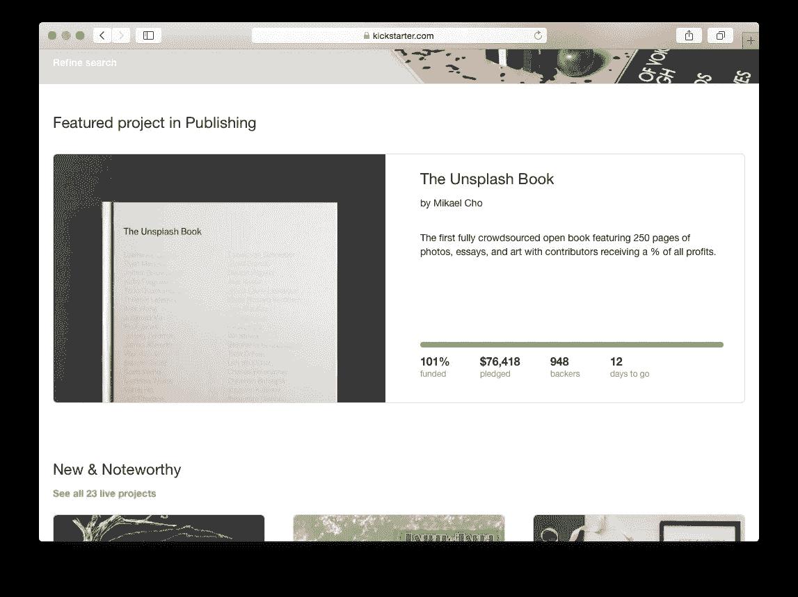
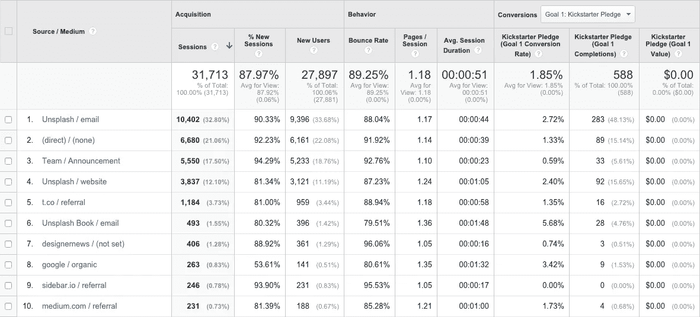

# 我们用于计划和发起 75，000 美元 Kickstarter 活动的所有资源

> 原文：<https://medium.com/swlh/every-resource-we-used-to-plan-and-launch-a-75k-kickstarter-campaign-cc5897f71bfd>

## 所以你想众筹？知道你在做什么。

100% funded and featured with 12 days to go!

有很多文章承诺一步一步地指导你进行 6 位数的众筹活动。你知道的。“如何在 10 天内在 Kickstarter 上赚 100 万美元！”或“10 万美元营销活动的 5 个简单步骤”类型。

尽管这些头条新闻中的数字本身就足以敲响警钟，但如果你仍然愿意相信病毒式宣传有捷径可走，我也能理解。

见鬼，我想相信。

当我们开始为[为 Unsplash Book](https://www.kickstarter.com/projects/mikaelcho/the-unsplash-book) 的 Kickstarter 活动做研究时，我们读了大部分，如果不是全部的话。在艰难跋涉之后，我们几乎毫发无损地走到了另一边，对如何规划、构建和发起一场成功的竞选有了一个整体的看法。

自发布以来的两周内，我们已经看到了一些令人难以置信的成功:在不到 48 小时内达到了我们 75，000 美元目标的 50%以上，并被 Kickstarter 员工选中和推荐。

**我们还从一个直到几天前还不知道我们存在的社区获得了令人难以置信的反馈和评论。**

但是达到这一步需要时间。很多时间。

通过强调迄今为止**对我们有效的建议**，我希望能让你摆脱寻找可靠来源的烦闷，并更接近让某些众筹活动与众不同的实际细节。

这不是一个循序渐进的指南(因为不管有些人会告诉你什么，真的没有办法为 Kickstarter 编写一个指南)，而是为那些寻求发起众筹活动的人提供的最佳资源的精选集合，以及使每一个都如此强大和必读的独特要点:

## 【Kickstarter 活动失败的原因

[找到并召集您产品的社区预发布](https://medium.com/u/99ef2f4e9a8#.j3k67fy9k)

[1000 名忠实粉丝理论](https://medium.com/u/95422752a843#.a3y0izdod)的忠实粉丝，利用这样的社区是找到那些在整个活动中支持你的旗手的好方法。

## [众筹是马拉松，不是短跑](/@ryanessmaker/thoughts-on-a-successful-kickstarter-campaign-84803cf18f58#.x2bqrqxf9)

[不要忘记税务员(因为他不会忘记你)](https://medium.com/u/93e92407b673#.wicbqcbd3)

格伦·弗莱什曼

你知道你在 Kickstarter 上筹到的钱也算收入吗？因为我们没有。在为他的图书项目筹集资金后，几乎经历了一场严重的税务灾难，杂志的 Glenn Fleishman 写了一篇引人注目的文章，深入探讨了 Kickstarter 后你的税务状况的现实。

虽然你的具体情况当然会有所不同和独特，但对于任何希望筹集大量资金的人来说，这是一个重要的入门，也是你在事后的责任。税收似乎是一个无聊的话题，但是在你开始之前，了解你将如何被你的竞选活动影响是至关重要的。

## [为你的活动设置谷歌分析](http://www.spellforgegames.com/kickstarter-and-google-analytics-a-guide-for-kickstarter-campaigns/)

Spellforge 游戏

Kickstarter 让你对谁会来参加你的活动有了很好的了解，但如果你想更深入地了解转化率，Spellforge Games 团队的这篇文章可能是关于如何在你的活动中设置 Google Analytics 的最简单的分步指南。

如果您使用 Google Analytics，在您的活动页面上设置它将快速让您看到:

*   谁会访问你的页面
*   他们要在那里呆多久
*   他们来自哪里(这让我们惊讶地意识到我们需要为国际支持者研究不同的运输选项)
*   他们何时以及如何支持你的项目

Our referral sources 5 days into the campaign

对于 Unsplash Book 活动，我们甚至设置了链接跟踪，这样我们就可以跟踪哪个团队成员给这个页面带来了最多的流量。

# 在整个活动中保持动力

你可能会在头 24 小时内达到你的筹资目标，或者你可能会一直乞求到最后一分钟。但无论如何，在你的众筹活动中,*将会有*段黑暗时期。他们只是来与领土。

当我们遇到困难时，我们会一次又一次地回到下面的一些帖子，提醒我们为什么要在公共场合开发产品，为什么要如此依赖我们的社区:

## [我们最喜欢的喜剧演员之一对金钱的最佳观点](https://louisck.net/news/a-statement-from-louis-c-k)

路易斯·c·k。

Kickstarter 社区围绕着比制造新产品或实现某个任意目标更大的目标。需要有更大的事业，更大的目的，才能得到他们创作群体的支持。

路易斯关于金钱的话可能是我们发起活动的最大推动力之一:

> “我从来不认为钱是‘我的钱’，我一直认为它是‘钱’这是一种资源。如果它在我周围聚集，那么它需要被冲回系统。
> 
> “我明白了钱可以是很多东西。它可以是被囤积、争夺、保护、偷窃和扣留的东西。或者它可以像一种能量，由一大群人的欲望、意志、创造性兴趣、欢笑的需要所驱动。它可以被洗牌、被推来推去、被汇集在一起，以激发共同的兴趣。”

建设和投资你的社区。你投入的越多，它回报给你的就越多。

## 为什么创新是生存的唯一途径:与肯·罗宾逊爵士的对话

当我们公开分享我们的想法和工作时，我们都会受益。正如艾萨克·牛顿所说:“如果我看得更远，那是因为我站在巨人的肩膀上”。

我们来到 Kickstarter 的原因是成为他们社区和更大的创意社区的一部分。与 Ken Robinson 爵士的对话是提醒您为什么展示您的作品并成为社区一员如此重要的最佳资源之一:

> “没有人生活在真空中。即使是独自生活的人——像车库里的孤独诗人或独自发明家——也会从他们所在的文化中汲取灵感，从其他人的思想和成就的影响中汲取灵感……因此，在我看来，合作、多样性、思想交流和建立在他人成就的基础上是创作过程的核心，这一点毫无疑问。”

成为谈话的一部分。当我们公开分享我们的想法和工作时，我们都会受益。

Kickstarter 和其他众筹社区是验证和发展你的想法的绝佳场所，但它们需要大量的前期工作才能取得成功。

我们正在朝着 Unsplash Book 的筹资目标前进，虽然我们可以说这在很大程度上归功于我们在 Unsplash 过去 2.5 年中建立的社区，但我们不能低估我们为我们的活动所做的研究和前期调查。

就像路易斯 back 说的钱一样，我们想把我们所做的研究重新注入系统。

因此，如果你想众筹你自己的产品，我希望我们的工作可以减少你的前期投资，让你更快地创造和推广你的想法。

我们分享得越多，一起工作得越多，我们就能做出越酷的东西。

快乐大厦！

*嘿！我是乔里。屡获殊荣的作家、编辑和内容策略师。如果你想一起工作，可以在* [*的博客*](http://blog.rescuetime.com/time-management/) *或* [*上查看更多类似的帖子。*](http://jorymackay.com/)

## 参考资料:

*   [发起 100 万美元众筹的 6 个步骤](/@zac_park/6-steps-to-launch-a-1-000-000-crowdfund-41bde58c832b#.juz3486nh)
*   [黑客 Kickstarter:如何在 10 天内筹集 10 万美元](http://fourhourworkweek.com/2012/12/18/hacking-kickstarter-how-to-raise-100000-in-10-days-includes-successful-templates-e-mails-etc/)
*   [Next Keyboard 如何成为 Kickstarter 上资金最多的应用](/swlh/how-next-keyboard-became-the-most-funded-app-on-kickstarter-ada26c4384d1#.afcmnipvf)
*   [关于成功的 Kickstarter 活动的想法](/@ryanessmaker/thoughts-on-a-successful-kickstarter-campaign-84803cf18f58#.rtxzr0tq5)
*   [我们如何在 Kickstarter 上筹集到 45 万美元](http://momentlens.co/momentist/2014/04/09/how-we-raised-450k-on-kickstarter/)
*   [伸展前先思考](https://www.kickstarter.com/blog/think-before-you-stretch)
*   [如何 Kickstarter](http://www.studioneat.com/blogs/main/17250808-how-to-kickstarter)
*   [给凯撒应得的报酬](/the-magazine/pay-caesar-his-due-b6481c44c3ff#.wtzv26pbf)
*   [Kickstarter 和谷歌分析(Kickstarter 活动指南)](http://www.spellforgegames.com/kickstarter-and-google-analytics-a-guide-for-kickstarter-campaigns/)
*   [路易斯·c·k 的声明](https://louisck.net/news/a-statement-from-louis-c-k)
*   [为什么现在有创造力？与肯·罗宾逊爵士的对话](http://www.ascd.org/publications/educational-leadership/sept09/vol67/num01/Why-Creativity-Now%C2%A2-A-Conversation-with-Sir-Ken-Robinson.aspx)