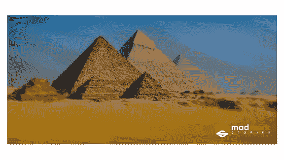
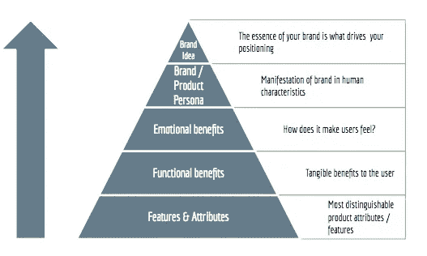

# 每个创业公司都需要它的金字塔

> 原文：<https://medium.com/swlh/every-startup-needs-its-pyramid-e4be09a5fe5c>

**背景**

我已经写了很多关于品牌和品牌的重要性，以及它们能给你的组织带来的不同。从财富 500 强公司到车库里的 6 个人，发展和培育你的品牌会对你的业务产生巨大的影响。如果你错过了， [**这里是**](https://www.madmork.com/single-post/2017/06/15/Startups-Why-its-never-too-early-to-start-Branding) 我的帖子，在这里我讨论了品牌的重要性，以及为什么即使是最小的公司(即:你的创业公司)也应该尽早开始。就像我常说的:“这不是短跑，这是马拉松。这场比赛不属于跑得最快的人，而属于坚持不懈的人。”

在我的一个播客中(你可以在这里观看**)，我还谈到了你可以用来开始品牌化的第一个也是最重要的工具之一，叫做品牌圣经。**

**品牌圣经的一个重要组成部分是所谓的品牌金字塔。这实际上是发展你的品牌圣经的第四步。但是什么是品牌金字塔，为什么它对创业公司很重要？**

**每当我进入一家初创公司或开始辅导其创始人时，我做的第一件事就是出去问公司的关键员工一些问题，包括:**

1.  **你是谁？用一句话描述你的生意。**
2.  **你在解决什么客户问题？有什么好处？**
3.  **你的产品的情感价值是什么？客户使用你的产品后会有什么感觉？**
4.  **你的核心价值观是什么？作为一个人，你会如何描述自己？**
5.  **你品牌的精髓是什么？你想传达的核心思想是什么？**
6.  **你公司的使命是什么？**
7.  **你公司的愿景是什么？**

**通常情况下，尤其是在科技公司或初创公司，当我问 5 到 10 个人这些问题时，我得到的答案是无所不在。尽管一般的想法和概念可能会有一些重叠，但人们的答案是不一致的、混乱的或者完全错误的。他们还会对自己的核心价值观有不同的看法，通常会把公司的使命宣言和愿景混淆起来(我们稍后会对此单独发帖)。**

**为什么这是一个问题？因为如果 10 个不同的人告诉你的潜在客户 10 件不同的事情，你的信息是不集中的，当这些潜在客户将你的报价与竞争对手的相比时，他们不太可能记得你的与众不同。**

## **什么是品牌金字塔？**

**品牌金字塔是一种工具，它以类似金字塔的图表形式回答了上述基本问题，可以在整个公司内轻松共享和交流。它唯一没有直接处理的是与公司使命和愿景相关的问题(尽管品牌本质是公司成长后想要成为的公司或其愿景的直接结果)。**

## **为什么重要？**

**建立一个品牌金字塔可能看起来是一个微不足道的练习，但它很重要，因为它为你的企业做了 4 件重要的事情:**

1.  **迫使高级管理层就公司的目标、服务对象、原因、如何让客户感受以及公司的核心价值观达成共识。**
2.  **阐明品牌的一些基本原则，如品牌的本质是什么。**
3.  **奠定品牌的战略基础。**
4.  **在一个易于使用的图表中提供所有这些信息，可以以一种易于共享和理解的方式与其他创始人和员工快速共享。**

## **它是由什么组成的？**

> ***品牌金字塔自下而上由 5 个部分组成:***

****

****产品特性和属性:**本节解释产品的不同特性(例如，一个消息应用程序可能还具有表情符号、视频聊天和群聊功能)。**

****功能优势:**该部分有助于明确“我们正在解决什么问题？客户为什么会使用我们的产品？一旦他们使用了我们的产品，他们的期望是什么？”(在我们上面的例子中，消息应用程序帮助你以一种免费的方式通过文本、语音和视频与他人交流)。**

****情感上的好处:**除了解决客户的需求，这一部分还有助于回答“客户使用我们的产品后感觉如何？”如果你记得我以前的一篇帖子，关于为什么创业公司应该专注于 [**【屠龙不在谈技术】**](https://www.madmork.com/single-post/2017/05/29/Less-Tech-More-Heroes-Slaying-Dragons-Please) ，客户不仅仅是对你的产品功能感兴趣，他们希望你给他们讲一个故事。他们希望能够在那天早上看着镜子里的自己，感觉稍微好一点，因为他们正在使用你的产品。这就是情感利益的来源。(在我们的消息应用程序示例中，也许该应用程序帮助用户感到“亲近”、“安全”、“需要”。这些都是 app 可以提供的情感需求。)为什么情绪很重要？因为对产品有一定情感的消费者比没有情感的消费者更不容易流失！—这降低了您的营销成本，并让您的客户不断到来、使用，并有望付款。**

****品牌角色和/或核心价值观:**如果你的品牌是一个人，你会如何描述他或她？对这个人和你的公司重要的价值观是什么？你所做的一切，从产品开发到市场营销到客户服务，是如何强化这些核心价值观的？以 Geico 的壁虎为例。壁虎是友好的，平易近人的和好奇的。这些都是用户可以联系到的属性，这让他们觉得 Geico 是一种更接近的保险产品。**

****品牌本质/理念:**品牌本质是潜在的理念，回答了“为什么”顾客应该关心你的品牌。比如苹果的品牌本质就是“通过技术赋能于人”。品牌本质上就是你的品牌的 DNA。你的立场以及你与竞争对手的区别。这是让你成为“你”的核心。**

## **实际含义及其对您业务的意义**

**你的公司，尤其是你的营销团队的最终目标是让客户理解、相信并向他人宣传你的产品或服务。消费者越是真正了解你的品牌精髓，并愿意和渴望与他人分享，他们就越忠诚，关系就越牢固，客户转向竞争对手产品的可能性就越小。他们也更有可能通过口碑(WOM)向朋友推荐你的产品。在顾客心中建立品牌的本质是营销的“圣杯”，也是大多数品牌很少达到的目标。我在另一篇 [**帖子**](https://www.madmork.com/single-post/2017/05/16/Tech-Companies-Need-a-Little-More-Viking-in-them) 中讨论了强大品牌的好处，所以让我们来谈谈你实际上“如何”建立你的品牌金字塔。**

## **发展你的品牌金字塔**

**第一步是真正了解你是否需要建立一个品牌金字塔，或者你目前的金字塔有多坚固。这就是品牌“评论”发挥作用的地方。最简单的方法是采访你公司的所有关键人物，问他们我在这篇文章开头提到的问题。如果答案非常一致，那么你做得很好。如果没有，你有一些工作要做。你可能还想采访一些你的客户和/或潜在客户，看看他们的想法。答案可能会让你大吃一惊。**

**对于早期或中型公司(10-200 人左右)，我建议如下:**

1.  **创建一个类似我在文章开头提到的问题的列表。如果需要的话，可以扩展一下。**
2.  **采访你的关键员工/创始人和一些客户。最好是对他们每个人进行至少 45-60 分钟的一对一访谈，并发给他们一份关键问题和主题的清单，以便他们为会议做好充分准备。**
3.  **收集所有反馈，并将其输入到一个“当前状态”文档中，您可以将该文档呈现给相关利益相关方。**
4.  **安排初次会面，强调:**

*   **什么是品牌金字塔，为什么它很重要**
*   **您的审计及其揭示的内容的快照**
*   **发展品牌金字塔所需的日历和概述**

**5.与相同的关键利益相关者召开头脑风暴会议。我们的目标是让他们在品牌金字塔的每个核心部分都保持一致。**

**6.根据头脑风暴制定初稿，并将其提交给同一组利益相关者。**

**7.获取信息，并根据需要调整品牌金字塔。**

**8.一旦你得到关键人物的认可，你就应该向更广泛的公司(销售、工程师、客户支持、人力资源等)展示品牌金字塔。).根据您的业务规模，您可能需要全体人员参与，也可能需要营销团队成员向所有相关的面向客户的团队和团队领导演示。**

**9.完成并展示品牌金字塔后，你应该将其添加到你的 [**品牌圣经**](https://www.madmork.com/single-post/2017/05/11/Why-every-startup-needs-a-Brand-Bible) (如果你已经有了)，上传到你的内部网的营销页面，并确保每个人都知道它在哪里。**

****

****如何让品牌金字塔活下去****

**恭喜你！你已经建立了自己的品牌金字塔。但是，为了让它继续下去，并使它成为现实，而不仅仅是一个漂亮的图表和管理练习，创始人和/或高级管理层应该不断地公开加强你的品牌本质和核心价值，只要他们有机会。**

**一种方法是，在每场会议开始时，用 2 分钟时间回顾一下你的品牌本质和价值。我看到的另一个成功实施的方法是对那些通过自己的行动和倡议来体现你的品牌价值和品牌精髓的员工进行季度奖励。在我曾经工作过的公司 [**Course Hero**](http://www.coursehero.com) ，他们更进一步，实际上开发了 Slack 表情符号，每当有人做了促进公司核心价值观的事情时，人们就会在对话中使用。如果你问我，我会觉得很酷！**

**希望这有所帮助。建立一个伟大的品牌金字塔是让你的高层管理人员步调一致的关键。品牌金字塔是为贵公司的品牌战略奠定基础的一个很好的工具，如果使用得当，它对于始终如一地实现贵公司的品牌承诺是至关重要的。但请记住，这只是一个工具，建立一个伟大的品牌是关于一致性，专注和耐心。**

**打上烙印！一如既往，如果你觉得这很有用，请喜欢，分享和评论。别忘了订阅我们的 [**【脸书】**](https://www.facebook.com/madmorkstories/) 页面和 [**YouTube**](https://www.youtube.com/channel/UCLW5RrPvV_sGnYACiv9djlg) 频道，保持了解。**

**帕特里克·疯子·默克**

**首席说书人**

****

## **这个故事发表在 [The Startup](https://medium.com/swlh) 上，这是 Medium 最大的企业家出版物，拥有 295，232+人。**

## **在这里订阅接收[我们的头条新闻](http://growthsupply.com/the-startup-newsletter/)。**

****