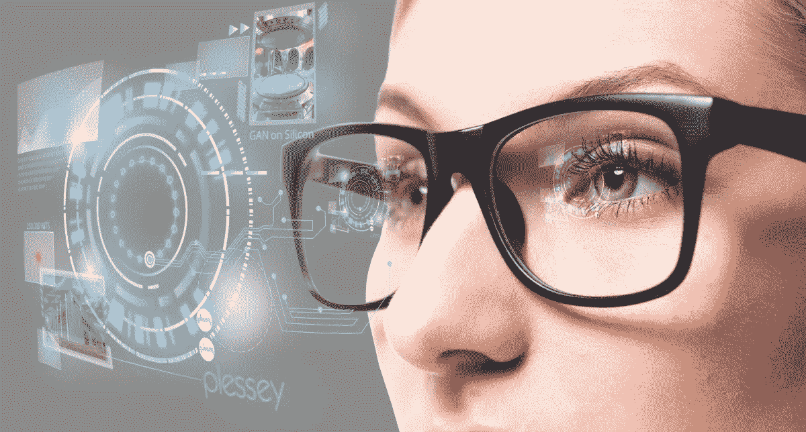
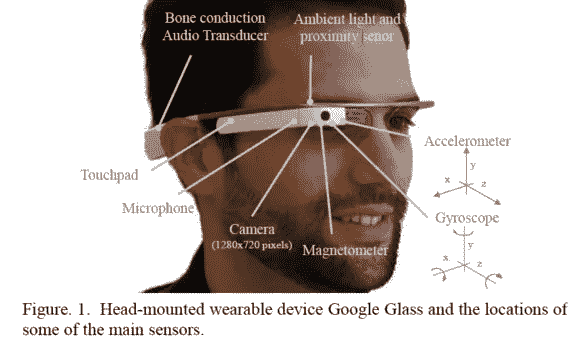
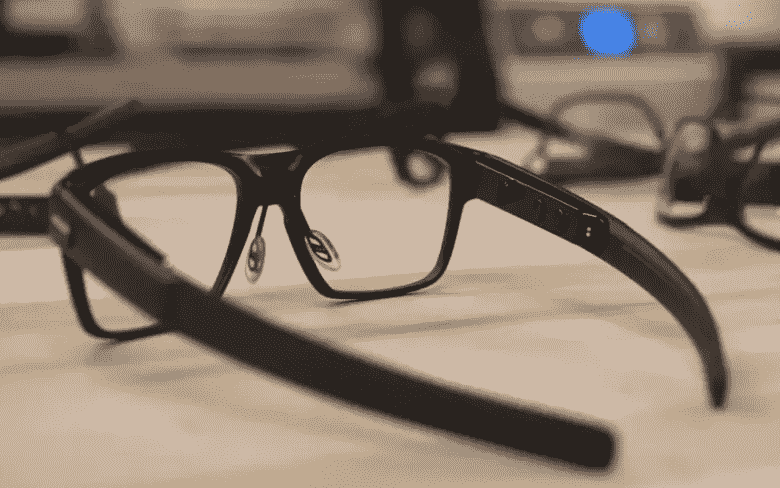

# 关于智能眼镜你需要知道的一切

> 原文：<https://medium.com/swlh/every-thing-you-need-to-know-about-smart-glasses-eb3d2e0a62de>

2017 年谷歌推出了他们的第一款智能眼镜，这也是世界科技领域的第一款智能眼镜。它的框架就像任何其他正常的眼镜一样，唯一的区别在于它的右手边，这是实现主要技术的地方，因此眼镜看起来不对称。右手边投射出一个棱镜，它实际上是眼镜的玻璃，因此也被称为[光学头戴式显示器](https://en.wikipedia.org/wiki/Optical_head-mounted_display)。它不会妨碍你的正常视力，因为棱镜位于镜架的右上角，你只需要向上看一点，就可以透过玻璃看到。

根据谷歌的说法，透过玻璃看就像从 8 英尺外看一个 25 英寸的屏幕。为了让眼镜工作，需要通过蓝牙线程或 WiFi 连接到智能手机中的 **MyGlass** 应用程序。非常谷歌眼镜有一些基本功能，这些是 1。拍照，2。录制视频，3。通过谷歌地图导航，4。通话和信息，请按 5。谷歌。所有这些功能都可以通过语音动作来控制，我们必须说“ *OK GLASS* ，然后说出我们需要执行的动作。例如，要拍照，你需要说“ *OK GLASS 拍照*”，或者从谷歌联系人打电话给某人，我们需要说“ *OK GLASS 打电话给 JOHN* ”。同样的事情也可以用在导航和谷歌搜索上。在谷歌地图导航中，它会在地图上用实时箭头指引你的方向。你也可以通过使用玻璃的触摸板在窗口或屏幕之间滑动。

使用智能眼镜就像使用智能手机应用程序一样。这种智能眼镜讨论的特征不限于上面提到的，它可以用于不同的领域，如医疗、工业和其他工作场所，并且可以根据所需的工作场所或工作情况为其添加功能。

但这并不是它进化的终结。随着市场上**英特尔智能眼镜**的发布，智能眼镜技术将迎来新的转折。智能眼镜的整个模型由英特尔正式宣布，看起来这些眼镜将超越谷歌眼镜。这些眼镜被称为 **Vaunt。**最神奇的是，这些眼镜看起来很正常，很对称，不像谷歌眼镜。它不包含任何摄像头，所以它在社交场合不令人讨厌，它基本上是为信息目的而制作的。它有一个红色的单色投影仪，将图像照射到全息反射镜上，然后直接反射到眼球上。垂直腔面发射激光器发射全息光栅上的信息，将正确的波长反射到眼睛中。所形成的图像被称为视网膜投影，因此，图像实际上是画在视网膜的背面，以获得明亮清晰的图像信息。

Intel smart-glasses

现在，脸书和 Twitter 的通知会一直出现在你眼前，这可能看起来很疯狂。这就是为什么英特尔使用了人工智能技术，该技术将使用眼睛手势来控制这些动作，如控制通知和切换标签或窗口，这不同于谷歌眼镜，谷歌眼镜使用触摸板来实现这些目的。

像 NORTH 这样的公司也在推出智能眼镜，他们的技术也倾向于在设计、界面和价格上挑战谷歌和英特尔。

技术每天都在变化。智能手机已经改变了我们的日常生活，但是这些智能眼镜将会改变什么呢？我们准备好把一项技术戴在脸上了吗？这项技术会像智能手机一样在普通人中生存吗？

# 请在下面评论，让我知道你对这个话题的看法。