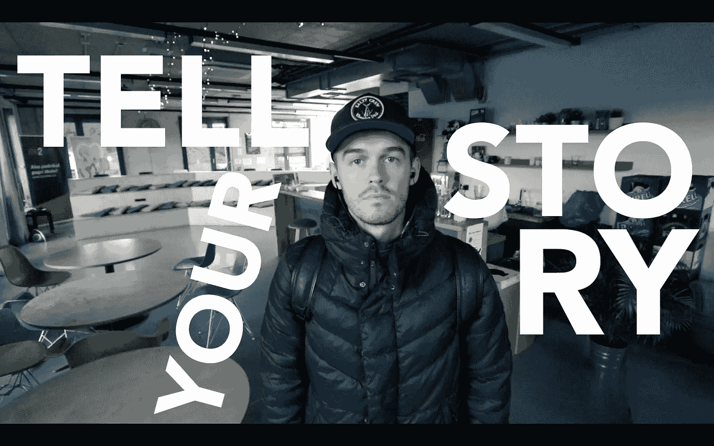

# “每个人都有创造力。”—我

> 原文：<https://medium.com/swlh/everyone-is-creative-me-c2927d620cc9>

## 成为专家并不能让你成为好作家。

我曾经认为我首先必须成为一名商人，这样我才能写关于商业的文章。我想我需要在 IT 行业工作来谈论技术。我想如果我喜欢投资，我需要成为一名专家。

我做了那些事。我去了 IT 行业，在私募股权公司工作，并试图创办一家公司。但我从未找到满足感，也不是特别成功。

有一次，一个朋友告诉我，我缺乏动力。我自卫了。

问题是我的动机和我的自我。我只想写作，创作东西。我想我需要一个许可来创作，我渴望得到某种认可。我希望有人一遍又一遍地告诉我:

“是的，我们想听听您的意见。”

🤷‍

## 停止评判

就像不是所有的教练和老师都是他们领域的顶尖高手，也不是所有的作家和创作者都是他们领域的专家。就像教学一样，创造性的努力是另外一回事。它需要不同的技能和不同的动机。

是学习的问题。是关于成长的。你在观察、感知和感受你周围的世界。你在获取传达信息的内容。它可以是娱乐，鼓励，教导，思考。

可以是你想要的任何东西。

## 开始复制

聪明人知道:

> 模仿是最真诚的学习方式。
> 
> 没有什么是原创的。
> 
> 该说的都说了。
> 
> 想法是借来的。

当你借东西的时候，最好的做法是还回去，也许还会有所回报。你这样说就够了。你进一步分享的事实是你的东西。

这是你的附加值。

当你学了某样东西并教它的时候，或者当你思考某样东西并给出你的看法的时候，那就是你。这就够了。

我们想听听你要说什么。

[It’s #vlogtober](https://www.instagram.com/uhmrt/)

*非常感谢您的阅读。我努力通过探索你的创造力让你的一天变得更好。请通过回复这篇文章来分享你的经历。* ❤️

## 这篇文章发表在[《创业](https://medium.com/swlh)》上，这是 Medium 最大的创业刊物，有+ 381，508 人关注。

## 在这里订阅接收[我们的头条新闻](http://growthsupply.com/the-startup-newsletter/)。

