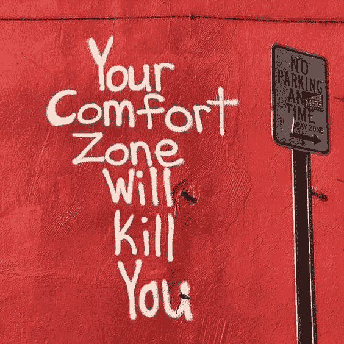

# 每个人都告诉你要走出你的舒适区——这里是开始的地方

> 原文：<https://medium.com/swlh/everyone-tells-you-to-think-outside-the-box-here-is-where-to-start-ca2cce84acc3>

当你走出舒适区时，生活就开始了。虽然你的舒适区创造了安全感，最小化了压力，但是研究表明，打破它可能很困难，但却非常有益。这是因为你在冒险，但同时也在挑战自己，去打开通向新机遇的新大门。挑战自我的人知道，努力往往会带来意想不到的惊喜。

以我的经验来看，挑战自我并不一定意味着辞职去印度。只需做一些调整，你就可以脱离常规，注意到生活中的巨大变化。以下是我用来打破常规、挑战自我的一些生活窍门:

**1。做一些你有热情，但不是专家的事情。**例如，如果你从事金融行业，为你的朋友或重要的人制作一个创意视频或照片拼贴画。你将比日常工作更多地利用左脑，学习大量的酷技能，让别人非常开心。

**2。独自旅行。你应该至少尝试一次独自度假。理想的情况是，一个人去一个新的国家，但是如果你不考虑这个国家，那就短途旅行吧。独自旅行给你一种绝对自由的感觉，这在我们的日常生活中很难得到。结果，你会对自己和你所做的决定感到更加舒服。**

**3。不舒服。我是认真的。你将学会如何管理你的恐惧并增强自信。你讨厌公开演讲吗？—上单口相声课！对自己的身体不舒服？—上一堂滑稽戏课，在最后的表演中跳舞！这些行为让你可以把自己踢到高速档，而不是等着别人来做。**

**4。和陌生人说话**，但切闲聊。这里有一个主意:去酒吧，和一个你从未见过的人开始交谈。花些时间听听他们的经历，留心并试着理解他们。每个人都是一个独特的故事——数十亿个可能永远不会被写出来的故事。

5.你不喜欢酒吧？ [**和陌生人一起参加饭局！**](https://kinza.life/collections/all-kinza-experiences) 我知道一开始听起来会不舒服，但是几分钟后你就会意识到你和一个离婚的投资银行家或者桌子对面那个戴着头巾的女孩有多少共同之处！那种联系的时刻感觉非常特别——它建立了同理心，给你一种独特的兴奋感，让你了解你核心圈子之外的人的真实情况。这样的时刻是真正让你走出舒适区的时刻，相信我，这种感觉很棒。

这些是我的黑客。跟我分享一下你是怎么打破日常的！

## 这篇文章发表在 [The Startup](https://medium.com/swlh) 上，这是 Medium 最大的创业刊物，有 299，352+人关注。

## 订阅接收[我们的头条新闻](http://growthsupply.com/the-startup-newsletter/)。

