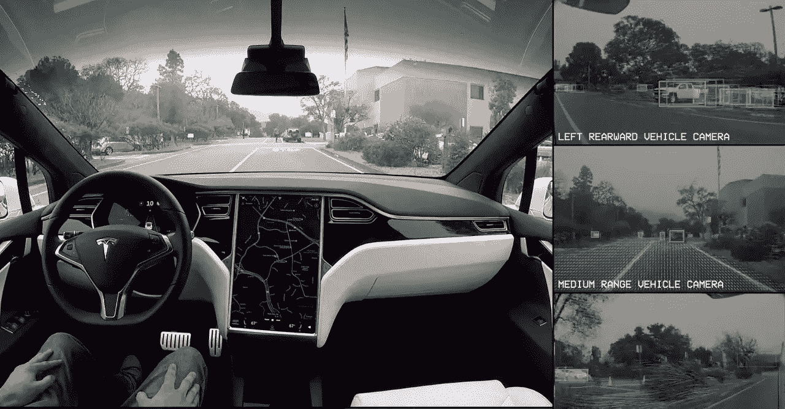
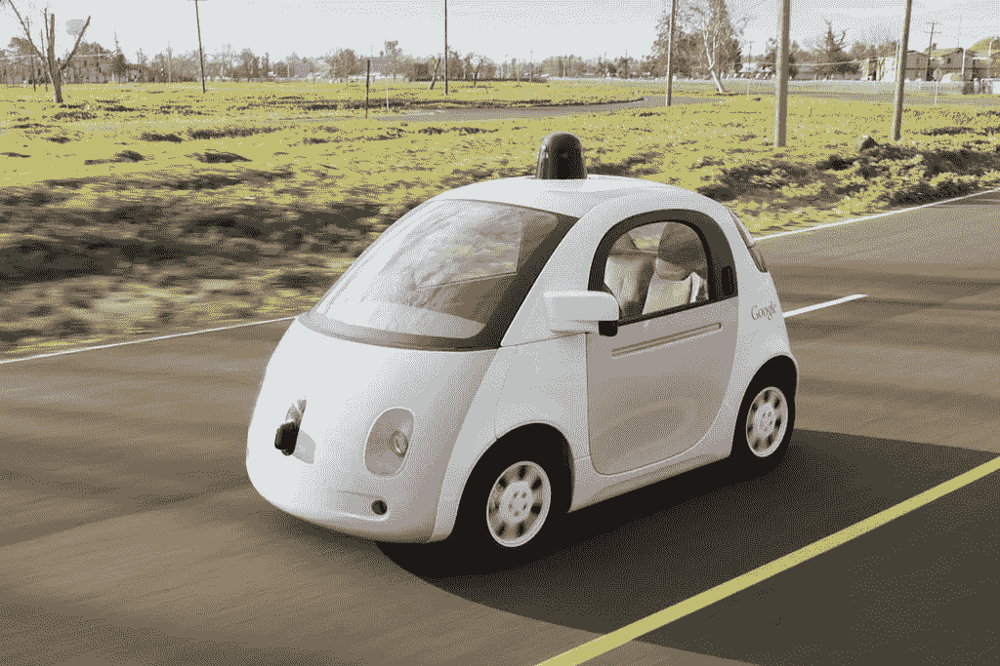
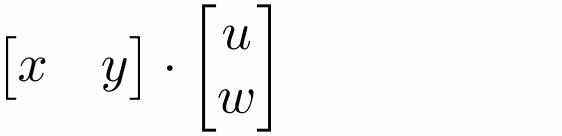
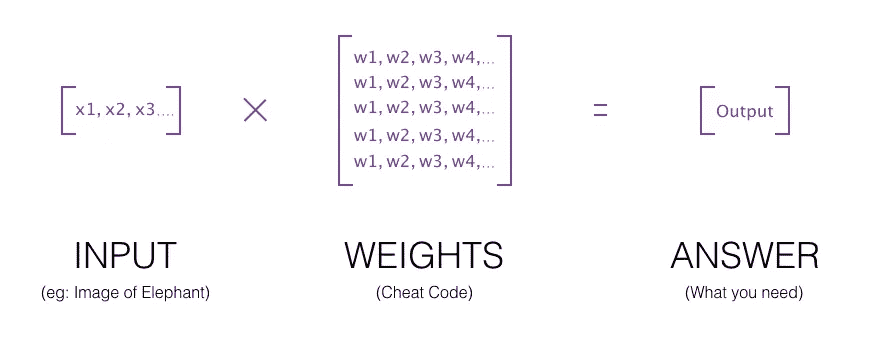
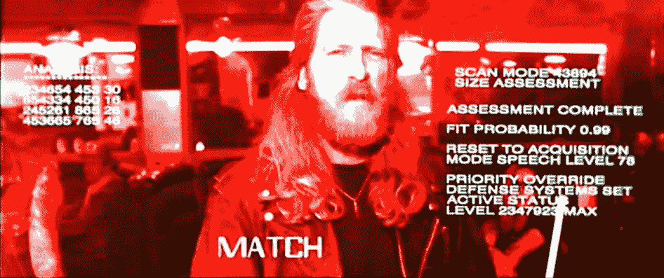
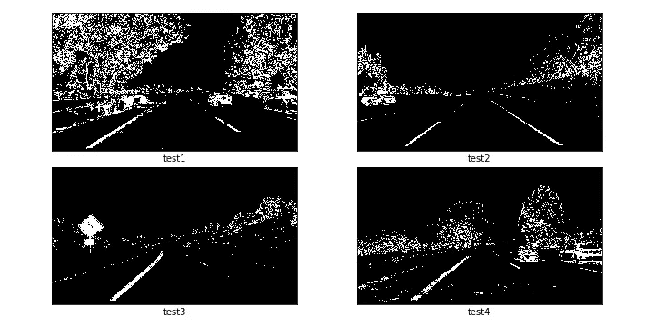

# 向非工程师解释自动驾驶汽车的一切

> 原文：<https://medium.com/swlh/everything-about-self-driving-cars-explained-for-non-engineers-f73997dcb60c>

我保证你在阅读这篇文章的时候不用谷歌也不用字典。在这篇文章中，我将教你从“深度学习”到“计算机视觉”的核心概念。使用非常简单的英语。

你可能已经知道什么是自动驾驶汽车，并且它们最近被认为是毒品，所以如果你不介意，我将跳过任何高中论文式的介绍。:)

> 但是我不会跳过我自己的介绍:嗨，我是[阿曼](http://aman-agarwal.com)，我是一名工程师，我对不必要的“复杂”谈话有很低的容忍度。我在媒体上写文章，让困难的事情变得简单。简单被低估了。

# *无人驾驶汽车是如何工作的？*

也被称为*自动驾驶汽车*，它们致力于三个很酷的技术领域的结合。下面分别对它们做一个简单的介绍，然后我们再深入探讨。到本文结束时，你将对所有这些技术有足够的了解，能够与这些领域的工程师或投资者进行明智的对话。“人工神经网络”之类的东西听起来将不再像是魔法咒语或科幻电影中的词汇。

顺便说一句，我已经将一些东西归类到大致独立的高级“系统”中，但当然在实践中，这些系统都是高度互联的，没有明确定义的边界，并且在引擎盖下有大量的东西在运行。

**计算机视觉(*oooooohhhhhh 听起来太酷了* )** :让汽车“看见”周围环境的技术。这些是汽车的眼睛和耳朵。这整个系统叫做 ***感知*** 。基本上我们用:
1。好的老**相机**，这是最重要的(简单的 200 万像素相机就可以了)，2
。第二重要的雷达。他们向四周发射无线电波，就像超声波一样，你可以探测到物体反射回来的电波。还有激光器，它们很酷，但是现在很贵，而且下雨或有雾的时候它们就不工作了。也叫“激光雷达”。你可以说它们像雷达，但图像质量更好，激光可以走得很远，所以你有更大的视野范围。激光通常被放置在汽车顶部的一个旋转轮上，因此它们可以快速旋转，观察周围的环境。这里你可以看到一个激光雷达放置在谷歌汽车的顶部:

Check out the Lidar sensor on top. It’s a spinning laser beam.

**深度学习**:这是一种允许汽车根据通过上述计算机视觉工具收集的信息，自行做出驾驶**决定**的技术。这就是训练汽车“大脑”的东西。我们一会儿将详细讨论这一点。

通过将这两者结合起来，甚至在基础层面上，您可以做一些有趣的事情。这是我做的一个项目，只使用一个摄像头来检测车道线和路上的其他车辆。

**机器人**:你可以看到一切，你可以思考和做决定。但是如果你大脑的决定(例如:抬起左腿)不能到达腿部的肌肉，你的腿就不能动，你就不能走路。同样，如果你的汽车有一个‘大脑’(=一台带有深度学习软件的计算机)，计算机需要与你汽车的零件连接，才能控制汽车。简单来说，这些连接和相关功能构成了‘机器人学’。它允许你接受软件大脑的决定，并使用机械来实际转动方向盘，按下和释放油门，刹车等。

**导航和路径规划:**即使具备了以上所有条件，最终你仍然需要弄清楚你在这个星球上的“哪里”以及你想去哪里的方向。这有几个方面，像 GPS(你的老式导航设备，从卫星上获取位置信息)，和存储的地图等。你还混合了计算机视觉数据。也有几种方法来做路径规划(短距离机动)。

*因此，汽车根据大脑做出的决定控制转向和刹车等，这些决定是基于通过摄像头、雷达和激光接收的信息以及从导航程序接收的方向。这就完成了一辆自动驾驶汽车的整个系统*。

***花絮(随意跳过)***
自动驾驶汽车有许多“级别”，从第 1 级到第 5 级，基于汽车的独立程度*以及驾驶时需要的人工协助程度。哦，还有 0 级，也就是你的老式手动汽车。*

*5 级意味着汽车将 100%自动驾驶。它不会有方向盘或刹车，因为它不是由人驾驶的。这些车还不存在，尖端车还在 3 级，最多 4 级。*

# *深度学习解释了像我这样的黑猩猩*

*假设你是一个野生动物探险爱好者，而我是你的超级白痴朋友。下周我要去非洲旅行。你给我一些建议:“阿曼，离他妈的大象远点。”*

*我问你，“大象是什么？”*

*你很可能会说，“你这个笨蛋，大象是...没关系，这是一张大象的照片，这是它的样子。离他们远点。”*

**

*然后我去狩猎。*

*下周你会知道我 ***还是*** 设法撞上一头大象，差点被踩死。你问我发生了什么。*

*我回答说，“我不知道，我确实看到了这个巨大的动物，但它看起来一点也不像你给我看的照片，所以我觉得玩它是安全的，我就上前拉了拉这个摇尾巴的小东西。这是我在那之前拍的动物照片……”*

**

*你:………。*

*你:“好的，阿满。对不起，我的错。我对你的大脑期望过高。让我给你一个“作弊代码”,你下次旅行时需要遵守。如果你看到任何东西从各个角度看起来都是棕色的，似乎有四条像柱子一样的皮革腿，大而扇动的耳朵，厚而长的鼻子从它的脸上伸出来像一个大管，而且比你胖而大，那么那就是一头大象，你需要远离它。”*

*下个月我再次回到 safari(嘿，这是我的假设故事，我可以去 safari 想去几次就去几次)，这次我不会遇到任何大象，因为你的“欺骗代码”工作得很好。*

*你是怎么想出那个“作弊代码”的？这是因为你已经从各个不同的角度看到了一头大象，你挑选了一头大象的一些特征，不管你从哪个角度看它，这些特征都保持不变。所以你有很多大象的*特征*来思考，这些特征来自你一生中收集的所有关于大象的*数据*，而*帮助你在脑海中形成一幅大象最明显的*特征*的画面，并把它们作为作弊代码给了我。意识到我不必真的“知道”大象是什么，我只是有一个帮助我识别大象的欺骗代码。但是这个欺骗代码几乎和知道大象是什么一样有效！(从哲学的角度来看——你真的知道大象是什么吗？或者我们不都是通过相似的欺骗代码和判断来感知世界的吗？一些值得思考的事情。)**

**但是为什么不给我看一张照片(你之前给我看的那张)就能让我明白这个想法呢？因为我(当然是个白痴)把那张照片当成了“神圣的真理”——我假设每只大象看起来都和那张照片一模一样，几乎是完美的一对。**

**深度学习的工作方式非常相似。**

**深度学习的基础是:*人工神经网络，*我现在来解释一下。它们也被称为*深度神经网络*。**

**首先，我假设你在高中时知道一点点数学知识。你知道矩阵是什么吧？你可以用一个矩阵乘以另一个矩阵？这是字面上的 ***only*** 数学，我需要你知道这篇文章。但是如果你不知道这些也不要难过！我从小就讨厌数学。这里有一个复习:**

****

**记住什么是矩阵。**

**人工神经网络(ANN)是一些非常奇特的东西，但我会带你一步步地踏上旅程。你看，人脑是由许多被称为“神经元”的细胞组成的网络，这是人工神经网络的灵感来源。这是它在纸上的样子:**

****

**人工神经网络是一个神奇的盒子，它接受输入，给出输出。例如，假设你想要一个神奇的人工神经网络，它能接收一张照片，并能判断这张照片是不是大象。你把一张照片放进盒子里，出来的答案是“是”或“不是”。**

**或者，你放一张前方道路的照片，你希望人工神经网络告诉你是否应该减速或加速。答案出来了，“加速！”**

**它是如何发生的？你如何创建这个 ANN？**

**简单地说，人工神经网络就像是人脑的简单版本。首先你用*数据训练它。当你给人工神经网络提供数据时，它会创建一个“作弊代码”，帮助它下次做出决定。(我马上会给出一个详细的例子)这种“欺骗代码”被称为人工神经网络的“权重”。你之前看过《黑客帝国》吗？你可以说第一个矩阵[x y] matrix 是一个输入，第二个矩阵[u w] matrix 是*权值*或者作弊码的集合。当您将输入与权重相乘时，您会得到一个*答案*。***

*人工神经网络可以有许多不同的种类，根据你如何设计它，它可以给出“是或否”的答案，或者，例如，它可以给出一个具体的数字，或者一系列不同的数字，等等。您可以选择它将给出什么样的输出和接收什么样的输入，以及它将有多大和多复杂，这使它具有极强的通用性。你可以建立神经网络，将视频、语音样本、图像或文本段落等作为输入。当然，所有这些都会在电脑上自动转换成数字，并且会有一个巨大的“权重”矩阵乘以输入，生成一个输出，这就是你的答案。*

*但我相信你还是不完全明白。你如何“训练”人工神经网络给你有意义的输出？*

*假设你想训练一个人工神经网络来识别大象。*

*所以你创建了一个新的人工神经网络，它接受某种类型的输入，给出某种类型的输出。起初，这个 ANN 对它试图解决的问题一无所知。这就像我在最初的大象例子中一样——在你给我看第一张大象的照片之前，我甚至不知道大象是什么。如果你当时问我在照片中找一头大象，我可能会随机选择。所以你可以说，最初，我有一些随机的欺骗代码，对吗？但是当你给我看一头大象并告诉我它是一头大象的时候，*突然*我调整了我的随机作弊代码，现在我*对大象有了一些*的概念。我的作弊代码不再是随机的，如果我从前面看到一头大象，我可能会选择正确的答案！所以当我得到更多信息时，我已经更新了我的作弊代码。我有越多不同的大象照片，我的作弊代码就越能给出正确的答案。我仍然不知道大象“是什么”，但我在不同的照片中看到了足够的相关性，以识别大象最特殊的特征，并远离它们。*

*类似地，当你第一次创建一个人工神经网络时，你首先给它一个随机的权重集(=作弊代码)。然后你给它看一个输入图像(一只大象的照片)，也告诉它你期望的输出(回答“是”)。人工神经网络的美妙之处在于，如果你给它一个示例输入及其相应的输出，那么它会 ***调整它的作弊代码*** ，以便它下次可以重复那个正确的答案。它会 ***改变权重矩阵中的数字*** 你给它的数据越多，它就能匹配你的答案。这就是为什么，你可以从一组随机的权重开始，随着时间的推移，人工神经网络会调整它们，这样它们就可以很好地作为一个作弊代码！酷吧？这就是人工神经网络“学习”的方式。你给它的数据越多，它调整的权重越多，它就变得越准确。*

*正如我之前解释过的，这是通过矩阵乘法实现的。这个人工神经网络的权重矩阵将具有这样的值，如果你把它乘以你的输入图像(图像将被转换成数字)，你可以得到一个答案。通常，不仅仅是一个权重矩阵，而是一系列矩阵，你一个接一个地相乘。但是这个概念和你在下图中看到的是一样的:*

**

*Rough matrix representation (I made this diagram myself) :)*

*但这还不够。请记住，人工神经网络并不聪明——它毕竟是在作弊代码上工作的。如果你只给它看大象的照片，并对每张照片都说“是”，你认为它会做什么？*

*它会偷懒，假设*每张*照片都是一头大象！它将调整其权重(作弊代码)，以这样一种方式，无论给它的照片，它将始终输出一个“是”。这被称为“*”不适应，意思是你错误地认为你的白痴朋友很聪明。你的 ANN 已经变得*偏向*某个特定的答案。为了防止这种情况发生，**你还需要给它一些反例，这些反例的答案是“不”**。所以你还混合了许多例子照片，这些照片不是大象，而是狮子、奶牛、人类、松鼠、皮卡丘和瞪羚、海马……(对不起，我忘乎所以了)，现在人工神经网络将被迫更仔细地调整它的作弊代码。现在你正在增加它的准确性，使它更加可靠！或者，你也可以有" ***过拟合*** "，当安的作弊代码仍然懒惰，但它现在超级聪明，它开始*记忆*你给它的整个训练数据！这通常发生在你的人工神经网络很大很深的时候，所以在某种程度上，它只是开始存储你给它的所有信息。它变得非常擅长回答你的训练数据，但是当给它一个以前没有遇到过的新例子时，它就失败了。它不再像作弊代码一样工作，而是变得像一部图像字典。您可以通过减小模型的大小(随机减少一些权重)或增加数据的多样性来防止这种情况。前者被称为“dropout”(非常简单，但是非常疯狂的想法)，后者被称为“*平衡数据集*”。**

**你也已经从之前的 safari 例子中吸取了教训，现在你会小心翼翼地向它展示其他从不同角度拍摄的大象照片，这样它就不会犯你的白痴朋友所犯的同样的错误。这就是为什么研究人员/工程师经常“ ***增加****他们的训练数据集，以包括镜像反射或相同图像的更亮/更暗版本等，以增加他们数据的多样性。这有助于确保人工神经网络尽可能准确。你希望作弊代码超级“健壮”,以至于它能像真人一样工作，甚至更好。***

***在训练结束时，有了足够的*平衡*数据和增强等，你将拥有一个训练有素的人工神经网络(也称为训练模型),它可以以合理的准确度识别图像中的大象，并且还知道什么时候*不能识别*一头大象。***

**"**过度拟合**"，你在两个段落前遇到的单词(=网络变得太聪明，好像它刚刚记住了你的数据)，是深度学习行话中一个非常常见的术语，你现在知道它的意思了。(装配不足是一个不太麻烦的问题，因为它很容易诊断和解决。)有人可能会说，“天哪，我的模型对新数据不太适用，我想它是过度拟合了”，而你会说，“你有没有尝试增加训练数据？”你将立刻拥有这个夜晚。其他人甚至可能认为你自己就是一个深度学习工程师！(如果他们这样做，告诉他们“哦，不，我只是在媒体上跟踪一个人”。当他们问我是谁时，请假装说“哦，你不知道？他是这个领域最酷的人！”).**

**调整权重(根据数据更新作弊代码)的过程涉及到一种叫做*的反向传播。*在训练时，每当你给安看一个输入例子(比如一只小猫)，然后告诉它答案(“不，它不是大象！”)，它会首先尝试使用它当前的作弊代码来得出自己的答案。如果答案是对的，那么它就不需要调整它的作弊代码了，对吧？懒惰的 ANN 只会在出错的时候更新它的作弊代码。因此，只有当人工神经网络的答案是错误的，它才不得不通过一个微小的*位来调整它的权重，并再次测试权重。这种调整算法称为反向传播。人工神经网络犯下的“错误”在权重矩阵中激起涟漪，改变了许多权重值。所以你可以说错误*通过网络传播回来*。同样，这也是为什么你总是可以在最初创建随机权重的人工神经网络，随着时间的推移，它会自己调整它们。***

*简而言之，如果你带着作弊代码参加考试，而你的一些答案是错的，那么你很可能会升级你的作弊代码，以便在该科目的下一次考试中具有更高的准确性。每次考试后，根据分数编辑/重写作弊代码的过程被称为反向传播。*

**

*现在再看一下“神经网络”的图形图像。你看到那个叫做“隐藏层”的东西了吗？嗯，人工神经网络是由*层神经元构成的，*这些神经元将权重作为值。它们被称为“隐藏层”，因为你不需要知道网络中的确切权重！当然，你可以把这些值打印出来——但是查看一个可以包含数百万或数十亿个小数字的矩阵是没有用的。这是一个欺骗代码，它会根据你给它的输入进行自我更新，你只需要知道这些。*

*这就是为什么深度学习经常被认为是一个“黑盒”系统。如果你以前曾经用任何语言编程过，你习惯于为程序写下明确的指令。但在这里，你看不到计算机为自己创造的用来代替书面算法的潜在“作弊代码”。*

*回到自动驾驶汽车，假设你在特定的毫秒从汽车周围的不同相机拍摄照片，并从雷达和激光雷达(也就是激光雷达)收集所有数据，并将它们组合在一起形成一个列表，并使用该列表作为汽车人工神经网络的输入。而你期望从网络得到的输出是一长串的转向角，油门/刹车值，是否点亮大灯，是否鸣喇叭等等。这些是你的“标签”,由人工神经网络来预测。*

*使用人类收集的特定数据显式训练人工神经网络的深度学习被称为“监督学习”。对于每个数据样本，您都有数据和标签。*

*因此，这里有一个你将如何“训练”汽车大脑的例子。首先，你将简单地独自正常驾驶汽车，但继续从传感器和摄像机等收集输入数据。还有一种设备可以测量每毫秒的数据，比如你驾驶时的转向角和油门压力等 ***。*** 然后一旦你回到家，你就可以开始“训练”你在驾驶时收集的所有数据上的 ANN。人工神经网络将更新其作弊代码，以接受你的计算机视觉输入，并尽可能接近地模仿你的驾驶决策。*

*这被称为**行为克隆**，原则上**类似于当今大多数汽车公司正在做的事情——收集驾驶数据，并让他们的汽车‘练习’。每一次训练之旅后，车会变得越来越会做决定。行为克隆仅用于系统工作流程和驾驶过程的一小部分。还有许多手动调整和人类编写的指令和检查，以确保汽车不会像一只由未经良好训练的人工神经网络领导的无头鸡一样到处跑。***

## *在其他一切都相似的情况下，驾驶数据是开发自动驾驶汽车竞赛中最大的获胜因素。*

*现在——你知道什么是“深度学习”，以及它的作用。你知道什么是深度神经网络(= ANNs)，以及它们如何工作(权重=作弊代码，反向传播=根据给定的示例测试调整权重)。你也知道你应该有一个大而平衡的数据集，这样网络就不会*过度适应*(在设置欺骗代码时变得懒惰或过于聪明)。*

*恭喜你！我不骗你，这比你想象的更有成就！*

# *计算机视觉*

*还记得*终结者*里的这一幕吗？*

**

*施瓦辛格一丝不挂地走进一家酒吧，想找人偷衣服。这一定是你想到“计算机视觉”时想到的，你说对了一部分。*

*自动驾驶汽车也可以像那样看世界。计算机视觉技术的主要目的是处理相机图像以检测车道线、跟踪其他车辆和行人、寻找道路上的任何颠簸或孔洞、测量汽车和其他物体之间的距离等。*

*计算机视觉没有单一的技术或底层技术——相反，它通常可以归结为简单的图像处理。你只受限于你的想象力和设计复杂算法的能力，如果你擅长几何，这是另一个优势。例如，处理相机图像的一种流行方法包括观察颜色在水平和垂直方向上变化的速度。这就是所谓的“梯度”，它可以用来寻找边缘。这里有一个例子:*

**

*这些都是通过简单的技术使用一个流行的计算机视觉函数库创建的，称为[***【OpenCV***](http://opencv.org)。您应该了解 OpenCV，因为它是最流行的库。每个机器人或深度学习的家伙都知道它。*

*进一步看上面的例子，你看到的图像只是一个矩形上的 1 和 0 的表示。1 是白色的，0 是黑色的！您可以选择图片中任何一个区域的像素，并对其进行处理。这就是我如何检测车道线，并得出我的项目输出，如本文开头所见。*

*计算机视觉检测物体的另一种常用技术叫做*立体视觉*。不要被看似复杂的名称所迷惑，立体视觉简单地说就是用不止一只眼睛看东西(你一直都在这么做)。当你用两只眼睛看东西时，你会对它有多远和它有什么形状有更好的估计。同样，汽车在两侧使用不止一个摄像头，将图像组合起来，更真实地观察世界。*

**当看不清道路时，如下雪、下雨等不利条件怎么办？好吧，我们不要忘记另外两个传感器(雷达和激光)。即使任何两个传感器工作不太好，该系统的设计使得第三个传感器仍然非常可靠(但这是一个正在进行的研究领域，我们还不完善)。此外，如果汽车的神经网络已经被训练在这种条件下驾驶，汽车应该知道如何做出决定。同样，正如我前面所说的，首要任务是收集足够的数据。你训练得越多，车就变得越好。句号。**

*我不会深入讨论计算机视觉的更多细节，因为它是一个非常广泛的领域。只知道不是科幻，也没什么“神奇”的。只是用你的想象力去玩图像。还有其他一些技巧，您可以在这个非常简短的页面中了解到:*

* [## NOVA |机器人大赛|机器人看到的(不闪)| PBS

### (可打印)在此幻灯片中，了解一些世界上最大和最雄心勃勃的 darpa 检测实验。

www.pbs.org](http://www.pbs.org/wgbh/nova/darpa/see-nf.html) 

# 机器人和导航

实际上，我不会在这里花太多时间。原则上，机器人非常简单(你不需要奇特的想象力来理解发生了什么)——你基本上需要知道一种叫做*致动器*的东西。然而，即使想象起来很简单，实际执行起来却很难！

**执行器**是一种将电信号作为输入，并将其转化为物理动作的装置。它并不太复杂，通常它只是内部有一个电机，根据它接收到的电信号的强度旋转一定的角度。执行器有各种形状和大小，一个在方向盘上，一个用于油门、刹车、齿轮、引擎等。你明白了。

对于导航，除了 GPS/地图/计算机视觉技术，你还应该知道一个非常酷的技术，叫做“*”。它包括*根据您的速度和行驶距离计算您的当前位置，并了解您到目前为止的所有转弯的历史*等。你还记得小罗伯特·唐尼演的那部烂夏洛克·福尔摩斯电影吗？有一个场景是他被绑架并被带上马车，被蒙上眼睛，但是当他们到达目的地后，他神奇地知道了自己的确切位置。一定要看这个场景的前几分钟，你就会明白什么是“推算定位”。这个系统的运作方式很像夏洛克·福尔摩斯。*

*航位推算的原理用于“定位”(估计你的车辆在哪里)，然后该信息用于路径规划(你应该去哪里)。*

## *好吧！现在你应该对自动驾驶汽车的工作原理有了很好的了解。以下是我们了解到的情况:*

1.  *深度学习——作弊代码、平衡训练数据、过拟合和其他问题，为什么深度学习是一个“黑盒”等。*
2.  *计算机视觉——相机、雷达和激光雷达传感器、立体视觉，如何创造性地处理图像以提取许多不同类型的信息，有一个流行的编程库，叫做 OpenCV。*
3.  *机器人——什么是执行器。*
4.  *导航——您了解到，除了 GPS 和存储的地图等，汽车还使用一种夏洛克·福尔摩斯式的技术，称为“航位推算”。*

> *所以…你现在是不是觉得比 20 分钟前更危险更牛逼了？:)*

*我的目的不仅仅是给你信心，还有欣赏。成功建造一辆自动驾驶汽车需要很多非常聪明的人来做数百万件不同的事情，现在你可以对他们更加尊重了。** 

**在我们结束这篇文章之前，有一点要注意:**

> **我教授世界上第一个针对高级技术流畅度的培训项目——面向非技术高管、营销/销售领导、投资者和企业家。你可以在这里阅读:**

** [## 世界上第一个技术流畅性训练计划

### 我会教你如何与工程师聪明地交谈，如何更有效地雇佣和管理员工，以及如何成为一名技术战略家。

sanpram.com](https://sanpram.com/teaching) 

## 现在，关于“人工智能会抢走我们的工作，然后杀了我们”的讨论的一些想法

我想让你注意到你刚才学到的一件有趣的事情。你知道了每一个神经网络都被设计和训练成接受特定类型的输入，然后给出特定类型的输出。

即使你使用一个**巨大的**神经网络，并将其用作自动驾驶汽车的**大脑**，你仍然需要将它连接到汽车周围所有传感器和摄像头的输入，以及 GPS 和地图，还需要将神经网络的输出连接到使汽车移动的所有硬件和执行器。正如您已经了解到的，神经网络是一系列彼此相乘或相加的矩阵。如果你不把它与输入或输出联系起来，它就像其他数学表达式一样，是一个死的数学表达式。

但是让我们假设你不负责任地拿一个训练很差的神经网络，用它来运行一个危险的机器，比如眼科手术机器人。这是在一只眼睛上做的手术，这只眼睛有一些非常罕见的情况，医生和神经网络都没有被训练来检测。机器人犯了一个永久性伤害眼睛的错误。现在在这个假设的场景中，我确信第二天全世界的报纸都会谈论 AI 是如何醒来并决定杀人的。但是现在你已经读完了上面的整篇文章，我希望你能明白为什么这是废话。

你可以提出一个论点，嘿，整个宇宙，甚至人类的大脑，本质上都是由最深层的数学表达式组成的，因此一些矩阵比其他矩阵更邪恶。所以也许一个神经网络 ***有可能是邪恶的。*** *也许在训练神经网络的时候，你重新安排了它的权重，以至于它变得邪恶了。*

即使这可能是真的，这仍然不是一个好的论点。即使那个制作拙劣的(或者报纸称之为“邪恶的”)人工智能软件根本没有安装在真正的机器人上，它也不可能犯任何错误。

我个人觉得应该规范 AI 在现实世界中的使用，保证它不害人。这应该类似于医疗行业——人们应该可以在实验室的试管中自由开发一种新药。但是，如果你想在动物或人体上测试你的新药，你必须向政府申请许可，并证明它可以进行测试。

这完全取决于你如何决定使用一个软件。工程师应该负责正确地构建软件，还应该负责决定他们的软件是否可以在现实世界中使用。** 

## **就是这样！如果你觉得这很有帮助，请在评论中告诉我。我会感觉很好。**