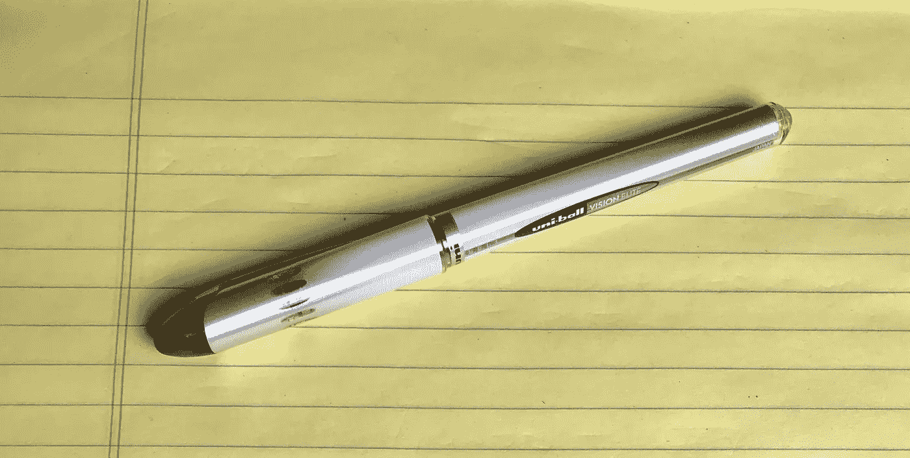

# 我做的每件事都是从黄色便笺簿开始的

> 原文：<https://medium.com/swlh/everything-i-do-starts-on-yellow-pads-a350162f5540>

## 一叠又一叠的黄色便笺簿

我是一名软件开发人员，我沉迷于黄色平板电脑。

好了，我说了。

我认为这些神奇的垫子是我魔力的秘密来源，所以我不打算戒掉这个支撑了我几十年的用纸习惯。

有时候，当我坐在家里舒适的大椅子或沙发上，一丝不苟地设计代码模块或商业策略时，我会同时使用两三个 pad。

拥有多个 pad 就像在电脑上使用多个显示器一样。一旦你尝试了，就没有回头路了。这让我们更容易看到全局；尤其是当碎片紧密连接时。

如果我要开始一项新的产品或业务，我可以在做研究的时候很容易地翻阅十几本甚至更多的便笺簿，草草记下抽象的想法和主意。

起初，我试着撕掉单页，但最终，我在单个便笺簿上得到太多不相关的想法，我把它们全部拆开，在地板上按主题堆成一堆；准备好等待回形针或巨型紧固件。

我的批评者吹捧他们的*思维导图*和*谷歌文档*；但对我来说，这些根本没有给我自由形式的体验，我觉得这种体验对我的个人过程是如此重要。

我经常结合我的 Pad 使用微软 Office 附带的*One Note*——主要是作为一个丰富的书签系统，可以在我的 MacBook 和 iPad Pro 之间实时自动同步。

没错。当我真正进入状态时，我会同时使用两三个平板电脑、一台 MacBook 和一台 iPad。

我的客厅沙发和茶几变成了灵感的工具，我的新桌子，我的 60 英寸壁挂式电视正在等待一个机会，用 ChromeCast 或 Apple TV 向我展示一个精彩的 YouTube 视频。

我总是在寻找可能有助于我的创作过程的新工具，但不知何故，我总是回到我的旧习惯。

想笑就笑吧。它对我有用。

我想知道我是否会改变？

## 这篇文章发表在 [The Startup](https://medium.com/swlh) 上，这是 Medium 最大的创业刊物，有+391，714 人关注。

## 在这里订阅接收[我们的头条新闻](http://growthsupply.com/the-startup-newsletter/)。

